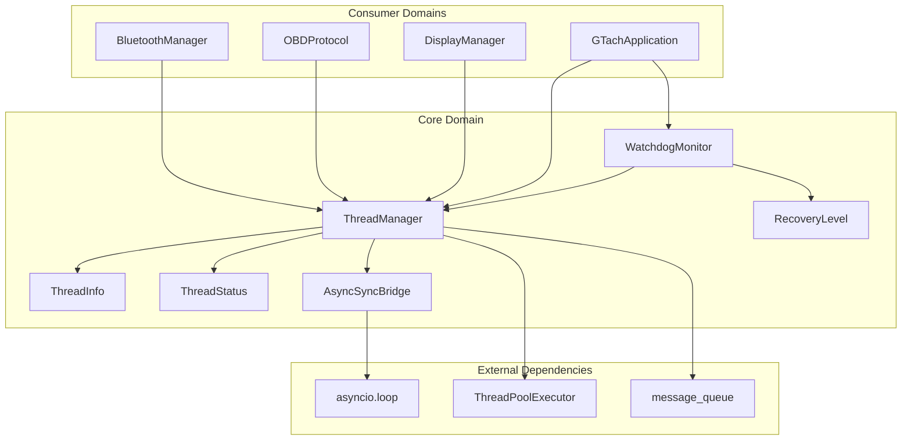
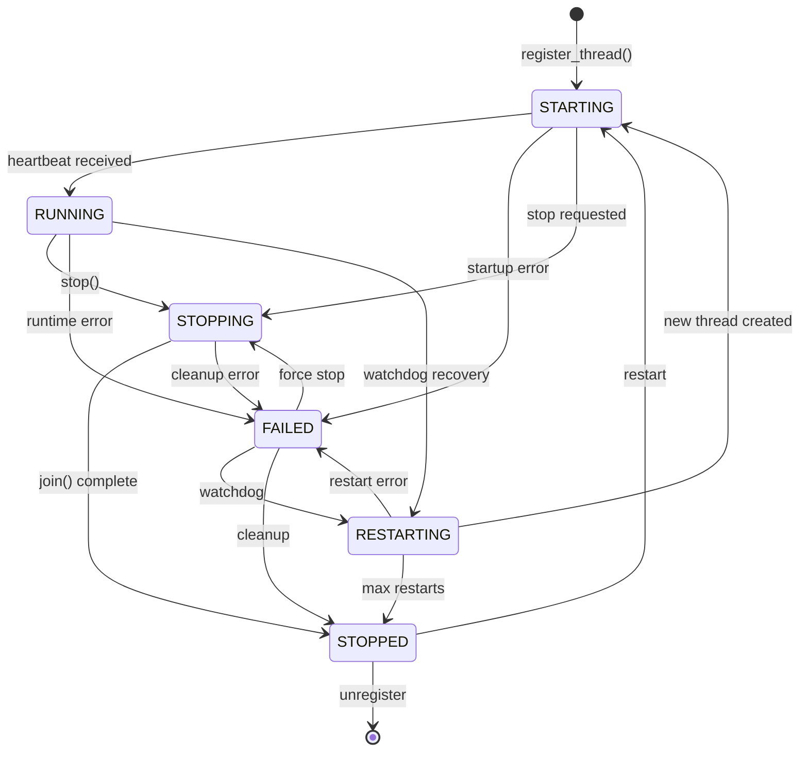
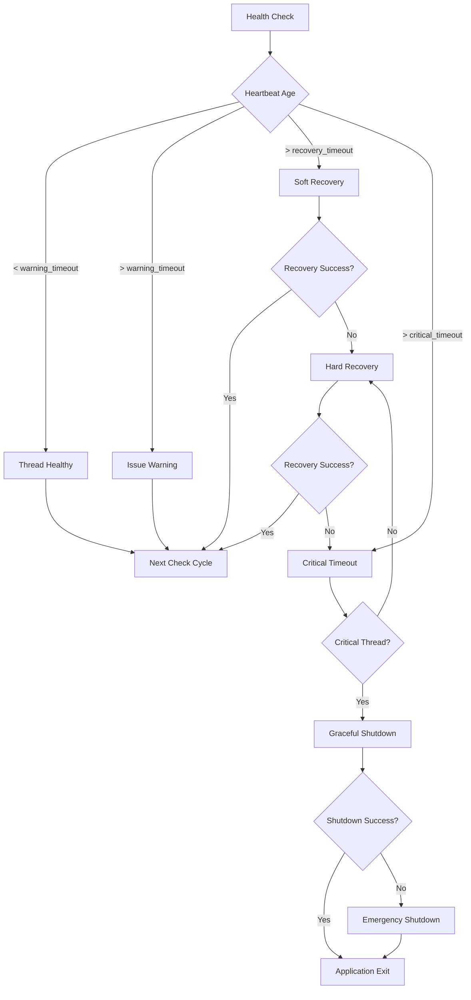

# Domain Design: Core

Created: 2025-12-29

---

## Table of Contents

- [1.0 Document Information](<#1.0 document information>)
- [2.0 Domain Overview](<#2.0 domain overview>)
- [3.0 Domain Boundaries](<#3.0 domain boundaries>)
- [4.0 Components](<#4.0 components>)
- [5.0 Interfaces](<#5.0 interfaces>)
- [6.0 Data Design](<#6.0 data design>)
- [7.0 Error Handling](<#7.0 error handling>)
- [8.0 Visual Documentation](<#8.0 visual documentation>)
- [9.0 Tier 3 Component Documents](<#9.0 tier 3 component documents>)
- [Version History](<#version history>)

---

## 1.0 Document Information

```yaml
document_info:
  document_id: "design-4f8a2b1c-domain_core"
  tier: 2
  domain: "Core"
  parent: "design-0000-master_gtach.md"
  version: "1.0"
  date: "2025-12-29"
  author: "William Watson"
```

### 1.1 Parent Reference

- **Master Design**: [design-0000-master_gtach.md](<design-0000-master_gtach.md>)

[Return to Table of Contents](<#table of contents>)

---

## 2.0 Domain Overview

### 2.1 Purpose

The Core domain provides foundational infrastructure for thread lifecycle management, system health monitoring, and async/sync coordination. It serves as the execution backbone for all other domains, ensuring thread safety, automatic failure recovery, and resource cleanup.

### 2.2 Responsibilities

1. **Thread Lifecycle Management**: Registration, starting, stopping, and status tracking of application threads
2. **Heartbeat Monitoring**: Track thread responsiveness via periodic heartbeat updates
3. **Automatic Recovery**: Restart failed threads with exponential backoff and jitter
4. **Watchdog Monitoring**: Escalating health checks with recovery procedures
5. **Async/Sync Bridging**: Coordinate between asyncio event loops and synchronous code
6. **Resource Cleanup**: Proper shutdown sequencing with timeout handling
7. **Worker Pool Management**: Background task execution via ThreadPoolExecutor

### 2.3 Domain Patterns

| Pattern | Implementation | Purpose |
|---------|---------------|---------|
| State Machine | ThreadStatus enum with valid transitions | Atomic thread state management |
| Observer | Heartbeat monitoring, WatchdogMonitor | Health status observation |
| Strategy | Platform-optimized worker pool sizing | Cross-platform optimization |
| Singleton-like | ThreadManager instance per application | Centralized thread coordination |
| Bridge | AsyncSyncBridge | Async/sync execution context coordination |

[Return to Table of Contents](<#table of contents>)

---

## 3.0 Domain Boundaries

### 3.1 Internal Boundaries

```yaml
location: "src/gtach/core/"
modules:
  - "__init__.py: Package exports (ThreadManager, WatchdogMonitor, ThreadStatus)"
  - "thread.py: ThreadManager, ThreadInfo, ThreadStatus, AsyncSyncBridge"
  - "watchdog.py: WatchdogMonitor, RecoveryLevel, RecoveryStats, ThreadHealth"
  - "watchdog_enhanced.py: Extended watchdog functionality (optional)"
```

### 3.2 External Dependencies

| Dependency | Type | Purpose |
|------------|------|---------|
| threading | Standard Library | Thread primitives, locks, events |
| asyncio | Standard Library | Async event loop coordination |
| queue | Standard Library | Thread-safe message passing |
| concurrent.futures | Standard Library | ThreadPoolExecutor, Future |
| time | Standard Library | Timestamps, sleep |
| weakref | Standard Library | Resource tracking without preventing GC |
| logging | Standard Library | Structured logging |

### 3.3 Domain Consumers

| Consumer Domain | Usage |
|-----------------|-------|
| Communication | BluetoothManager, OBDProtocol thread registration and heartbeats |
| Display | DisplayManager thread registration and heartbeats |
| Application | GTachApplication lifecycle coordination |

[Return to Table of Contents](<#table of contents>)

---

## 4.0 Components

### 4.1 ThreadManager

```yaml
component:
  name: "ThreadManager"
  purpose: "Thread-safe manager for application threads and worker pool"
  file: "thread.py"
  
  responsibilities:
    - "Register threads with atomic state initialization"
    - "Track thread status via heartbeat updates"
    - "Handle thread failures with exponential backoff restart"
    - "Manage worker pool for background tasks"
    - "Coordinate async/sync execution via AsyncSyncBridge"
    - "Perform graceful shutdown with proper cleanup"
  
  key_elements:
    - name: "ThreadManager"
      type: "class"
      purpose: "Main thread lifecycle coordinator"
    - name: "ThreadInfo"
      type: "dataclass"
      purpose: "Thread state and metadata container"
    - name: "ThreadStatus"
      type: "enum"
      purpose: "Thread state enumeration with valid transitions"
    - name: "AsyncSyncBridge"
      type: "class"
      purpose: "Async/sync execution context bridge"
  
  dependencies:
    internal: []
    external:
      - "threading.RLock"
      - "threading.Event"
      - "concurrent.futures.ThreadPoolExecutor"
      - "asyncio.AbstractEventLoop"
  
  processing_logic:
    - "Thread registration initializes ThreadInfo with STARTING status"
    - "Heartbeat updates transition STARTING → RUNNING"
    - "Failure handling transitions to FAILED, schedules restart"
    - "Restart uses exponential backoff: min(2^restart_count, 8) + jitter"
    - "Shutdown stops worker pool, then stops all managed threads"
  
  error_conditions:
    - condition: "Thread registration during shutdown"
      handling: "Raise RuntimeError"
    - condition: "Invalid state transition"
      handling: "Log warning, reject transition"
    - condition: "Thread restart failure"
      handling: "Log error, mark as FAILED"
```

### 4.2 WatchdogMonitor

```yaml
component:
  name: "WatchdogMonitor"
  purpose: "Monitor thread health and trigger escalating recovery actions"
  file: "watchdog.py"
  
  responsibilities:
    - "Periodic health checks of all registered threads"
    - "Detect unresponsive threads via heartbeat timeout"
    - "Escalate recovery from warning to shutdown"
    - "Track recovery statistics for diagnostics"
    - "Initiate graceful or emergency shutdown when critical"
  
  key_elements:
    - name: "WatchdogMonitor"
      type: "class"
      purpose: "Thread health monitor with recovery procedures"
    - name: "RecoveryLevel"
      type: "enum"
      purpose: "Escalation levels (WARNING→SOFT→HARD→GRACEFUL→EMERGENCY)"
    - name: "RecoveryStats"
      type: "dataclass"
      purpose: "Recovery operation statistics"
    - name: "ThreadHealth"
      type: "dataclass"
      purpose: "Per-thread health tracking"
  
  dependencies:
    internal:
      - "ThreadManager"
      - "ThreadStatus"
    external:
      - "threading.Thread"
      - "threading.Event"
      - "threading.Lock"
  
  processing_logic:
    - "Monitor loop runs every check_interval (default 5s)"
    - "Check heartbeat age against warning_timeout (15s), recovery_timeout (30s), critical_timeout (45s)"
    - "WARNING: Log warning, continue monitoring"
    - "SOFT_RECOVERY: Attempt gentle recovery, wait for heartbeat"
    - "HARD_RECOVERY: Use ThreadManager.handle_thread_failure()"
    - "GRACEFUL_SHUTDOWN: Call shutdown callback for critical threads"
    - "EMERGENCY_SHUTDOWN: os._exit(1) as last resort"
  
  error_conditions:
    - condition: "Critical thread recovery failure"
      handling: "Initiate graceful shutdown"
    - condition: "Graceful shutdown failure"
      handling: "Emergency shutdown (os._exit)"
    - condition: "Max recovery attempts exceeded"
      handling: "Log error, stop recovery for thread"
```

### 4.3 AsyncSyncBridge

```yaml
component:
  name: "AsyncSyncBridge"
  purpose: "Bridge for coordinating async and sync execution contexts"
  file: "thread.py"
  
  responsibilities:
    - "Submit async coroutines from sync context"
    - "Message passing between contexts with timeout"
    - "Manage event loop reference thread-safely"
    - "Cleanup active tasks on shutdown"
  
  key_elements:
    - name: "AsyncSyncBridge"
      type: "class"
      purpose: "Async/sync coordination"
  
  dependencies:
    internal: []
    external:
      - "asyncio.AbstractEventLoop"
      - "asyncio.run_coroutine_threadsafe"
      - "queue.Queue"
      - "threading.RLock"
      - "threading.Event"
  
  processing_logic:
    - "set_event_loop() stores loop reference for async submission"
    - "submit_async_task() uses run_coroutine_threadsafe() for cross-context execution"
    - "send_message() provides request/response pattern with timeout"
    - "shutdown() cancels active tasks and clears queues"
  
  error_conditions:
    - condition: "Event loop not available"
      handling: "Return failed Future with RuntimeError"
    - condition: "Message queue timeout"
      handling: "Raise TimeoutError"
    - condition: "Shutdown during operation"
      handling: "Raise RuntimeError"
```

[Return to Table of Contents](<#table of contents>)

---

## 5.0 Interfaces

### 5.1 ThreadManager Public Interface

```python
class ThreadManager:
    def __init__(self, num_workers: int = 3, platform_optimized: bool = True) -> None
    def register_thread(self, name: str, thread: threading.Thread) -> None
    def update_heartbeat(self, name: str) -> None
    def get_thread_status(self, name: str) -> Optional[ThreadStatus]
    def get_thread_info(self, name: str) -> Optional[Dict[str, Any]]
    def list_threads(self) -> Dict[str, Dict[str, Any]]
    def is_healthy(self, heartbeat_timeout: float = 30.0) -> bool
    def get_statistics(self) -> Dict[str, Any]
    def handle_thread_failure(self, name: str, error: Exception) -> None
    def stop_thread(self, name: str, timeout: float = 5.0) -> bool
    def shutdown(self, timeout: float = 10.0) -> None
    
    # Properties
    @property
    def message_queue(self) -> queue.Queue
    @property
    def data_available(self) -> threading.Event
    @property
    def async_bridge(self) -> AsyncSyncBridge
```

### 5.2 WatchdogMonitor Public Interface

```python
class WatchdogMonitor:
    def __init__(self, thread_manager: ThreadManager, 
                 check_interval: float = 5.0,
                 warning_timeout: float = 15.0,
                 recovery_timeout: float = 30.0,
                 critical_timeout: float = 45.0,
                 shutdown_callback: Optional[Callable] = None) -> None
    def start(self) -> None
    def stop(self) -> None
    def get_recovery_stats(self) -> RecoveryStats
    def get_thread_health_status(self) -> Dict[str, Dict[str, Any]]
```

### 5.3 Inter-Domain Contracts

| Interface | Consumer | Contract |
|-----------|----------|----------|
| register_thread() | All domains | Must call before thread.start() |
| update_heartbeat() | All domains | Call periodically in thread loop |
| message_queue | Display domain | Put OBDResponse for display updates |
| data_available | Display domain | Set when new data in queue |
| shutdown() | Application | Called during application shutdown |

[Return to Table of Contents](<#table of contents>)

---

## 6.0 Data Design

### 6.1 ThreadInfo

```yaml
entity:
  name: "ThreadInfo"
  purpose: "Thread state and metadata container"
  
  attributes:
    - name: "thread"
      type: "threading.Thread"
      constraints: "Required, immutable after creation"
    - name: "status"
      type: "ThreadStatus"
      constraints: "Required, atomic transitions only"
    - name: "last_heartbeat"
      type: "float"
      constraints: "Unix timestamp, updated via update_heartbeat()"
    - name: "restart_count"
      type: "int"
      constraints: "Default 0, incremented on restart"
    - name: "last_error"
      type: "Optional[Exception]"
      constraints: "Set on failure"
    - name: "target_func"
      type: "Optional[Callable]"
      constraints: "Extracted from thread for restart"
    - name: "target_args"
      type: "tuple"
      constraints: "Extracted from thread for restart"
    - name: "target_kwargs"
      type: "dict"
      constraints: "Extracted from thread for restart"
    - name: "creation_time"
      type: "float"
      constraints: "Unix timestamp at registration"
    - name: "restart_future"
      type: "Optional[Future]"
      constraints: "Pending restart operation"
```

### 6.2 ThreadStatus State Machine

```yaml
states:
  STARTING: "Thread registered, not yet confirmed running"
  RUNNING: "Thread operational, heartbeats updating"
  STOPPING: "Stop requested, waiting for termination"
  STOPPED: "Thread terminated, cleanup complete"
  FAILED: "Thread error, pending restart or intervention"
  RESTARTING: "Restart in progress"

transitions:
  STARTING:
    - RUNNING: "First heartbeat received"
    - FAILED: "Startup error"
    - STOPPING: "Stop requested during startup"
  RUNNING:
    - STOPPING: "Stop requested"
    - FAILED: "Runtime error"
    - RESTARTING: "Watchdog recovery"
  STOPPING:
    - STOPPED: "Clean termination"
    - FAILED: "Cleanup error"
  STOPPED:
    - STARTING: "Manual restart"
    - RESTARTING: "Watchdog restart"
  FAILED:
    - RESTARTING: "Watchdog recovery"
    - STOPPING: "Forced stop"
    - STOPPED: "Cleanup complete"
  RESTARTING:
    - STARTING: "Restart initiated"
    - FAILED: "Restart error"
    - STOPPED: "Max restarts exceeded"
```

### 6.3 RecoveryStats

```yaml
entity:
  name: "RecoveryStats"
  purpose: "Track recovery operation statistics"
  
  attributes:
    - name: "warnings_issued"
      type: "int"
      constraints: "Default 0"
    - name: "soft_recovery_attempts"
      type: "int"
      constraints: "Default 0"
    - name: "soft_recovery_successes"
      type: "int"
      constraints: "Default 0"
    - name: "hard_recovery_attempts"
      type: "int"
      constraints: "Default 0"
    - name: "hard_recovery_successes"
      type: "int"
      constraints: "Default 0"
    - name: "shutdown_triggers"
      type: "int"
      constraints: "Default 0"
    - name: "last_recovery_time"
      type: "float"
      constraints: "Unix timestamp"
```

[Return to Table of Contents](<#table of contents>)

---

## 7.0 Error Handling

### 7.1 Exception Strategy

| Error Type | Handling Strategy |
|------------|-------------------|
| Thread registration during shutdown | Raise RuntimeError immediately |
| Invalid state transition | Log warning, reject transition |
| Thread restart failure | Log error, mark FAILED, continue monitoring |
| Watchdog critical timeout | Initiate graceful shutdown |
| Graceful shutdown failure | Emergency shutdown (os._exit) |
| AsyncSyncBridge timeout | Raise TimeoutError to caller |

### 7.2 Logging Standards

```yaml
logging:
  logger_names:
    - "ThreadManager"
    - "WatchdogMonitor"
    - "AsyncSyncBridge"
  
  log_levels:
    DEBUG: "State transitions, sync timing, cleanup details"
    INFO: "Thread registration, restart success, shutdown complete"
    WARNING: "Invalid transitions, thread unresponsive, recovery attempts"
    ERROR: "Thread failures, restart failures (with exc_info)"
    CRITICAL: "Shutdown initiation, emergency shutdown"
```

[Return to Table of Contents](<#table of contents>)

---

## 8.0 Visual Documentation

### 8.1 Domain Component Diagram



### 8.2 Thread State Machine Diagram



### 8.3 Watchdog Recovery Escalation



[Return to Table of Contents](<#table of contents>)

---

## 9.0 Tier 3 Component Documents

The following Tier 3 component design documents decompose each component:

| Document | Component | Status |
|----------|-----------|--------|
| [design-a1b2c3d4-component_core_thread_manager.md](<design-a1b2c3d4-component_core_thread_manager.md>) | ThreadManager | Complete |
| [design-b2c3d4e5-component_core_watchdog_monitor.md](<design-b2c3d4e5-component_core_watchdog_monitor.md>) | WatchdogMonitor | Complete |
| [design-c3d4e5f6-component_core_async_sync_bridge.md](<design-c3d4e5f6-component_core_async_sync_bridge.md>) | AsyncSyncBridge | Complete |

[Return to Table of Contents](<#table of contents>)

---

## Version History

| Version | Date | Author | Changes |
|---------|------|--------|---------|
| 1.0 | 2025-12-29 | William Watson | Initial domain design document |
| 1.1 | 2025-12-29 | William Watson | Added Tier 3 component document cross-references |

---

Copyright (c) 2025 William Watson. This work is licensed under the MIT License.
