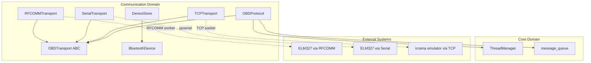
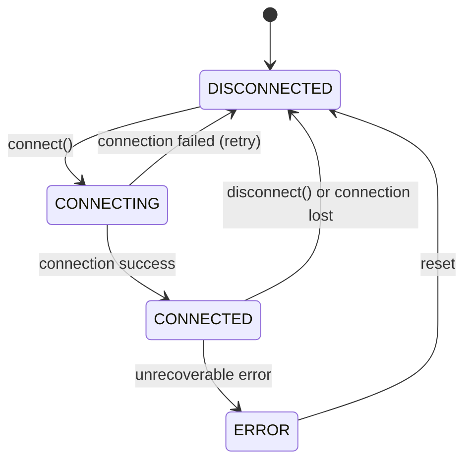
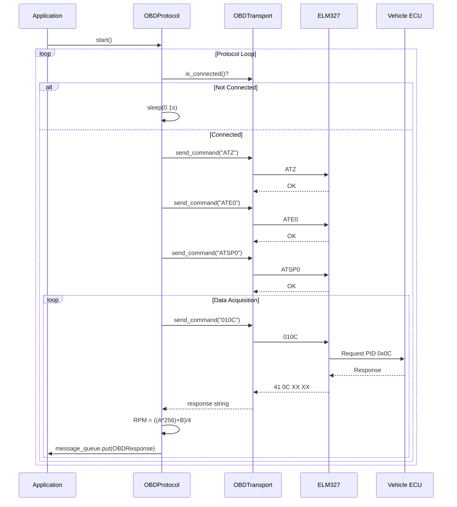
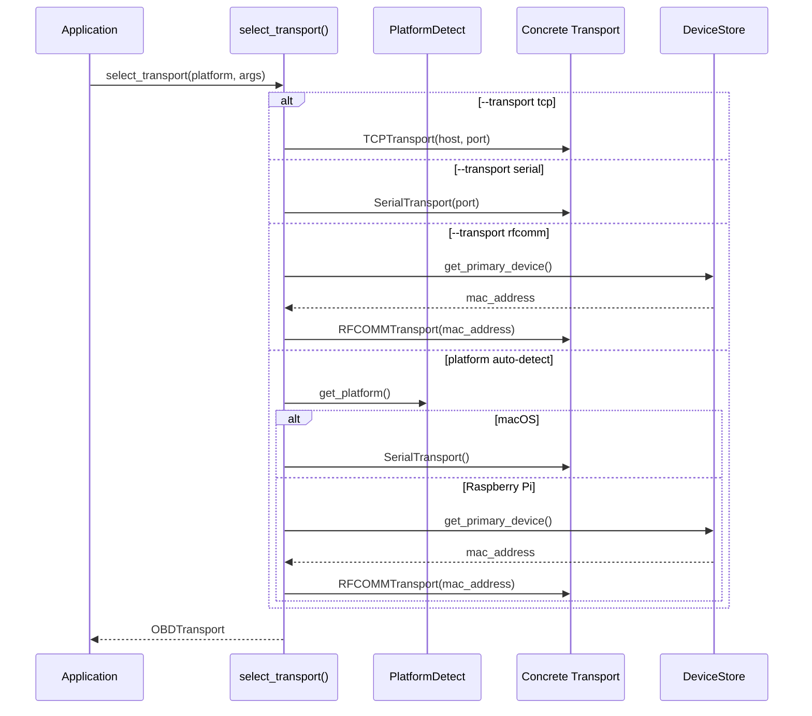

# Domain Design: Communication

Created: 2025-12-29

---

## Table of Contents

- [1.0 Document Information](<#1.0 document information>)
- [2.0 Domain Overview](<#2.0 domain overview>)
- [3.0 Domain Boundaries](<#3.0 domain boundaries>)
- [4.0 Components](<#4.0 components>)
- [5.0 Interfaces](<#5.0 interfaces>)
- [6.0 Data Design](<#6.0 data design>)
- [7.0 Error Handling](<#7.0 error handling>)
- [8.0 Visual Documentation](<#8.0 visual documentation>)
- [9.0 Tier 3 Component Documents](<#9.0 tier 3 component documents>)
- [Version History](<#version history>)

> **Change notice:** v2.0 replaces the Bleak/BLE-based BluetoothManager with an
> OBDTransport abstraction. See ARCH e7f8a9b0 and REQ g1h2i3j4 in
> requirements-gtach-master.md.

---

## 1.0 Document Information

```yaml
document_info:
  document_id: "design-7d3e9f5a-domain_comm"
  tier: 2
  domain: "Communication"
  parent: "design-0000-master_gtach.md"
  version: "2.0"
  date: "2026-03-24"
  author: "William Watson"
```

### 1.1 Parent Reference

- **Master Design**: [design-0000-master_gtach.md](<design-0000-master_gtach.md>)

[Return to Table of Contents](<#table of contents>)

---

## 2.0 Domain Overview

### 2.1 Purpose

The Communication domain manages connectivity to ELM327 OBD-II adapters and implements the OBD-II protocol for vehicle data acquisition. It provides a transport abstraction supporting three physical transports: RFCOMM socket (Pi/Linux, real ELM327), serial port (macOS, paired ELM327), and TCP socket (any platform, ircama emulator). All transports present a uniform interface to the OBD protocol layer.

### 2.2 Responsibilities

1. **Transport Abstraction**: Provide OBDTransport interface hiding physical transport from OBDProtocol
2. **Transport Selection**: Select concrete transport at startup via platform detection or CLI override
3. **Connection Management**: Establish, maintain, and recover transport connections
4. **OBD Protocol Initialization**: Configure ELM327 with AT commands (ATZ, ATE0, ATSP0/8)
5. **RPM Data Acquisition**: Request PID 0x0C, parse response, deliver to display
6. **Device Persistence**: Store paired device information for automatic reconnection
7. **State Machine Management**: Track connection states (DISCONNECTED→CONNECTING→CONNECTED→ERROR)
8. **Error Recovery**: Retry connections indefinitely with configured delay

### 2.3 Domain Patterns

| Pattern | Implementation | Purpose |
|---------|---------------|---------|
| Abstract Base Class | OBDTransport | Uniform interface across all transports |
| Strategy | RFCOMMTransport / SerialTransport / TCPTransport | Runtime transport selection |
| State Machine | TransportState enum | Connection state tracking |
| Repository | DeviceStore | Device persistence and retrieval |
| Adapter | OBDProtocol | Adapt ELM327 AT protocol to application interface |

[Return to Table of Contents](<#table of contents>)

---

## 3.0 Domain Boundaries

### 3.1 Internal Boundaries

```yaml
location: "src/gtach/comm/"
modules:
  - "__init__.py: Package exports (OBDTransport, TransportState, OBDProtocol, OBDResponse, DeviceStore)"
  - "transport.py: OBDTransport (ABC), TransportState, TransportError, select_transport()"
  - "rfcomm.py: RFCOMMTransport — RFCOMM socket, Pi/Linux, real ELM327"
  - "serial_transport.py: SerialTransport — pyserial, macOS, paired ELM327 or emulator"
  - "tcp_transport.py: TCPTransport — TCP socket, any platform, ircama emulator"
  - "obd.py: OBDProtocol, OBDResponse"
  - "device_store.py: DeviceStore (YAML-based persistence)"
  - "models.py: BluetoothDevice dataclass"
```

### 3.2 External Dependencies

| Dependency | Type | Purpose |
|------------|------|---------|
| pyserial | Third-party | SerialTransport on macOS |
| socket | Standard Library | RFCOMMTransport (AF_BLUETOOTH) and TCPTransport |
| threading | Standard Library | Thread-safe state management |
| yaml | Third-party (optional) | Device configuration persistence |
| logging | Standard Library | Structured logging |

### 3.3 Domain Dependencies

| Domain | Dependency Type | Usage |
|--------|-----------------|-------|
| Core | Required | ThreadManager for thread registration and heartbeats |
| Display | Consumer | SetupDisplayManager consumes device discovery results |

[Return to Table of Contents](<#table of contents>)

---

## 4.0 Components

### 4.1 OBDTransport (Abstract Base)

```yaml
component:
  name: "OBDTransport"
  purpose: "Abstract base class defining the uniform transport interface for all concrete transports"
  file: "transport.py"

  responsibilities:
    - "Define connect(), disconnect(), send_command(), is_connected() as abstract methods"
    - "Define TransportState enum (DISCONNECTED, CONNECTING, CONNECTED, ERROR)"
    - "Provide select_transport() factory function for platform-based transport selection"
    - "Provide TransportError base exception"

  key_elements:
    - name: "OBDTransport"
      type: "class (ABC)"
      purpose: "Abstract transport interface"
    - name: "TransportState"
      type: "enum"
      purpose: "Connection state enumeration"
    - name: "TransportError"
      type: "exception"
      purpose: "Base transport error"
    - name: "select_transport"
      type: "function"
      purpose: "Factory: returns concrete transport based on platform or CLI args"

  processing_logic:
    - "select_transport() checks --transport CLI arg first (tcp, rfcomm, serial)"
    - "If no CLI arg: PlatformType.MACOS -> SerialTransport; PlatformType.RASPBERRY_PI_* -> RFCOMMTransport"
    - "TCP host/port passed via --obd-host / --obd-port args (default localhost:35000)"
    - "RFCOMM MAC address read from DeviceStore"
    - "Serial port auto-discovered via serial.tools.list_ports on macOS"
```

### 4.2 RFCOMMTransport

```yaml
component:
  name: "RFCOMMTransport"
  purpose: "Classic Bluetooth SPP transport using RFCOMM socket for Pi/Linux"
  file: "rfcomm.py"

  responsibilities:
    - "Open RFCOMM socket to ELM327 MAC address on channel 1"
    - "Send AT commands as bytes; read response up to prompt character (>)"
    - "Maintain connection with keepalive; detect loss and signal reconnect"
    - "Retry connection indefinitely with configured delay"

  key_elements:
    - name: "RFCOMMTransport"
      type: "class"
      purpose: "Concrete RFCOMM transport"

  dependencies:
    internal:
      - "OBDTransport"
      - "DeviceStore"
    external:
      - "socket (AF_BLUETOOTH, BTPROTO_RFCOMM)"
      - "threading.RLock"

  processing_logic:
    - "socket.socket(AF_BLUETOOTH, SOCK_STREAM, BTPROTO_RFCOMM)"
    - "sock.connect((mac_address, 1))  # channel 1 for SPP"
    - "send_command(): encode to bytes, write to socket, read until > prompt"
    - "Response read with configurable timeout (default 2 s)"
    - "On socket error: set DISCONNECTED, retry loop sleeps retry_delay"

  error_conditions:
    - condition: "Device not paired or out of range"
      handling: "OSError on connect; retry after delay"
    - condition: "Connection lost mid-read"
      handling: "Catch recv() returning empty; set DISCONNECTED"
    - condition: "Response timeout"
      handling: "Return None; caller handles missing data"
```

### 4.3 SerialTransport

```yaml
component:
  name: "SerialTransport"
  purpose: "Serial port transport for macOS with paired ELM327 or emulator"
  file: "serial_transport.py"

  responsibilities:
    - "Open pyserial connection to /dev/tty.* device (macOS SPP) or configured port"
    - "Send AT commands; read response up to prompt character (>)"
    - "Auto-discover ELM327 serial port if none configured"
    - "Retry connection with configured delay"

  key_elements:
    - name: "SerialTransport"
      type: "class"
      purpose: "Concrete serial transport"

  dependencies:
    internal:
      - "OBDTransport"
    external:
      - "serial (pyserial)"
      - "serial.tools.list_ports"

  processing_logic:
    - "Port configured via --serial-port arg or auto-discovered from list_ports()"
    - "Auto-discovery: filter ports containing 'ELM' or 'OBD' in description or device name"
    - "serial.Serial(port, baudrate=38400, timeout=2)"
    - "send_command(): write bytes, read until > prompt with read_until()"
    - "On SerialException: set DISCONNECTED, retry after delay"

  error_conditions:
    - condition: "Port not found"
      handling: "Log error, retry after delay"
    - condition: "Device disconnected"
      handling: "SerialException; set DISCONNECTED, retry"
    - condition: "Response timeout"
      handling: "Return None; caller handles missing data"
```

### 4.4 TCPTransport

```yaml
component:
  name: "TCPTransport"
  purpose: "TCP socket transport for connecting to ircama ELM327 emulator"
  file: "tcp_transport.py"

  responsibilities:
    - "Open TCP socket to configured host:port (default localhost:35000)"
    - "Send AT commands as bytes; read response up to prompt character (>)"
    - "Retry connection with configured delay"

  key_elements:
    - name: "TCPTransport"
      type: "class"
      purpose: "Concrete TCP transport"

  dependencies:
    internal:
      - "OBDTransport"
    external:
      - "socket (AF_INET, SOCK_STREAM)"

  processing_logic:
    - "socket.socket(AF_INET, SOCK_STREAM)"
    - "sock.connect((host, port))"
    - "send_command(): encode to bytes, sendall(), recv() loop until > prompt"
    - "Response read with configurable timeout via sock.settimeout()"
    - "On ConnectionRefusedError / OSError: set DISCONNECTED, retry after delay"

  error_conditions:
    - condition: "Emulator not running"
      handling: "ConnectionRefusedError; retry after delay"
    - condition: "Connection dropped"
      handling: "recv() returns empty; set DISCONNECTED, retry"
    - condition: "Response timeout"
      handling: "socket.timeout; return None"
```

### 4.5 OBDProtocol

```yaml
component:
  name: "OBDProtocol"
  purpose: "Handle OBD-II protocol communication with ELM327 via OBDTransport"
  file: "obd.py"
  
  responsibilities:
    - "Initialize ELM327 adapter with AT commands"
    - "Request vehicle data via PID commands"
    - "Parse OBD-II response data"
    - "Deliver parsed data to ThreadManager message queue"
    - "Maintain protocol loop with heartbeat updates"
  
  key_elements:
    - name: "OBDProtocol"
      type: "class"
      purpose: "OBD-II protocol handler"
    - name: "OBDResponse"
      type: "dataclass"
      purpose: "Parsed OBD response container"
  
  dependencies:
    internal:
      - "OBDTransport"
    external:
      - "threading.Thread"
      - "threading.Event"
  
  processing_logic:
    - "Protocol loop waits for transport connection"
    - "Initialize ELM327: ATZ (reset), ATE0 (echo off), ATSP0/8 (protocol)"
    - "Request RPM: send '010C', parse response bytes"
    - "RPM calculation: ((A * 256) + B) / 4"
    - "Put OBDResponse in ThreadManager.message_queue"
    - "Set ThreadManager.data_available event"
  
  error_conditions:
    - condition: "Transport not connected"
      handling: "Sleep and retry loop"
    - condition: "Initialization failure"
      handling: "Log error, retry initialization"
    - condition: "Invalid response format"
      handling: "Return None, log warning"
    - condition: "Protocol error"
      handling: "Log error with traceback, sleep and continue"
```

### 4.6 DeviceStore

```yaml
component:
  name: "DeviceStore"
  purpose: "Persistent storage for paired Bluetooth devices"
  file: "device_store.py"
  
  responsibilities:
    - "Load and save device configuration from YAML"
    - "Manage primary and secondary device lists"
    - "Track setup completion state"
    - "Provide device retrieval by MAC address"
  
  key_elements:
    - name: "DeviceStore"
      type: "class"
      purpose: "Device persistence manager"
  
  dependencies:
    internal: []
    external:
      - "yaml (optional)"
      - "os, pathlib"
      - "logging"
  
  processing_logic:
    - "Load config from config/devices.yaml on init"
    - "Fall back to in-memory storage if YAML unavailable"
    - "Save updates atomically via temp file + rename"
    - "Track primary device separately from secondary list"
  
  error_conditions:
    - condition: "YAML not available"
      handling: "Use in-memory fallback, log warning"
    - condition: "Config file not found"
      handling: "Create default config, save"
    - condition: "Save failure"
      handling: "Log error, data remains in memory"
```

### 4.7 BluetoothDevice

```yaml
component:
  name: "BluetoothDevice"
  purpose: "Data model for Bluetooth device information"
  file: "models.py"
  
  key_elements:
    - name: "BluetoothDevice"
      type: "dataclass"
      purpose: "Device metadata container"
  
  attributes:
    - "name: Device display name"
    - "address: MAC address (normalized uppercase, no colons)"
    - "last_connected: Datetime of last connection"
    - "connection_count: Number of successful connections"
    - "signal_strength: RSSI in dBm (optional)"
    - "device_type: ELM327, OBD, UNKNOWN"
    - "metadata: Additional key-value data"
  
  processing_logic:
    - "Normalize MAC address in __post_init__"
    - "Detect device type from name (ELM, OBD keywords)"
    - "Convert timestamp strings to datetime"
    - "Serialize/deserialize via to_dict/from_dict"
```

[Return to Table of Contents](<#table of contents>)

---

## 5.0 Interfaces

### 5.1 OBDTransport Abstract Interface

```python
class OBDTransport(ABC):
    @abstractmethod
    def connect(self) -> bool: ...
    @abstractmethod
    def disconnect(self) -> None: ...
    @abstractmethod
    def send_command(self, command: str, timeout: float = 2.0) -> Optional[str]: ...
    @abstractmethod
    def is_connected(self) -> bool: ...
    @property
    @abstractmethod
    def state(self) -> TransportState: ...

def select_transport(platform: PlatformType, args: argparse.Namespace) -> OBDTransport:
    """Factory: selects concrete transport based on CLI args or platform."""
```

### 5.2 Concrete Transport Constructors

```python
class RFCOMMTransport(OBDTransport):
    def __init__(self, mac_address: str, channel: int = 1,
                 retry_delay: float = 5.0) -> None

class SerialTransport(OBDTransport):
    def __init__(self, port: Optional[str] = None, baudrate: int = 38400,
                 retry_delay: float = 5.0) -> None

class TCPTransport(OBDTransport):
    def __init__(self, host: str = "localhost", port: int = 35000,
                 retry_delay: float = 5.0) -> None
```

### 5.3 OBDProtocol Public Interface

```python
class OBDProtocol:
    def __init__(self, transport: OBDTransport,
                 thread_manager: ThreadManager) -> None
    def start(self) -> None
    def stop(self) -> None
```

### 5.4 DeviceStore Public Interface

```python
class DeviceStore:
    def __init__(self, config_path: str = "config/devices.yaml") -> None
    def save_device(self, device: BluetoothDevice, is_primary: bool = True) -> None
    def get_primary_device(self) -> Optional[BluetoothDevice]
    def get_all_devices(self) -> List[BluetoothDevice]
    def remove_device(self, mac_address: str) -> bool
    def get_device_by_mac(self, mac_address: str) -> Optional[BluetoothDevice]
```

### 5.5 Inter-Domain Contracts

| Interface | Consumer | Contract |
|-----------|----------|----------|
| OBDResponse → message_queue | Display domain | Display reads RPM from queue |
| TransportState changes | Application | App responds to connection state |
| select_transport() | Application | Returns transport for platform/CLI args |

[Return to Table of Contents](<#table of contents>)

---

## 6.0 Data Design

### 6.1 BluetoothDevice Entity

```yaml
entity:
  name: "BluetoothDevice"
  purpose: "Bluetooth device information and metadata"
  
  attributes:
    - name: "name"
      type: "str"
      constraints: "Required"
    - name: "address"
      type: "str"
      constraints: "MAC format, normalized uppercase without colons"
    - name: "last_connected"
      type: "Optional[datetime]"
      constraints: "ISO format string convertible"
    - name: "connection_count"
      type: "int"
      constraints: "Default 0"
    - name: "signal_strength"
      type: "Optional[int]"
      constraints: "RSSI in dBm"
    - name: "device_type"
      type: "str"
      constraints: "ELM327, OBD, UNKNOWN"
    - name: "metadata"
      type: "Dict[str, Any]"
      constraints: "Default empty dict"
```

### 6.2 OBDResponse Entity

```yaml
entity:
  name: "OBDResponse"
  purpose: "Parsed OBD-II response data"
  
  attributes:
    - name: "pid"
      type: "int"
      constraints: "0x00-0xFF, e.g., 0x0C for RPM"
    - name: "data"
      type: "bytes"
      constraints: "Raw response bytes after parsing"
    - name: "timestamp"
      type: "float"
      constraints: "Unix timestamp"
    - name: "error"
      type: "Optional[str]"
      constraints: "Error message if parsing failed"
```

### 6.3 TransportState Enumeration

```yaml
states:
  DISCONNECTED: "No active transport connection"
  CONNECTING: "Connection attempt in progress"
  CONNECTED: "Active connection established"
  ERROR: "Unrecoverable error state"
```

### 6.4 Device Configuration Storage

```yaml
storage:
  name: "devices.yaml"
  location: "config/devices.yaml"
  format: "YAML"
  
  structure:
    paired_devices:
      primary:
        name: "string"
        mac_address: "string"
        device_type: "string"
        last_connected: "ISO datetime string"
      secondary:
        <mac_address>:
          name: "string"
          mac_address: "string"
          # ... same fields as primary
```

[Return to Table of Contents](<#table of contents>)

---

## 7.0 Error Handling

### 7.1 Exception Hierarchy

```
TransportError (domain base)
├── ConnectionError
├── TimeoutError
└── ProtocolError

OBDError (domain base)
├── InitializationError
└── ResponseParseError
```

### 7.2 Error Strategies

| Error Type | Strategy |
|------------|----------|
| Transport not available | Log error, set ERROR state, return gracefully |
| Connection refused / device not found | Retry indefinitely with configured delay |
| Connection lost | Transition DISCONNECTED, retry loop resumes |
| Command timeout | Return None; caller handles missing data |
| Parse error | Log warning, return None response |

### 7.3 Logging Standards

```yaml
logging:
  logger_names:
    - "RFCOMMTransport"
    - "SerialTransport"
    - "TCPTransport"
    - "OBDProtocol"
    - "DeviceStore"
  
  log_levels:
    DEBUG: "Command/response details, state transitions"
    INFO: "Connection established, transport selected, protocol initialized"
    WARNING: "Retry attempts, parse failures, timeout warnings"
    ERROR: "Connection failures, protocol errors (with traceback)"
```

[Return to Table of Contents](<#table of contents>)

---

## 8.0 Visual Documentation

### 8.1 Domain Component Diagram



### 8.2 TransportState Machine



### 8.3 OBD Protocol Flow



### 8.4 Transport Selection Sequence



[Return to Table of Contents](<#table of contents>)

---

## 9.0 Tier 3 Component Documents

The following Tier 3 component design documents are pending creation for the v2.0 transport abstraction architecture:

| Document | Component | Status |
|----------|-----------|--------|
| [design-b1c2d3e4-component_comm_transport.md](<design-b1c2d3e4-component_comm_transport.md>) | OBDTransport + select_transport() | Complete |
| [design-c2d3e4f5-component_comm_rfcomm_transport.md](<design-c2d3e4f5-component_comm_rfcomm_transport.md>) | RFCOMMTransport | Complete |
| [design-d3e4f5a6-component_comm_tcp_transport.md](<design-d3e4f5a6-component_comm_tcp_transport.md>) | TCPTransport | Complete |
| [design-e4f5a6b7-component_comm_serial_transport.md](<design-e4f5a6b7-component_comm_serial_transport.md>) | SerialTransport | Complete |
| [design-f5a6b7c8-component_comm_obd_protocol.md](<design-f5a6b7c8-component_comm_obd_protocol.md>) | OBDProtocol | Complete |
| [design-a6b7c8d9-component_comm_device_store.md](<design-a6b7c8d9-component_comm_device_store.md>) | DeviceStore + BluetoothDevice | Complete |

> **Note:** v1.x Tier 3 documents (BluetoothManager-based) have been archived to `deprecated/`.

[Return to Table of Contents](<#table of contents>)

---

## Version History

| Version | Date | Author | Changes |
|---------|------|--------|---------|
| 1.0 | 2025-12-29 | William Watson | Initial domain design document |
| 1.1 | 2025-12-29 | William Watson | Added Tier 3 component document cross-references |
| 2.0 | 2026-03-24 | William Watson | Transport abstraction redesign: replaced BluetoothManager/Bleak with OBDTransport ABC and three concrete transports (RFCOMM, Serial, TCP); updated §4–§9 to reflect new architecture |

---

Copyright (c) 2025 William Watson. This work is licensed under the MIT License.
