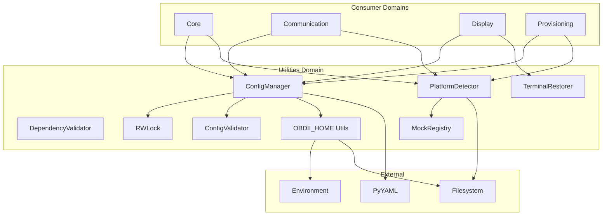
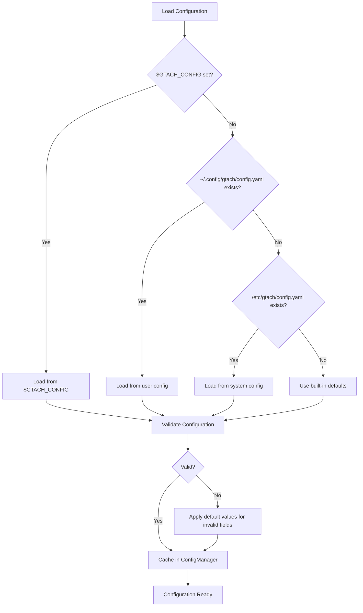
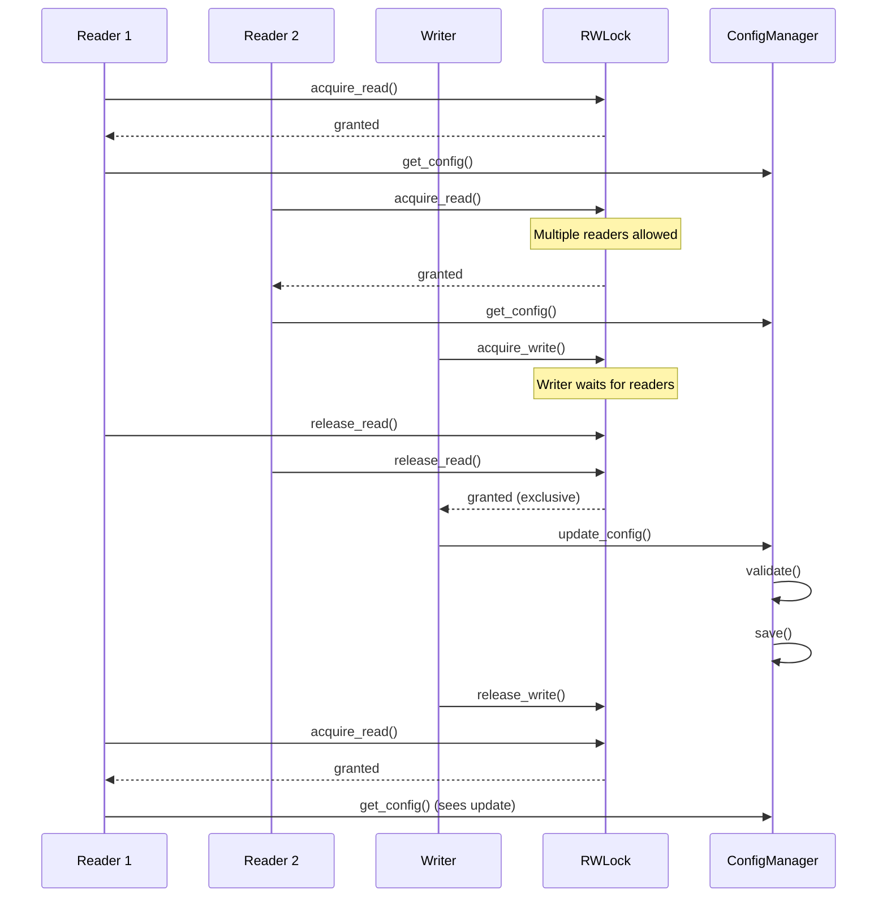

# Domain Design: Utilities

Created: 2025-12-29

---

## Table of Contents

- [1.0 Document Information](<#1.0 document information>)
- [2.0 Domain Overview](<#2.0 domain overview>)
- [3.0 Domain Boundaries](<#3.0 domain boundaries>)
- [4.0 Components](<#4.0 components>)
- [5.0 Interfaces](<#5.0 interfaces>)
- [6.0 Data Design](<#6.0 data design>)
- [7.0 Error Handling](<#7.0 error handling>)
- [8.0 Visual Documentation](<#8.0 visual documentation>)
- [9.0 Tier 3 Component Documents](<#9.0 tier 3 component documents>)
- [Version History](<#version history>)

---

## 1.0 Document Information

```yaml
document_info:
  document_id: "design-9a1f3c7e-domain_utils"
  tier: 2
  domain: "Utilities"
  parent: "design-0000-master_gtach.md"
  version: "1.0"
  date: "2025-12-29"
  author: "William Watson"
```

### 1.1 Parent Reference

- **Master Design**: [design-0000-master_gtach.md](<design-0000-master_gtach.md>)

[Return to Table of Contents](<#table of contents>)

---

## 2.0 Domain Overview

### 2.1 Purpose

The Utilities domain provides cross-cutting infrastructure services used by all other domains. It encompasses configuration management, platform detection, terminal state restoration, dependency validation, and standardized path management. These services enable consistent behavior across development (macOS) and deployment (Raspberry Pi) platforms.

### 2.2 Responsibilities

1. **Configuration Management**: Thread-safe singleton for loading, validating, and persisting application settings
2. **Platform Detection**: Multi-method detection of Raspberry Pi variants with confidence scoring
3. **Terminal Restoration**: Console state management for framebuffer applications
4. **Dependency Validation**: Runtime verification of required Python packages
5. **Path Management**: Standardized OBDII_HOME path resolution
6. **Session Logging**: Debug-mode file logging with session identifiers

### 2.3 Domain Patterns

| Pattern | Implementation | Purpose |
|---------|---------------|---------|
| Singleton | ConfigManager (thread-safe) | Single configuration source |
| Strategy | PlatformDetector methods | Multi-method platform detection |
| Factory | Mock registry | Platform-specific mock creation |
| Template Method | Configuration hierarchy | Ordered config file resolution |
| Observer | Configuration change callbacks | Settings change notification |
| Read-Write Lock | RWLock class | Concurrent read, exclusive write |

[Return to Table of Contents](<#table of contents>)

---

## 3.0 Domain Boundaries

### 3.1 Internal Boundaries

```yaml
location: "src/gtach/utils/"
modules:
  - "__init__.py: Package exports"
  - "config.py: ConfigManager, OBDConfig, RWLock, ConfigTransaction, ConfigValidator"
  - "platform.py: PlatformDetector, PlatformType, DetectionMethod, MockRegistry"
  - "terminal.py: TerminalRestorer"
  - "dependencies.py: DependencyValidator"
  - "home.py: OBDII_HOME path utilities"
  - "logging_config.py: Session-based logging setup"
```

### 3.2 External Dependencies

| Dependency | Type | Purpose |
|------------|------|---------|
| yaml | Third-party (optional) | Configuration file parsing |
| threading | Standard Library | Thread-safe singletons, RWLock |
| os, pathlib | Standard Library | Path operations |
| platform | Standard Library | System platform detection |
| subprocess | Standard Library | Hardware detection commands |
| logging | Standard Library | Logging configuration |
| importlib.util | Standard Library | Dependency checking |

### 3.3 Domain Consumers

All other domains consume Utilities services:

| Consumer | Services Used |
|----------|---------------|
| Core | ConfigManager for thread settings |
| Communication | ConfigManager for Bluetooth/OBD settings, PlatformDetector for mocks |
| Display | ConfigManager for display settings, TerminalRestorer for console |
| Provisioning | ConfigManager for version info, PlatformDetector for target detection |
| Application | All utility services during initialization |

[Return to Table of Contents](<#table of contents>)

---

## 4.0 Components

### 4.1 ConfigManager

```yaml
component:
  name: "ConfigManager"
  purpose: "Thread-safe singleton for application configuration"
  file: "config.py"
  
  responsibilities:
    - "Load configuration from YAML hierarchy"
    - "Provide thread-safe read/write access via RWLock"
    - "Validate configuration against constraints"
    - "Support atomic transactions with rollback"
    - "Enable session-based debug logging"
    - "Notify observers of configuration changes"
  
  key_elements:
    - name: "ConfigManager"
      type: "class"
      purpose: "Singleton configuration manager"
    - name: "OBDConfig"
      type: "dataclass"
      purpose: "Root configuration container"
    - name: "RWLock"
      type: "class"
      purpose: "Reader-writer lock for concurrent access"
    - name: "ConfigTransaction"
      type: "class"
      purpose: "Atomic transaction with rollback"
    - name: "ConfigValidator"
      type: "class"
      purpose: "Hardware-aware validation"
  
  dependencies:
    internal:
      - "home.py (get_config_file, get_home_path)"
    external:
      - "yaml"
      - "threading.RLock"
      - "pathlib.Path"
      - "logging"
  
  processing_logic:
    - "Singleton via double-checked locking"
    - "Configuration hierarchy: $GTACH_CONFIG → ~/.config/gtach/config.yaml → /etc/gtach/config.yaml → defaults"
    - "Read access: acquire read lock, return copy"
    - "Write access: acquire write lock, validate, save, notify"
    - "Debug mode: create session log file with UUID"
  
  error_conditions:
    - condition: "YAML not available"
      handling: "Use default configuration, log warning"
    - condition: "Config file not found"
      handling: "Use defaults, create file on first save"
    - condition: "Validation failure"
      handling: "Reject change, return validation errors"
    - condition: "Save failure"
      handling: "Log error, data remains in memory"
```

### 4.2 PlatformDetector

```yaml
component:
  name: "PlatformDetector"
  purpose: "Unified platform detection with conflict resolution"
  file: "platform.py"
  
  responsibilities:
    - "Detect platform type (Raspberry Pi variant, macOS, Linux, Windows)"
    - "Run multiple detection methods with confidence scoring"
    - "Resolve conflicts between detection methods"
    - "Verify GPIO accessibility"
    - "Provide mock registry for hardware abstraction"
    - "Cache detection results for performance"
  
  key_elements:
    - name: "PlatformDetector"
      type: "class"
      purpose: "Multi-method platform detector"
    - name: "PlatformType"
      type: "enum"
      purpose: "Platform type enumeration"
    - name: "DetectionMethod"
      type: "enum"
      purpose: "Available detection methods"
    - name: "DetectionResult"
      type: "dataclass"
      purpose: "Single method result with confidence"
    - name: "PlatformCapabilities"
      type: "dataclass"
      purpose: "Platform capability flags"
    - name: "MockRegistry"
      type: "class"
      purpose: "Hardware mock management"
  
  dependencies:
    internal: []
    external:
      - "platform (stdlib)"
      - "subprocess"
      - "os"
      - "threading.RLock"
  
  processing_logic:
    - "Detection methods: DEVICE_TREE, HARDWARE_REVISION, PROC_CPUINFO, BCM_GPIO, SYSTEM_PLATFORM"
    - "Weight scoring: DEVICE_TREE=1.0, HARDWARE_REVISION=0.9, PROC_CPUINFO=0.8, BCM_GPIO=0.6, SYSTEM_PLATFORM=0.4"
    - "Conflict resolution: weighted voting across methods"
    - "Cache results for 5 minutes (configurable)"
    - "GPIO accessibility: test actual file/permission access"
  
  error_conditions:
    - condition: "All detection methods fail"
      handling: "Return PlatformType.UNKNOWN"
    - condition: "Detection conflict"
      handling: "Use weighted voting, log discrepancy"
    - condition: "GPIO access denied"
      handling: "Set capabilities.gpio_accessible = False"
```

### 4.3 TerminalRestorer

```yaml
component:
  name: "TerminalRestorer"
  purpose: "Manage console state for framebuffer applications"
  file: "terminal.py"
  
  responsibilities:
    - "Save terminal state before framebuffer takeover"
    - "Restore terminal state on application exit"
    - "Handle cursor visibility"
    - "Manage input echo settings"
  
  key_elements:
    - name: "TerminalRestorer"
      type: "class"
      purpose: "Terminal state manager"
  
  dependencies:
    internal: []
    external:
      - "os"
      - "sys"
      - "termios (optional)"
      - "tty (optional)"
  
  processing_logic:
    - "Save termios settings on init (if available)"
    - "Hide cursor on framebuffer init"
    - "Restore settings on cleanup/exit"
    - "No-op on platforms without termios"
  
  error_conditions:
    - condition: "termios not available"
      handling: "Log debug, no-op operations"
    - condition: "Not a TTY"
      handling: "Skip terminal operations"
    - condition: "Restore failure"
      handling: "Log error, best-effort cleanup"
```

### 4.4 DependencyValidator

```yaml
component:
  name: "DependencyValidator"
  purpose: "Validate runtime Python package availability"
  file: "dependencies.py"
  
  responsibilities:
    - "Check required package availability"
    - "Verify minimum version requirements"
    - "Generate validation reports"
    - "Provide installation hints"
  
  key_elements:
    - name: "DependencyValidator"
      type: "class"
      purpose: "Package dependency checker"
  
  dependencies:
    internal: []
    external:
      - "importlib.util"
      - "pkg_resources (optional)"
  
  processing_logic:
    - "Check each required package via importlib.util.find_spec()"
    - "Compare installed version against minimum requirement"
    - "Aggregate results into validation report"
    - "Distinguish required vs optional packages"
  
  error_conditions:
    - condition: "Required package missing"
      handling: "Add to missing list, include pip install hint"
    - condition: "Version too old"
      handling: "Add to outdated list with upgrade hint"
```

### 4.5 OBDII_HOME Utilities

```yaml
component:
  name: "OBDII_HOME Utilities"
  purpose: "Standardized path management for application files"
  file: "home.py"
  
  responsibilities:
    - "Resolve OBDII_HOME base path"
    - "Provide config file path resolution"
    - "Ensure directory structure exists"
    - "Support environment variable override"
  
  key_elements:
    - name: "get_home_path"
      type: "function"
      purpose: "Return OBDII_HOME path"
    - name: "get_config_file"
      type: "function"
      purpose: "Return config file path"
    - name: "ensure_directories"
      type: "function"
      purpose: "Create required directories"
  
  dependencies:
    internal: []
    external:
      - "os"
      - "pathlib.Path"
  
  processing_logic:
    - "Check $GTACH_CONFIG environment variable"
    - "Fall back to ~/.config/gtach/"
    - "Create directories with appropriate permissions"
    - "Return Path objects for type safety"
```

[Return to Table of Contents](<#table of contents>)

---

## 5.0 Interfaces

### 5.1 ConfigManager Public Interface

```python
class ConfigManager:
    # Singleton access
    @classmethod
    def get_instance(cls) -> 'ConfigManager'
    
    # Configuration access (thread-safe)
    def get_config(self) -> OBDConfig
    def get_bluetooth_config(self) -> BluetoothConfig
    def get_display_config(self) -> DisplayConfig
    
    # Configuration modification
    def update_config(self, updates: Dict[str, Any]) -> bool
    def begin_transaction(self) -> ConfigTransaction
    
    # Validation
    def validate(self) -> Dict[str, Any]
    
    # Session logging
    def enable_debug_logging(self, session_id: str = None) -> str
    def get_log_file_path(self) -> Optional[Path]
    
    # Reload
    def reload(self) -> bool
```

### 5.2 PlatformDetector Public Interface

```python
class PlatformDetector:
    def __init__(self) -> None
    
    # Detection
    def get_platform_type(self, force_refresh: bool = False) -> PlatformType
    def get_capabilities(self) -> PlatformCapabilities
    def get_detection_results(self) -> List[DetectionResult]
    
    # Raspberry Pi specific
    def is_raspberry_pi(self) -> bool
    def get_pi_model(self) -> Optional[str]
    
    # Mock management
    @property
    def mock_registry(self) -> MockRegistry
    
    # Utilities
    def get_gpio_mock(self) -> Any
    def should_use_mocks(self) -> bool
```

### 5.3 TerminalRestorer Public Interface

```python
class TerminalRestorer:
    def __init__(self) -> None
    def save_state(self) -> None
    def restore_state(self) -> None
    def hide_cursor(self) -> None
    def show_cursor(self) -> None
    
    # Context manager
    def __enter__(self) -> 'TerminalRestorer'
    def __exit__(self, exc_type, exc_val, exc_tb) -> None
```

### 5.4 Inter-Domain Contracts

| Interface | Consumer | Contract |
|-----------|----------|----------|
| ConfigManager.get_instance() | All domains | Returns singleton instance |
| get_config() | All domains | Returns thread-safe config copy |
| PlatformDetector.is_raspberry_pi() | Core, Display | Returns True on Pi hardware |
| should_use_mocks() | Comm, Display | Returns True on non-Pi platforms |
| TerminalRestorer | Display | Context manager for console state |

[Return to Table of Contents](<#table of contents>)

---

## 6.0 Data Design

### 6.1 OBDConfig (Root Configuration)

```yaml
entity:
  name: "OBDConfig"
  purpose: "Root configuration container"
  
  nested_configs:
    - name: "bluetooth"
      type: "BluetoothConfig"
    - name: "display"
      type: "DisplayConfig"
    - name: "session"
      type: "SessionConfig"
```

### 6.2 BluetoothConfig

```yaml
entity:
  name: "BluetoothConfig"
  purpose: "Bluetooth connection settings"
  
  attributes:
    - name: "scan_duration"
      type: "float"
      constraints: "Default 10.0 seconds"
    - name: "retry_delay"
      type: "float"
      constraints: "Default 5.0 seconds (no retry limit)"
    - name: "timeout"
      type: "float"
      constraints: "Default 10.0 seconds"
    - name: "bleak_timeout"
      type: "float"
      constraints: "Default 10.0 seconds"
    - name: "service_discovery_timeout"
      type: "float"
      constraints: "Default 5.0 seconds"
    - name: "elm327_timeout"
      type: "float"
      constraints: "Default 2.0 seconds"
    - name: "elm327_retries"
      type: "int"
      constraints: "Default 3"
```

### 6.3 PlatformType Enumeration

```yaml
entity:
  name: "PlatformType"
  purpose: "Detected platform enumeration"
  
  values:
    - RASPBERRY_PI_ZERO: "Pi Zero (original)"
    - RASPBERRY_PI_ZERO_2W: "Pi Zero 2 W (target)"
    - RASPBERRY_PI_4: "Raspberry Pi 4"
    - RASPBERRY_PI_5: "Raspberry Pi 5"
    - RASPBERRY_PI_GENERIC: "Unknown Pi variant"
    - LINUX_GENERIC: "Non-Pi Linux"
    - MACOS: "macOS (development)"
    - WINDOWS: "Windows"
    - UNKNOWN: "Detection failed"
```

### 6.4 Configuration File Structure

```yaml
storage:
  name: "config.yaml"
  location: "~/.config/gtach/config.yaml"
  
  structure:
    bluetooth:
      scan_duration: 10.0
      retry_delay: 5.0
      timeout: 10.0
      bleak_timeout: 10.0
    display:
      mode: "DIGITAL"
      rpm_max: 8000
      fps_limit: 30
```

[Return to Table of Contents](<#table of contents>)

---

## 7.0 Error Handling

### 7.1 Exception Strategy

| Error Type | Handling Strategy |
|------------|-------------------|
| YAML not available | Use default config, log warning |
| Config file missing | Use defaults, create on save |
| Validation failure | Return errors dict, reject change |
| Platform detection failure | Return UNKNOWN, log error |
| GPIO access denied | Set capability flag, use mocks |
| Terminal restore failure | Log error, best-effort cleanup |

### 7.2 Logging Standards

```yaml
logging:
  logger_names:
    - "ConfigManager"
    - "PlatformDetector"
    - "TerminalRestorer"
    - "DependencyValidator"
    - "MockRegistry"
  
  log_levels:
    DEBUG: "Detection method details, config access, lock operations"
    INFO: "Platform detected, config loaded, session started"
    WARNING: "YAML unavailable, mock fallback, validation warnings"
    ERROR: "Save failures, detection errors (with traceback)"
```

[Return to Table of Contents](<#table of contents>)

---

## 8.0 Visual Documentation

### 8.1 Domain Component Diagram



### 8.2 Configuration Resolution Flow



### 8.3 Platform Detection Flow

```mermaid
flowchart TD
    START[Detect Platform] --> CACHE{Cache Valid?}
    
    CACHE -->|Yes| RETURN[Return Cached Result]
    CACHE -->|No| RUN[Run All Detection Methods]
    
    RUN --> DT[Device Tree Check]
    RUN --> HR[Hardware Revision Check]
    RUN --> PC[/proc/cpuinfo Check]
    RUN --> GPIO[BCM GPIO Check]
    RUN --> SYS[System Platform Check]
    
    DT --> RESULTS
    HR --> RESULTS
    PC --> RESULTS
    GPIO --> RESULTS
    SYS --> RESULTS
    
    RESULTS[Collect Results] --> WEIGHT[Apply Confidence Weights]
    WEIGHT --> VOTE[Weighted Voting]
    
    VOTE --> CONFLICT{Conflicts?}
    
    CONFLICT -->|Yes| RESOLVE[Use Highest Weight Method]
    CONFLICT -->|No| SELECT[Select Unanimous Result]
    
    RESOLVE --> UPDATE
    SELECT --> UPDATE
    
    UPDATE[Update Cache] --> RETURN
```

### 8.4 ConfigManager Thread Safety



[Return to Table of Contents](<#table of contents>)

---

## 9.0 Tier 3 Component Documents

The following Tier 3 component design documents decompose each component:

| Document | Component | Status |
|----------|-----------|--------|
| [design-b4c5d6e7-component_utils_config_manager.md](<design-b4c5d6e7-component_utils_config_manager.md>) | ConfigManager | Complete |
| [design-c5d6e7f8-component_utils_platform_detector.md](<design-c5d6e7f8-component_utils_platform_detector.md>) | PlatformDetector | Complete |
| [design-d6e7f8a9-component_utils_terminal_restorer.md](<design-d6e7f8a9-component_utils_terminal_restorer.md>) | TerminalRestorer | Complete |
| [design-e7f8a9b0-component_utils_dependency_validator.md](<design-e7f8a9b0-component_utils_dependency_validator.md>) | DependencyValidator | Complete |
| [design-f8a9b0c1-component_utils_home.md](<design-f8a9b0c1-component_utils_home.md>) | OBDII_HOME Utilities | Complete |

[Return to Table of Contents](<#table of contents>)

---

## Version History

| Version | Date | Author | Changes |
|---------|------|--------|---------|
| 1.0 | 2025-12-29 | William Watson | Initial domain design document |
| 1.1 | 2025-12-29 | William Watson | Added Tier 3 component document cross-references |
| 1.2 | 2026-03-13 | William Watson | C1: removed retry_limit attribute. C3: fps_limit 60->30. C4: removed rpm_warning/rpm_danger; added rpm_max. OOS-05: removed SessionConfig section from config structure. |

---

Copyright (c) 2025 William Watson. This work is licensed under the MIT License.
