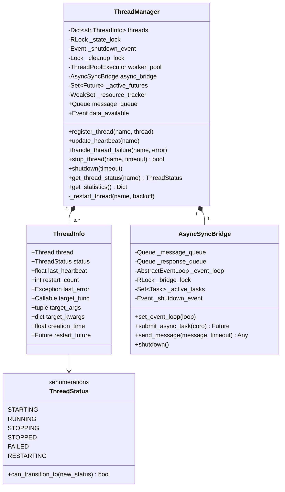
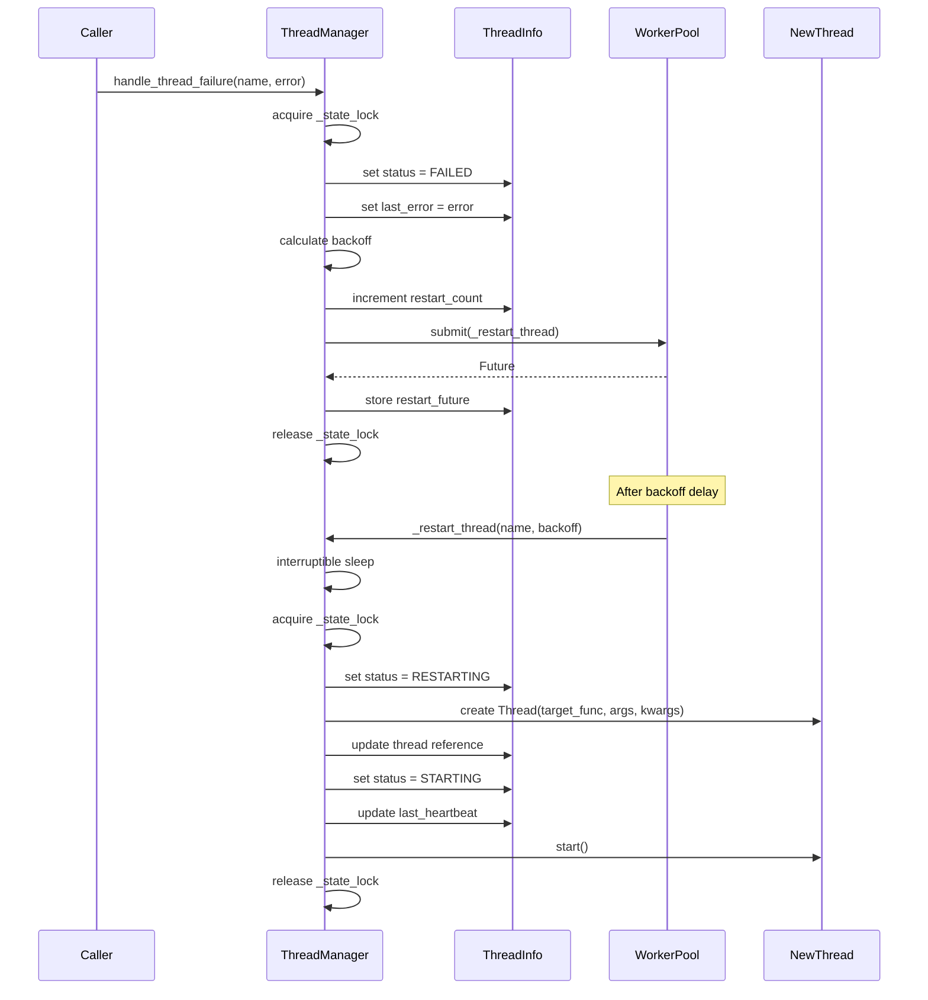
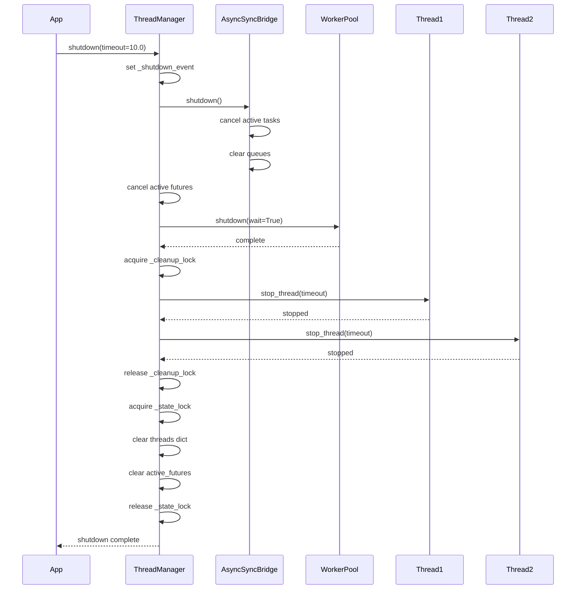

# Component Design: ThreadManager

Created: 2025-12-29

---

## Table of Contents

- [1.0 Document Information](<#1.0 document information>)
- [2.0 Component Overview](<#2.0 component overview>)
- [3.0 Class Design](<#3.0 class design>)
- [4.0 Method Specifications](<#4.0 method specifications>)
- [5.0 Data Structures](<#5.0 data structures>)
- [6.0 State Management](<#6.0 state management>)
- [7.0 Threading Model](<#7.0 threading model>)
- [8.0 Error Handling](<#8.0 error handling>)
- [9.0 Dependencies](<#9.0 dependencies>)
- [10.0 Visual Documentation](<#10.0 visual documentation>)
- [Version History](<#version history>)

---

## 1.0 Document Information

```yaml
document_info:
  document_id: "design-a1b2c3d4-component_core_thread_manager"
  tier: 3
  domain: "Core"
  component: "ThreadManager"
  parent: "design-4f8a2b1c-domain_core.md"
  source_file: "src/gtach/core/thread.py"
  version: "1.0"
  date: "2025-12-29"
  author: "William Watson"
```

### 1.1 Parent Reference

- **Domain Design**: [design-4f8a2b1c-domain_core.md](<design-4f8a2b1c-domain_core.md>)
- **Master Design**: [design-0000-master_gtach.md](<design-0000-master_gtach.md>)

[Return to Table of Contents](<#table of contents>)

---

## 2.0 Component Overview

### 2.1 Purpose

ThreadManager provides thread-safe lifecycle management for application threads with automatic failure recovery, worker pool coordination, and async/sync bridging. It serves as the central coordination point for all managed threads in the GTach application.

### 2.2 Responsibilities

1. Register threads with atomic state initialization (STARTING)
2. Track thread health via heartbeat timestamp updates
3. Handle thread failures with exponential backoff restart
4. Manage ThreadPoolExecutor for background tasks
5. Provide message queue for inter-thread communication
6. Coordinate async/sync execution via AsyncSyncBridge
7. Perform graceful shutdown with proper cleanup sequencing

### 2.3 Design Rationale

- **RLock vs Lock**: RLock enables nested locking for complex operations
- **Exponential backoff with jitter**: Prevents thundering herd on mass restart
- **WeakSet for resource tracking**: Allows garbage collection while tracking
- **Context manager support**: Ensures cleanup on exceptions

[Return to Table of Contents](<#table of contents>)

---

## 3.0 Class Design

### 3.1 ThreadManager Class

```python
class ThreadManager:
    """Thread-safe manager for application threads and worker pool.
    
    Provides atomic state transitions, proper resource cleanup,
    and async/sync coordination with comprehensive error handling.
    
    Attributes:
        threads: Dict[str, ThreadInfo] - Registered thread metadata
        worker_pool: ThreadPoolExecutor - Background task executor
        async_bridge: AsyncSyncBridge - Async/sync coordination
        message_queue: queue.Queue - Inter-thread communication
        data_available: threading.Event - Signal for new data
    """
```

### 3.2 Constructor Signature

```python
def __init__(self, num_workers: int = 3, platform_optimized: bool = True) -> None:
    """Initialize thread manager with thread-safe architecture.
    
    Args:
        num_workers: Base number of worker threads (default 3)
        platform_optimized: Enable platform-specific worker scaling
            - macOS: min(num_workers * 2, 8) for development
            - Raspberry Pi: min(num_workers, 4) for Pi Zero 2W
    
    Thread Safety:
        Constructor is thread-safe; instance should be created once.
    """
```

### 3.3 Instance Attributes

| Attribute | Type | Purpose |
|-----------|------|---------|
| `threads` | `Dict[str, ThreadInfo]` | Thread metadata registry |
| `_state_lock` | `threading.RLock` | Reentrant lock for state operations |
| `_shutdown_event` | `threading.Event` | Shutdown signal |
| `_cleanup_lock` | `threading.Lock` | Separate lock for cleanup |
| `worker_pool` | `ThreadPoolExecutor` | Background task executor |
| `async_bridge` | `AsyncSyncBridge` | Async/sync coordinator |
| `_active_futures` | `Set[Future]` | Pending async operations |
| `_resource_tracker` | `weakref.WeakSet` | GC-safe resource tracking |
| `message_queue` | `queue.Queue` | Inter-thread messages |
| `data_available` | `threading.Event` | New data signal |
| `_operation_count` | `int` | Performance counter |
| `_lock` | `RLock` | Backward compatibility alias |

[Return to Table of Contents](<#table of contents>)

---

## 4.0 Method Specifications

### 4.1 register_thread

```python
def register_thread(self, name: str, thread: threading.Thread) -> None:
    """Register a new thread for management with atomic state transition.
    
    Args:
        name: Unique identifier for the thread
        thread: Thread instance to manage (should not be started)
    
    Raises:
        RuntimeError: If called during shutdown
    
    Thread Safety:
        Atomic registration protected by _state_lock
    
    State Transition:
        Creates ThreadInfo with status=STARTING
    
    Algorithm:
        1. Check shutdown flag (raise if set)
        2. Acquire _state_lock
        3. Check for existing thread with same name
           - If exists and active: log warning, return
           - If exists and inactive: replace
        4. Create ThreadInfo with STARTING status
        5. Add to threads dict and resource tracker
        6. Release lock
        7. Log registration
    """
```

### 4.2 update_heartbeat

```python
def update_heartbeat(self, name: str) -> None:
    """Update thread heartbeat timestamp with atomic status transition.
    
    Args:
        name: Thread identifier
    
    Thread Safety:
        Atomic update protected by _state_lock
    
    State Transition:
        STARTING -> RUNNING on first heartbeat
    
    Algorithm:
        1. Acquire _state_lock
        2. Lookup thread in registry
           - If not found: log warning, return
        3. Get current timestamp
        4. If status is STARTING and can transition to RUNNING:
           - Update status to RUNNING
           - Log transition
        5. Update last_heartbeat timestamp
        6. Release lock
    """
```

### 4.3 handle_thread_failure

```python
def handle_thread_failure(self, name: str, error: Exception) -> None:
    """Handle thread failure with atomic state transition and safe restart.
    
    Args:
        name: Thread identifier
        error: Exception that caused the failure
    
    Thread Safety:
        Atomic state update, restart scheduled via worker pool
    
    State Transition:
        Current state -> FAILED
    
    Restart Calculation:
        backoff = min(2 ** restart_count, 8) + jitter
        jitter = backoff * 0.1 * (hash(name) % 10) / 10
    
    Algorithm:
        1. Check shutdown flag (return if set)
        2. Acquire _state_lock
        3. Lookup thread in registry
           - If not found: log warning, return
        4. Validate state transition to FAILED
           - If invalid: log warning, return
        5. Update status to FAILED
        6. Store error in last_error
        7. Calculate backoff with jitter
        8. Increment restart_count
        9. Log error with full traceback
        10. Cancel any existing restart_future
        11. Submit _restart_thread to worker pool
        12. Store restart_future, add to active_futures
        13. Add cleanup callback to future
        14. Release lock
    """
```

### 4.4 _restart_thread

```python
def _restart_thread(self, name: str, backoff: float) -> None:
    """Restart failed thread after backoff with proper error handling.
    
    Args:
        name: Thread identifier
        backoff: Seconds to wait before restart
    
    Thread Safety:
        Runs in worker pool thread, acquires locks as needed
    
    State Transitions:
        FAILED/STOPPED -> RESTARTING -> STARTING
    
    Algorithm:
        1. Interruptible sleep (check shutdown every 100ms)
           - Return if shutdown detected
        2. Acquire _state_lock
        3. Verify thread still exists
           - If not: log warning, return
        4. Verify status is FAILED or STOPPED
           - If changed: log, return
        5. Validate transition to RESTARTING
           - If invalid: log warning, return
        6. Set status to RESTARTING
        7. Verify target_func is available
           - If not: log error, set STOPPED, return
        8. Create new Thread with stored target/args/kwargs
        9. Update ThreadInfo with new thread
        10. Set status to STARTING
        11. Update last_heartbeat
        12. Clear last_error
        13. Start new thread
        14. Log success
        15. Release lock
    
    Exception Handling:
        On any exception:
        - Log error with traceback
        - Attempt to set status to FAILED (best effort)
    """
```

### 4.5 stop_thread

```python
def stop_thread(self, name: str, timeout: float = 5.0) -> bool:
    """Stop a specific thread with proper state management.
    
    Args:
        name: Thread identifier
        timeout: Maximum seconds to wait for thread join
    
    Returns:
        True if thread stopped successfully, False otherwise
    
    Thread Safety:
        Lock acquired for state update, join outside lock
    
    State Transition:
        Current state -> STOPPING -> STOPPED/FAILED
    
    Algorithm:
        1. Acquire _state_lock
        2. Lookup thread in registry
           - If not found: log warning, return False
        3. Validate transition to STOPPING
           - If already STOPPED: return True
           - If invalid: return False
        4. Set status to STOPPING
        5. Cancel any pending restart_future
        6. Release lock (avoid deadlock during join)
        7. If thread is alive: join with timeout
        8. Check if thread stopped
        9. Acquire _state_lock
        10. Set final status (STOPPED if joined, FAILED if not)
        11. Release lock
        12. Log result
        13. Return success status
    """
```

### 4.6 shutdown

```python
def shutdown(self, timeout: float = 10.0) -> None:
    """Shutdown thread manager with proper resource cleanup and verification.
    
    Args:
        timeout: Maximum seconds for complete shutdown
    
    Thread Safety:
        Sets shutdown event, then proceeds with cleanup
    
    Algorithm:
        1. Record shutdown start time
        2. Log shutdown initiation
        3. Set _shutdown_event
        4. Call async_bridge.shutdown()
        5. Cancel all active futures
           - Log cancelled count
        6. Shutdown worker pool (wait=True)
           - Log completion or warning
        7. Acquire _cleanup_lock
        8. Calculate per-thread timeout
        9. For each registered thread:
           - Call stop_thread with per-thread timeout
           - Track success/failure counts
        10. Release _cleanup_lock
        11. Calculate cleanup duration
        12. Log final statistics
        13. Acquire _state_lock
        14. Clear threads dict
        15. Clear active_futures
        16. Release lock
    """
```

### 4.7 Utility Methods

```python
def get_thread_status(self, name: str) -> Optional[ThreadStatus]:
    """Get current thread status thread-safely."""

def get_thread_info(self, name: str) -> Optional[Dict[str, Any]]:
    """Get thread information snapshot as dictionary."""

def list_threads(self) -> Dict[str, Dict[str, Any]]:
    """Get information for all managed threads."""

def is_healthy(self, heartbeat_timeout: float = 30.0) -> bool:
    """Check if all threads are healthy (no FAILED, heartbeats current)."""

def get_statistics(self) -> Dict[str, Any]:
    """Get manager statistics for monitoring."""
```

[Return to Table of Contents](<#table of contents>)

---

## 5.0 Data Structures

### 5.1 ThreadInfo Dataclass

```python
@dataclass(frozen=False, eq=False)
class ThreadInfo:
    """Thread information and state tracking with synchronization.
    
    Attributes:
        thread: The managed Thread instance
        status: Current ThreadStatus
        last_heartbeat: Unix timestamp of last heartbeat
        restart_count: Number of restart attempts
        last_error: Exception from last failure
        target_func: Thread target function (for restart)
        target_args: Thread target args (for restart)
        target_kwargs: Thread target kwargs (for restart)
        creation_time: Unix timestamp of registration
        restart_future: Pending restart Future
    """
    thread: threading.Thread
    status: ThreadStatus
    last_heartbeat: float
    restart_count: int = 0
    last_error: Optional[Exception] = None
    target_func: Optional[Callable] = None
    target_args: tuple = field(default_factory=tuple)
    target_kwargs: dict = field(default_factory=dict)
    creation_time: float = field(default_factory=time.time)
    restart_future: Optional[Future] = None
    
    def __hash__(self):
        """Make ThreadInfo hashable based on thread identity."""
        return hash((id(self.thread), self.creation_time))
    
    def __post_init__(self):
        """Extract and store thread target info safely."""
        if hasattr(self.thread, '_target') and self.thread._target:
            self.target_func = self.thread._target
            self.target_args = getattr(self.thread, '_args', ())
            self.target_kwargs = getattr(self.thread, '_kwargs', {})
```

### 5.2 ThreadStatus Enum

```python
class ThreadStatus(Enum):
    """Thread status enumeration with atomic transitions.
    
    Valid Transitions:
        STARTING  -> RUNNING, FAILED, STOPPING
        RUNNING   -> STOPPING, FAILED, RESTARTING
        STOPPING  -> STOPPED, FAILED
        STOPPED   -> STARTING, RESTARTING
        FAILED    -> RESTARTING, STOPPING, STOPPED
        RESTARTING -> STARTING, FAILED, STOPPED
    """
    STARTING = auto()
    RUNNING = auto()
    STOPPING = auto()
    STOPPED = auto()
    FAILED = auto()
    RESTARTING = auto()
    
    def can_transition_to(self, new_status: 'ThreadStatus') -> bool:
        """Check if transition to new status is valid."""
        valid_transitions = {
            ThreadStatus.STARTING: {ThreadStatus.RUNNING, ThreadStatus.FAILED, ThreadStatus.STOPPING},
            ThreadStatus.RUNNING: {ThreadStatus.STOPPING, ThreadStatus.FAILED, ThreadStatus.RESTARTING},
            ThreadStatus.STOPPING: {ThreadStatus.STOPPED, ThreadStatus.FAILED},
            ThreadStatus.STOPPED: {ThreadStatus.STARTING, ThreadStatus.RESTARTING},
            ThreadStatus.FAILED: {ThreadStatus.RESTARTING, ThreadStatus.STOPPING, ThreadStatus.STOPPED},
            ThreadStatus.RESTARTING: {ThreadStatus.STARTING, ThreadStatus.FAILED, ThreadStatus.STOPPED}
        }
        return new_status in valid_transitions.get(self, set())
```

[Return to Table of Contents](<#table of contents>)

---

## 6.0 State Management

### 6.1 State Invariants

1. **Single Status**: Each thread has exactly one status at any time
2. **Valid Transitions**: Status changes only via defined transitions
3. **Atomic Updates**: Status changes are protected by _state_lock
4. **Heartbeat Monotonic**: last_heartbeat only increases (never backdated)
5. **Restart Counter**: restart_count only increments, never resets

### 6.2 Synchronization Strategy

```yaml
synchronization:
  _state_lock:
    type: "RLock"
    protects:
      - "threads dict access"
      - "ThreadInfo status updates"
      - "ThreadInfo heartbeat updates"
    reentrant: true
    reason: "Enables nested locking for complex operations"
  
  _cleanup_lock:
    type: "Lock"
    protects:
      - "Shutdown sequence"
      - "Thread stopping iteration"
    separate: true
    reason: "Avoids deadlock with _state_lock during cleanup"
  
  _shutdown_event:
    type: "Event"
    signals:
      - "Shutdown in progress"
    checked_by:
      - "register_thread"
      - "handle_thread_failure"
      - "_restart_thread"
```

### 6.3 Lock Acquisition Order

To prevent deadlock, locks must be acquired in this order:
1. `_shutdown_event.is_set()` check (no lock)
2. `_state_lock` for state operations
3. `_cleanup_lock` only during shutdown (never while holding _state_lock)

[Return to Table of Contents](<#table of contents>)

---

## 7.0 Threading Model

### 7.1 Worker Pool Configuration

```python
# Platform-optimized worker count
if platform_optimized:
    if platform.system() == 'Darwin':  # macOS development
        num_workers = min(num_workers * 2, 8)  # Higher concurrency
    else:  # Raspberry Pi deployment
        num_workers = min(num_workers, 4)  # Conservative for Pi Zero 2W

worker_pool = ThreadPoolExecutor(
    max_workers=num_workers,
    thread_name_prefix='TMWorker'
)
```

### 7.2 Restart Backoff Algorithm

```python
def calculate_backoff(restart_count: int, name: str) -> float:
    """Calculate restart delay with exponential backoff and jitter.
    
    Formula: min(2^restart_count, 8) + jitter
    Jitter: backoff * 0.1 * deterministic_factor
    
    Deterministic jitter prevents thundering herd while being repeatable.
    """
    base_backoff = min(2 ** restart_count, 8)  # Cap at 8 seconds
    jitter = base_backoff * 0.1 * (hash(name) % 10) / 10
    return base_backoff + jitter
```

### 7.3 Interruptible Sleep Pattern

```python
# Used in _restart_thread for shutdown-aware waiting
for _ in range(int(backoff * 10)):
    if self._shutdown_event.is_set():
        return  # Exit early on shutdown
    time.sleep(0.1)  # 100ms increments
```

[Return to Table of Contents](<#table of contents>)

---

## 8.0 Error Handling

### 8.1 Exception Strategy

| Scenario | Exception | Handling |
|----------|-----------|----------|
| Register during shutdown | RuntimeError | Raise immediately |
| Unknown thread in update | None | Log warning, return |
| Invalid state transition | None | Log warning, reject |
| Restart thread not found | None | Log warning, return |
| Restart no target_func | None | Log error, set STOPPED |
| Worker pool shutdown | Exception | Log warning, continue |

### 8.2 Logging Configuration

```python
logger = logging.getLogger('ThreadManager')

# Log levels by operation
DEBUG: "State transitions, sync timing, cleanup details"
INFO: "Thread registration, restart success, shutdown complete"
WARNING: "Invalid transitions, unknown threads, recovery attempts"
ERROR: "Thread failures, restart failures (with exc_info=True)"
```

### 8.3 Error Recovery

```python
# Best-effort status update on exception
try:
    # Normal processing
except Exception as e:
    self.logger.error(f"Error: {e}", exc_info=True)
    try:
        with self._state_lock:
            if name in self.threads:
                self.threads[name].status = ThreadStatus.FAILED
                self.threads[name].last_error = e
    except Exception:
        pass  # Best effort
```

[Return to Table of Contents](<#table of contents>)

---

## 9.0 Dependencies

### 9.1 Internal Dependencies

| Component | Usage |
|-----------|-------|
| AsyncSyncBridge | Async/sync coordination (same file) |
| ThreadStatus | State enumeration (same file) |
| ThreadInfo | Thread metadata container (same file) |

### 9.2 External Dependencies

| Package | Import | Purpose |
|---------|--------|---------|
| threading | RLock, Lock, Event, Thread | Synchronization primitives |
| queue | Queue | Inter-thread communication |
| time | time, perf_counter | Timestamps, timing |
| asyncio | AbstractEventLoop | Event loop reference |
| concurrent.futures | ThreadPoolExecutor, Future | Worker pool, async results |
| weakref | WeakSet | GC-safe resource tracking |
| logging | getLogger | Structured logging |
| platform | system | Platform detection |

[Return to Table of Contents](<#table of contents>)

---

## 10.0 Visual Documentation

### 10.1 Class Diagram



### 10.2 Restart Sequence Diagram



### 10.3 Shutdown Sequence



[Return to Table of Contents](<#table of contents>)

---

## Version History

| Version | Date | Author | Changes |
|---------|------|--------|---------|
| 1.0 | 2025-12-29 | William Watson | Initial component design document |

---

Copyright (c) 2025 William Watson. This work is licensed under the MIT License.
