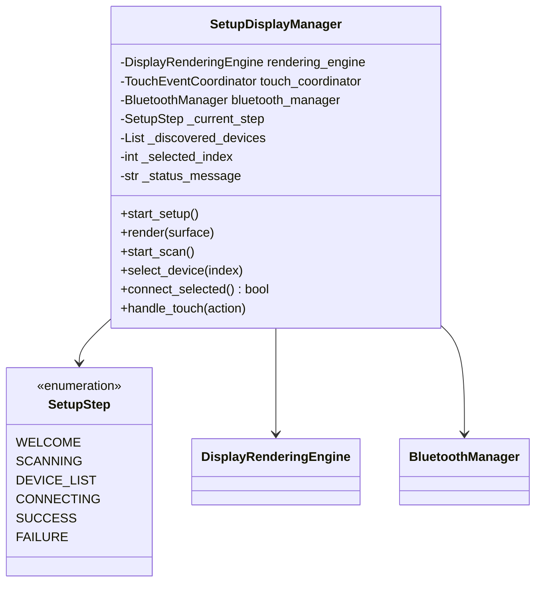
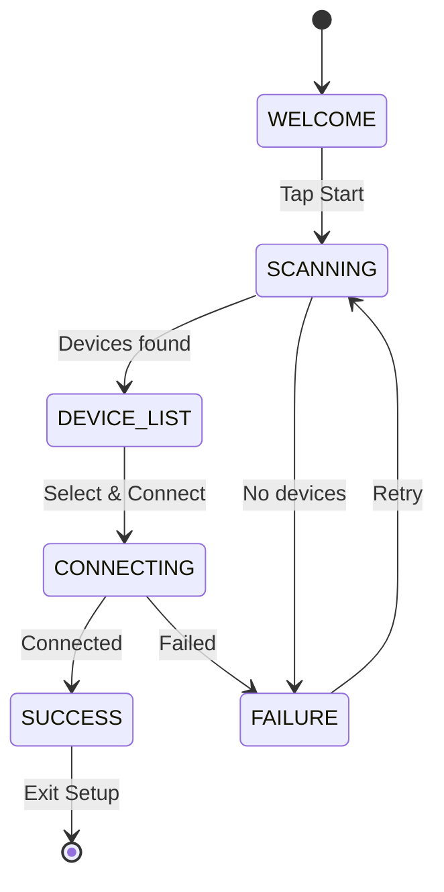

# Component Design: SetupDisplayManager

Created: 2025-12-29

---

## Table of Contents

- [1.0 Document Information](<#1.0 document information>)
- [2.0 Component Overview](<#2.0 component overview>)
- [3.0 Class Design](<#3.0 class design>)
- [4.0 Method Specifications](<#4.0 method specifications>)
- [5.0 Setup Wizard Flow](<#5.0 setup wizard flow>)
- [6.0 Visual Documentation](<#6.0 visual documentation>)
- [Version History](<#version history>)

---

## 1.0 Document Information

```yaml
document_info:
  document_id: "design-a3b4c5d6-component_display_setup_manager"
  tier: 3
  domain: "Display"
  component: "SetupDisplayManager"
  parent: "design-2c6b8e4d-domain_display.md"
  source_file: "src/gtach/display/setup_manager.py"
  version: "1.0"
  date: "2025-12-29"
  author: "William Watson"
```

### 1.1 Parent Reference

- **Domain Design**: [design-2c6b8e4d-domain_display.md](<design-2c6b8e4d-domain_display.md>)

[Return to Table of Contents](<#table of contents>)

---

## 2.0 Component Overview

### 2.1 Purpose

SetupDisplayManager provides the user interface for the initial Bluetooth device pairing wizard, guiding users through device discovery, selection, and connection.

### 2.2 Responsibilities

1. Display device scanning progress
2. Show list of discovered devices
3. Handle device selection input
4. Display connection progress
5. Show success/failure status
6. Provide retry and back navigation

[Return to Table of Contents](<#table of contents>)

---

## 3.0 Class Design

### 3.1 SetupDisplayManager Class

```python
class SetupDisplayManager:
    """Setup wizard UI controller."""
```

### 3.2 Constructor

```python
def __init__(self, 
             rendering_engine: DisplayRenderingEngine,
             touch_coordinator: TouchEventCoordinator,
             bluetooth_manager: BluetoothManager) -> None:
    """Initialize setup display manager.
    
    Args:
        rendering_engine: For rendering operations
        touch_coordinator: For input handling
        bluetooth_manager: For device operations
    """
```

### 3.3 Attributes

| Attribute | Type | Purpose |
|-----------|------|---------|
| `rendering_engine` | `DisplayRenderingEngine` | Rendering |
| `touch_coordinator` | `TouchEventCoordinator` | Input |
| `bluetooth_manager` | `BluetoothManager` | BT operations |
| `_current_step` | `SetupStep` | Current wizard step |
| `_discovered_devices` | `List[BluetoothDevice]` | Found devices |
| `_selected_index` | `int` | Selected device index |
| `_status_message` | `str` | Current status |
| `_is_scanning` | `bool` | Scanning in progress |
| `_is_connecting` | `bool` | Connection in progress |

### 3.4 SetupStep Enum

```python
class SetupStep(Enum):
    """Setup wizard steps."""
    WELCOME = auto()      # Welcome screen
    SCANNING = auto()     # Device discovery
    DEVICE_LIST = auto()  # Select device
    CONNECTING = auto()   # Connection progress
    SUCCESS = auto()      # Pairing complete
    FAILURE = auto()      # Error occurred
```

[Return to Table of Contents](<#table of contents>)

---

## 4.0 Method Specifications

### 4.1 start_setup

```python
async def start_setup(self) -> None:
    """Start the setup wizard.
    
    Sets initial step and displays welcome screen.
    """
```

### 4.2 render

```python
def render(self, surface: pygame.Surface) -> None:
    """Render current setup step.
    
    Delegates to step-specific render method.
    """
```

### 4.3 Step Render Methods

```python
def _render_welcome(self, surface: pygame.Surface) -> None:
    """Render welcome screen with start button."""

def _render_scanning(self, surface: pygame.Surface) -> None:
    """Render scanning animation and progress."""

def _render_device_list(self, surface: pygame.Surface) -> None:
    """Render discovered devices list.
    
    Shows:
        - Device names
        - Signal strength bars
        - Selection highlight
        - Scroll if > 4 devices
    """

def _render_connecting(self, surface: pygame.Surface) -> None:
    """Render connection progress spinner."""

def _render_success(self, surface: pygame.Surface) -> None:
    """Render success confirmation."""

def _render_failure(self, surface: pygame.Surface) -> None:
    """Render error message with retry option."""
```

### 4.4 start_scan

```python
async def start_scan(self) -> None:
    """Initiate device scanning.
    
    Algorithm:
        1. Set step to SCANNING
        2. Call bluetooth_manager.scan_for_devices()
        3. Store results in _discovered_devices
        4. Set step to DEVICE_LIST (or FAILURE if none)
    """
```

### 4.5 select_device

```python
def select_device(self, index: int) -> None:
    """Select device by index."""
```

### 4.6 connect_selected

```python
async def connect_selected(self) -> bool:
    """Connect to selected device.
    
    Returns:
        True if connection successful
    
    Algorithm:
        1. Set step to CONNECTING
        2. Get device at _selected_index
        3. Call bluetooth_manager.connect()
        4. Set step to SUCCESS or FAILURE
    """
```

### 4.7 handle_touch

```python
def handle_touch(self, action: TouchAction) -> None:
    """Handle touch input for setup screens.
    
    Actions vary by current step:
        - WELCOME: Start scan on tap
        - DEVICE_LIST: Select on tap, connect on long press
        - FAILURE: Retry on tap
    """
```

[Return to Table of Contents](<#table of contents>)

---

## 5.0 Setup Wizard Flow

### 5.1 Step Sequence

```
WELCOME -> SCANNING -> DEVICE_LIST -> CONNECTING -> SUCCESS
                           │                          │
                           │                          └──> Exit Setup
                           │
                           └─── (empty) ──> FAILURE ──> SCANNING (retry)
                           
CONNECTING -> FAILURE -> SCANNING (retry)
```

### 5.2 User Interactions

| Step | Tap Action | Long Press | Swipe |
|------|------------|------------|-------|
| WELCOME | Start scan | - | - |
| SCANNING | Cancel | - | - |
| DEVICE_LIST | Select device | Connect | Scroll list |
| CONNECTING | - | Cancel | - |
| SUCCESS | Continue | - | - |
| FAILURE | Retry | Exit | - |

[Return to Table of Contents](<#table of contents>)

---

## 6.0 Visual Documentation

### 6.1 Class Diagram



### 6.2 Wizard Flow



[Return to Table of Contents](<#table of contents>)

---

## Version History

| Version | Date | Author | Changes |
|---------|------|--------|---------|
| 1.0 | 2025-12-29 | William Watson | Initial component design document |

---

Copyright (c) 2025 William Watson. This work is licensed under the MIT License.
