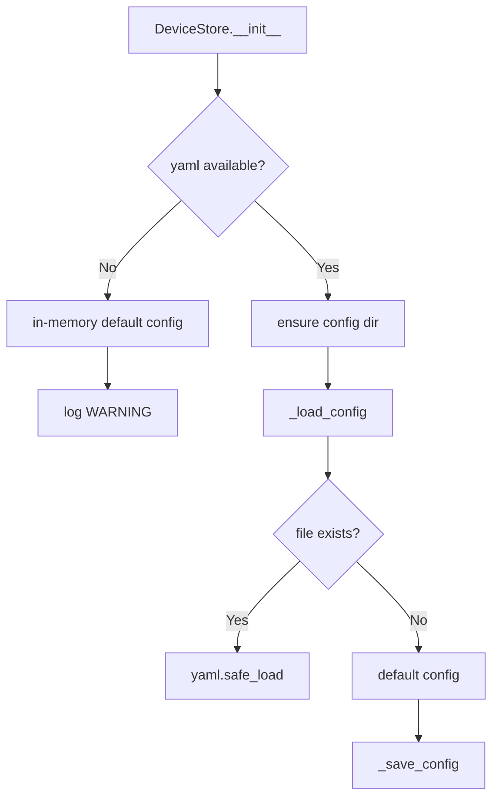

# Component Design: DeviceStore and BluetoothDevice

Created: 2026 March 24

---

## Table of Contents

- [1.0 Document Information](<#1.0 document information>)
- [2.0 Component Overview](<#2.0 component overview>)
- [3.0 File Locations](<#3.0 file locations>)
- [4.0 Elements](<#4.0 elements>)
- [5.0 Interfaces](<#5.0 interfaces>)
- [6.0 Data Design](<#6.0 data design>)
- [7.0 Error Handling](<#7.0 error handling>)
- [8.0 Visual Documentation](<#8.0 visual documentation>)
- [9.0 Element Registry](<#9.0 element registry>)
- [Version History](<#version history>)

---

## 1.0 Document Information

```yaml
document_info:
  document_id: "design-a6b7c8d9-component_comm_device_store"
  tier: 3
  domain: "Communication"
  parent: "design-7d3e9f5a-domain_comm.md"
  version: "1.0"
  date: "2026-03-24"
  author: "William Watson"
```

### 1.1 Parent Reference

- **Domain Design**: [design-7d3e9f5a-domain_comm.md](<design-7d3e9f5a-domain_comm.md>)

[Return to Table of Contents](<#table of contents>)

---

## 2.0 Component Overview

### 2.1 Purpose

`DeviceStore` provides YAML-backed persistence for the primary paired ELM327 device MAC address. `BluetoothDevice` is the data model that carries device information. Both reside within the Communication domain.

### 2.2 Change from Existing Source

`device_store.py` currently imports `BluetoothDevice` from `..display.setup_models` — a cross-domain dependency that violates domain boundaries. This redesign corrects the import to use the `BluetoothDevice` dataclass defined in `comm/models.py`. Fields are rationalised to remove BLE-specific attributes (`connection_verified`, `is_paired`, `last_seen`) and replace with transport-agnostic equivalents.

### 2.3 Responsibilities

**DeviceStore:**
1. Load and save device configuration from `config/devices.yaml`
2. Return the primary device MAC address for use by `RFCOMMTransport`
3. Fall back to in-memory storage if `yaml` is unavailable

**BluetoothDevice:**
1. Represent ELM327 adapter identity and connection metadata
2. Provide serialisation (`to_dict`) and deserialisation (`from_dict`)

[Return to Table of Contents](<#table of contents>)

---

## 3.0 File Locations

```yaml
files:
  - path: "src/gtach/comm/models.py"
    status: "Existing — rationalise BluetoothDevice fields; remove BLE-specific attributes"
    exports:
      - "BluetoothDevice"

  - path: "src/gtach/comm/device_store.py"
    status: "Existing — correct import; remove BLE-specific methods; simplify to transport-agnostic interface"
    exports:
      - "DeviceStore"
```

[Return to Table of Contents](<#table of contents>)

---

## 4.0 Elements

### 4.1 BluetoothDevice (models.py)

```yaml
element:
  name: "BluetoothDevice"
  type: "dataclass"
  file: "src/gtach/comm/models.py"

  fields:
    - name: "name"
      type: "str"
      description: "Device display name (e.g. 'ELM327')"
    - name: "mac_address"
      type: "str"
      description: "Bluetooth MAC address; normalised to uppercase with colons (AA:BB:CC:DD:EE:FF)"
    - name: "device_type"
      type: "str"
      default: "'UNKNOWN'"
      description: "ELM327, OBD, or UNKNOWN; auto-detected from name if not set"
    - name: "last_connected"
      type: "Optional[datetime]"
      default: "None"
      description: "ISO datetime of last successful connection"

  post_init_logic:
    - "Normalise mac_address to uppercase with colons"
    - "Auto-detect device_type from name if set to UNKNOWN"

  methods:
    - name: "to_dict"
      signature: "to_dict(self) -> Dict[str, Any]"
      purpose: "Serialise to dict for YAML persistence; omit None fields"

    - name: "from_dict"
      signature: "from_dict(cls, data: Dict[str, Any]) -> BluetoothDevice"
      type: "classmethod"
      purpose: "Deserialise from dict loaded from YAML"
```

### 4.2 DeviceStore (device_store.py)

```yaml
element:
  name: "DeviceStore"
  type: "class"
  file: "src/gtach/comm/device_store.py"

  constructor:
    signature: "__init__(self, config_path: str = 'config/devices.yaml') -> None"
    processing_logic:
      - "Store config_path"
      - "If yaml available: ensure config dir exists; call _load_config()"
      - "If yaml not available: initialise in-memory default config; log warning"

  methods:
    - name: "save_device"
      signature: "save_device(self, device: BluetoothDevice, is_primary: bool = True) -> None"
      processing_logic:
        - "Convert device to dict via device.to_dict()"
        - "Store under config['paired_devices']['primary'] if is_primary"
        - "Store under config['paired_devices']['secondary'][mac] otherwise"
        - "Call _save_config()"

    - name: "get_primary_device"
      signature: "get_primary_device(self) -> Optional[BluetoothDevice]"
      processing_logic:
        - "Read config['paired_devices'].get('primary')"
        - "If present: return BluetoothDevice.from_dict(data)"
        - "If absent or error: return None"

    - name: "get_all_devices"
      signature: "get_all_devices(self) -> List[BluetoothDevice]"
      processing_logic:
        - "Collect primary device (if present)"
        - "Collect all secondary devices"
        - "Return combined list"

    - name: "remove_device"
      signature: "remove_device(self, mac_address: str) -> bool"
      processing_logic:
        - "Remove from primary or secondary as appropriate"
        - "Call _save_config(); return True on success, False if not found"

    - name: "get_device_by_mac"
      signature: "get_device_by_mac(self, mac_address: str) -> Optional[BluetoothDevice]"
      processing_logic:
        - "Iterate get_all_devices(); match on mac_address"
        - "Return matching device or None"

    - name: "_load_config"
      signature: "_load_config(self) -> None"
      processing_logic:
        - "Open config_path with yaml.safe_load"
        - "On FileNotFoundError: create default config; call _save_config()"
        - "On Exception: log error; use default in-memory config"

    - name: "_save_config"
      signature: "_save_config(self) -> None"
      processing_logic:
        - "If yaml not available: log debug and return"
        - "Write to temp file; rename to config_path (atomic write)"
        - "On Exception: log error"
```

[Return to Table of Contents](<#table of contents>)

---

## 5.0 Interfaces

### 5.1 BluetoothDevice

```python
import datetime
from dataclasses import dataclass
from typing import Optional, Dict, Any

@dataclass
class BluetoothDevice:
    name: str
    mac_address: str
    device_type: str = "UNKNOWN"
    last_connected: Optional[datetime.datetime] = None

    def __post_init__(self) -> None: ...
    def to_dict(self) -> Dict[str, Any]: ...

    @classmethod
    def from_dict(cls, data: Dict[str, Any]) -> "BluetoothDevice": ...
```

### 5.2 DeviceStore

```python
from typing import List, Optional
from .models import BluetoothDevice

class DeviceStore:

    def __init__(self, config_path: str = "config/devices.yaml") -> None: ...

    def save_device(self, device: BluetoothDevice,
                    is_primary: bool = True) -> None: ...

    def get_primary_device(self) -> Optional[BluetoothDevice]: ...

    def get_all_devices(self) -> List[BluetoothDevice]: ...

    def remove_device(self, mac_address: str) -> bool: ...

    def get_device_by_mac(self, mac_address: str) -> Optional[BluetoothDevice]: ...
```

[Return to Table of Contents](<#table of contents>)

---

## 6.0 Data Design

### 6.1 BluetoothDevice Fields

| Field | Type | Required | Notes |
|-------|------|----------|-------|
| `name` | `str` | Yes | Display name |
| `mac_address` | `str` | Yes | Normalised to `AA:BB:CC:DD:EE:FF` |
| `device_type` | `str` | No | Default `UNKNOWN`; auto-detected |
| `last_connected` | `Optional[datetime]` | No | ISO format in YAML |

### 6.2 devices.yaml Structure

```yaml
paired_devices:
  primary:
    name: "ELM327"
    mac_address: "AA:BB:CC:DD:EE:FF"
    device_type: "ELM327"
    last_connected: "2026-03-24T10:00:00"
  secondary:
    AA:BB:CC:DD:EE:00:
      name: "ELM327 backup"
      mac_address: "AA:BB:CC:DD:EE:00"
      device_type: "ELM327"
      last_connected: "2026-01-01T08:00:00"
```

[Return to Table of Contents](<#table of contents>)

---

## 7.0 Error Handling

| Condition | Handling |
|-----------|----------|
| `yaml` not installed | In-memory config; log WARNING; persistence disabled |
| Config file not found | Create default config; save |
| YAML parse error | Log ERROR; use default in-memory config |
| Save failure | Log ERROR; data remains in memory |
| `get_primary_device` with missing/corrupt data | Log error; return None |

### 7.1 Logging

```yaml
logger_name: "DeviceStore"
log_levels:
  DEBUG: "config load/save operations"
  INFO: "device saved, device removed"
  WARNING: "yaml not available"
  ERROR: "load/save failures with exception detail"
```

[Return to Table of Contents](<#table of contents>)

---

## 8.0 Visual Documentation

### 8.1 DeviceStore Initialisation



[Return to Table of Contents](<#table of contents>)

---

## 9.0 Element Registry

```yaml
modules:
  - name: "gtach.comm.models"
    path: "src/gtach/comm/models.py"
    package: "gtach.comm"
  - name: "gtach.comm.device_store"
    path: "src/gtach/comm/device_store.py"
    package: "gtach.comm"

classes:
  - name: "BluetoothDevice"
    module: "gtach.comm.models"
    base_classes: []
  - name: "DeviceStore"
    module: "gtach.comm.device_store"
    base_classes: []
```

[Return to Table of Contents](<#table of contents>)

---

## Version History

| Version | Date | Author | Changes |
|---------|------|--------|---------|
| 1.0 | 2026-03-24 | William Watson | Initial component design; corrects cross-domain BluetoothDevice import; rationalises fields and interface |

---

Copyright (c) 2025 William Watson. This work is licensed under the MIT License.
