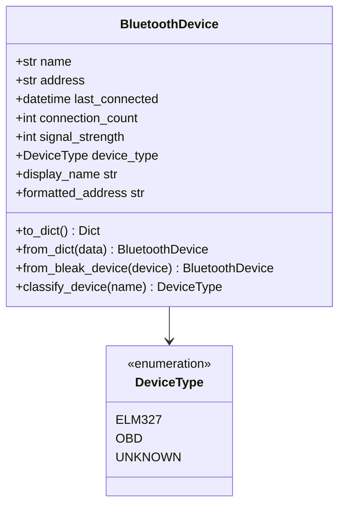

# Component Design: BluetoothDevice

Created: 2025-12-29

---

## Table of Contents

- [1.0 Document Information](<#1.0 document information>)
- [2.0 Component Overview](<#2.0 component overview>)
- [3.0 Class Design](<#3.0 class design>)
- [4.0 Methods and Properties](<#4.0 methods and properties>)
- [5.0 Serialization](<#5.0 serialization>)
- [6.0 Visual Documentation](<#6.0 visual documentation>)
- [Version History](<#version history>)

---

## 1.0 Document Information

```yaml
document_info:
  document_id: "design-a7b8c9d0-component_comm_bluetooth_device"
  tier: 3
  domain: "Communication"
  component: "BluetoothDevice"
  parent: "design-7d3e9f5a-domain_comm.md"
  source_file: "src/gtach/comm/models.py"
  version: "1.0"
  date: "2025-12-29"
  author: "William Watson"
```

### 1.1 Parent Reference

- **Domain Design**: [design-7d3e9f5a-domain_comm.md](<design-7d3e9f5a-domain_comm.md>)

[Return to Table of Contents](<#table of contents>)

---

## 2.0 Component Overview

### 2.1 Purpose

BluetoothDevice is a data model representing a discovered or paired Bluetooth device with metadata for display, selection, and persistence.

### 2.2 Responsibilities

1. Store device identification (name, address)
2. Track connection history (last_connected, connection_count)
3. Store signal quality metrics
4. Classify device type (ELM327, OBD, UNKNOWN)
5. Support serialization for persistence

[Return to Table of Contents](<#table of contents>)

---

## 3.0 Class Design

### 3.1 BluetoothDevice Dataclass

```python
@dataclass
class BluetoothDevice:
    """Bluetooth device information container.
    
    Represents a discovered or paired BLE device with
    metadata for display and connection management.
    
    Attributes:
        name: Device advertised name
        address: Bluetooth MAC address (normalized format)
        last_connected: Timestamp of last successful connection
        connection_count: Number of successful connections
        signal_strength: RSSI value in dBm (negative)
        device_type: Classification (ELM327, OBD, UNKNOWN)
    """
    name: str
    address: str
    last_connected: Optional[datetime] = None
    connection_count: int = 0
    signal_strength: Optional[int] = None
    device_type: DeviceType = DeviceType.UNKNOWN
```

### 3.2 DeviceType Enum

```python
class DeviceType(Enum):
    """Bluetooth device type classification."""
    ELM327 = "ELM327"      # ELM327-based OBD adapter
    OBD = "OBD"            # Generic OBD adapter
    UNKNOWN = "UNKNOWN"    # Unclassified device
```

### 3.3 Address Format

```python
# Normalized address format: uppercase, no separators
# Example: "AA11BB22CC33"

# Accepted input formats (normalized on storage):
# - "AA:11:BB:22:CC:33" (colon-separated)
# - "AA-11-BB-22-CC-33" (hyphen-separated)
# - "aa11bb22cc33" (lowercase, no separators)
```

[Return to Table of Contents](<#table of contents>)

---

## 4.0 Methods and Properties

### 4.1 Display Properties

```python
@property
def display_name(self) -> str:
    """Get display-friendly name.
    
    Returns name if available, otherwise formatted address.
    """
    return self.name if self.name else self.formatted_address

@property
def formatted_address(self) -> str:
    """Get address in display format (XX:XX:XX:XX:XX:XX)."""
    addr = self.address.upper()
    return ':'.join(addr[i:i+2] for i in range(0, 12, 2))
```

### 4.2 Classification

```python
@classmethod
def classify_device(cls, name: str) -> DeviceType:
    """Classify device type from advertised name.
    
    Args:
        name: Device advertised name
    
    Returns:
        DeviceType based on name pattern matching
    
    Patterns:
        ELM327: "ELM327", "OBD", "OBDII", "V-LINK"
        OBD: "OBD" in name
        UNKNOWN: No pattern match
    """
    name_upper = (name or "").upper()
    if "ELM327" in name_upper or "V-LINK" in name_upper:
        return DeviceType.ELM327
    if "OBD" in name_upper:
        return DeviceType.OBD
    return DeviceType.UNKNOWN
```

### 4.3 Factory Methods

```python
@classmethod
def from_bleak_device(cls, bleak_device, rssi: int = None) -> 'BluetoothDevice':
    """Create from Bleak BLEDevice.
    
    Args:
        bleak_device: Bleak BLEDevice instance
        rssi: Signal strength (optional)
    
    Returns:
        BluetoothDevice instance
    """
    return cls(
        name=bleak_device.name or "Unknown",
        address=bleak_device.address.replace(":", "").upper(),
        signal_strength=rssi,
        device_type=cls.classify_device(bleak_device.name)
    )
```

[Return to Table of Contents](<#table of contents>)

---

## 5.0 Serialization

### 5.1 To Dictionary

```python
def to_dict(self) -> Dict[str, Any]:
    """Serialize to dictionary for YAML storage.
    
    Returns:
        Dictionary with all attributes
    """
    return {
        'name': self.name,
        'address': self.address,
        'last_connected': self.last_connected.isoformat() if self.last_connected else None,
        'connection_count': self.connection_count,
        'signal_strength': self.signal_strength,
        'device_type': self.device_type.value
    }
```

### 5.2 From Dictionary

```python
@classmethod
def from_dict(cls, data: Dict[str, Any]) -> 'BluetoothDevice':
    """Deserialize from dictionary.
    
    Args:
        data: Dictionary from YAML storage
    
    Returns:
        BluetoothDevice instance
    """
    last_connected = None
    if data.get('last_connected'):
        last_connected = datetime.fromisoformat(data['last_connected'])
    
    return cls(
        name=data.get('name', 'Unknown'),
        address=data.get('address', ''),
        last_connected=last_connected,
        connection_count=data.get('connection_count', 0),
        signal_strength=data.get('signal_strength'),
        device_type=DeviceType(data.get('device_type', 'UNKNOWN'))
    )
```

[Return to Table of Contents](<#table of contents>)

---

## 6.0 Visual Documentation

### 6.1 Class Diagram



[Return to Table of Contents](<#table of contents>)

---

## Version History

| Version | Date | Author | Changes |
|---------|------|--------|---------|
| 1.0 | 2025-12-29 | William Watson | Initial component design document |

---

Copyright (c) 2025 William Watson. This work is licensed under the MIT License.
