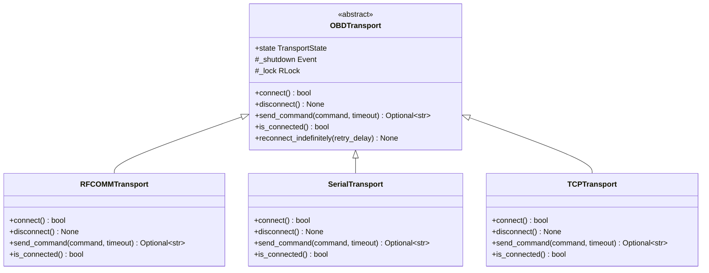
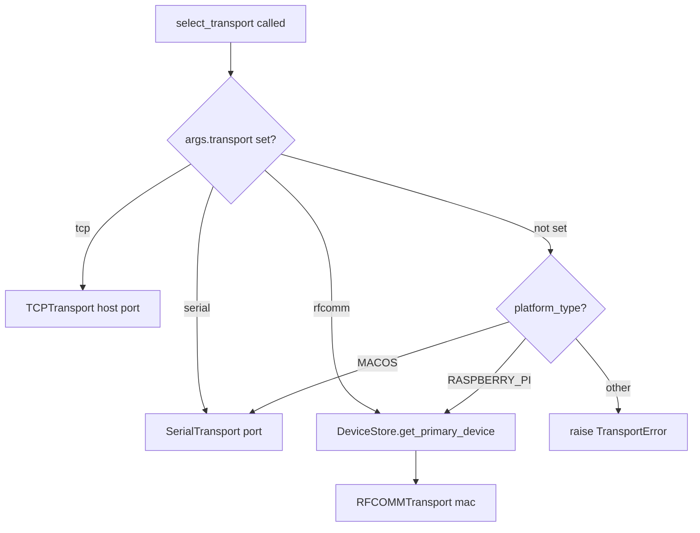

# Component Design: OBDTransport

Created: 2026 March 24

---

## Table of Contents

- [1.0 Document Information](<#1.0 document information>)
- [2.0 Component Overview](<#2.0 component overview>)
- [3.0 File Location](<#3.0 file location>)
- [4.0 Elements](<#4.0 elements>)
- [5.0 Interfaces](<#5.0 interfaces>)
- [6.0 Data Design](<#6.0 data design>)
- [7.0 Error Handling](<#7.0 error handling>)
- [8.0 Visual Documentation](<#8.0 visual documentation>)
- [9.0 Element Registry](<#9.0 element registry>)
- [Version History](<#version history>)

---

## 1.0 Document Information

```yaml
document_info:
  document_id: "design-b1c2d3e4-component_comm_transport"
  tier: 3
  domain: "Communication"
  parent: "design-7d3e9f5a-domain_comm.md"
  version: "1.0"
  date: "2026-03-24"
  author: "William Watson"
```

### 1.1 Parent Reference

- **Domain Design**: [design-7d3e9f5a-domain_comm.md](<design-7d3e9f5a-domain_comm.md>)

[Return to Table of Contents](<#table of contents>)

---

## 2.0 Component Overview

### 2.1 Purpose

Defines the `OBDTransport` abstract base class, `TransportState` enumeration, `TransportError` exception hierarchy, and `select_transport()` factory function. All concrete transport implementations (`RFCOMMTransport`, `SerialTransport`, `TCPTransport`) inherit from `OBDTransport`. `OBDProtocol` depends only on this interface.

### 2.2 Responsibilities

1. Define the uniform transport interface via `OBDTransport` ABC
2. Define `TransportState` enumeration for connection state tracking
3. Define `TransportError` exception hierarchy
4. Provide `select_transport()` factory returning a concrete transport based on CLI args or platform detection

[Return to Table of Contents](<#table of contents>)

---

## 3.0 File Location

```yaml
file: "src/gtach/comm/transport.py"
status: "New — does not exist in current source"
exports:
  - "OBDTransport"
  - "TransportState"
  - "TransportError"
  - "select_transport"
```

[Return to Table of Contents](<#table of contents>)

---

## 4.0 Elements

### 4.1 TransportState

```yaml
element:
  name: "TransportState"
  type: "enum"
  base: "enum.Enum"

  members:
    DISCONNECTED: "No active transport connection"
    CONNECTING: "Connection attempt in progress"
    CONNECTED: "Active connection established"
    ERROR: "Unrecoverable error state requiring reset"
```

### 4.2 TransportError

```yaml
element:
  name: "TransportError"
  type: "exception hierarchy"
  base: "Exception"

  subclasses:
    - name: "ConnectionError"
      purpose: "Transport could not establish or lost a connection"
    - name: "TimeoutError"
      purpose: "Transport read or write timed out"
    - name: "ProtocolError"
      purpose: "Unexpected response format from transport"
```

### 4.3 OBDTransport

```yaml
element:
  name: "OBDTransport"
  type: "class (ABC)"
  base: "abc.ABC"

  abstract_methods:
    - name: "connect"
      signature: "connect(self) -> bool"
      purpose: "Establish transport connection; return True on success"

    - name: "disconnect"
      signature: "disconnect(self) -> None"
      purpose: "Close transport connection and release resources"

    - name: "send_command"
      signature: "send_command(self, command: str, timeout: float = 2.0) -> Optional[str]"
      purpose: "Send AT/OBD command string; return response string or None on timeout/error"

    - name: "is_connected"
      signature: "is_connected(self) -> bool"
      purpose: "Return True if transport is in CONNECTED state"

  abstract_properties:
    - name: "state"
      type: "TransportState"
      purpose: "Current connection state (read-only)"

  concrete_methods:
    - name: "reconnect_indefinitely"
      signature: "reconnect_indefinitely(self, retry_delay: float = 5.0) -> None"
      purpose: "Retry connect() in a loop until connected or shutdown requested"
      processing_logic:
        - "Loop: call connect(); if True return"
        - "On failure: log warning, sleep retry_delay"
        - "Checks self._shutdown for loop exit"

  attributes:
    - name: "_shutdown"
      type: "threading.Event"
      purpose: "Signal reconnect_indefinitely to exit"
    - name: "_lock"
      type: "threading.RLock"
      purpose: "Protect state transitions"
```

### 4.4 select_transport

```yaml
element:
  name: "select_transport"
  type: "function"
  signature: "select_transport(platform_type: PlatformType, args: argparse.Namespace) -> OBDTransport"
  purpose: "Factory function; instantiate and return the correct concrete transport"

  processing_logic:
    - "Check args.transport first (explicit CLI override)"
    - "'tcp'    -> TCPTransport(host=args.obd_host, port=args.obd_port)"
    - "'serial' -> SerialTransport(port=getattr(args, 'serial_port', None))"
    - "'rfcomm' -> load MAC from DeviceStore; RFCOMMTransport(mac_address)"
    - "No CLI arg: PlatformType.MACOS -> SerialTransport()"
    - "No CLI arg: PlatformType.RASPBERRY_PI_* -> load MAC from DeviceStore; RFCOMMTransport(mac_address)"
    - "Unknown platform with no CLI arg: raise TransportError('Unsupported platform')"

  parameters:
    - name: "platform_type"
      type: "PlatformType"
      description: "Detected platform from utils.platform"
    - name: "args"
      type: "argparse.Namespace"
      description: "Parsed CLI arguments; expected attrs: transport, obd_host, obd_port, serial_port"

  returns:
    type: "OBDTransport"
    description: "Configured concrete transport instance (not yet connected)"

  raises:
    - exception: "TransportError"
      condition: "Platform unsupported and no explicit --transport arg provided"
    - exception: "TransportError"
      condition: "DeviceStore returns no primary device when RFCOMM required"
```

[Return to Table of Contents](<#table of contents>)

---

## 5.0 Interfaces

### 5.1 OBDTransport ABC

```python
from abc import ABC, abstractmethod
from typing import Optional

class OBDTransport(ABC):

    @abstractmethod
    def connect(self) -> bool: ...

    @abstractmethod
    def disconnect(self) -> None: ...

    @abstractmethod
    def send_command(self, command: str, timeout: float = 2.0) -> Optional[str]: ...

    @abstractmethod
    def is_connected(self) -> bool: ...

    @property
    @abstractmethod
    def state(self) -> "TransportState": ...

    def reconnect_indefinitely(self, retry_delay: float = 5.0) -> None: ...
```

### 5.2 select_transport Factory

```python
import argparse
from ..utils.platform import PlatformType

def select_transport(platform_type: PlatformType,
                     args: argparse.Namespace) -> OBDTransport: ...
```

### 5.3 Exception Classes

```python
class TransportError(Exception): ...
class ConnectionError(TransportError): ...
class TimeoutError(TransportError): ...
class ProtocolError(TransportError): ...
```

[Return to Table of Contents](<#table of contents>)

---

## 6.0 Data Design

### 6.1 TransportState Values

| State | Description |
|-------|-------------|
| DISCONNECTED | Initial state; no active connection |
| CONNECTING | connect() in progress |
| CONNECTED | Transport ready for send_command() |
| ERROR | Unrecoverable; requires reset or restart |

### 6.2 CLI Argument Contract

| Attribute | Type | Default | Description |
|-----------|------|---------|-------------|
| `args.transport` | `Optional[str]` | `None` | `'tcp'`, `'serial'`, `'rfcomm'`, or absent |
| `args.obd_host` | `str` | `'localhost'` | TCP host for TCPTransport |
| `args.obd_port` | `int` | `35000` | TCP port for TCPTransport |
| `args.serial_port` | `Optional[str]` | `None` | Serial device path; None triggers auto-discovery |

[Return to Table of Contents](<#table of contents>)

---

## 7.0 Error Handling

| Condition | Handling |
|-----------|----------|
| Unknown platform, no --transport arg | Raise `TransportError('Unsupported platform')` |
| DeviceStore returns no primary device for RFCOMM | Raise `TransportError('No paired device found')` |
| Concrete subclass fails to implement abstract method | `TypeError` at instantiation (Python ABC enforcement) |

[Return to Table of Contents](<#table of contents>)

---

## 8.0 Visual Documentation

### 8.1 Class Hierarchy



### 8.2 select_transport Logic



[Return to Table of Contents](<#table of contents>)

---

## 9.0 Element Registry

```yaml
modules:
  - name: "gtach.comm.transport"
    path: "src/gtach/comm/transport.py"
    package: "gtach.comm"

classes:
  - name: "TransportState"
    module: "gtach.comm.transport"
    base_classes: ["enum.Enum"]
  - name: "TransportError"
    module: "gtach.comm.transport"
    base_classes: ["Exception"]
  - name: "ConnectionError"
    module: "gtach.comm.transport"
    base_classes: ["TransportError"]
  - name: "TimeoutError"
    module: "gtach.comm.transport"
    base_classes: ["TransportError"]
  - name: "ProtocolError"
    module: "gtach.comm.transport"
    base_classes: ["TransportError"]
  - name: "OBDTransport"
    module: "gtach.comm.transport"
    base_classes: ["abc.ABC"]

functions:
  - name: "select_transport"
    module: "gtach.comm.transport"
    signature: "select_transport(platform_type: PlatformType, args: argparse.Namespace) -> OBDTransport"
```

[Return to Table of Contents](<#table of contents>)

---

## Version History

| Version | Date | Author | Changes |
|---------|------|--------|---------|
| 1.0 | 2026-03-24 | William Watson | Initial component design |

---

Copyright (c) 2025 William Watson. This work is licensed under the MIT License.
