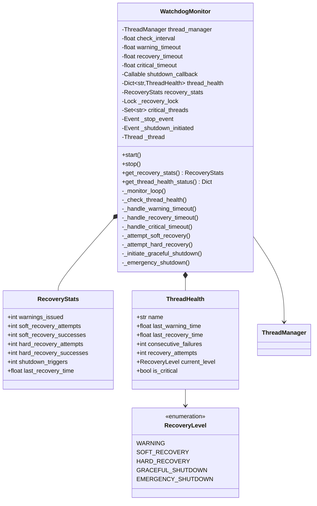
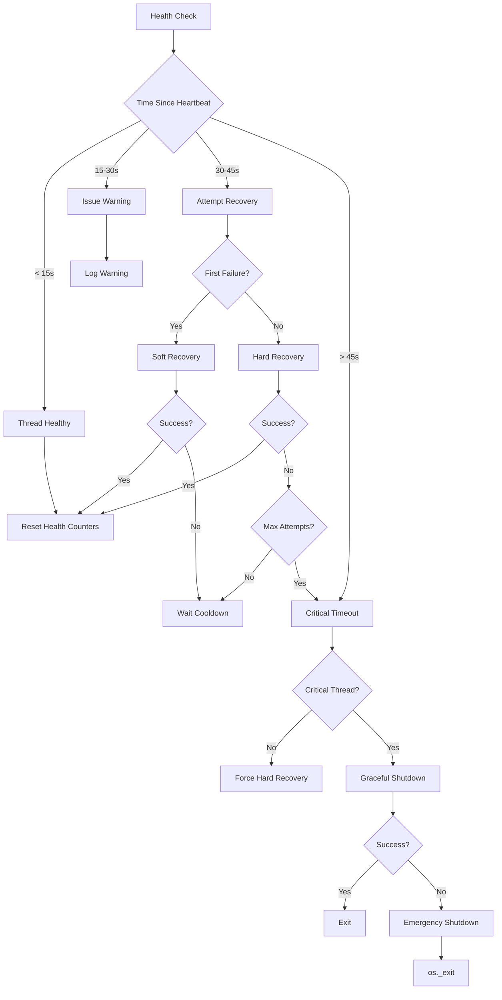

# Component Design: WatchdogMonitor

Created: 2025-12-29

---

## Table of Contents

- [1.0 Document Information](<#1.0 document information>)
- [2.0 Component Overview](<#2.0 component overview>)
- [3.0 Class Design](<#3.0 class design>)
- [4.0 Method Specifications](<#4.0 method specifications>)
- [5.0 Data Structures](<#5.0 data structures>)
- [6.0 Recovery Escalation](<#6.0 recovery escalation>)
- [7.0 Error Handling](<#7.0 error handling>)
- [8.0 Dependencies](<#8.0 dependencies>)
- [9.0 Visual Documentation](<#9.0 visual documentation>)
- [Version History](<#version history>)

---

## 1.0 Document Information

```yaml
document_info:
  document_id: "design-b2c3d4e5-component_core_watchdog_monitor"
  tier: 3
  domain: "Core"
  component: "WatchdogMonitor"
  parent: "design-4f8a2b1c-domain_core.md"
  source_file: "src/gtach/core/watchdog.py"
  version: "1.0"
  date: "2025-12-29"
  author: "William Watson"
```

### 1.1 Parent Reference

- **Domain Design**: [design-4f8a2b1c-domain_core.md](<design-4f8a2b1c-domain_core.md>)
- **Master Design**: [design-0000-master_gtach.md](<design-0000-master_gtach.md>)

[Return to Table of Contents](<#table of contents>)

---

## 2.0 Component Overview

### 2.1 Purpose

WatchdogMonitor provides health monitoring for managed threads with escalating recovery procedures. It detects unresponsive threads via heartbeat timeout and triggers appropriate recovery actions ranging from warnings to emergency shutdown.

### 2.2 Responsibilities

1. Periodically check heartbeat timestamps against timeout thresholds
2. Issue warnings for unresponsive threads
3. Attempt soft recovery (signal, interrupt)
4. Escalate to hard recovery (thread restart)
5. Initiate graceful shutdown for critical thread failures
6. Perform emergency shutdown as last resort
7. Track recovery statistics for diagnostics

### 2.3 Recovery Philosophy

- **Graduated Response**: Escalate only when lower-level recovery fails
- **Critical Thread Protection**: Some threads (display, bluetooth, main) trigger shutdown on failure
- **Prevention of Thrashing**: Cooldown periods between recovery attempts
- **Visibility**: Comprehensive statistics for debugging

[Return to Table of Contents](<#table of contents>)

---

## 3.0 Class Design

### 3.1 WatchdogMonitor Class

```python
class WatchdogMonitor:
    """Enhanced watchdog monitor with automatic recovery mechanisms.
    
    Provides escalating recovery responses:
    1. WARNING: Log warnings for unresponsive threads
    2. SOFT_RECOVERY: Attempt gentle recovery (interrupts, signals)
    3. HARD_RECOVERY: Force thread restart
    4. GRACEFUL_SHUTDOWN: Controlled application shutdown
    5. EMERGENCY_SHUTDOWN: Immediate process termination
    """
```

### 3.2 Constructor Signature

```python
def __init__(self, 
             thread_manager: ThreadManager,
             check_interval: float = 5.0,
             warning_timeout: float = 15.0,
             recovery_timeout: float = 30.0,
             critical_timeout: float = 45.0,
             shutdown_callback: Optional[Callable] = None) -> None:
    """Initialize enhanced watchdog monitor.
    
    Args:
        thread_manager: ThreadManager instance to monitor
        check_interval: Seconds between health checks (default 5.0)
        warning_timeout: Seconds before issuing warnings (default 15.0)
        recovery_timeout: Seconds before attempting recovery (default 30.0)
        critical_timeout: Seconds before triggering shutdown (default 45.0)
        shutdown_callback: Optional callback for graceful shutdown
    
    Timeout Hierarchy:
        warning_timeout < recovery_timeout < critical_timeout
    """
```

### 3.3 Instance Attributes

| Attribute | Type | Purpose |
|-----------|------|---------|
| `thread_manager` | `ThreadManager` | Monitored thread manager |
| `check_interval` | `float` | Seconds between checks |
| `warning_timeout` | `float` | Threshold for warnings |
| `recovery_timeout` | `float` | Threshold for recovery |
| `critical_timeout` | `float` | Threshold for shutdown |
| `shutdown_callback` | `Optional[Callable]` | Graceful shutdown hook |
| `thread_health` | `Dict[str, ThreadHealth]` | Per-thread health tracking |
| `recovery_stats` | `RecoveryStats` | Aggregate statistics |
| `_recovery_lock` | `threading.Lock` | Stats protection |
| `critical_threads` | `Set[str]` | Shutdown-triggering threads |
| `_stop_event` | `threading.Event` | Stop signal |
| `_shutdown_initiated` | `threading.Event` | Shutdown in progress |
| `_thread` | `threading.Thread` | Monitor thread |

[Return to Table of Contents](<#table of contents>)

---

## 4.0 Method Specifications

### 4.1 start / stop

```python
def start(self) -> None:
    """Start watchdog monitoring.
    
    Creates and starts monitor thread. Thread runs until stop() called.
    """

def stop(self) -> None:
    """Stop watchdog monitoring with final status report.
    
    Algorithm:
        1. If shutdown initiated, log accordingly
        2. Set _stop_event
        3. Join monitor thread (timeout 5.0s)
        4. Log warning if thread didn't stop cleanly
        5. Log final recovery statistics
    """
```

### 4.2 _monitor_loop

```python
def _monitor_loop(self) -> None:
    """Main monitoring loop.
    
    Algorithm:
        while not _stop_event.is_set():
            1. Call _check_thread_health()
            2. Wait on _stop_event for check_interval
    """
```

### 4.3 _check_thread_health

```python
def _check_thread_health(self) -> None:
    """Enhanced thread health checking with escalating recovery.
    
    Algorithm:
        1. Get current time
        2. Acquire thread_manager._lock
        3. For each thread in thread_manager.threads:
           a. Skip if status not RUNNING or STARTING
           b. Initialize ThreadHealth if needed
           c. Calculate time_since_heartbeat
           d. Route to appropriate handler:
              - > critical_timeout: _handle_critical_timeout
              - > recovery_timeout: _handle_recovery_timeout
              - > warning_timeout: _handle_warning_timeout
              - else: _reset_thread_health
    """
```

### 4.4 _handle_warning_timeout

```python
def _handle_warning_timeout(self, name: str, health: ThreadHealth, 
                            timeout: float) -> None:
    """Handle warning-level timeout.
    
    Algorithm:
        1. Check if 30 seconds since last warning (prevent spam)
        2. If sufficient time elapsed:
           a. Log warning with timeout value
           b. Update last_warning_time
           c. Set current_level to WARNING
           d. Increment recovery_stats.warnings_issued
    """
```

### 4.5 _handle_recovery_timeout

```python
def _handle_recovery_timeout(self, name: str, health: ThreadHealth,
                             timeout: float) -> None:
    """Handle recovery-level timeout with escalating attempts.
    
    Algorithm:
        1. Check if 10 seconds since last recovery attempt
           - Return if too recent (cooldown)
        2. Increment consecutive_failures
        3. Update last_recovery_time
        4. If consecutive_failures == 1:
           - Call _attempt_soft_recovery
        5. If consecutive_failures >= 2:
           - Call _attempt_hard_recovery
    """
```

### 4.6 _handle_critical_timeout

```python
def _handle_critical_timeout(self, name: str, health: ThreadHealth,
                             timeout: float) -> None:
    """Handle critical timeout - may trigger shutdown.
    
    Algorithm:
        1. Log error with timeout value
        2. If health.is_critical:
           a. Log critical message
           b. Call _initiate_graceful_shutdown
        3. Else:
           - Call _attempt_hard_recovery with force=True
    """
```

### 4.7 _attempt_soft_recovery

```python
def _attempt_soft_recovery(self, name: str, health: ThreadHealth,
                           timeout: float) -> None:
    """Attempt soft recovery using thread interruption.
    
    Algorithm:
        1. Log info message
        2. Increment recovery_stats.soft_recovery_attempts
        3. Set health.current_level to SOFT_RECOVERY
        4. Increment health.recovery_attempts
        5. Acquire thread_manager._lock
        6. Get thread_info
        7. Record old_heartbeat
        8. Sleep 1.0 seconds
        9. If heartbeat updated:
           a. Log success
           b. Increment soft_recovery_successes
           c. Call _reset_thread_health
    """
```

### 4.8 _attempt_hard_recovery

```python
def _attempt_hard_recovery(self, name: str, health: ThreadHealth,
                           timeout: float, force: bool = False) -> None:
    """Attempt hard recovery by restarting the thread.
    
    Algorithm:
        1. If not force and recovery_attempts >= 3:
           a. Log error (exceeded max attempts)
           b. If is_critical: _initiate_graceful_shutdown
           c. Return
        2. Log warning
        3. Increment hard_recovery_attempts
        4. Set current_level to HARD_RECOVERY
        5. Increment recovery_attempts
        6. Call thread_manager.handle_thread_failure()
        7. Sleep 2.0 seconds
        8. Acquire thread_manager._lock
        9. Check if thread status is RUNNING:
           a. Log success
           b. Increment hard_recovery_successes
           c. Call _reset_thread_health
    """
```

### 4.9 _initiate_graceful_shutdown

```python
def _initiate_graceful_shutdown(self, reason: str) -> None:
    """Initiate graceful application shutdown.
    
    Algorithm:
        1. If _shutdown_initiated already set: return
        2. Set _shutdown_initiated
        3. Log critical message with reason
        4. Increment shutdown_triggers
        5. If shutdown_callback provided:
           a. Log info
           b. Call shutdown_callback()
        6. Else:
           a. Log warning
           b. Call thread_manager.shutdown()
        7. On exception: call _emergency_shutdown
    """
```

### 4.10 _emergency_shutdown

```python
def _emergency_shutdown(self) -> None:
    """Emergency shutdown as last resort.
    
    Algorithm:
        1. Log critical message
        2. Sleep 0.5 seconds (allow logging to complete)
        3. Call os._exit(1)
    """
```

[Return to Table of Contents](<#table of contents>)

---

## 5.0 Data Structures

### 5.1 RecoveryLevel Enum

```python
class RecoveryLevel(Enum):
    """Recovery escalation levels."""
    WARNING = auto()           # Log warning, continue monitoring
    SOFT_RECOVERY = auto()     # Attempt gentle recovery
    HARD_RECOVERY = auto()     # Force thread restart
    GRACEFUL_SHUTDOWN = auto() # Controlled application shutdown
    EMERGENCY_SHUTDOWN = auto() # Immediate shutdown
```

### 5.2 RecoveryStats Dataclass

```python
@dataclass
class RecoveryStats:
    """Statistics for recovery operations."""
    warnings_issued: int = 0
    soft_recovery_attempts: int = 0
    soft_recovery_successes: int = 0
    hard_recovery_attempts: int = 0
    hard_recovery_successes: int = 0
    shutdown_triggers: int = 0
    last_recovery_time: float = 0.0
```

### 5.3 ThreadHealth Dataclass

```python
@dataclass
class ThreadHealth:
    """Track thread health and recovery history."""
    name: str
    last_warning_time: float = 0.0
    last_recovery_time: float = 0.0
    consecutive_failures: int = 0
    recovery_attempts: int = 0
    current_level: RecoveryLevel = RecoveryLevel.WARNING
    is_critical: bool = False  # Critical threads trigger shutdown
```

### 5.4 Critical Threads

```python
# Threads that trigger shutdown if recovery fails
critical_threads = {'display', 'bluetooth', 'main'}
```

[Return to Table of Contents](<#table of contents>)

---

## 6.0 Recovery Escalation

### 6.1 Timeout Thresholds

| Threshold | Default | Action |
|-----------|---------|--------|
| warning_timeout | 15.0s | Log warning |
| recovery_timeout | 30.0s | Attempt recovery |
| critical_timeout | 45.0s | Shutdown or force recovery |

### 6.2 Escalation Path

```
Thread unresponsive
       │
       ▼
[15s] WARNING
       │
       ▼ (still unresponsive)
[30s] SOFT_RECOVERY (1st attempt)
       │
       ▼ (still unresponsive)
[30s+10s] HARD_RECOVERY (2nd+ attempts)
       │
       ▼ (still unresponsive or max attempts)
[45s] CRITICAL_TIMEOUT
       │
       ├─► Non-critical thread: Force hard recovery
       │
       └─► Critical thread: GRACEFUL_SHUTDOWN
                │
                ▼ (shutdown fails)
           EMERGENCY_SHUTDOWN
```

### 6.3 Cooldown Periods

| Operation | Cooldown | Purpose |
|-----------|----------|---------|
| Warning | 30s | Prevent log spam |
| Recovery attempt | 10s | Allow recovery to take effect |

[Return to Table of Contents](<#table of contents>)

---

## 7.0 Error Handling

### 7.1 Exception Strategy

| Scenario | Handling |
|----------|----------|
| Recovery method exception | Log error with traceback |
| Graceful shutdown exception | Fall through to emergency |
| Emergency shutdown | Best effort logging, then os._exit |

### 7.2 Logging Configuration

```python
logger = logging.getLogger('WatchdogMonitor')

# Log levels by severity
DEBUG: "Health check details"
INFO: "Monitor started, recovery success"
WARNING: "Thread unresponsive, recovery attempts"
ERROR: "Critical timeout, max attempts exceeded"
CRITICAL: "Shutdown initiation, emergency shutdown"
```

[Return to Table of Contents](<#table of contents>)

---

## 8.0 Dependencies

### 8.1 Internal Dependencies

| Component | Usage |
|-----------|-------|
| ThreadManager | Monitor thread health, trigger failures |
| ThreadStatus | Check thread states |

### 8.2 External Dependencies

| Package | Import | Purpose |
|---------|--------|---------|
| threading | Thread, Event, Lock | Monitor thread, signals |
| time | time, sleep | Timestamps, delays |
| logging | getLogger | Structured logging |
| os | _exit | Emergency shutdown |

[Return to Table of Contents](<#table of contents>)

---

## 9.0 Visual Documentation

### 9.1 Class Diagram



### 9.2 Recovery Flow



[Return to Table of Contents](<#table of contents>)

---

## Version History

| Version | Date | Author | Changes |
|---------|------|--------|---------|
| 1.0 | 2025-12-29 | William Watson | Initial component design document |

---

Copyright (c) 2025 William Watson. This work is licensed under the MIT License.
