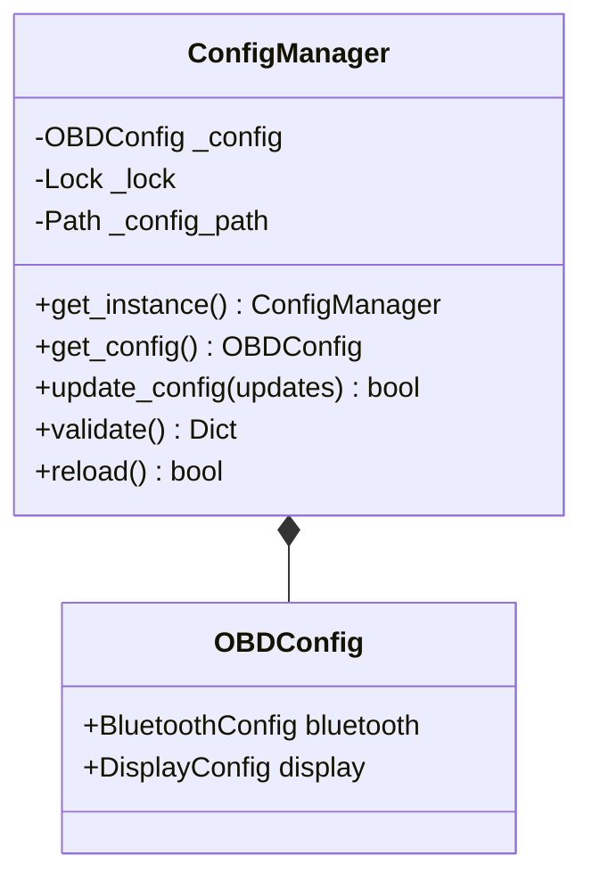

# Component Design: ConfigManager

Created: 2025-12-29

---

## Table of Contents

- [1.0 Document Information](<#1.0 document information>)
- [2.0 Component Overview](<#2.0 component overview>)
- [3.0 Class Design](<#3.0 class design>)
- [4.0 Method Specifications](<#4.0 method specifications>)
- [5.0 Configuration Hierarchy](<#5.0 configuration hierarchy>)
- [6.0 Thread Safety](<#6.0 thread safety>)
- [7.0 Error Handling](<#7.0 error handling>)
- [8.0 Visual Documentation](<#8.0 visual documentation>)
- [Version History](<#version history>)

---

## 1.0 Document Information

```yaml
document_info:
  document_id: "design-b4c5d6e7-component_utils_config_manager"
  tier: 3
  domain: "Utilities"
  component: "ConfigManager"
  parent: "design-9a1f3c7e-domain_utils.md"
  source_file: "src/gtach/utils/config.py"
  version: "1.0"
  date: "2025-12-29"
  author: "William Watson"
```

### 1.1 Parent Reference

- **Domain Design**: [design-9a1f3c7e-domain_utils.md](<design-9a1f3c7e-domain_utils.md>)
- **Master Design**: [design-0000-master_gtach.md](<design-0000-master_gtach.md>)

[Return to Table of Contents](<#table of contents>)

---

## 2.0 Component Overview

### 2.1 Purpose

ConfigManager provides a thread-safe singleton for application configuration management with YAML persistence and validation.

### 2.2 Responsibilities

1. Load configuration from YAML file hierarchy
2. Provide thread-safe read/write access via threading.Lock
3. Validate configuration against basic range constraints
4. Persist changes to YAML file

### 2.3 Singleton Pattern

ConfigManager uses double-checked locking to ensure exactly one instance exists application-wide, providing a single source of truth for configuration.

[Return to Table of Contents](<#table of contents>)

---

## 3.0 Class Design

### 3.1 ConfigManager Class

```python
class ConfigManager:
    """Thread-safe singleton configuration manager.
    
    Provides concurrent read access with exclusive write access
    via RWLock synchronization.
    """
    
    _instance: Optional['ConfigManager'] = None
    _instance_lock: threading.Lock = threading.Lock()
```

### 3.2 get_instance (Singleton Access)

```python
@classmethod
def get_instance(cls) -> 'ConfigManager':
    """Get singleton instance with double-checked locking.
    
    Returns:
        ConfigManager singleton instance
    
    Thread Safety:
        Uses double-checked locking pattern
    """
    if cls._instance is None:
        with cls._instance_lock:
            if cls._instance is None:
                cls._instance = cls()
    return cls._instance
```

### 3.3 Constructor (Private)

```python
def __init__(self) -> None:
    """Initialize config manager (use get_instance()).
    
    Raises:
        RuntimeError: If called directly after instance exists
    """
```

### 3.4 Attributes

| Attribute | Type | Purpose |
|-----------|------|---------|
| `_config` | `OBDConfig` | Current configuration |
| `_lock` | `threading.Lock` | Configuration access lock |
| `_config_path` | `Path` | Active config file path |
| `_callbacks` | `List[Callable]` | Change observers |

[Return to Table of Contents](<#table of contents>)

---

## 4.0 Method Specifications

### 4.1 get_config

```python
def get_config(self) -> OBDConfig:
    """Get configuration copy (thread-safe read).
    
    Returns:
        Deep copy of current OBDConfig
    
    Thread Safety:
        Acquires read lock
    """
```

### 4.2 get_bluetooth_config / get_display_config

```python
def get_bluetooth_config(self) -> BluetoothConfig:
    """Get Bluetooth configuration section."""

def get_display_config(self) -> DisplayConfig:
    """Get display configuration section."""
```

### 4.3 update_config

```python
def update_config(self, updates: Dict[str, Any]) -> bool:
    """Update configuration (thread-safe write).
    
    Args:
        updates: Dictionary of updates (nested keys supported)
    
    Returns:
        True if update successful
    
    Thread Safety:
        Acquires write lock
    
    Algorithm:
        1. Acquire write lock
        2. Create backup of current config
        3. Apply updates
        4. Validate new configuration
        5. If valid: save to file, notify callbacks
        6. If invalid: restore backup, return False
        7. Release lock
    """
```

### 4.4 validate

```python
def validate(self) -> Dict[str, Any]:
    """Validate current configuration.
    
    Returns:
        Dict with 'valid' bool and 'errors' list
    """
```

### 4.5 reload

```python
def reload(self) -> bool:
    """Reload configuration from file.
    
    Returns:
        True if reload successful
    
    Thread Safety:
        Acquires write lock during reload
    """
```

[Return to Table of Contents](<#table of contents>)

---

## 5.0 Configuration Hierarchy

### 5.1 Resolution Order

```
1. $GTACH_CONFIG environment variable (if set)
2. ~/.config/gtach/config.yaml (user config)
3. /etc/gtach/config.yaml (system config)
4. Built-in defaults
```

### 5.2 OBDConfig Structure

```python
@dataclass
class OBDConfig:
    """Root configuration container."""
    bluetooth: BluetoothConfig
    display: DisplayConfig

@dataclass
class BluetoothConfig:
    scan_duration: float = 10.0
    connection_timeout: float = 10.0
    command_timeout: float = 2.0
    retry_delay: float = 5.0     # Delay between reconnect attempts (no retry limit)

@dataclass
class DisplayConfig:
    mode: str = "DIGITAL"
    rpm_max: int = 8000
    fps_limit: int = 30
```

[Return to Table of Contents](<#table of contents>)

---

## 6.0 Thread Safety

### 6.1 Lock Usage

ConfigManager uses a single `threading.Lock` for exclusive access on both reads and writes. This is appropriate for the Pi Zero single-core context: read contention is low and RWLock overhead is unnecessary.

```python
@contextmanager
def _locked(self):
    """Context manager for exclusive configuration access."""
    with self._lock:
        yield
```

[Return to Table of Contents](<#table of contents>)

---

## 7.0 Error Handling

### 7.1 Exception Strategy

| Scenario | Handling |
|----------|----------|
| YAML not available | Use defaults, log warning |
| File not found | Use defaults, create on save |
| Parse error | Use defaults, log error |
| Validation failure | Reject update, return errors |
| Save failure | Log error, data in memory |


[Return to Table of Contents](<#table of contents>)

---

## 8.0 Visual Documentation

### 8.1 Class Diagram




[Return to Table of Contents](<#table of contents>)

---

## Version History

| Version | Date | Author | Changes |
|---------|------|--------|---------|
| 1.0 | 2025-12-29 | William Watson | Initial component design document |
| 1.1 | 2026-03-13 | William Watson | OOS-05/06/07: removed SessionConfig, ConfigTransaction, RWLock; simplified to threading.Lock. C3: fps_limit 60->30. C4: removed rpm_warning/rpm_danger. C1: removed retry_limit. H2/H3/H4: removed session logging attributes. |

---

Copyright (c) 2025 William Watson. This work is licensed under the MIT License.
