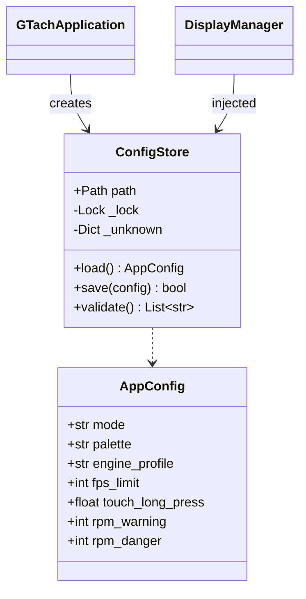
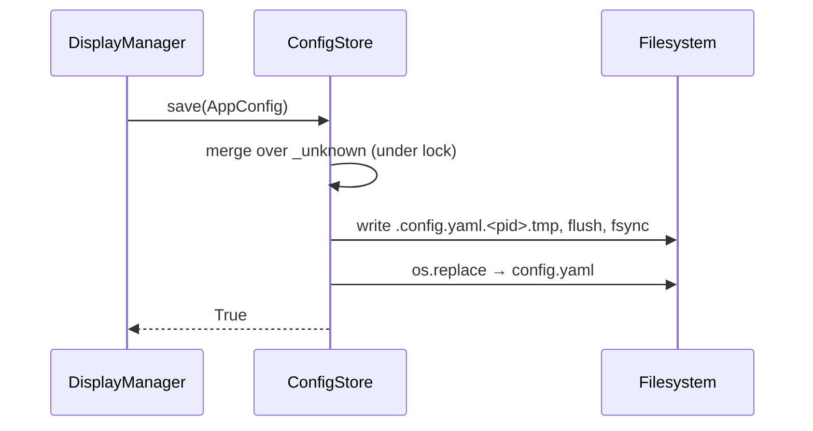

# Component Design: ConfigStore

Created: 2025-12-29

---

## Table of Contents

- [1.0 Document Information](<#1.0 document information>)
- [2.0 Component Overview](<#2.0 component overview>)
- [3.0 Class Design](<#3.0 class design>)
- [4.0 Method Specifications](<#4.0 method specifications>)
- [5.0 Configuration File](<#5.0 configuration file>)
- [6.0 Thread Safety](<#6.0 thread safety>)
- [7.0 Error Handling](<#7.0 error handling>)
- [8.0 Visual Documentation](<#8.0 visual documentation>)
- [Version History](<#version history>)

---

## 1.0 Document Information

```yaml
document_info:
  document_id: "design-b4c5d6e7-component_utils_config_manager"
  tier: 3
  domain: "Utilities"
  component: "ConfigStore"
  parent: "design-9a1f3c7e-domain_utils.md"
  source_file: "src/gtach/utils/config.py"
  version: "2.0"
  date: "2026-10-07"
  author: "William Watson"
  change_ref: "change-5fbff586"
```

### 1.1 Parent Reference

- **Domain Design**: [design-9a1f3c7e-domain_utils.md](<design-9a1f3c7e-domain_utils.md>)
- **Home Directory**: [design-f8a9b0c1-component_utils_home.md](<design-f8a9b0c1-component_utils_home.md>)
- **Source Change**: [change-5fbff586](<../change/change-5fbff586-configuration-split.md>)

[Return to Table of Contents](<#table of contents>)

---

## 2.0 Component Overview

### 2.1 Purpose

`ConfigStore` is the sole owner of the GTach configuration file, `gtach_home()/config.yaml` (default `/opt/gtach/config.yaml`). It reads the file into an `AppConfig`, writes it atomically, and validates it for the `--validate-config` command.

The document identifier is retained from the former `ConfigManager` design, which this version replaces (change-5fbff586).

### 2.2 Responsibilities

1. Load the flat configuration into an `AppConfig`, applying defaults for missing or invalid values.
2. Save an `AppConfig` atomically, preserving keys it does not know.
3. Validate the file without changing it.

### 2.3 Consumers

| Consumer | Use |
|---|---|
| `GTachApplication` | Creates one `ConfigStore` (from `--config` or the default) and injects it into `DisplayManager`. |
| `DisplayManager` | `load()` at start; `save()` when a persisted setting changes (for example the palette). No direct file I/O. |
| `main` (`--validate-config`) | `validate()`; exit 1 on any error. |

### 2.4 Retained in the Module

`load_engine_profile()` and `SplashConfig` are unchanged.

### 2.5 Removed (change-5fbff586)

`ConfigManager`, `ConfigValidator`, `ConfigTransaction`, `RWLock`, `BluetoothConfig`, `DisplayConfig` (utils), `SessionConfig`, `SessionManager`, `OBDConfig` and the legacy INI path.

[Return to Table of Contents](<#table of contents>)

---

## 3.0 Class Design

### 3.1 AppConfig

```python
@dataclass
class AppConfig:
    mode: str = 'RADIAL'
    palette: str = 'day'
    engine_profile: str = 'abarth_595_turismo'
    fps_limit: int = 30
    touch_long_press: float = 1.0
    rpm_warning: int = 6500
    rpm_danger: int = 7000
```

### 3.2 ConfigStore

```python
class ConfigStore:
    path: Path                      # default gtach_home() / 'config.yaml'
    _lock: threading.Lock           # guards _unknown
    _unknown: Dict[str, Any]        # keys read but not in CONFIG_KEYS

    def __init__(self, path: Optional[Path] = None) -> None: ...
    def load(self) -> AppConfig: ...
    def save(self, config: AppConfig) -> bool: ...
    def validate(self) -> List[str]: ...
```

### 3.3 Module Constants

| Name | Value |
|---|---|
| `CONFIG_KEYS` | Key → type for the seven `AppConfig` fields, in file order |
| `MODE_VALUES` | `('RADIAL',)` |
| `LEGACY_MODE_VALUES` | `('DIGITAL',)` — accepted on read, mapped to `RADIAL` |
| `PALETTE_VALUES` | `('day', 'night')` |
| `FPS_LIMIT_RANGE` | `(1, 60)` |
| `TOUCH_LONG_PRESS_RANGE` | `(0.1, 5.0)` |

[Return to Table of Contents](<#table of contents>)

---

## 4.0 Method Specifications

### 4.1 load

- Missing file: return defaults; nothing is written.
- Unreadable file or invalid YAML: log ERROR with traceback; return defaults.
- Not a mapping: log WARNING; return defaults.
- Each known key is coerced to its type; a value that cannot be coerced is replaced by its default with a WARNING.
- `DIGITAL` is mapped to `RADIAL`.
- Unknown keys are retained under the lock for `save()`.
- Ranges are not enforced on load; `validate()` reports them.

### 4.2 save

- Merge the `AppConfig` fields over the retained unknown keys.
- Create the directory if missing.
- Write to a temporary file in the same directory, flush, `os.fsync`, then `os.replace`.
- Return `True`; on `OSError` or `yaml.YAMLError` log ERROR, remove the temporary file and return `False`.

### 4.3 validate

Returns one error string per problem; an empty list means valid. A missing or empty file is valid. Checks: readable mapping; no unknown keys; types (booleans rejected for numeric keys); `mode` in `MODE_VALUES` or `LEGACY_MODE_VALUES`; `palette` in `PALETTE_VALUES`; `engine_profile` defined in `assets/engine_profiles.yaml`; `fps_limit` and `touch_long_press` within their ranges.

[Return to Table of Contents](<#table of contents>)

---

## 5.0 Configuration File

### 5.1 Location

`gtach_home() / 'config.yaml'`, overridable by `--config`. See [design-f8a9b0c1](<design-f8a9b0c1-component_utils_home.md>).

### 5.2 Schema

```yaml
mode: RADIAL
palette: day
engine_profile: abarth_595_turismo
fps_limit: 30
touch_long_press: 1.0
rpm_warning: 6500
rpm_danger: 7000
```

`config/config.example.yaml` in the repository holds this schema at the defaults.

[Return to Table of Contents](<#table of contents>)

---

## 6.0 Thread Safety

`_lock` (a `threading.Lock`) guards only `_unknown`. File I/O and logging run outside the lock (CLAUDE.md §4 rule 8). Concurrent `save()` calls each write a complete file; `os.replace` makes the last writer win.

[Return to Table of Contents](<#table of contents>)

---

## 7.0 Error Handling

| Condition | Handling |
|---|---|
| File missing | Defaults; valid |
| Unreadable / invalid YAML | ERROR with traceback; defaults; validate reports it |
| Not a mapping | WARNING; defaults; validate reports it |
| Invalid value type | WARNING; default for that key; validate reports it |
| Save failure | ERROR with traceback; temporary file removed; `False` |

Configuration problems never prevent startup.

[Return to Table of Contents](<#table of contents>)

---

## 8.0 Visual Documentation

### 8.1 Class Diagram


```mermaid
classDiagram
    class AppConfig {
        +str mode
        +str palette
        +str engine_profile
        +int fps_limit
        +float touch_long_press
        +int rpm_warning
        +int rpm_danger
    }
    class ConfigStore {
        +Path path
        -Lock _lock
        -Dict _unknown
        +load() AppConfig
        +save(config) bool
        +validate() List~str~
    }
    ConfigStore ..> AppConfig
    GTachApplication --> ConfigStore : creates
    DisplayManager --> ConfigStore : injected
```

### 8.2 Save Sequence


```mermaid
sequenceDiagram
    participant DM as DisplayManager
    participant CS as ConfigStore
    participant FS as Filesystem
    DM->>CS: save(AppConfig)
    CS->>CS: merge over _unknown (under lock)
    CS->>FS: write .config.yaml.<pid>.tmp, flush, fsync
    CS->>FS: os.replace → config.yaml
    CS-->>DM: True
```

[Return to Table of Contents](<#table of contents>)

---

## Version History

| Version | Date | Author | Changes |
|---------|------|--------|---------|
| 1.0 | 2025-12-29 | William Watson | Initial component design document |
| 1.1 | 2026-03-13 | William Watson | OOS-05/06/07: removed SessionConfig, ConfigTransaction, RWLock; simplified to threading.Lock. C3: fps_limit 60->30. C4: removed rpm_warning/rpm_danger. C1: removed retry_limit. H2/H3/H4: removed session logging attributes. |
| 2.0 | 2026-10-07 | William Watson | Rewritten for [change-5fbff586](<../change/change-5fbff586-configuration-split.md>): ConfigManager replaced by ConfigStore over the flat GTACH_HOME/config.yaml; AppConfig; validate(); obsolete classes removed. Matches the implementation in commit f5ab73a. |

---

Copyright (c) 2026 William Watson. MIT License.
