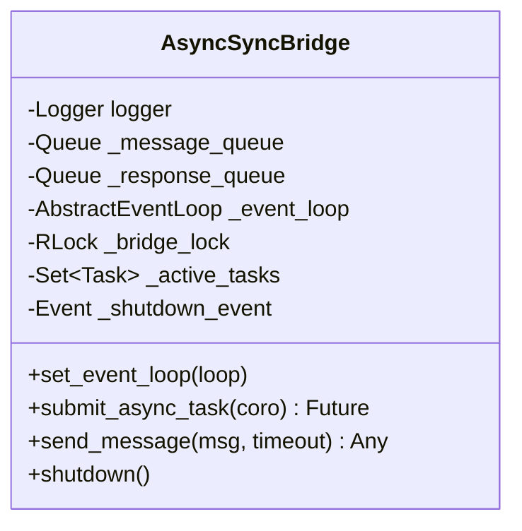

# Component Design: AsyncSyncBridge

Created: 2025-12-29

---

## Table of Contents

- [1.0 Document Information](<#1.0 document information>)
- [2.0 Component Overview](<#2.0 component overview>)
- [3.0 Class Design](<#3.0 class design>)
- [4.0 Method Specifications](<#4.0 method specifications>)
- [5.0 Threading Model](<#5.0 threading model>)
- [6.0 Error Handling](<#6.0 error handling>)
- [7.0 Visual Documentation](<#7.0 visual documentation>)
- [Version History](<#version history>)

---

## 1.0 Document Information

```yaml
document_info:
  document_id: "design-c3d4e5f6-component_core_async_sync_bridge"
  tier: 3
  domain: "Core"
  component: "AsyncSyncBridge"
  parent: "design-4f8a2b1c-domain_core.md"
  source_file: "src/gtach/core/thread.py"
  version: "1.0"
  date: "2025-12-29"
  author: "William Watson"
```

### 1.1 Parent Reference

- **Domain Design**: [design-4f8a2b1c-domain_core.md](<design-4f8a2b1c-domain_core.md>)

[Return to Table of Contents](<#table of contents>)

---

## 2.0 Component Overview

### 2.1 Purpose

AsyncSyncBridge provides coordination between asyncio event loops and synchronous code. It enables submitting async coroutines from sync contexts and supports message passing between execution contexts with timeout handling.

### 2.2 Responsibilities

1. Store asyncio event loop reference for cross-context submission
2. Submit async coroutines from synchronous code
3. Provide message passing between async and sync contexts
4. Track and cancel active async tasks on shutdown
5. Clear message queues during cleanup

### 2.3 Use Case

Primary use: BluetoothManager uses Bleak (async library) but integrates with sync ThreadManager. AsyncSyncBridge enables sync code to trigger async Bluetooth operations.

[Return to Table of Contents](<#table of contents>)

---

## 3.0 Class Design

### 3.1 Constructor

```python
def __init__(self, logger: logging.Logger) -> None:
    """Initialize bridge with message queues and synchronization.
    
    Args:
        logger: Logger instance for debug output
    
    Initializes:
        _message_queue: Queue for outgoing messages
        _response_queue: Queue for incoming responses
        _event_loop: None (set via set_event_loop)
        _bridge_lock: RLock for thread-safe access
        _active_tasks: Set of pending async tasks
        _shutdown_event: Event signaling shutdown
    """
```

### 3.2 Attributes

| Attribute | Type | Purpose |
|-----------|------|---------|
| `logger` | `Logger` | Debug logging |
| `_message_queue` | `queue.Queue` | Outgoing messages |
| `_response_queue` | `queue.Queue` | Incoming responses |
| `_event_loop` | `Optional[AbstractEventLoop]` | Async loop reference |
| `_bridge_lock` | `threading.RLock` | Thread-safe access |
| `_active_tasks` | `Set[asyncio.Task]` | Pending tasks |
| `_shutdown_event` | `threading.Event` | Shutdown signal |

[Return to Table of Contents](<#table of contents>)

---

## 4.0 Method Specifications

### 4.1 set_event_loop

```python
def set_event_loop(self, loop: asyncio.AbstractEventLoop) -> None:
    """Set the event loop for async operations.
    
    Thread Safety: Protected by _bridge_lock
    
    Must be called from async context (e.g., Bluetooth thread)
    before submit_async_task can be used.
    """
```

### 4.2 submit_async_task

```python
def submit_async_task(self, coro) -> concurrent.futures.Future:
    """Submit async coroutine from sync context.
    
    Args:
        coro: Coroutine to execute
    
    Returns:
        Future that resolves with coroutine result
    
    Raises:
        RuntimeError: If loop not set or shutting down
    
    Implementation:
        Uses asyncio.run_coroutine_threadsafe() for cross-context execution
    
    Thread Safety:
        Acquires _bridge_lock, checks loop availability
    """
```

### 4.3 send_message

```python
def send_message(self, message: Any, timeout: float = 5.0) -> Any:
    """Send message between contexts with timeout.
    
    Args:
        message: Payload to send
        timeout: Maximum wait time (default 5.0s)
    
    Returns:
        Response from receiving context
    
    Raises:
        RuntimeError: If shutting down
        TimeoutError: If send or receive times out
    
    Algorithm:
        1. Check shutdown flag
        2. Put message in _message_queue (with timeout)
        3. Get response from _response_queue (with timeout)
        4. Return response
    """
```

### 4.4 shutdown

```python
def shutdown(self) -> None:
    """Shutdown bridge and cleanup resources.
    
    Algorithm:
        1. Log shutdown initiation
        2. Set _shutdown_event
        3. Acquire _bridge_lock
        4. Cancel all active tasks (if not done)
        5. Clear _message_queue
        6. Clear _response_queue
        7. Release lock
    """
```

[Return to Table of Contents](<#table of contents>)

---

## 5.0 Threading Model

### 5.1 Cross-Context Execution

```
Sync Thread (Main/Display)          Async Thread (Bluetooth)
         │                                   │
         │ submit_async_task(coro)          │
         │────────────────────────────────► │
         │                                   │ run_coroutine_threadsafe
         │                                   │ executes coro
         │ ◄────────────────────────────────│
         │ Future.result()                   │
```

### 5.2 Message Passing

```
Sync Context                        Async Context
     │                                   │
     │ send_message(msg)                 │
     │──► _message_queue ──────────────► │
     │                                   │ process message
     │ ◄── _response_queue ◄─────────────│
     │ return response                   │
```

[Return to Table of Contents](<#table of contents>)

---

## 6.0 Error Handling

| Scenario | Exception | Handling |
|----------|-----------|----------|
| No event loop | RuntimeError | Return failed Future |
| Shutting down | RuntimeError | Raise in send_message |
| Queue full | TimeoutError | Raise with timeout info |
| Queue empty | TimeoutError | Raise with timeout info |

[Return to Table of Contents](<#table of contents>)

---

## 7.0 Visual Documentation

### 7.1 Class Diagram



### 7.2 Sequence Diagram

```mermaid
sequenceDiagram
    participant Sync as Sync Code
    participant Bridge as AsyncSyncBridge
    participant Loop as Event Loop
    participant Coro as Coroutine
    
    Sync->>Bridge: submit_async_task(coro)
    Bridge->>Bridge: acquire _bridge_lock
    Bridge->>Bridge: check _event_loop set
    Bridge->>Loop: run_coroutine_threadsafe(coro)
    Loop->>Coro: execute
    Coro-->>Loop: result
    Loop-->>Bridge: Future
    Bridge-->>Sync: Future
    Sync->>Sync: future.result()
```

[Return to Table of Contents](<#table of contents>)

---

## Version History

| Version | Date | Author | Changes |
|---------|------|--------|---------|
| 1.0 | 2025-12-29 | William Watson | Initial component design document |

---

Copyright (c) 2025 William Watson. This work is licensed under the MIT License.
