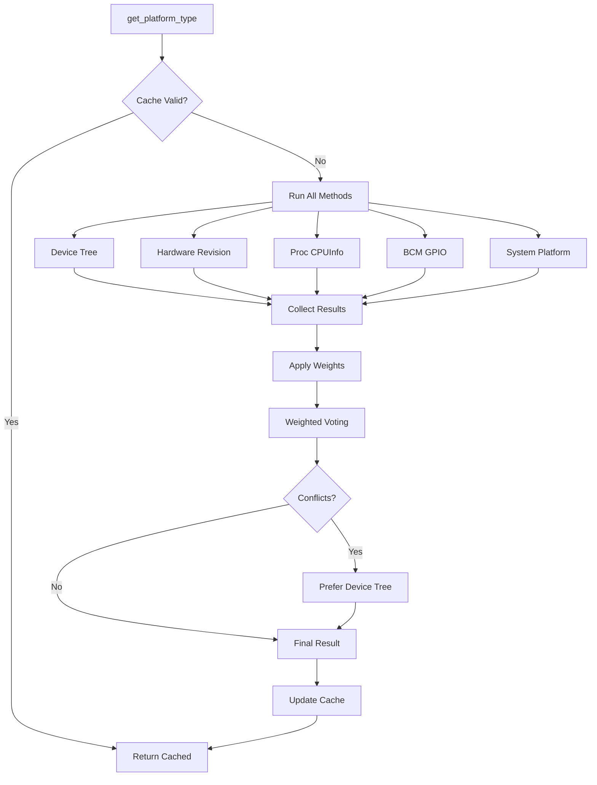
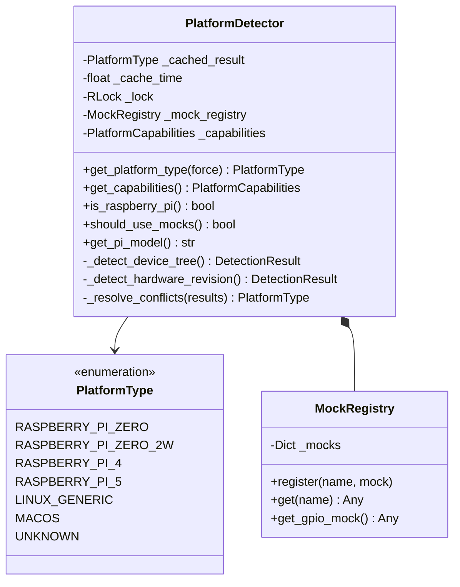

# Component Design: PlatformDetector

Created: 2025-12-29

---

## Table of Contents

- [1.0 Document Information](<#1.0 document information>)
- [2.0 Component Overview](<#2.0 component overview>)
- [3.0 Class Design](<#3.0 class design>)
- [4.0 Method Specifications](<#4.0 method specifications>)
- [5.0 Detection Methods](<#5.0 detection methods>)
- [6.0 Mock Registry](<#6.0 mock registry>)
- [7.0 Visual Documentation](<#7.0 visual documentation>)
- [Version History](<#version history>)

---

## 1.0 Document Information

```yaml
document_info:
  document_id: "design-c5d6e7f8-component_utils_platform_detector"
  tier: 3
  domain: "Utilities"
  component: "PlatformDetector"
  parent: "design-9a1f3c7e-domain_utils.md"
  source_file: "src/gtach/utils/platform.py"
  version: "1.0"
  date: "2025-12-29"
  author: "William Watson"
```

### 1.1 Parent Reference

- **Domain Design**: [design-9a1f3c7e-domain_utils.md](<design-9a1f3c7e-domain_utils.md>)

[Return to Table of Contents](<#table of contents>)

---

## 2.0 Component Overview

### 2.1 Purpose

PlatformDetector provides unified platform detection using multiple methods with confidence scoring and conflict resolution to reliably identify Raspberry Pi variants and other platforms.

### 2.2 Responsibilities

1. Detect platform type (Pi Zero, Pi 4, macOS, Linux, etc.)
2. Run multiple detection methods with confidence weighting
3. Resolve conflicts between detection methods
4. Verify GPIO accessibility
5. Provide mock registry for hardware abstraction
6. Cache detection results for performance

### 2.3 Detection Philosophy

Multiple detection methods provide redundancy and validation. Weighted voting resolves conflicts when methods disagree, preferring higher-confidence methods.

[Return to Table of Contents](<#table of contents>)

---

## 3.0 Class Design

### 3.1 PlatformDetector Class

```python
class PlatformDetector:
    """Multi-method platform detector with conflict resolution."""
```

### 3.2 Constructor

```python
def __init__(self, cache_ttl: float = 300.0) -> None:
    """Initialize platform detector.
    
    Args:
        cache_ttl: Cache time-to-live in seconds (default 5 min)
    """
```

### 3.3 Attributes

| Attribute | Type | Purpose |
|-----------|------|---------|
| `_cached_result` | `Optional[PlatformType]` | Cached detection |
| `_cache_time` | `float` | Cache timestamp |
| `_cache_ttl` | `float` | Cache validity period |
| `_lock` | `threading.RLock` | Thread safety |
| `_mock_registry` | `MockRegistry` | Hardware mocks |
| `_capabilities` | `PlatformCapabilities` | Platform features |

### 3.4 PlatformType Enum

```python
class PlatformType(Enum):
    """Detected platform type."""
    RASPBERRY_PI_ZERO = "pi_zero"
    RASPBERRY_PI_ZERO_2W = "pi_zero_2w"
    RASPBERRY_PI_4 = "pi_4"
    RASPBERRY_PI_5 = "pi_5"
    RASPBERRY_PI_GENERIC = "pi_generic"
    LINUX_GENERIC = "linux"
    MACOS = "macos"
    WINDOWS = "windows"
    UNKNOWN = "unknown"
```

### 3.5 DetectionMethod Enum

```python
class DetectionMethod(Enum):
    """Available detection methods."""
    DEVICE_TREE = auto()       # /proc/device-tree
    HARDWARE_REVISION = auto() # Hardware revision codes
    PROC_CPUINFO = auto()      # /proc/cpuinfo
    BCM_GPIO = auto()          # BCM GPIO access
    SYSTEM_PLATFORM = auto()   # Python platform module
```

[Return to Table of Contents](<#table of contents>)

---

## 4.0 Method Specifications

### 4.1 get_platform_type

```python
def get_platform_type(self, force_refresh: bool = False) -> PlatformType:
    """Get detected platform type.
    
    Args:
        force_refresh: Bypass cache if True
    
    Returns:
        PlatformType enum value
    
    Thread Safety:
        Acquires lock during detection
    
    Algorithm:
        1. Check cache validity
        2. If valid cache and not force_refresh: return cached
        3. Run all detection methods
        4. Apply weighted voting
        5. Store in cache
        6. Return result
    """
```

### 4.2 get_capabilities

```python
def get_capabilities(self) -> PlatformCapabilities:
    """Get platform capability flags.
    
    Returns:
        PlatformCapabilities with feature flags
    """
```

### 4.3 get_detection_results

```python
def get_detection_results(self) -> List[DetectionResult]:
    """Get individual method results for diagnostics.
    
    Returns:
        List of DetectionResult from each method
    """
```

### 4.4 is_raspberry_pi

```python
def is_raspberry_pi(self) -> bool:
    """Check if running on any Raspberry Pi.
    
    Returns:
        True if RASPBERRY_PI_* platform detected
    """
```

### 4.5 should_use_mocks

```python
def should_use_mocks(self) -> bool:
    """Check if hardware mocks should be used.
    
    Returns:
        True if not on Raspberry Pi (use mocks for development)
    """
```

### 4.6 get_pi_model

```python
def get_pi_model(self) -> Optional[str]:
    """Get Raspberry Pi model string.
    
    Returns:
        Model string (e.g., "Raspberry Pi Zero 2 W") or None
    """
```

[Return to Table of Contents](<#table of contents>)

---

## 5.0 Detection Methods

### 5.1 Method Weights

| Method | Weight | Reliability |
|--------|--------|-------------|
| DEVICE_TREE | 1.0 | Highest - kernel-maintained |
| HARDWARE_REVISION | 0.9 | Very high - unique to model |
| PROC_CPUINFO | 0.8 | High - may vary |
| BCM_GPIO | 0.6 | Medium - requires permissions |
| SYSTEM_PLATFORM | 0.4 | Low - generic |

### 5.2 Detection Implementations

```python
def _detect_device_tree(self) -> DetectionResult:
    """Check /proc/device-tree/model."""
    path = Path('/proc/device-tree/model')
    if path.exists():
        model = path.read_text().strip('\x00')
        # Parse model string for Pi variant
        return DetectionResult(method, platform_type, confidence)

def _detect_hardware_revision(self) -> DetectionResult:
    """Check /proc/cpuinfo Hardware/Revision fields."""
    # Known revision codes map to specific models

def _detect_proc_cpuinfo(self) -> DetectionResult:
    """Parse /proc/cpuinfo for BCM processor."""

def _detect_bcm_gpio(self) -> DetectionResult:
    """Check for BCM GPIO device access."""
    bcm_path = Path('/dev/gpiomem')
    # Check exists and accessible

def _detect_system_platform(self) -> DetectionResult:
    """Use Python platform module."""
    system = platform.system()
    machine = platform.machine()
```

### 5.3 Weighted Voting

```python
def _resolve_conflicts(self, results: List[DetectionResult]) -> PlatformType:
    """Resolve conflicts via weighted voting.
    
    Algorithm:
        1. Group results by platform type
        2. Sum weights for each type
        3. Return type with highest total weight
        4. On tie: prefer DEVICE_TREE result
    """
```

[Return to Table of Contents](<#table of contents>)

---

## 6.0 Mock Registry

### 6.1 MockRegistry Class

```python
class MockRegistry:
    """Registry for hardware abstraction mocks."""
    
    def __init__(self):
        self._mocks: Dict[str, Any] = {}
    
    def register(self, name: str, mock: Any) -> None:
        """Register a mock implementation."""
    
    def get(self, name: str) -> Optional[Any]:
        """Get registered mock."""
    
    def get_gpio_mock(self) -> Any:
        """Get GPIO mock for development platforms."""
```

### 6.2 PlatformCapabilities Dataclass

```python
@dataclass
class PlatformCapabilities:
    """Platform feature availability."""
    has_gpio: bool = False
    has_spi: bool = False
    has_i2c: bool = False
    has_bluetooth: bool = False
    gpio_accessible: bool = False
    framebuffer_available: bool = False
    touch_available: bool = False
```

[Return to Table of Contents](<#table of contents>)

---

## 7.0 Visual Documentation

### 7.1 Detection Flow



### 7.2 Class Diagram



[Return to Table of Contents](<#table of contents>)

---

## Version History

| Version | Date | Author | Changes |
|---------|------|--------|---------|
| 1.0 | 2025-12-29 | William Watson | Initial component design document |

---

Copyright (c) 2025 William Watson. This work is licensed under the MIT License.
