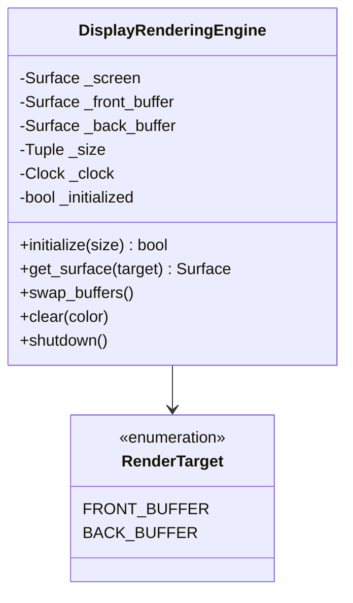

# Component Design: DisplayRenderingEngine

Created: 2025-12-29

---

## Table of Contents

- [1.0 Document Information](<#1.0 document information>)
- [2.0 Component Overview](<#2.0 component overview>)
- [3.0 Class Design](<#3.0 class design>)
- [4.0 Method Specifications](<#4.0 method specifications>)
- [5.0 Double Buffering](<#5.0 double buffering>)
- [6.0 Visual Documentation](<#6.0 visual documentation>)
- [Version History](<#version history>)

---

## 1.0 Document Information

```yaml
document_info:
  document_id: "design-c9d0e1f2-component_display_rendering_engine"
  tier: 3
  domain: "Display"
  component: "DisplayRenderingEngine"
  parent: "design-2c6b8e4d-domain_display.md"
  source_file: "src/gtach/display/rendering.py"
  version: "1.0"
  date: "2025-12-29"
  author: "William Watson"
```

### 1.1 Parent Reference

- **Domain Design**: [design-2c6b8e4d-domain_display.md](<design-2c6b8e4d-domain_display.md>)

[Return to Table of Contents](<#table of contents>)

---

## 2.0 Component Overview

### 2.1 Purpose

DisplayRenderingEngine manages double-buffered framebuffer rendering to prevent screen tearing. It provides surface access for rendering operations and handles buffer swapping.

### 2.2 Responsibilities

1. Initialize Pygame display surface
2. Manage front and back buffer surfaces
3. Provide surface access for rendering
4. Swap buffers atomically
5. Handle display shutdown cleanup

### 2.3 Double Buffering Rationale

Direct rendering to the display causes visible tearing as pixels update mid-frame. Double buffering renders to an off-screen buffer, then atomically swaps it with the visible buffer.

[Return to Table of Contents](<#table of contents>)

---

## 3.0 Class Design

### 3.1 DisplayRenderingEngine Class

```python
class DisplayRenderingEngine:
    """Double-buffered rendering engine.
    
    Provides tear-free rendering via front/back buffer swapping.
    """
```

### 3.2 Constructor

```python
def __init__(self) -> None:
    """Initialize rendering engine.
    
    Attributes initialized to None until initialize() called.
    """
```

### 3.3 Attributes

| Attribute | Type | Purpose |
|-----------|------|---------|
| `_screen` | `pygame.Surface` | Primary display surface |
| `_front_buffer` | `pygame.Surface` | Currently displayed |
| `_back_buffer` | `pygame.Surface` | Off-screen rendering target |
| `_size` | `Tuple[int, int]` | Display dimensions |
| `_clock` | `pygame.time.Clock` | Frame rate limiter |
| `_initialized` | `bool` | Initialization state |

### 3.4 RenderTarget Enum

```python
class RenderTarget(Enum):
    """Buffer selection for rendering."""
    FRONT_BUFFER = auto()  # Currently displayed
    BACK_BUFFER = auto()   # Off-screen target
```

[Return to Table of Contents](<#table of contents>)

---

## 4.0 Method Specifications

### 4.1 initialize

```python
def initialize(self, size: Tuple[int, int] = (480, 480)) -> bool:
    """Initialize display and buffers.
    
    Args:
        size: Display dimensions (default 480x480)
    
    Returns:
        True if successful
    
    Algorithm:
        1. Initialize Pygame display module
        2. Set display mode (fullscreen on Pi, windowed on dev)
        3. Create front buffer surface
        4. Create back buffer surface
        5. Create clock for timing
        6. Return True
    
    Error Handling:
        On exception: log error, return False
    """
```

### 4.2 get_surface

```python
def get_surface(self, 
                target: RenderTarget = RenderTarget.BACK_BUFFER) -> pygame.Surface:
    """Get surface for rendering.
    
    Args:
        target: Which buffer to return (default BACK_BUFFER)
    
    Returns:
        Pygame Surface for rendering operations
    
    Usage:
        surface = engine.get_surface()
        surface.fill((0, 0, 0))
        pygame.draw.circle(surface, ...)
    """
```

### 4.3 swap_buffers

```python
def swap_buffers(self) -> None:
    """Swap front and back buffers.
    
    Algorithm:
        1. Blit back_buffer to front_buffer
        2. Blit front_buffer to screen
        3. Call pygame.display.flip()
    
    Note:
        Back buffer retains content for incremental updates.
    """
```

### 4.4 clear

```python
def clear(self, color: Tuple[int, int, int] = (0, 0, 0)) -> None:
    """Clear back buffer.
    
    Args:
        color: Fill color (default black)
    """
```

### 4.5 shutdown

```python
def shutdown(self) -> None:
    """Shutdown rendering engine.
    
    Algorithm:
        1. Set _initialized = False
        2. Clear surface references
        3. Quit Pygame display module
    """
```

[Return to Table of Contents](<#table of contents>)

---

## 5.0 Double Buffering

### 5.1 Buffer Architecture

```
┌─────────────────┐    ┌─────────────────┐
│   Back Buffer   │    │  Front Buffer   │
│  (off-screen)   │ ─► │   (visible)     │
│                 │    │                 │
│  Render here    │    │  Display shows  │
└─────────────────┘    └─────────────────┘
                              │
                              ▼
                       ┌─────────────────┐
                       │     Screen      │
                       │  (hardware)     │
                       └─────────────────┘
```

### 5.2 Swap Sequence

```python
# Typical frame cycle
engine.clear()                    # Clear back buffer
render_content(engine.get_surface())  # Draw to back buffer
engine.swap_buffers()             # Make visible
```

[Return to Table of Contents](<#table of contents>)

---

## 6.0 Visual Documentation

### 6.1 Class Diagram



[Return to Table of Contents](<#table of contents>)

---

## Version History

| Version | Date | Author | Changes |
|---------|------|--------|---------|
| 1.0 | 2025-12-29 | William Watson | Initial component design document |

---

Copyright (c) 2025 William Watson. This work is licensed under the MIT License.
