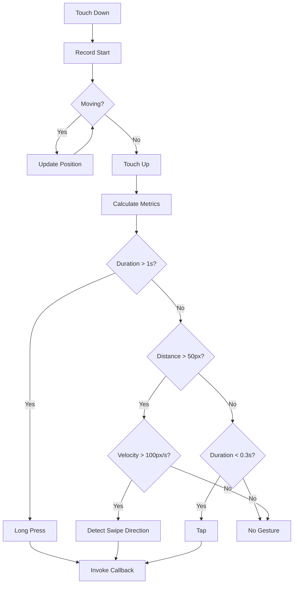
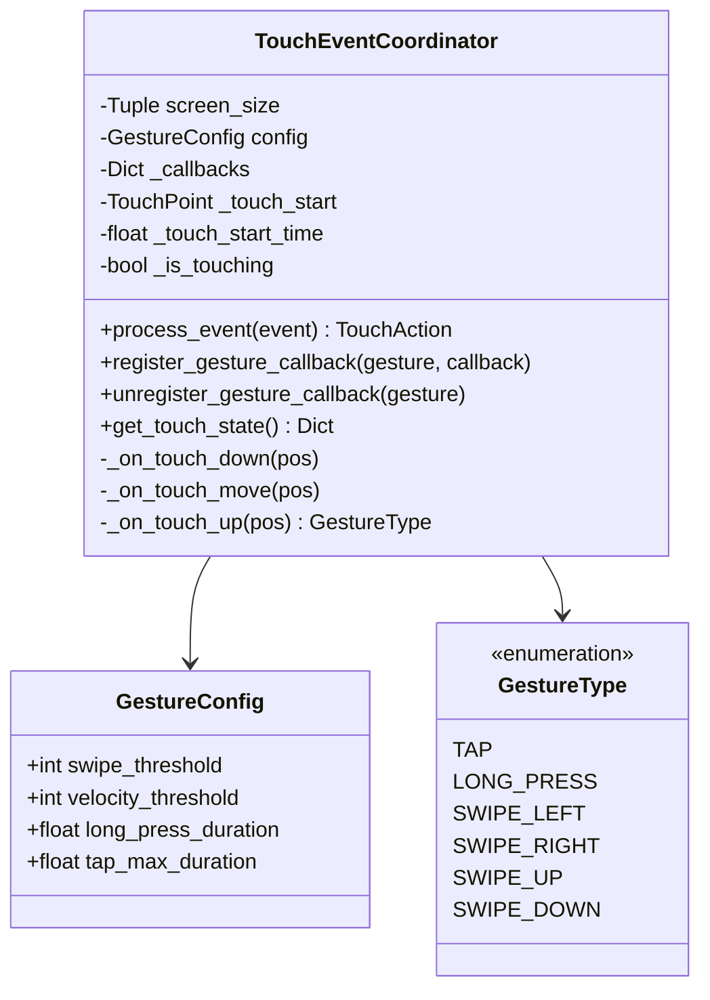

# Component Design: TouchEventCoordinator

Created: 2025-12-29

---

## Table of Contents

- [1.0 Document Information](<#1.0 document information>)
- [2.0 Component Overview](<#2.0 component overview>)
- [3.0 Class Design](<#3.0 class design>)
- [4.0 Method Specifications](<#4.0 method specifications>)
- [5.0 Gesture Recognition](<#5.0 gesture recognition>)
- [6.0 Visual Documentation](<#6.0 visual documentation>)
- [Version History](<#version history>)

---

## 1.0 Document Information

```yaml
document_info:
  document_id: "design-d0e1f2a3-component_display_touch_coordinator"
  tier: 3
  domain: "Display"
  component: "TouchEventCoordinator"
  parent: "design-2c6b8e4d-domain_display.md"
  source_file: "src/gtach/display/input.py"
  version: "1.0"
  date: "2025-12-29"
  author: "William Watson"
```

### 1.1 Parent Reference

- **Domain Design**: [design-2c6b8e4d-domain_display.md](<design-2c6b8e4d-domain_display.md>)

[Return to Table of Contents](<#table of contents>)

---

## 2.0 Component Overview

### 2.1 Purpose

TouchEventCoordinator processes touch events from Pygame and recognizes gestures (swipe, long press, tap). It provides callback registration for gesture handlers.

### 2.2 Responsibilities

1. Track touch start, move, and end events
2. Calculate gesture metrics (distance, velocity, duration)
3. Classify gestures based on thresholds
4. Invoke registered callbacks for recognized gestures
5. Provide touch state for rendering overlays

[Return to Table of Contents](<#table of contents>)

---

## 3.0 Class Design

### 3.1 TouchEventCoordinator Class

```python
class TouchEventCoordinator:
    """Touch event processor and gesture recognizer."""
```

### 3.2 Constructor

```python
def __init__(self, 
             screen_size: Tuple[int, int] = (480, 480),
             config: GestureConfig = None) -> None:
    """Initialize touch coordinator.
    
    Args:
        screen_size: Display dimensions for bounds checking
        config: Gesture thresholds (uses defaults if None)
    """
```

### 3.3 Attributes

| Attribute | Type | Purpose |
|-----------|------|---------|
| `screen_size` | `Tuple[int, int]` | Display bounds |
| `config` | `GestureConfig` | Threshold settings |
| `_callbacks` | `Dict[GestureType, Callable]` | Gesture handlers |
| `_touch_start` | `Optional[TouchPoint]` | Touch down position |
| `_touch_current` | `Optional[TouchPoint]` | Latest position |
| `_touch_start_time` | `float` | Touch down timestamp |
| `_is_touching` | `bool` | Active touch state |

### 3.4 GestureType Enum

```python
class GestureType(Enum):
    """Recognized gesture types."""
    TAP = auto()          # Quick touch and release
    LONG_PRESS = auto()   # Press and hold
    SWIPE_LEFT = auto()   # Horizontal swipe left
    SWIPE_RIGHT = auto()  # Horizontal swipe right
    SWIPE_UP = auto()     # Vertical swipe up
    SWIPE_DOWN = auto()   # Vertical swipe down
    DOUBLE_TAP = auto()   # Two quick taps
```

### 3.5 GestureConfig Dataclass

```python
@dataclass
class GestureConfig:
    """Gesture recognition thresholds."""
    swipe_threshold: int = 50       # Min pixels for swipe
    velocity_threshold: int = 100   # Min pixels/sec for swipe
    long_press_duration: float = 1.0  # Seconds for long press
    tap_max_duration: float = 0.3   # Max seconds for tap
    double_tap_interval: float = 0.3  # Max seconds between taps
```

[Return to Table of Contents](<#table of contents>)

---

## 4.0 Method Specifications

### 4.1 process_event

```python
def process_event(self, event: pygame.event.Event) -> Optional[TouchAction]:
    """Process Pygame event.
    
    Args:
        event: Pygame event (MOUSEBUTTONDOWN, MOUSEMOTION, MOUSEBUTTONUP)
    
    Returns:
        TouchAction if gesture recognized, None otherwise
    
    Supported Events:
        MOUSEBUTTONDOWN: Touch start
        MOUSEMOTION: Touch move
        MOUSEBUTTONUP: Touch end (triggers recognition)
    """
```

### 4.2 _on_touch_down

```python
def _on_touch_down(self, pos: Tuple[int, int]) -> None:
    """Handle touch start.
    
    Records:
        - Start position
        - Start timestamp
        - Sets _is_touching = True
    """
```

### 4.3 _on_touch_move

```python
def _on_touch_move(self, pos: Tuple[int, int]) -> None:
    """Handle touch movement.
    
    Updates:
        - Current position
        - Can trigger early recognition for long press
    """
```

### 4.4 _on_touch_up

```python
def _on_touch_up(self, pos: Tuple[int, int]) -> Optional[GestureType]:
    """Handle touch end and recognize gesture.
    
    Algorithm:
        1. Calculate duration
        2. Calculate distance (dx, dy)
        3. Calculate velocity
        4. Check long press (duration > threshold)
        5. Check swipe (distance > threshold, velocity > threshold)
        6. Check tap (duration < threshold, small distance)
        7. Invoke callback if recognized
        8. Reset touch state
    """
```

### 4.5 register_gesture_callback

```python
def register_gesture_callback(self, 
                              gesture: GestureType,
                              callback: Callable[[], None]) -> None:
    """Register callback for gesture type.
    
    Args:
        gesture: GestureType to handle
        callback: Function to call when gesture recognized
    """
```

### 4.6 unregister_gesture_callback

```python
def unregister_gesture_callback(self, gesture: GestureType) -> None:
    """Remove callback for gesture type."""
```

### 4.7 get_touch_state

```python
def get_touch_state(self) -> Dict[str, Any]:
    """Get current touch state for overlays.
    
    Returns:
        Dict with is_touching, position, duration
    """
```

[Return to Table of Contents](<#table of contents>)

---

## 5.0 Gesture Recognition

### 5.1 Swipe Detection

```python
def _detect_swipe(self, dx: int, dy: int, 
                  velocity: float, duration: float) -> Optional[GestureType]:
    """Detect swipe gesture.
    
    Criteria:
        - Distance > swipe_threshold (50px)
        - Velocity > velocity_threshold (100px/s)
        - Duration < 1.0s (not a hold)
    
    Direction:
        - |dx| > |dy|: Horizontal swipe
            - dx < 0: SWIPE_LEFT
            - dx > 0: SWIPE_RIGHT
        - |dy| > |dx|: Vertical swipe
            - dy < 0: SWIPE_UP
            - dy > 0: SWIPE_DOWN
    """
```

### 5.2 Long Press Detection

```python
def _detect_long_press(self, distance: float, 
                       duration: float) -> bool:
    """Detect long press gesture.
    
    Criteria:
        - Duration > long_press_duration (1.0s)
        - Distance < swipe_threshold (didn't move much)
    """
```

### 5.3 Tap Detection

```python
def _detect_tap(self, distance: float, 
                duration: float) -> bool:
    """Detect tap gesture.
    
    Criteria:
        - Duration < tap_max_duration (0.3s)
        - Distance < swipe_threshold / 2 (minimal movement)
    """
```

[Return to Table of Contents](<#table of contents>)

---

## 6.0 Visual Documentation

### 6.1 Gesture Recognition Flow



### 6.2 Class Diagram



[Return to Table of Contents](<#table of contents>)

---

## Version History

| Version | Date | Author | Changes |
|---------|------|--------|---------|
| 1.0 | 2025-12-29 | William Watson | Initial component design document |

---

Copyright (c) 2025 William Watson. This work is licensed under the MIT License.
