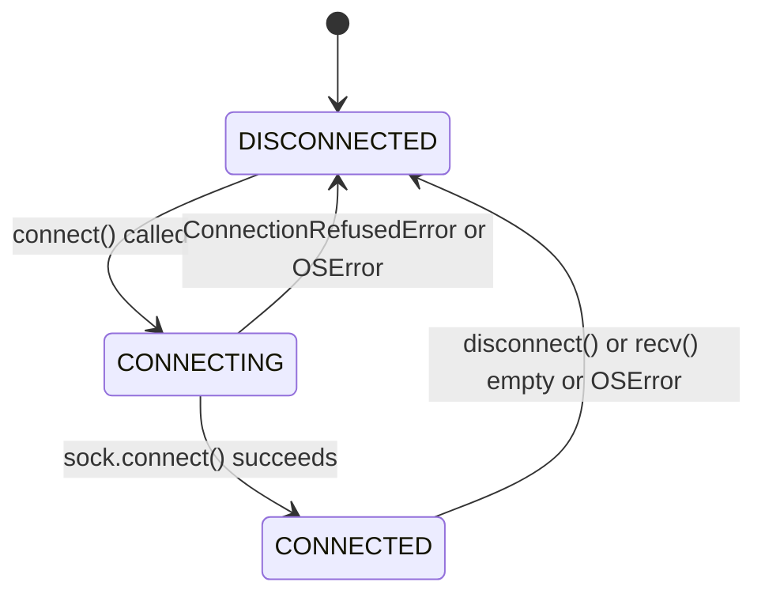
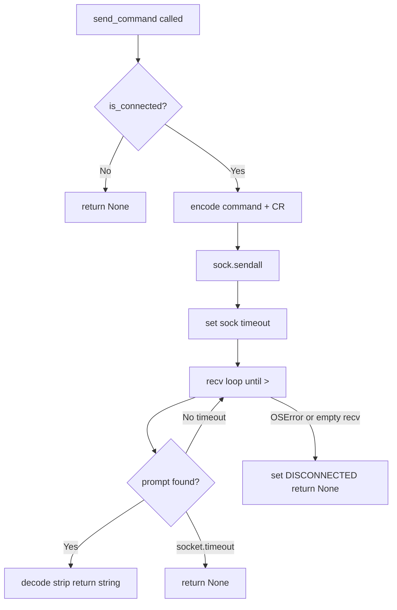

# Component Design: TCPTransport

Created: 2026 March 24

---

## Table of Contents

- [1.0 Document Information](<#1.0 document information>)
- [2.0 Component Overview](<#2.0 component overview>)
- [3.0 File Location](<#3.0 file location>)
- [4.0 Elements](<#4.0 elements>)
- [5.0 Interfaces](<#5.0 interfaces>)
- [6.0 Data Design](<#6.0 data design>)
- [7.0 Error Handling](<#7.0 error handling>)
- [8.0 Visual Documentation](<#8.0 visual documentation>)
- [9.0 Element Registry](<#9.0 element registry>)
- [Version History](<#version history>)

---

## 1.0 Document Information

```yaml
document_info:
  document_id: "design-d3e4f5a6-component_comm_tcp_transport"
  tier: 3
  domain: "Communication"
  parent: "design-7d3e9f5a-domain_comm.md"
  version: "1.0"
  date: "2026-03-24"
  author: "William Watson"
```

### 1.1 Parent Reference

- **Domain Design**: [design-7d3e9f5a-domain_comm.md](<design-7d3e9f5a-domain_comm.md>)
- **Interface Contract**: [design-b1c2d3e4-component_comm_transport.md](<design-b1c2d3e4-component_comm_transport.md>)

[Return to Table of Contents](<#table of contents>)

---

## 2.0 Component Overview

### 2.1 Purpose

Implements `OBDTransport` over a TCP socket. Used on any platform to connect to an `ircama/ELM327-emulator` instance running in network mode (`elm -s car -n 35000`). No third-party libraries required; uses the Python standard library `socket` module with `AF_INET`.

### 2.2 Responsibilities

1. Open and manage a TCP socket to a configured host and port
2. Send AT/OBD command strings and read responses up to the ELM327 prompt character (`>`)
3. Detect connection loss and signal state transition to `DISCONNECTED`
4. Retry connection indefinitely via `reconnect_indefinitely()` inherited from `OBDTransport`

[Return to Table of Contents](<#table of contents>)

---

## 3.0 File Location

```yaml
file: "src/gtach/comm/tcp_transport.py"
status: "New — does not exist in current source"
exports:
  - "TCPTransport"
```

[Return to Table of Contents](<#table of contents>)

---

## 4.0 Elements

### 4.1 TCPTransport

```yaml
element:
  name: "TCPTransport"
  type: "class"
  base: "OBDTransport"

  constructor:
    signature: "__init__(self, host: str = 'localhost', port: int = 35000, retry_delay: float = 5.0) -> None"
    parameters:
      - name: "host"
        type: "str"
        default: "'localhost'"
        description: "TCP host of ELM327 emulator"
      - name: "port"
        type: "int"
        default: 35000
        description: "TCP port; ircama emulator default is 35000"
      - name: "retry_delay"
        type: "float"
        default: 5.0
        description: "Seconds to wait between reconnect attempts"

  attributes:
    - name: "_host"
      type: "str"
    - name: "_port"
      type: "int"
    - name: "_retry_delay"
      type: "float"
    - name: "_sock"
      type: "Optional[socket.socket]"
      purpose: "Active TCP socket; None when disconnected"
    - name: "_state"
      type: "TransportState"
      purpose: "Current connection state; protected by _lock"

  methods:
    - name: "connect"
      signature: "connect(self) -> bool"
      processing_logic:
        - "Acquire _lock; set _state = CONNECTING"
        - "Create socket.socket(AF_INET, SOCK_STREAM)"
        - "sock.settimeout(10.0)"
        - "sock.connect((self._host, self._port))"
        - "sock.settimeout(None)"
        - "On success: set _state = CONNECTED; store sock; return True"
        - "On ConnectionRefusedError / OSError: close socket; set _state = DISCONNECTED; return False"

    - name: "disconnect"
      signature: "disconnect(self) -> None"
      processing_logic:
        - "Set _shutdown event"
        - "Close and None _sock under _lock"
        - "Set _state = DISCONNECTED"

    - name: "send_command"
      signature: "send_command(self, command: str, timeout: float = 2.0) -> Optional[str]"
      processing_logic:
        - "Check is_connected(); return None if not"
        - "Encode command: (command.strip() + '\\r').encode('ascii')"
        - "sock.sendall(encoded)"
        - "Set sock.settimeout(timeout)"
        - "Read response: loop sock.recv(1024) accumulating until '>' found in buffer"
        - "Decode buffer; strip prompt and whitespace; return string"
        - "On socket.timeout: return None"
        - "On OSError / recv returns empty: set _state = DISCONNECTED; return None"

    - name: "is_connected"
      signature: "is_connected(self) -> bool"
      processing_logic:
        - "Return _state == TransportState.CONNECTED under _lock"

    - name: "state (property)"
      signature: "state(self) -> TransportState"
      processing_logic:
        - "Return _state under _lock"
```

[Return to Table of Contents](<#table of contents>)

---

## 5.0 Interfaces

```python
import socket
from typing import Optional
from .transport import OBDTransport, TransportState

class TCPTransport(OBDTransport):

    def __init__(self, host: str = "localhost",
                 port: int = 35000,
                 retry_delay: float = 5.0) -> None: ...

    def connect(self) -> bool: ...

    def disconnect(self) -> None: ...

    def send_command(self, command: str,
                     timeout: float = 2.0) -> Optional[str]: ...

    def is_connected(self) -> bool: ...

    @property
    def state(self) -> TransportState: ...
```

[Return to Table of Contents](<#table of contents>)

---

## 6.0 Data Design

### 6.1 Socket Parameters

| Parameter | Value | Notes |
|-----------|-------|-------|
| `socket.AF_INET` | Address family | IPv4 |
| `socket.SOCK_STREAM` | Stream socket | TCP |
| Connect timeout | 10 s | Applied via `settimeout` before connect |
| Read timeout | Per `send_command` `timeout` arg | Restored to None after read |
| Default host | `localhost` | Override for remote Pi emulator |
| Default port | `35000` | ircama emulator default |

### 6.2 Response Protocol

| Element | Value |
|---------|-------|
| Command terminator sent | `\r` (carriage return) |
| Response terminator | `>` (ELM327 prompt) |
| Encoding | ASCII |
| Buffer size per recv | 1024 bytes |

[Return to Table of Contents](<#table of contents>)

---

## 7.0 Error Handling

| Condition | Handling |
|-----------|----------|
| `ConnectionRefusedError` on `connect()` | Close socket; set DISCONNECTED; return False |
| `OSError` on `connect()` | Close socket; set DISCONNECTED; return False |
| `OSError` on `send_command()` | Set DISCONNECTED; return None |
| `socket.timeout` on read | Return None; state remains CONNECTED |
| `recv()` returns empty bytes | Connection dropped; set DISCONNECTED; return None |
| `send_command()` called when not CONNECTED | Return None immediately |

### 7.1 Logging

```yaml
logger_name: "TCPTransport"
log_levels:
  DEBUG: "send_command input/output, raw socket bytes"
  INFO: "connect success (host:port), disconnect"
  WARNING: "connect failed (pre-retry)"
  ERROR: "OSError detail on connect/send failure"
```

[Return to Table of Contents](<#table of contents>)

---

## 8.0 Visual Documentation

### 8.1 Connection State Transitions



### 8.2 send_command Flow



[Return to Table of Contents](<#table of contents>)

---

## 9.0 Element Registry

```yaml
modules:
  - name: "gtach.comm.tcp_transport"
    path: "src/gtach/comm/tcp_transport.py"
    package: "gtach.comm"

classes:
  - name: "TCPTransport"
    module: "gtach.comm.tcp_transport"
    base_classes: ["gtach.comm.transport.OBDTransport"]
```

[Return to Table of Contents](<#table of contents>)

---

## Version History

| Version | Date | Author | Changes |
|---------|------|--------|---------|
| 1.0 | 2026-03-24 | William Watson | Initial component design |

---

Copyright (c) 2025 William Watson. This work is licensed under the MIT License.
