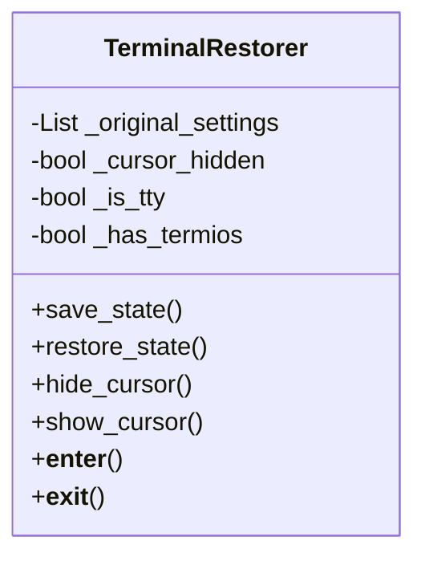
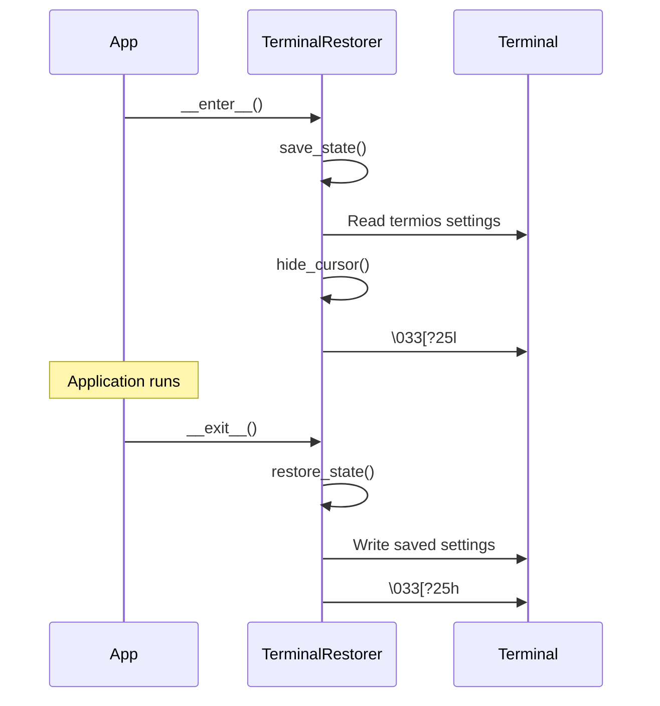

# Component Design: TerminalRestorer

Created: 2025-12-29

---

## Table of Contents

- [1.0 Document Information](<#1.0 document information>)
- [2.0 Component Overview](<#2.0 component overview>)
- [3.0 Class Design](<#3.0 class design>)
- [4.0 Method Specifications](<#4.0 method specifications>)
- [5.0 Visual Documentation](<#5.0 visual documentation>)
- [Version History](<#version history>)

---

## 1.0 Document Information

```yaml
document_info:
  document_id: "design-d6e7f8a9-component_utils_terminal_restorer"
  tier: 3
  domain: "Utilities"
  component: "TerminalRestorer"
  parent: "design-9a1f3c7e-domain_utils.md"
  source_file: "src/gtach/utils/terminal.py"
  version: "1.0"
  date: "2025-12-29"
  author: "William Watson"
```

### 1.1 Parent Reference

- **Domain Design**: [design-9a1f3c7e-domain_utils.md](<design-9a1f3c7e-domain_utils.md>)

[Return to Table of Contents](<#table of contents>)

---

## 2.0 Component Overview

### 2.1 Purpose

TerminalRestorer manages terminal state for framebuffer applications, saving and restoring cursor visibility, echo settings, and other terminal attributes.

### 2.2 Responsibilities

1. Save terminal state before framebuffer takeover
2. Hide cursor during graphical display
3. Restore terminal state on application exit
4. Handle platforms without termios gracefully

### 2.3 Context

When Pygame takes over the framebuffer, terminal state can be corrupted. TerminalRestorer ensures the console returns to a usable state after application exit.

[Return to Table of Contents](<#table of contents>)

---

## 3.0 Class Design

### 3.1 TerminalRestorer Class

```python
class TerminalRestorer:
    """Terminal state manager for framebuffer applications."""
```

### 3.2 Constructor

```python
def __init__(self) -> None:
    """Initialize terminal restorer.
    
    Saves current terminal state if available.
    No-op on platforms without termios.
    """
```

### 3.3 Attributes

| Attribute | Type | Purpose |
|-----------|------|---------|
| `_original_settings` | `Optional[List]` | Saved termios settings |
| `_cursor_hidden` | `bool` | Cursor visibility state |
| `_is_tty` | `bool` | Running in terminal |
| `_has_termios` | `bool` | termios available |

[Return to Table of Contents](<#table of contents>)

---

## 4.0 Method Specifications

### 4.1 save_state

```python
def save_state(self) -> None:
    """Save current terminal state.
    
    Saves:
        - termios settings (if available)
        - Cursor visibility
    
    No-op if not a TTY or termios unavailable.
    """
```

### 4.2 restore_state

```python
def restore_state(self) -> None:
    """Restore saved terminal state.
    
    Restores:
        - termios settings
        - Shows cursor if hidden
    
    Best-effort: logs errors but doesn't raise.
    """
```

### 4.3 hide_cursor / show_cursor

```python
def hide_cursor(self) -> None:
    """Hide terminal cursor.
    
    Uses ANSI escape sequence: \033[?25l
    """

def show_cursor(self) -> None:
    """Show terminal cursor.
    
    Uses ANSI escape sequence: \033[?25h
    """
```

### 4.4 Context Manager

```python
def __enter__(self) -> 'TerminalRestorer':
    """Enter context: save state, hide cursor."""
    self.save_state()
    self.hide_cursor()
    return self

def __exit__(self, exc_type, exc_val, exc_tb) -> None:
    """Exit context: restore state."""
    self.restore_state()
```

[Return to Table of Contents](<#table of contents>)

---

## 5.0 Visual Documentation

### 5.1 Class Diagram



### 5.2 Usage Flow



[Return to Table of Contents](<#table of contents>)

---

## Version History

| Version | Date | Author | Changes |
|---------|------|--------|---------|
| 1.0 | 2025-12-29 | William Watson | Initial component design document |

---

Copyright (c) 2025 William Watson. This work is licensed under the MIT License.
