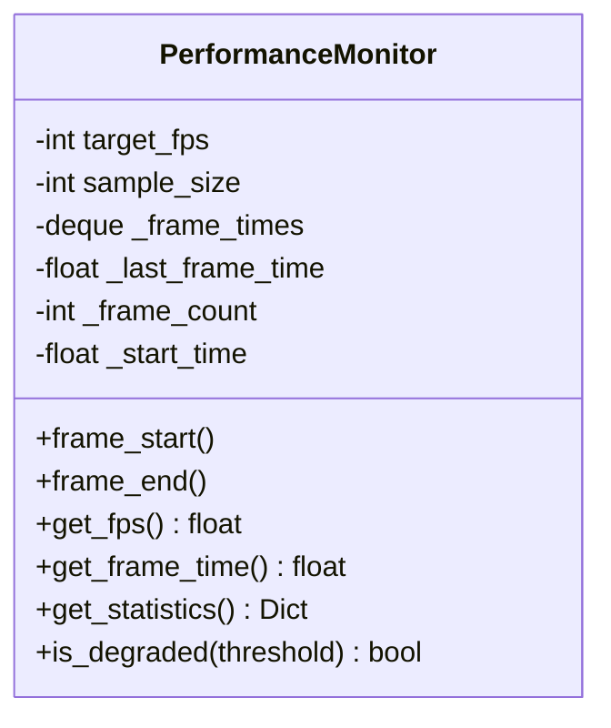

# Component Design: PerformanceMonitor

Created: 2025-12-29

---

## Table of Contents

- [1.0 Document Information](<#1.0 document information>)
- [2.0 Component Overview](<#2.0 component overview>)
- [3.0 Class Design](<#3.0 class design>)
- [4.0 Method Specifications](<#4.0 method specifications>)
- [5.0 Visual Documentation](<#5.0 visual documentation>)
- [Version History](<#version history>)

---

## 1.0 Document Information

```yaml
document_info:
  document_id: "design-e1f2a3b4-component_display_performance_monitor"
  tier: 3
  domain: "Display"
  component: "PerformanceMonitor"
  parent: "design-2c6b8e4d-domain_display.md"
  source_file: "src/gtach/display/performance.py"
  version: "1.0"
  date: "2025-12-29"
  author: "William Watson"
```

### 1.1 Parent Reference

- **Domain Design**: [design-2c6b8e4d-domain_display.md](<design-2c6b8e4d-domain_display.md>)

[Return to Table of Contents](<#table of contents>)

---

## 2.0 Component Overview

### 2.1 Purpose

PerformanceMonitor tracks display performance metrics including frames per second (FPS) and frame timing statistics for diagnostics and optimization.

### 2.2 Responsibilities

1. Track frame timestamps
2. Calculate rolling average FPS
3. Track min/max/average frame times
4. Detect performance degradation
5. Provide metrics for diagnostics overlay

[Return to Table of Contents](<#table of contents>)

---

## 3.0 Class Design

### 3.1 PerformanceMonitor Class

```python
class PerformanceMonitor:
    """Display performance metrics tracker."""
```

### 3.2 Constructor

```python
def __init__(self, 
             target_fps: int = 60,
             sample_size: int = 60) -> None:
    """Initialize performance monitor.
    
    Args:
        target_fps: Target frame rate for comparison
        sample_size: Number of frames for rolling average
    """
```

### 3.3 Attributes

| Attribute | Type | Purpose |
|-----------|------|---------|
| `target_fps` | `int` | Expected frame rate |
| `sample_size` | `int` | Rolling window size |
| `_frame_times` | `deque` | Recent frame durations |
| `_last_frame_time` | `float` | Previous frame timestamp |
| `_frame_count` | `int` | Total frames rendered |
| `_start_time` | `float` | Monitor start timestamp |

[Return to Table of Contents](<#table of contents>)

---

## 4.0 Method Specifications

### 4.1 frame_start / frame_end

```python
def frame_start(self) -> None:
    """Mark frame start for timing."""

def frame_end(self) -> None:
    """Mark frame end and record duration.
    
    Calculates frame duration and adds to rolling buffer.
    """
```

### 4.2 get_fps

```python
def get_fps(self) -> float:
    """Get current frames per second.
    
    Returns:
        Rolling average FPS (0 if no frames)
    
    Calculation:
        FPS = sample_size / sum(frame_times)
    """
```

### 4.3 get_frame_time

```python
def get_frame_time(self) -> float:
    """Get average frame time in milliseconds."""
```

### 4.4 get_statistics

```python
def get_statistics(self) -> Dict[str, Any]:
    """Get comprehensive performance statistics.
    
    Returns:
        Dict with:
            - fps: Current FPS
            - target_fps: Target FPS
            - frame_time_avg: Average frame time (ms)
            - frame_time_min: Minimum frame time (ms)
            - frame_time_max: Maximum frame time (ms)
            - frame_count: Total frames
            - uptime: Seconds since start
            - performance_ratio: fps / target_fps
    """
```

### 4.5 is_degraded

```python
def is_degraded(self, threshold: float = 0.8) -> bool:
    """Check if performance is degraded.
    
    Args:
        threshold: Ratio below which considered degraded
    
    Returns:
        True if fps < target_fps * threshold
    """
```

[Return to Table of Contents](<#table of contents>)

---

## 5.0 Visual Documentation

### 5.1 Class Diagram



[Return to Table of Contents](<#table of contents>)

---

## Version History

| Version | Date | Author | Changes |
|---------|------|--------|---------|
| 1.0 | 2025-12-29 | William Watson | Initial component design document |

---

Copyright (c) 2025 William Watson. This work is licensed under the MIT License.
