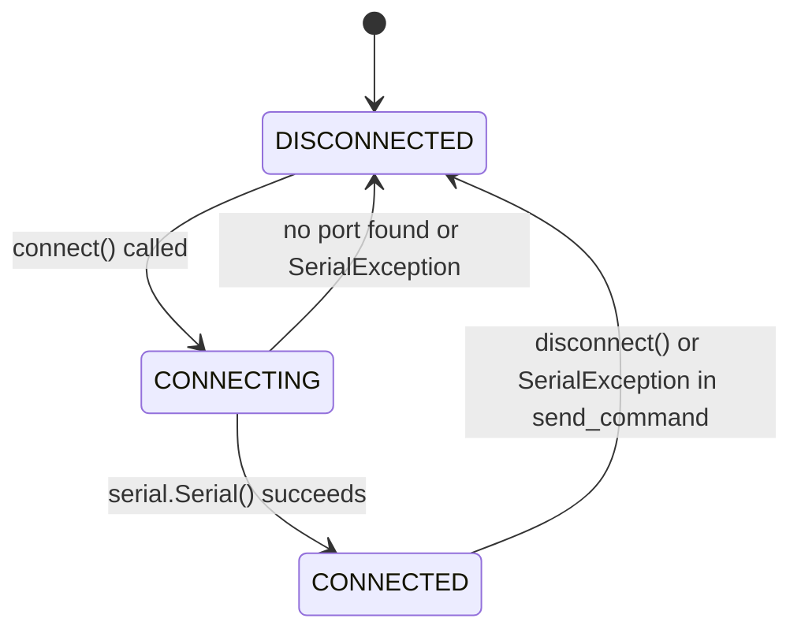
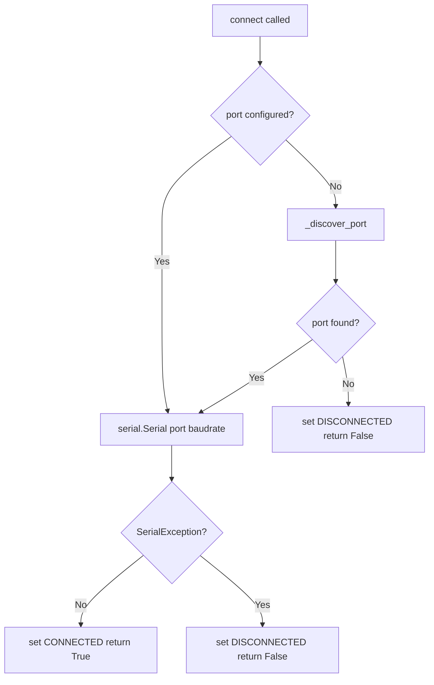

# Component Design: SerialTransport

Created: 2026 March 24

---

## Table of Contents

- [1.0 Document Information](<#1.0 document information>)
- [2.0 Component Overview](<#2.0 component overview>)
- [3.0 File Location](<#3.0 file location>)
- [4.0 Elements](<#4.0 elements>)
- [5.0 Interfaces](<#5.0 interfaces>)
- [6.0 Data Design](<#6.0 data design>)
- [7.0 Error Handling](<#7.0 error handling>)
- [8.0 Visual Documentation](<#8.0 visual documentation>)
- [9.0 Element Registry](<#9.0 element registry>)
- [Version History](<#version history>)

---

## 1.0 Document Information

```yaml
document_info:
  document_id: "design-e4f5a6b7-component_comm_serial_transport"
  tier: 3
  domain: "Communication"
  parent: "design-7d3e9f5a-domain_comm.md"
  version: "1.0"
  date: "2026-03-24"
  author: "William Watson"
```

### 1.1 Parent Reference

- **Domain Design**: [design-7d3e9f5a-domain_comm.md](<design-7d3e9f5a-domain_comm.md>)
- **Interface Contract**: [design-b1c2d3e4-component_comm_transport.md](<design-b1c2d3e4-component_comm_transport.md>)

[Return to Table of Contents](<#table of contents>)

---

## 2.0 Component Overview

### 2.1 Purpose

Implements `OBDTransport` using `pyserial` for serial port communication. Used on macOS to connect to a Bluetooth-paired ELM327 adapter (presenting as `/dev/tty.*`) or the Pi 4 SPP emulator. Supports explicit port configuration or automatic port discovery.

### 2.2 Responsibilities

1. Open and manage a `serial.Serial` connection to a configured or auto-discovered port
2. Send AT/OBD command strings and read responses up to the ELM327 prompt character (`>`)
3. Detect connection loss and signal state transition to `DISCONNECTED`
4. Retry connection indefinitely via `reconnect_indefinitely()` inherited from `OBDTransport`
5. Auto-discover ELM327 serial port on macOS if no port is explicitly configured

[Return to Table of Contents](<#table of contents>)

---

## 3.0 File Location

```yaml
file: "src/gtach/comm/serial_transport.py"
status: "New — does not exist in current source"
exports:
  - "SerialTransport"
dependencies:
  external:
    - "pyserial (serial)"
```

[Return to Table of Contents](<#table of contents>)

---

## 4.0 Elements

### 4.1 SerialTransport

```yaml
element:
  name: "SerialTransport"
  type: "class"
  base: "OBDTransport"

  constructor:
    signature: "__init__(self, port: Optional[str] = None, baudrate: int = 38400, retry_delay: float = 5.0) -> None"
    parameters:
      - name: "port"
        type: "Optional[str]"
        default: "None"
        description: "Serial device path (e.g. '/dev/tty.OBDII'). None triggers auto-discovery."
      - name: "baudrate"
        type: "int"
        default: 38400
        description: "ELM327 default baud rate"
      - name: "retry_delay"
        type: "float"
        default: 5.0
        description: "Seconds to wait between reconnect attempts"

  attributes:
    - name: "_port"
      type: "Optional[str]"
      purpose: "Configured port path; None uses auto-discovery on each connect attempt"
    - name: "_baudrate"
      type: "int"
    - name: "_retry_delay"
      type: "float"
    - name: "_serial"
      type: "Optional[serial.Serial]"
      purpose: "Active serial connection; None when disconnected"
    - name: "_state"
      type: "TransportState"
      purpose: "Current connection state; protected by _lock"

  methods:
    - name: "_discover_port"
      signature: "_discover_port(self) -> Optional[str]"
      processing_logic:
        - "Import serial.tools.list_ports"
        - "Iterate list_ports.comports()"
        - "Return first port where device or description contains 'ELM', 'OBD', or 'OBDII' (case-insensitive)"
        - "Return None if no match found"

    - name: "connect"
      signature: "connect(self) -> bool"
      processing_logic:
        - "Acquire _lock; set _state = CONNECTING"
        - "Resolve port: use self._port if set, else call _discover_port()"
        - "If no port resolved: set _state = DISCONNECTED; return False"
        - "serial.Serial(port, baudrate=self._baudrate, timeout=2)"
        - "On success: set _state = CONNECTED; store _serial; return True"
        - "On serial.SerialException: set _state = DISCONNECTED; return False"

    - name: "disconnect"
      signature: "disconnect(self) -> None"
      processing_logic:
        - "Set _shutdown event"
        - "Close _serial under _lock; set to None"
        - "Set _state = DISCONNECTED"

    - name: "send_command"
      signature: "send_command(self, command: str, timeout: float = 2.0) -> Optional[str]"
      processing_logic:
        - "Check is_connected(); return None if not"
        - "Encode command: (command.strip() + '\\r').encode('ascii')"
        - "self._serial.write(encoded)"
        - "self._serial.timeout = timeout"
        - "Read via self._serial.read_until(b'>') — returns bytes up to and including '>'"
        - "Decode; strip prompt and whitespace; return string"
        - "On serial.SerialException: set _state = DISCONNECTED; return None"
        - "On serial.SerialTimeoutException: return None"

    - name: "is_connected"
      signature: "is_connected(self) -> bool"
      processing_logic:
        - "Return _state == TransportState.CONNECTED under _lock"

    - name: "state (property)"
      signature: "state(self) -> TransportState"
      processing_logic:
        - "Return _state under _lock"
```

[Return to Table of Contents](<#table of contents>)

---

## 5.0 Interfaces

```python
from typing import Optional
import serial
from .transport import OBDTransport, TransportState

class SerialTransport(OBDTransport):

    def __init__(self, port: Optional[str] = None,
                 baudrate: int = 38400,
                 retry_delay: float = 5.0) -> None: ...

    def connect(self) -> bool: ...

    def disconnect(self) -> None: ...

    def send_command(self, command: str,
                     timeout: float = 2.0) -> Optional[str]: ...

    def is_connected(self) -> bool: ...

    @property
    def state(self) -> TransportState: ...

    def _discover_port(self) -> Optional[str]: ...
```

[Return to Table of Contents](<#table of contents>)

---

## 6.0 Data Design

### 6.1 Serial Parameters

| Parameter | Value | Notes |
|-----------|-------|-------|
| Baud rate | 38400 | ELM327 default |
| `serial.Serial` timeout | 2 s (constructor) | Overridden per `send_command` call |
| Read method | `read_until(b'>')` | pyserial built-in; reads to prompt |
| Encoding | ASCII | |

### 6.2 Port Auto-Discovery Criteria

| Match Criterion | Examples |
|-----------------|---------|
| Device path contains keyword | `/dev/tty.ELM327`, `/dev/tty.OBDII` |
| Port description contains keyword | `ELM327 Bluetooth`, `OBD-II Adapter` |
| Keywords (case-insensitive) | `ELM`, `OBD`, `OBDII` |

[Return to Table of Contents](<#table of contents>)

---

## 7.0 Error Handling

| Condition | Handling |
|-----------|----------|
| No port configured and auto-discovery finds nothing | Log warning; set DISCONNECTED; return False from connect() |
| `serial.SerialException` on connect | Set DISCONNECTED; return False |
| `serial.SerialException` on send_command | Set DISCONNECTED; return None |
| `serial.SerialTimeoutException` on read | Return None; state remains CONNECTED |
| `send_command()` called when not CONNECTED | Return None immediately |
| `pyserial` not installed | `ImportError` at module import; log error |

### 7.1 Logging

```yaml
logger_name: "SerialTransport"
log_levels:
  DEBUG: "send_command input/output, discovered port"
  INFO: "connect success (port), disconnect"
  WARNING: "port not found, connect failed (pre-retry)"
  ERROR: "SerialException detail"
```

[Return to Table of Contents](<#table of contents>)

---

## 8.0 Visual Documentation

### 8.1 Connection State Transitions



### 8.2 connect() Flow



[Return to Table of Contents](<#table of contents>)

---

## 9.0 Element Registry

```yaml
modules:
  - name: "gtach.comm.serial_transport"
    path: "src/gtach/comm/serial_transport.py"
    package: "gtach.comm"

classes:
  - name: "SerialTransport"
    module: "gtach.comm.serial_transport"
    base_classes: ["gtach.comm.transport.OBDTransport"]
```

[Return to Table of Contents](<#table of contents>)

---

## Version History

| Version | Date | Author | Changes |
|---------|------|--------|---------|
| 1.0 | 2026-03-24 | William Watson | Initial component design |

---

Copyright (c) 2025 William Watson. This work is licensed under the MIT License.
