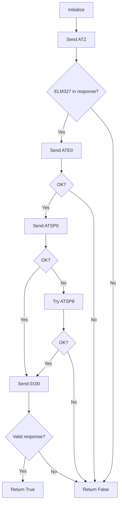
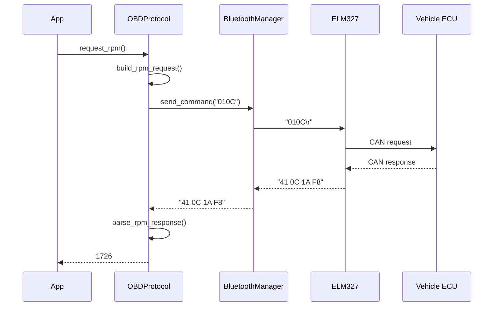

# Component Design: OBDProtocol

Created: 2025-12-29

---

## Table of Contents

- [1.0 Document Information](<#1.0 document information>)
- [2.0 Component Overview](<#2.0 component overview>)
- [3.0 Class Design](<#3.0 class design>)
- [4.0 Method Specifications](<#4.0 method specifications>)
- [5.0 Protocol Details](<#5.0 protocol details>)
- [6.0 Error Handling](<#6.0 error handling>)
- [7.0 Visual Documentation](<#7.0 visual documentation>)
- [Version History](<#version history>)

---

## 1.0 Document Information

```yaml
document_info:
  document_id: "design-e5f6a7b8-component_comm_obd_protocol"
  tier: 3
  domain: "Communication"
  component: "OBDProtocol"
  parent: "design-7d3e9f5a-domain_comm.md"
  source_file: "src/gtach/comm/obd.py"
  version: "1.0"
  date: "2025-12-29"
  author: "William Watson"
```

### 1.1 Parent Reference

- **Domain Design**: [design-7d3e9f5a-domain_comm.md](<design-7d3e9f5a-domain_comm.md>)

[Return to Table of Contents](<#table of contents>)

---

## 2.0 Component Overview

### 2.1 Purpose

OBDProtocol handles ELM327 adapter initialization and OBD-II PID request/response parsing. It encapsulates the AT command sequences and response format knowledge for communicating with vehicle ECUs.

### 2.2 Responsibilities

1. Initialize ELM327 adapter with AT commands
2. Build OBD-II PID request commands
3. Parse OBD-II responses to extract data
4. Calculate RPM from PID 0x0C response
5. Handle protocol auto-detection (ATSP0) and fallback (ATSP8)

### 2.3 OBD-II Context

OBD-II (On-Board Diagnostics II) is a standardized vehicle diagnostic system. ELM327 is a popular interpreter chip that translates serial commands to OBD-II protocols.

[Return to Table of Contents](<#table of contents>)

---

## 3.0 Class Design

### 3.1 OBDProtocol Class

```python
class OBDProtocol:
    """ELM327/OBD-II protocol handler.
    
    Manages adapter initialization and response parsing
    for vehicle telemetry retrieval.
    """
```

### 3.2 Constructor

```python
def __init__(self, config: Optional[OBDConfig] = None) -> None:
    """Initialize protocol handler.
    
    Args:
        config: Optional configuration (uses defaults if None)
    
    Attributes:
        config: OBDConfig with timeout/retry settings
        _initialized: Flag indicating successful init
        logger: Logger instance
    """
```

### 3.3 Class Constants

```python
# ELM327 AT Commands
CMD_RESET = "ATZ"           # Reset adapter
CMD_ECHO_OFF = "ATE0"       # Disable echo
CMD_PROTOCOL_AUTO = "ATSP0" # Auto-detect protocol
CMD_PROTOCOL_ISO = "ATSP8"  # Force ISO 15765-4 CAN

# OBD-II PIDs (Mode 01 - Current Data)
PID_RPM = "010C"            # Engine RPM
PID_SPEED = "010D"          # Vehicle speed
PID_COOLANT = "0105"        # Coolant temperature

# Response markers
PROMPT = ">"                # Ready for command
OK = "OK"                   # Command success
ERROR_MARKERS = ["?", "ERROR", "UNABLE", "NO DATA"]
```

[Return to Table of Contents](<#table of contents>)

---

## 4.0 Method Specifications

### 4.1 initialize

```python
async def initialize(self, 
                     send_command: Callable[[str], Awaitable[str]]) -> bool:
    """Initialize ELM327 adapter.
    
    Args:
        send_command: Async function to send commands
    
    Returns:
        True if initialization successful
    
    Algorithm:
        1. Send ATZ (reset)
           - Wait for "ELM327" in response
        2. Send ATE0 (echo off)
           - Wait for "OK"
        3. Send ATSP0 (auto protocol)
           - Wait for "OK"
        4. If ATSP0 fails, try ATSP8 (ISO CAN)
        5. Send test PID (0100) to verify
        6. Set _initialized = True
        7. Return True
    
    Error Handling:
        On any failure: log error, return False
    """
```

### 4.2 build_rpm_request

```python
def build_rpm_request(self) -> str:
    """Build RPM request command.
    
    Returns:
        "010C" - Mode 01, PID 0C
    """
```

### 4.3 parse_rpm_response

```python
def parse_rpm_response(self, response: str) -> Optional[int]:
    """Parse RPM from OBD-II response.
    
    Args:
        response: Raw response string from adapter
    
    Returns:
        RPM value or None on parse error
    
    Response Format:
        "41 0C XX YY" where:
        - 41: Mode 01 response (40 + mode)
        - 0C: PID
        - XX: High byte (A)
        - YY: Low byte (B)
    
    Calculation:
        RPM = ((A * 256) + B) / 4
    
    Algorithm:
        1. Strip whitespace and prompt
        2. Check for error markers
        3. Extract hex bytes after "41 0C"
        4. Convert A, B to integers
        5. Apply formula: ((A * 256) + B) / 4
        6. Return RPM as integer
    
    Error Handling:
        On parse error: log warning, return None
    """
```

### 4.4 parse_response

```python
def parse_response(self, response: str, expected_pid: str) -> OBDResponse:
    """Generic response parser.
    
    Args:
        response: Raw response string
        expected_pid: Expected PID (e.g., "0C")
    
    Returns:
        OBDResponse with parsed data or error
    
    Algorithm:
        1. Clean response (strip, remove echo)
        2. Check for error markers
        3. Verify response header (41 + PID)
        4. Extract data bytes
        5. Return OBDResponse
    """
```

### 4.5 is_error_response

```python
def is_error_response(self, response: str) -> bool:
    """Check if response indicates error.
    
    Args:
        response: Response string to check
    
    Returns:
        True if response contains error marker
    
    Error Markers:
        "?", "ERROR", "UNABLE TO CONNECT", "NO DATA",
        "BUS INIT", "STOPPED", "CAN ERROR"
    """
```

[Return to Table of Contents](<#table of contents>)

---

## 5.0 Protocol Details

### 5.1 ELM327 Initialization Sequence

```
Step 1: ATZ (Reset)
  Send: "ATZ\r"
  Expect: "ELM327 v1.5" (version varies)
  Purpose: Reset adapter to known state

Step 2: ATE0 (Echo Off)
  Send: "ATE0\r"
  Expect: "OK"
  Purpose: Disable command echo for cleaner parsing

Step 3: ATSP0 (Auto Protocol)
  Send: "ATSP0\r"
  Expect: "OK"
  Purpose: Auto-detect vehicle protocol

Step 4: Protocol Verification
  Send: "0100\r" (Supported PIDs)
  Expect: "41 00 XX XX XX XX"
  Purpose: Verify communication with ECU
```

### 5.2 RPM Request/Response

```
Request:
  Command: "010C\r"
  Meaning: Mode 01 (current data), PID 0C (RPM)

Response:
  Format: "41 0C A B"
  - 41: Response to mode 01
  - 0C: PID echo
  - A: High byte (0-255)
  - B: Low byte (0-255)

Calculation:
  RPM = ((A × 256) + B) ÷ 4
  Range: 0 to 16,383.75 RPM
  Resolution: 0.25 RPM

Example:
  Response: "41 0C 1A F8"
  A = 0x1A = 26
  B = 0xF8 = 248
  RPM = ((26 × 256) + 248) ÷ 4
  RPM = (6656 + 248) ÷ 4
  RPM = 6904 ÷ 4
  RPM = 1726
```

### 5.3 Supported Protocols (ATSP)

| Code | Protocol |
|------|----------|
| 0 | Auto detect |
| 1 | SAE J1850 PWM |
| 2 | SAE J1850 VPW |
| 3 | ISO 9141-2 |
| 4 | ISO 14230-4 KWP (5 baud) |
| 5 | ISO 14230-4 KWP (fast) |
| 6 | ISO 15765-4 CAN (11 bit, 500 kbaud) |
| 7 | ISO 15765-4 CAN (29 bit, 500 kbaud) |
| 8 | ISO 15765-4 CAN (11 bit, 250 kbaud) |
| 9 | ISO 15765-4 CAN (29 bit, 250 kbaud) |

[Return to Table of Contents](<#table of contents>)

---

## 6.0 Error Handling

### 6.1 Error Responses

| Response | Meaning | Handling |
|----------|---------|----------|
| "?" | Unknown command | Check command syntax |
| "NO DATA" | No response from ECU | Retry or check connection |
| "UNABLE TO CONNECT" | Protocol mismatch | Try different ATSP |
| "BUS INIT: ...ERROR" | CAN bus error | Check vehicle ignition |
| "STOPPED" | User interrupted | Retry command |
| "CAN ERROR" | CAN communication error | Check wiring |

### 6.2 Retry Strategy

```python
async def request_with_retry(self, 
                             send_command: Callable,
                             command: str,
                             retries: int = 3) -> Optional[str]:
    """Send command with retries on failure."""
    for attempt in range(retries):
        response = await send_command(command)
        if response and not self.is_error_response(response):
            return response
        await asyncio.sleep(0.5 * (attempt + 1))
    return None
```

[Return to Table of Contents](<#table of contents>)

---

## 7.0 Visual Documentation

### 7.1 Initialization Flow



### 7.2 RPM Request Flow



[Return to Table of Contents](<#table of contents>)

---

## Version History

| Version | Date | Author | Changes |
|---------|------|--------|---------|
| 1.0 | 2025-12-29 | William Watson | Initial component design document |

---

Copyright (c) 2025 William Watson. This work is licensed under the MIT License.
