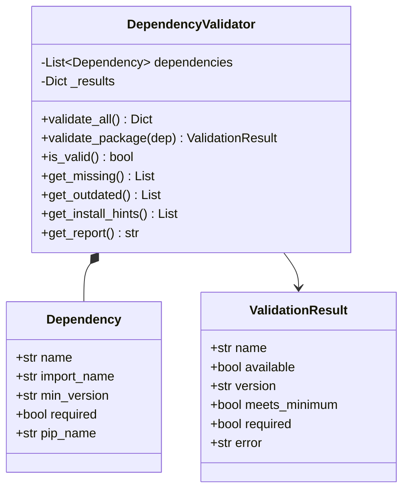

# Component Design: DependencyValidator

Created: 2025-12-29

---

## Table of Contents

- [1.0 Document Information](<#1.0 document information>)
- [2.0 Component Overview](<#2.0 component overview>)
- [3.0 Class Design](<#3.0 class design>)
- [4.0 Method Specifications](<#4.0 method specifications>)
- [5.0 Dependency Definitions](<#5.0 dependency definitions>)
- [6.0 Visual Documentation](<#6.0 visual documentation>)
- [Version History](<#version history>)

---

## 1.0 Document Information

```yaml
document_info:
  document_id: "design-e7f8a9b0-component_utils_dependency_validator"
  tier: 3
  domain: "Utilities"
  component: "DependencyValidator"
  parent: "design-9a1f3c7e-domain_utils.md"
  source_file: "src/gtach/utils/dependencies.py"
  version: "1.0"
  date: "2025-12-29"
  author: "William Watson"
```

### 1.1 Parent Reference

- **Domain Design**: [design-9a1f3c7e-domain_utils.md](<design-9a1f3c7e-domain_utils.md>)

[Return to Table of Contents](<#table of contents>)

---

## 2.0 Component Overview

### 2.1 Purpose

DependencyValidator checks runtime availability and version requirements for Python packages, providing validation reports and installation hints.

### 2.2 Responsibilities

1. Check package availability via importlib
2. Verify minimum version requirements
3. Generate validation reports
4. Distinguish required vs optional packages
5. Provide installation hints (pip commands)

[Return to Table of Contents](<#table of contents>)

---

## 3.0 Class Design

### 3.1 DependencyValidator Class

```python
class DependencyValidator:
    """Python package dependency checker."""
```

### 3.2 Constructor

```python
def __init__(self, 
             dependencies: Optional[List[Dependency]] = None) -> None:
    """Initialize with dependency list.
    
    Args:
        dependencies: List of Dependency specs (uses defaults if None)
    """
```

### 3.3 Attributes

| Attribute | Type | Purpose |
|-----------|------|---------|
| `dependencies` | `List[Dependency]` | Package specifications |
| `_results` | `Dict[str, ValidationResult]` | Check results |

### 3.4 Dependency Dataclass

```python
@dataclass
class Dependency:
    """Package dependency specification."""
    name: str                        # Package name
    import_name: Optional[str] = None  # Import name if different
    min_version: Optional[str] = None  # Minimum version
    required: bool = True            # Required vs optional
    pip_name: Optional[str] = None   # pip install name if different
```

### 3.5 ValidationResult Dataclass

```python
@dataclass
class ValidationResult:
    """Validation result for a dependency."""
    name: str
    available: bool
    version: Optional[str] = None
    meets_minimum: bool = True
    required: bool = True
    error: Optional[str] = None
```

[Return to Table of Contents](<#table of contents>)

---

## 4.0 Method Specifications

### 4.1 validate_all

```python
def validate_all(self) -> Dict[str, ValidationResult]:
    """Validate all dependencies.
    
    Returns:
        Dict mapping package name to ValidationResult
    """
```

### 4.2 validate_package

```python
def validate_package(self, dep: Dependency) -> ValidationResult:
    """Validate single package.
    
    Algorithm:
        1. Try importlib.util.find_spec()
        2. If not found: return unavailable result
        3. Try to get version via pkg_resources or __version__
        4. Compare against min_version if specified
        5. Return result
    """
```

### 4.3 is_valid

```python
def is_valid(self) -> bool:
    """Check if all required dependencies are satisfied.
    
    Returns:
        True if all required packages available and meet version
    """
```

### 4.4 get_missing

```python
def get_missing(self) -> List[str]:
    """Get list of missing required packages."""
```

### 4.5 get_outdated

```python
def get_outdated(self) -> List[Tuple[str, str, str]]:
    """Get outdated packages.
    
    Returns:
        List of (name, current_version, required_version)
    """
```

### 4.6 get_install_hints

```python
def get_install_hints(self) -> List[str]:
    """Get pip install commands for missing/outdated.
    
    Returns:
        List of pip install command strings
    
    Example:
        ["pip install bleak>=0.20.0", "pip install pygame"]
    """
```

### 4.7 get_report

```python
def get_report(self) -> str:
    """Get formatted validation report.
    
    Returns:
        Multi-line report string
    """
```

[Return to Table of Contents](<#table of contents>)

---

## 5.0 Dependency Definitions

### 5.1 Default Dependencies

```python
DEFAULT_DEPENDENCIES = [
    Dependency("pygame", min_version="2.0.0", required=True),
    Dependency("bleak", min_version="0.20.0", required=True),
    Dependency("pyyaml", import_name="yaml", required=False),
]
```

### 5.2 Version Comparison

```python
def _compare_versions(self, current: str, required: str) -> bool:
    """Compare version strings.
    
    Handles: "2.1.0", "2.1", "2"
    Returns: True if current >= required
    """
```

[Return to Table of Contents](<#table of contents>)

---

## 6.0 Visual Documentation

### 6.1 Class Diagram



[Return to Table of Contents](<#table of contents>)

---

## Version History

| Version | Date | Author | Changes |
|---------|------|--------|---------|
| 1.0 | 2025-12-29 | William Watson | Initial component design document |

---

Copyright (c) 2025 William Watson. This work is licensed under the MIT License.
