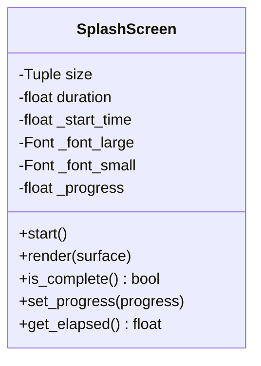

# Component Design: SplashScreen

Created: 2025-12-29

---

## Table of Contents

- [1.0 Document Information](<#1.0 document information>)
- [2.0 Component Overview](<#2.0 component overview>)
- [3.0 Class Design](<#3.0 class design>)
- [4.0 Method Specifications](<#4.0 method specifications>)
- [5.0 Visual Design](<#5.0 visual design>)
- [6.0 Visual Documentation](<#6.0 visual documentation>)
- [Version History](<#version history>)

---

## 1.0 Document Information

```yaml
document_info:
  document_id: "design-f2a3b4c5-component_display_splash_screen"
  tier: 3
  domain: "Display"
  component: "SplashScreen"
  parent: "design-2c6b8e4d-domain_display.md"
  source_file: "src/gtach/display/splash.py"
  version: "1.0"
  date: "2025-12-29"
  author: "William Watson"
```

### 1.1 Parent Reference

- **Domain Design**: [design-2c6b8e4d-domain_display.md](<design-2c6b8e4d-domain_display.md>)

[Return to Table of Contents](<#table of contents>)

---

## 2.0 Component Overview

### 2.1 Purpose

SplashScreen displays an automotive-themed startup animation during application initialization with optional loading progress.

### 2.2 Responsibilities

1. Render branded splash screen
2. Display application name and version
3. Show loading progress (optional)
4. Track display duration
5. Signal completion for mode transition

[Return to Table of Contents](<#table of contents>)

---

## 3.0 Class Design

### 3.1 SplashScreen Class

```python
class SplashScreen:
    """Automotive-themed startup splash screen."""
```

### 3.2 Constructor

```python
def __init__(self, 
             size: Tuple[int, int] = (480, 480),
             duration: float = 4.0) -> None:
    """Initialize splash screen.
    
    Args:
        size: Display dimensions
        duration: Display duration in seconds
    """
```

### 3.3 Attributes

| Attribute | Type | Purpose |
|-----------|------|---------|
| `size` | `Tuple[int, int]` | Display dimensions |
| `duration` | `float` | Display time (seconds) |
| `_start_time` | `float` | Animation start timestamp |
| `_font_large` | `pygame.Font` | Title font |
| `_font_small` | `pygame.Font` | Version font |
| `_progress` | `float` | Loading progress (0-1) |

[Return to Table of Contents](<#table of contents>)

---

## 4.0 Method Specifications

### 4.1 start

```python
def start(self) -> None:
    """Start splash screen timer."""
```

### 4.2 render

```python
def render(self, surface: pygame.Surface) -> None:
    """Render splash screen.
    
    Elements:
        1. Dark background
        2. Centered "GTach" title
        3. Version text below
        4. Optional loading bar
        5. Subtle animation effects
    """
```

### 4.3 is_complete

```python
def is_complete(self) -> bool:
    """Check if splash duration elapsed.
    
    Returns:
        True if elapsed time >= duration
    """
```

### 4.4 set_progress

```python
def set_progress(self, progress: float) -> None:
    """Set loading progress.
    
    Args:
        progress: Value between 0.0 and 1.0
    """
```

### 4.5 get_elapsed

```python
def get_elapsed(self) -> float:
    """Get elapsed time since start."""
```

[Return to Table of Contents](<#table of contents>)

---

## 5.0 Visual Design

### 5.1 Layout

```
┌─────────────────────────────┐
│                             │
│                             │
│          ┌─────┐            │
│          │LOGO │            │
│          └─────┘            │
│                             │
│           GTach             │
│                             │
│        v0.1.0-alpha         │
│                             │
│    ═══════════════════      │
│    [  Loading Bar   ]       │
│                             │
└─────────────────────────────┘
```

### 5.2 Colors

```python
SPLASH_COLORS = {
    'background': (10, 10, 15),    # Near black
    'title': (255, 255, 255),      # White
    'version': (128, 128, 128),    # Gray
    'progress_bg': (40, 40, 40),   # Dark gray
    'progress_fg': (0, 200, 100),  # Green
}
```

[Return to Table of Contents](<#table of contents>)

---

## 6.0 Visual Documentation

### 6.1 Class Diagram



[Return to Table of Contents](<#table of contents>)

---

## Version History

| Version | Date | Author | Changes |
|---------|------|--------|---------|
| 1.0 | 2025-12-29 | William Watson | Initial component design document |

---

Copyright (c) 2025 William Watson. This work is licensed under the MIT License.
