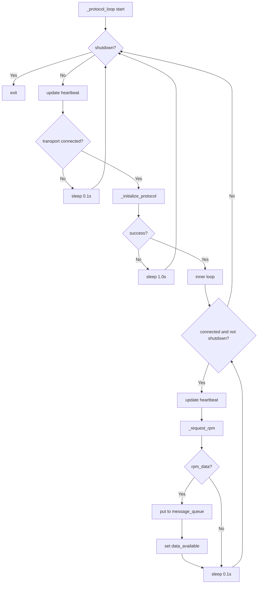

# Component Design: OBDProtocol

Created: 2026 March 24

---

## Table of Contents

- [1.0 Document Information](<#1.0 document information>)
- [2.0 Component Overview](<#2.0 component overview>)
- [3.0 File Location](<#3.0 file location>)
- [4.0 Elements](<#4.0 elements>)
- [5.0 Interfaces](<#5.0 interfaces>)
- [6.0 Data Design](<#6.0 data design>)
- [7.0 Error Handling](<#7.0 error handling>)
- [8.0 Visual Documentation](<#8.0 visual documentation>)
- [9.0 Element Registry](<#9.0 element registry>)
- [Version History](<#version history>)

---

## 1.0 Document Information

```yaml
document_info:
  document_id: "design-f5a6b7c8-component_comm_obd_protocol"
  tier: 3
  domain: "Communication"
  parent: "design-7d3e9f5a-domain_comm.md"
  version: "1.0"
  date: "2026-03-24"
  author: "William Watson"
```

### 1.1 Parent Reference

- **Domain Design**: [design-7d3e9f5a-domain_comm.md](<design-7d3e9f5a-domain_comm.md>)
- **Interface Contract**: [design-b1c2d3e4-component_comm_transport.md](<design-b1c2d3e4-component_comm_transport.md>)

[Return to Table of Contents](<#table of contents>)

---

## 2.0 Component Overview

### 2.1 Purpose

Implements the ELM327 AT command initialisation sequence and OBD-II RPM data acquisition loop. Communicates exclusively through the `OBDTransport` interface, making it transport-agnostic. Delivers parsed `OBDResponse` objects to the Core domain via `ThreadManager.message_queue`.

### 2.2 Change from Existing Source

The existing `obd.py` imports and depends on `BluetoothManager`. This component redesign replaces that dependency with `OBDTransport`. The file `src/gtach/comm/obd.py` is updated in place; the `OBDResponse` dataclass is retained unchanged.

### 2.3 Responsibilities

1. Accept an `OBDTransport` instance; wait for it to reach CONNECTED state
2. Execute ELM327 initialisation sequence (`ATZ`, `ATE0`, `ATSP0`)
3. Run continuous RPM acquisition loop: send `010C`, parse response, enqueue `OBDResponse`
4. Register with `ThreadManager`; maintain heartbeat
5. Handle transport disconnection by waiting for reconnection before resuming

[Return to Table of Contents](<#table of contents>)

---

## 3.0 File Location

```yaml
file: "src/gtach/comm/obd.py"
status: "Existing — replace BluetoothManager dependency with OBDTransport"
exports:
  - "OBDProtocol"
  - "OBDResponse"
```

[Return to Table of Contents](<#table of contents>)

---

## 4.0 Elements

### 4.1 OBDResponse

```yaml
element:
  name: "OBDResponse"
  type: "dataclass"
  note: "Unchanged from existing implementation"

  fields:
    - name: "pid"
      type: "int"
      description: "OBD PID (e.g. 0x0C for RPM)"
    - name: "data"
      type: "bytes"
      description: "Raw response bytes (A, B pair for RPM)"
    - name: "timestamp"
      type: "float"
      description: "Unix timestamp of acquisition"
    - name: "error"
      type: "Optional[str]"
      default: "None"
      description: "Error message if parsing failed; None on success"
```

### 4.2 OBDProtocol

```yaml
element:
  name: "OBDProtocol"
  type: "class"

  constructor:
    signature: "__init__(self, transport: OBDTransport, thread_manager: ThreadManager) -> None"
    parameters:
      - name: "transport"
        type: "OBDTransport"
        description: "Concrete transport instance (RFCOMMTransport, SerialTransport, or TCPTransport)"
      - name: "thread_manager"
        type: "ThreadManager"
        description: "Core domain thread manager for registration and message queue"
    processing_logic:
      - "Store transport and thread_manager references"
      - "Create shutdown_event (threading.Event)"
      - "Create obd_thread (threading.Thread, target=_protocol_loop, name='OBDProtocol')"
      - "Register obd_thread with thread_manager"

  attributes:
    - name: "transport"
      type: "OBDTransport"
    - name: "thread_manager"
      type: "ThreadManager"
    - name: "shutdown_event"
      type: "threading.Event"
    - name: "obd_thread"
      type: "threading.Thread"
    - name: "PROMPT"
      type: "bytes"
      value: "b'>'"
    - name: "RPM_PID"
      type: "int"
      value: "0x0C"
    - name: "timeout"
      type: "float"
      value: "1.0"

  methods:
    - name: "start"
      signature: "start(self) -> None"
      processing_logic:
        - "obd_thread.start()"
        - "Log INFO 'OBD protocol handler started'"

    - name: "stop"
      signature: "stop(self) -> None"
      processing_logic:
        - "Set shutdown_event"
        - "obd_thread.join()"
        - "Log INFO 'OBD protocol handler stopped'"

    - name: "_protocol_loop"
      signature: "_protocol_loop(self) -> None"
      processing_logic:
        - "While not shutdown_event.is_set():"
        - "  Update heartbeat: thread_manager.update_heartbeat('obd_protocol')"
        - "  If not transport.is_connected(): sleep 0.1 s; continue"
        - "  Call _initialize_protocol(); if returns False: sleep 1.0 s; continue"
        - "  Inner loop while transport.is_connected() and not shutdown_event.is_set():"
        - "    Update heartbeat"
        - "    rpm_data = _request_rpm()"
        - "    If rpm_data: thread_manager.message_queue.put(rpm_data)"
        - "    If rpm_data: thread_manager.data_available.set()"
        - "    sleep 0.1 s"
        - "  On exception: log ERROR with traceback; sleep 1.0 s"

    - name: "_initialize_protocol"
      signature: "_initialize_protocol(self) -> bool"
      processing_logic:
        - "Send 'ATZ' via transport.send_command(); ignore response"
        - "Send 'ATE0' via transport.send_command()"
        - "Send 'ATSP0' via transport.send_command()"
        - "Send '0100' (supported PIDs); check response is not None and not '7F'"
        - "Return True on success; return False on None response or '7F' prefix"
        - "On exception: log error; return False"

    - name: "_request_rpm"
      signature: "_request_rpm(self) -> Optional[OBDResponse]"
      processing_logic:
        - "response = transport.send_command('010C', timeout=self.timeout)"
        - "If response is None: return None"
        - "Strip whitespace; check starts with '41' and length >= 8 chars"
        - "Parse: data = bytes.fromhex(response.replace(' ', ''))"
        - "Return OBDResponse(pid=RPM_PID, data=data[2:4], timestamp=time.time())"
        - "On ValueError (hex parse): log warning; return None"
```

[Return to Table of Contents](<#table of contents>)

---

## 5.0 Interfaces

```python
import threading
import time
from dataclasses import dataclass
from typing import Optional
from .transport import OBDTransport
from ..core import ThreadManager

@dataclass
class OBDResponse:
    pid: int
    data: bytes
    timestamp: float
    error: Optional[str] = None

class OBDProtocol:

    def __init__(self, transport: OBDTransport,
                 thread_manager: ThreadManager) -> None: ...

    def start(self) -> None: ...

    def stop(self) -> None: ...

    def _protocol_loop(self) -> None: ...

    def _initialize_protocol(self) -> bool: ...

    def _request_rpm(self) -> Optional[OBDResponse]: ...
```

[Return to Table of Contents](<#table of contents>)

---

## 6.0 Data Design

### 6.1 RPM Calculation

| Field | Source |
|-------|--------|
| PID request | `010C` |
| Expected response prefix | `41 0C` |
| Data bytes | A = response[2], B = response[3] |
| RPM formula | `((A * 256) + B) / 4` |

The `OBDResponse.data` field contains bytes A and B. RPM value calculation is performed by the Display domain consumer, not by `OBDProtocol`.

### 6.2 Initialisation Commands

| Command | Purpose |
|---------|---------|
| `ATZ` | Reset ELM327 |
| `ATE0` | Disable echo |
| `ATSP0` | Auto-select OBD protocol |

[Return to Table of Contents](<#table of contents>)

---

## 7.0 Error Handling

| Condition | Handling |
|-----------|----------|
| Transport not connected at loop start | Sleep 0.1 s; retry |
| `_initialize_protocol` returns False | Sleep 1.0 s; retry outer loop |
| `send_command` returns None | Return None from `_request_rpm`; outer loop continues |
| `0100` response is `7F` | Initialization failure; log error; return False |
| ValueError in hex parse | Log warning; return None from `_request_rpm` |
| Unhandled exception in protocol loop | Log ERROR with traceback; sleep 1.0 s; resume |

### 7.1 Logging

```yaml
logger_name: "OBDProtocol"
log_levels:
  DEBUG: "command/response detail"
  INFO: "started, stopped, protocol initialized"
  WARNING: "parse failure, None response"
  ERROR: "initialization failure, unhandled exception (with traceback)"
```

[Return to Table of Contents](<#table of contents>)

---

## 8.0 Visual Documentation

### 8.1 Protocol Loop



[Return to Table of Contents](<#table of contents>)

---

## 9.0 Element Registry

```yaml
modules:
  - name: "gtach.comm.obd"
    path: "src/gtach/comm/obd.py"
    package: "gtach.comm"

classes:
  - name: "OBDResponse"
    module: "gtach.comm.obd"
    base_classes: []
  - name: "OBDProtocol"
    module: "gtach.comm.obd"
    base_classes: []

functions:
  - name: "_protocol_loop"
    module: "gtach.comm.obd"
    signature: "_protocol_loop(self) -> None"
  - name: "_initialize_protocol"
    module: "gtach.comm.obd"
    signature: "_initialize_protocol(self) -> bool"
  - name: "_request_rpm"
    module: "gtach.comm.obd"
    signature: "_request_rpm(self) -> Optional[OBDResponse]"
```

[Return to Table of Contents](<#table of contents>)

---

## Version History

| Version | Date | Author | Changes |
|---------|------|--------|---------|
| 1.0 | 2026-03-24 | William Watson | Initial component design; transport abstraction replaces BluetoothManager |

---

Copyright (c) 2025 William Watson. This work is licensed under the MIT License.
