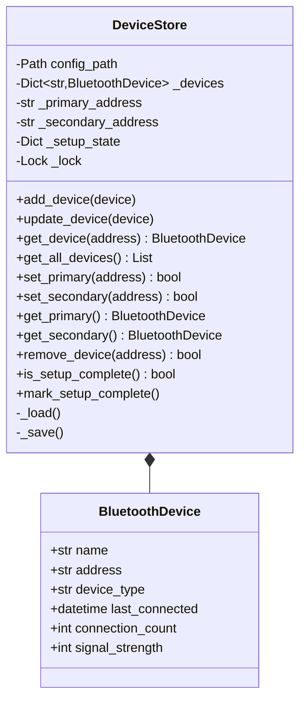
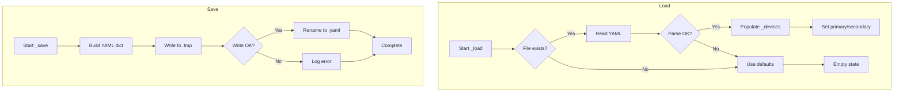

# Component Design: DeviceStore

Created: 2025-12-29

---

## Table of Contents

- [1.0 Document Information](<#1.0 document information>)
- [2.0 Component Overview](<#2.0 component overview>)
- [3.0 Class Design](<#3.0 class design>)
- [4.0 Method Specifications](<#4.0 method specifications>)
- [5.0 Data Persistence](<#5.0 data persistence>)
- [6.0 Error Handling](<#6.0 error handling>)
- [7.0 Visual Documentation](<#7.0 visual documentation>)
- [Version History](<#version history>)

---

## 1.0 Document Information

```yaml
document_info:
  document_id: "design-f6a7b8c9-component_comm_device_store"
  tier: 3
  domain: "Communication"
  component: "DeviceStore"
  parent: "design-7d3e9f5a-domain_comm.md"
  source_file: "src/gtach/comm/device_store.py"
  version: "1.0"
  date: "2025-12-29"
  author: "William Watson"
```

### 1.1 Parent Reference

- **Domain Design**: [design-7d3e9f5a-domain_comm.md](<design-7d3e9f5a-domain_comm.md>)

[Return to Table of Contents](<#table of contents>)

---

## 2.0 Component Overview

### 2.1 Purpose

DeviceStore provides persistent storage for Bluetooth device information including paired devices, connection history, and setup state. It uses YAML-based file storage with in-memory fallback.

### 2.2 Responsibilities

1. Store and retrieve paired device information
2. Track primary and secondary device designations
3. Maintain connection history and statistics
4. Persist setup completion state
5. Handle storage file corruption gracefully

### 2.3 Storage Location

```
~/.config/gtach/devices.yaml    # Primary storage
config/devices.yaml              # Fallback (project-local)
```

[Return to Table of Contents](<#table of contents>)

---

## 3.0 Class Design

### 3.1 DeviceStore Class

```python
class DeviceStore:
    """Persistent storage for Bluetooth device information.
    
    Provides YAML-based persistence with in-memory fallback
    for device pairing data and connection history.
    """
```

### 3.2 Constructor

```python
def __init__(self, config_path: Optional[Path] = None) -> None:
    """Initialize device store.
    
    Args:
        config_path: Custom config path (default ~/.config/gtach/devices.yaml)
    
    Initializes:
        - Config file path
        - In-memory device dict
        - Setup state dict
        - Loads existing data from file
    """
```

### 3.3 Instance Attributes

| Attribute | Type | Purpose |
|-----------|------|---------|
| `config_path` | `Path` | YAML file location |
| `_devices` | `Dict[str, BluetoothDevice]` | Address→Device map |
| `_primary_address` | `Optional[str]` | Primary device address |
| `_secondary_address` | `Optional[str]` | Secondary device address |
| `_setup_state` | `Dict[str, Any]` | Setup wizard state |
| `_lock` | `threading.Lock` | Thread safety |
| `logger` | `Logger` | Logging instance |

[Return to Table of Contents](<#table of contents>)

---

## 4.0 Method Specifications

### 4.1 add_device / update_device

```python
def add_device(self, device: BluetoothDevice) -> None:
    """Add or update device in store.
    
    Args:
        device: BluetoothDevice to store
    
    Thread Safety:
        Acquires _lock
    
    Algorithm:
        1. Normalize address (uppercase, no colons)
        2. Update last_seen timestamp
        3. Store in _devices dict
        4. Save to file
    """

def update_device(self, device: BluetoothDevice) -> None:
    """Update existing device, incrementing connection count.
    
    Same as add_device but also:
        - Increments connection_count
        - Updates last_connected timestamp
    """
```

### 4.2 get_device / get_all_devices

```python
def get_device(self, address: str) -> Optional[BluetoothDevice]:
    """Get device by address.
    
    Args:
        address: Device address (normalized internally)
    
    Returns:
        BluetoothDevice or None if not found
    """

def get_all_devices(self) -> List[BluetoothDevice]:
    """Get all stored devices.
    
    Returns:
        List of all BluetoothDevice objects
    """
```

### 4.3 set_primary / set_secondary

```python
def set_primary(self, address: str) -> bool:
    """Set device as primary.
    
    Args:
        address: Device address to set as primary
    
    Returns:
        True if device exists and was set
    
    Algorithm:
        1. Verify device exists in store
        2. Set _primary_address
        3. Save to file
    """

def set_secondary(self, address: str) -> bool:
    """Set device as secondary (fallback).
    
    Similar to set_primary for secondary device.
    """
```

### 4.4 get_primary / get_secondary

```python
def get_primary(self) -> Optional[BluetoothDevice]:
    """Get primary paired device."""

def get_secondary(self) -> Optional[BluetoothDevice]:
    """Get secondary paired device."""
```

### 4.5 remove_device

```python
def remove_device(self, address: str) -> bool:
    """Remove device from store.
    
    Args:
        address: Device address to remove
    
    Returns:
        True if device was removed
    
    Side Effects:
        - Clears primary/secondary if removed device was designated
        - Saves to file
    """
```

### 4.6 Setup State Methods

```python
def is_setup_complete(self) -> bool:
    """Check if initial setup is complete."""

def mark_setup_complete(self) -> None:
    """Mark initial setup as complete."""

def is_first_run(self) -> bool:
    """Check if this is first application run."""

def get_discovery_timeout(self) -> float:
    """Get configured discovery timeout (default 30.0)."""
```

### 4.7 Persistence Methods

```python
def _load(self) -> None:
    """Load device data from YAML file.
    
    Algorithm:
        1. Check if config file exists
        2. Read YAML content
        3. Parse paired_devices section
        4. Parse setup section
        5. Reconstruct BluetoothDevice objects
    
    Error Handling:
        On any error: log warning, use empty defaults
    """

def _save(self) -> None:
    """Save device data to YAML file.
    
    Algorithm:
        1. Ensure parent directory exists
        2. Build YAML structure
        3. Write to file atomically (write to temp, rename)
    
    Error Handling:
        On any error: log error, data remains in memory
    """
```

[Return to Table of Contents](<#table of contents>)

---

## 5.0 Data Persistence

### 5.1 YAML File Structure

```yaml
# devices.yaml
paired_devices:
  primary:
    name: "OBDII"
    address: "AA11BB22CC33"
    device_type: "ELM327"
    last_connected: "2025-12-29T10:30:00"
    connection_count: 42
    signal_strength: -65
  secondary:
    name: "OBD-Backup"
    address: "DD44EE55FF66"
    device_type: "ELM327"
    last_connected: "2025-12-20T14:00:00"
    connection_count: 5
    signal_strength: -78

setup:
  completed: true
  first_run: false
  discovery_timeout: 30.0
  last_setup_date: "2025-12-01"
```

### 5.2 Address Normalization

```python
def normalize_address(address: str) -> str:
    """Normalize Bluetooth address format.
    
    Converts:
        "AA:11:BB:22:CC:33" -> "AA11BB22CC33"
        "aa-11-bb-22-cc-33" -> "AA11BB22CC33"
        "aa11bb22cc33" -> "AA11BB22CC33"
    """
    return address.upper().replace(":", "").replace("-", "")
```

### 5.3 Atomic File Writes

```python
def _save_atomic(self, data: dict) -> None:
    """Write file atomically to prevent corruption."""
    temp_path = self.config_path.with_suffix('.tmp')
    with open(temp_path, 'w') as f:
        yaml.safe_dump(data, f, default_flow_style=False)
    temp_path.rename(self.config_path)  # Atomic on POSIX
```

[Return to Table of Contents](<#table of contents>)

---

## 6.0 Error Handling

### 6.1 Exception Strategy

| Scenario | Handling |
|----------|----------|
| File not found | Use empty defaults |
| YAML parse error | Log warning, use empty defaults |
| Write permission denied | Log error, data in memory only |
| Directory creation fails | Log error, use fallback path |

### 6.2 Graceful Degradation

```python
# In-memory operation continues even if persistence fails
try:
    self._save()
except Exception as e:
    self.logger.error(f"Failed to save: {e}")
    # Data remains valid in memory
```

[Return to Table of Contents](<#table of contents>)

---

## 7.0 Visual Documentation

### 7.1 Class Diagram



### 7.2 Load/Save Flow



[Return to Table of Contents](<#table of contents>)

---

## Version History

| Version | Date | Author | Changes |
|---------|------|--------|---------|
| 1.0 | 2025-12-29 | William Watson | Initial component design document |

---

Copyright (c) 2025 William Watson. This work is licensed under the MIT License.
