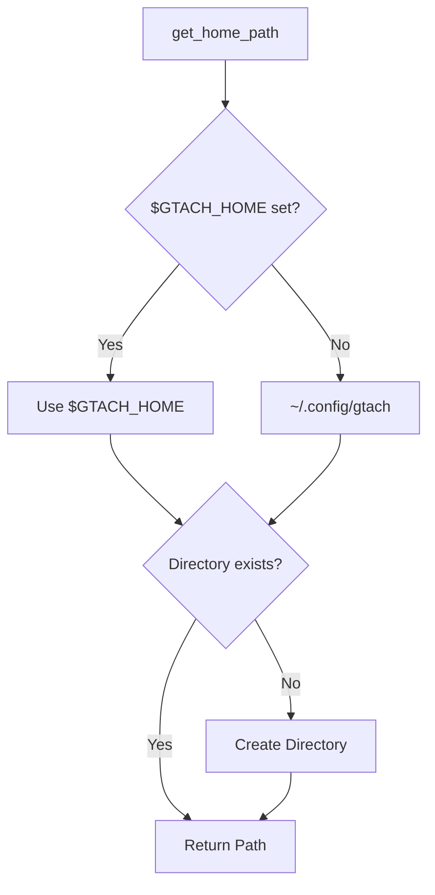

# Component Design: OBDII_HOME Utilities

Created: 2025-12-29

---

## Table of Contents

- [1.0 Document Information](<#1.0 document information>)
- [2.0 Component Overview](<#2.0 component overview>)
- [3.0 Function Specifications](<#3.0 function specifications>)
- [4.0 Path Resolution](<#4.0 path resolution>)
- [5.0 Visual Documentation](<#5.0 visual documentation>)
- [Version History](<#version history>)

---

## 1.0 Document Information

```yaml
document_info:
  document_id: "design-f8a9b0c1-component_utils_home"
  tier: 3
  domain: "Utilities"
  component: "OBDII_HOME Utilities"
  parent: "design-9a1f3c7e-domain_utils.md"
  source_file: "src/gtach/utils/home.py"
  version: "1.0"
  date: "2025-12-29"
  author: "William Watson"
```

### 1.1 Parent Reference

- **Domain Design**: [design-9a1f3c7e-domain_utils.md](<design-9a1f3c7e-domain_utils.md>)

[Return to Table of Contents](<#table of contents>)

---

## 2.0 Component Overview

### 2.1 Purpose

OBDII_HOME utilities provide standardized path management for application files including configuration, logs, and data storage with environment variable override support.

### 2.2 Responsibilities

1. Resolve application home directory
2. Provide config file path resolution
3. Ensure directory structure exists
4. Support environment variable override

[Return to Table of Contents](<#table of contents>)

---

## 3.0 Function Specifications

### 3.1 get_home_path

```python
def get_home_path() -> Path:
    """Get application home directory path.
    
    Resolution Order:
        1. $GTACH_HOME environment variable
        2. ~/.config/gtach/ (default)
    
    Returns:
        Path to application home directory
    
    Side Effects:
        Creates directory if it doesn't exist
    """
```

### 3.2 get_config_file

```python
def get_config_file(filename: str = "config.yaml") -> Path:
    """Get configuration file path.
    
    Args:
        filename: Config filename (default "config.yaml")
    
    Returns:
        Path to config file (may not exist yet)
    """
```

### 3.3 get_log_dir

```python
def get_log_dir() -> Path:
    """Get log directory path.
    
    Returns:
        Path to logs/ subdirectory
    
    Side Effects:
        Creates directory if it doesn't exist
    """
```

### 3.4 get_data_dir

```python
def get_data_dir() -> Path:
    """Get data directory path.
    
    Returns:
        Path to data/ subdirectory
    
    Side Effects:
        Creates directory if it doesn't exist
    """
```

### 3.5 ensure_directories

```python
def ensure_directories() -> None:
    """Ensure all application directories exist.
    
    Creates:
        - Home directory
        - logs/ subdirectory
        - data/ subdirectory
    
    Permissions:
        Directories created with 0755
    """
```

[Return to Table of Contents](<#table of contents>)

---

## 4.0 Path Resolution

### 4.1 Directory Structure

```
~/.config/gtach/           # Default home
├── config.yaml           # Main configuration
├── devices.yaml          # Bluetooth devices
├── logs/                 # Log files
│   └── session_*.log    # Session logs
└── data/                 # Application data
```

### 4.2 Environment Override

```bash
# Override default location
export GTACH_HOME=/custom/path/gtach

# All paths will use this base
get_home_path()      # -> /custom/path/gtach
get_config_file()    # -> /custom/path/gtach/config.yaml
get_log_dir()        # -> /custom/path/gtach/logs
```

[Return to Table of Contents](<#table of contents>)

---

## 5.0 Visual Documentation

### 5.1 Path Resolution Flow



[Return to Table of Contents](<#table of contents>)

---

## Version History

| Version | Date | Author | Changes |
|---------|------|--------|---------|
| 1.0 | 2025-12-29 | William Watson | Initial component design document |

---

Copyright (c) 2025 William Watson. This work is licensed under the MIT License.
