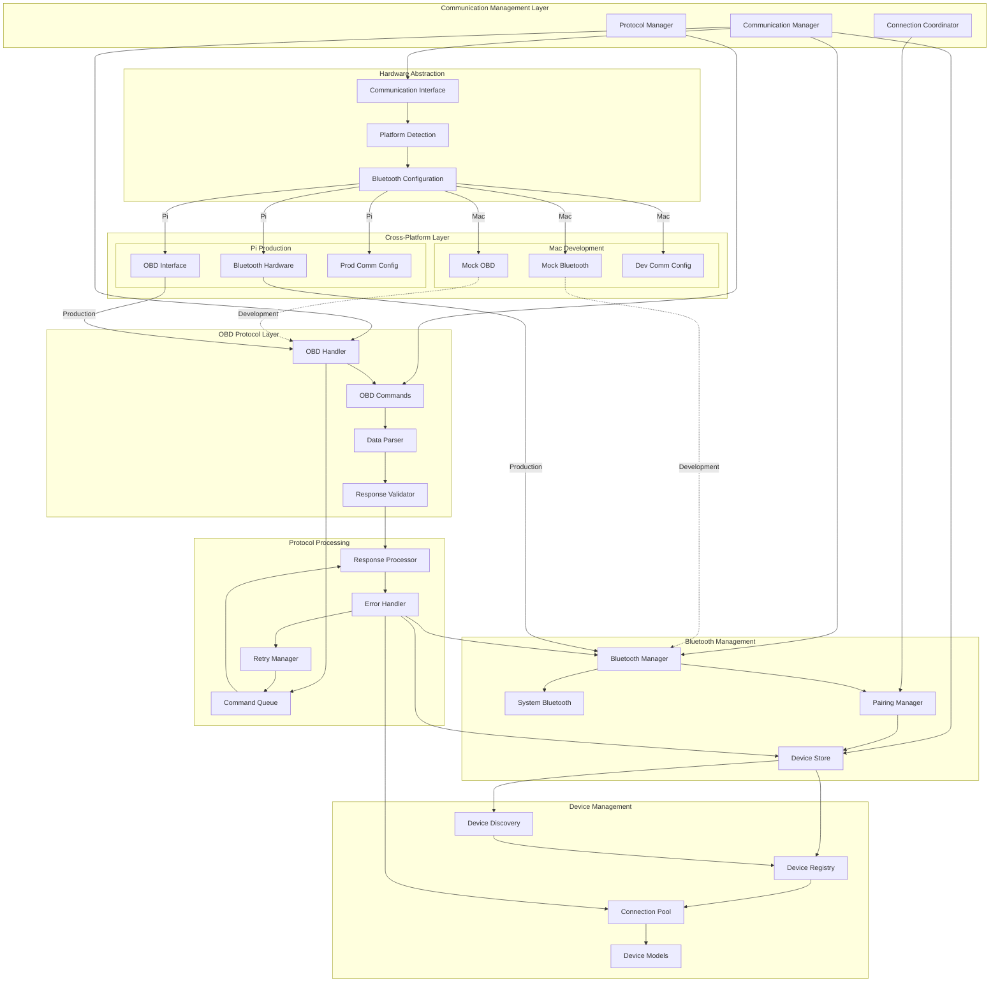

# Communication System Architecture

**Created**: 2025 08 20

## Diagram Header

**Diagram ID**: Communication_System_Architecture_GTach
**Category**: Component Architecture (Subsidiary)
**Version**: 1.0
**Status**: Active
**Created**: 2025 08 20
**Last Updated**: 2025 08 20
**Master Document Reference**: Master_System_Architecture_GTach

## Purpose

This component diagram provides detailed architecture specifications for the GTach communication subsystem, showing Bluetooth management, OBD interface protocols, device discovery and pairing, and cross-platform communication abstraction patterns within the communication domain as defined in the master system architecture.

## Communication System Overview

### Component Architecture
The communication system implements comprehensive vehicle diagnostic communication through Bluetooth Low Energy protocols, OBD-II command processing, device store management, automated pairing workflows, and cross-platform communication abstraction for Mac development and Raspberry Pi deployment.

### Master Document Alignment
This component architecture aligns with the master system architecture Communication domain and provides detailed implementation specifications for Bluetooth management, OBD handling, and device coordination shown at high level in the authoritative master document.

## Visual Documentation

### Communication Architecture Diagram

### Architecture Layers

#### Layer 1: Communication Management
**Communication Manager**: Central orchestration of communication subsystem with protocol coordination, connection management, and cross-platform abstraction.

**Connection Coordinator**: Connection lifecycle management with automated pairing, reconnection handling, and connection state monitoring.

**Protocol Manager**: OBD protocol management with command sequencing, response validation, and error recovery procedures.

#### Layer 2: Bluetooth Management
**Bluetooth Manager**: Core Bluetooth operations with device scanning, connection establishment, and data transmission management.

**System Bluetooth**: Platform-specific Bluetooth interface abstraction with Mac development mocking and Pi production hardware integration.

**Pairing Manager**: Automated device pairing with credential management, security validation, and pairing state persistence.

**Device Store**: Persistent device information storage with device metadata, connection history, and configuration management.

#### Layer 3: OBD Protocol Layer
**OBD Handler**: OBD-II protocol implementation with command generation, response parsing, and diagnostic data processing.

**Data Parser**: Diagnostic data interpretation with parameter extraction, unit conversion, and validation procedures.

**Response Validator**: OBD response validation with checksum verification, format validation, and error detection.

#### Layer 4: Device Management
**Device Discovery**: Active device scanning with filtering, signal strength monitoring, and device capability detection.

**Device Registry**: Comprehensive device database with device profiles, capabilities, and connection preferences.

**Connection Pool**: Connection resource management with connection reuse, timeout handling, and resource optimization.

#### Layer 5: Protocol Processing
**Command Queue**: OBD command sequencing with priority management, rate limiting, and batch processing optimization.

**Response Processor**: Diagnostic response processing with data extraction, format conversion, and application integration.

**Error Handler**: Comprehensive error management with recovery procedures, retry logic, and diagnostic reporting.

### Data Flow Patterns

#### Primary Flow: Device Discovery → Pairing → OBD Communication
1. Device discovery through Bluetooth scanning and filtering
2. Automated pairing with credential exchange and validation
3. OBD connection establishment and protocol negotiation
4. Command queue processing with response validation
5. Diagnostic data extraction and application integration

#### Secondary Flow: Error Recovery → Reconnection → Communication Restoration
1. Communication error detection and classification
2. Connection state validation and recovery procedures
3. Device reconnection with stored credentials
4. Protocol reestablishment and command queue restoration
5. Normal operation resumption with error reporting

## Cross-Platform Specifications

### Development Environment Authority
**Mac Mini M4 Responsibilities**: Mock Bluetooth and OBD implementations enabling full development and testing without hardware dependencies, protocol validation, and communication pipeline testing.

**Development Tools Integration**: Comprehensive communication testing framework, protocol simulation, and device management validation.

### Deployment Environment Authority
**Raspberry Pi Responsibilities**: Bluetooth hardware integration, OBD interface configuration, real device communication, and production protocol execution.

**Production Configuration**: Platform-specific Bluetooth optimization, OBD protocol timing configuration, and hardware interface validation.

### Platform Abstraction Definition
**Communication Interface Abstraction**: Common Bluetooth and OBD APIs enabling identical application logic across development and production environments with platform-specific driver implementations.

**Protocol Abstraction**: Consistent OBD protocol interfaces with platform-specific optimization strategies for Mac development efficiency and Pi performance constraints.

## Integration with Project Architecture

### Protocol Authority
This component diagram supports:
- **Protocol 1**: Project structure alignment through communication subsystem organization
- **Protocol 6**: Cross-platform development through communication hardware abstraction
- **Protocol 8**: Logging standards through error handling and diagnostic reporting
- **Protocol 10**: Hardware documentation through Bluetooth and OBD interface specifications

### Implementation Authority
This component diagram guides:
- Bluetooth management and device pairing implementation
- OBD protocol processing and diagnostic data handling
- Device store management and connection persistence
- Communication error handling and recovery procedures

### Testing Authority
This component diagram establishes:
- Communication testing framework with mock implementations
- Cross-platform communication validation procedures
- Protocol testing and OBD command validation
- Device management integration testing

## Master Document Coordination

### Consistency Maintenance
This component diagram maintains consistency with the master system architecture through:
- Aligned component naming with master communication domain specifications
- Consistent interface definitions and protocol patterns
- Coordinated integration with display and core domains

### Update Coordination
Changes to this component diagram coordinate with the master document through:
- Impact assessment on cross-domain communication integration
- Validation of continued alignment with hardware interface specifications
- Integration with cross-platform development requirements

## References

### Master Document Authority
- Master_System_Architecture_GTach: Authoritative source for communication domain integration

### Implementation References
- src/obdii/comm/bluetooth.py: Bluetooth management implementation
- src/obdii/comm/obd.py: OBD protocol implementation
- src/obdii/comm/device_store.py: Device store implementation
- src/obdii/comm/pairing.py: Pairing management implementation

### Protocol Dependencies
- Protocol 1: Project Structure Standards
- Protocol 6: Cross-Platform Development Standards
- Protocol 8: Logging and Debug Standards
- Protocol 10: Hardware Documentation and Integration Standards

---

**Diagram Status**: Active
**Master Document Alignment**: Verified 2025-08-20
**Next Review**: 2025-09-20

---

**Copyright**: Copyright (c) 2025 William Watson. This work is licensed under the MIT License.
