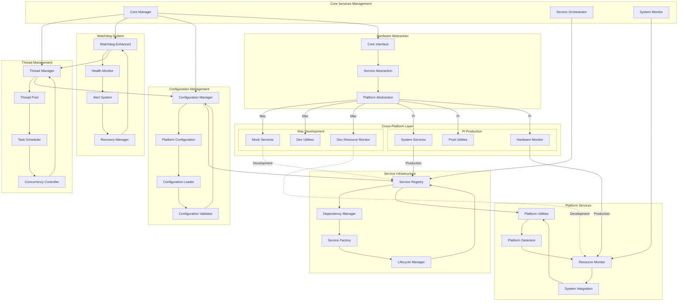

# Core Services Architecture

**Created**: 2025 08 20

## Diagram Header

**Diagram ID**: Core_Services_Architecture_GTach
**Category**: Component Architecture (Subsidiary)
**Version**: 1.0
**Status**: Active
**Created**: 2025 08 20
**Last Updated**: 2025 08 20
**Master Document Reference**: Master_System_Architecture_GTach

## Purpose

This component diagram provides detailed architecture specifications for the GTach core services subsystem, showing thread management, watchdog monitoring, configuration services, dependency injection, and cross-platform service abstraction patterns within the core domain as defined in the master system architecture.

## Core Services Overview

### Component Architecture
The core services system implements fundamental application infrastructure including thread-safe operations management, enhanced watchdog monitoring, configuration management with platform detection, service registry with dependency injection, and cross-platform service abstraction for Mac development and Raspberry Pi deployment.

### Master Document Alignment
This component architecture aligns with the master system architecture Core domain and provides detailed implementation specifications for thread management, configuration services, and system monitoring shown at high level in the authoritative master document.

## Visual Documentation

### Core Services Architecture Diagram

### Architecture Layers

#### Layer 1: Core Services Management
**Core Manager**: Central orchestration of core services with lifecycle management, service coordination, and system initialization.

**Service Orchestrator**: Service startup sequencing with dependency resolution, initialization coordination, and shutdown management.

**System Monitor**: Comprehensive system health monitoring with performance tracking, resource utilization monitoring, and alert generation.

#### Layer 2: Thread Management
**Thread Manager**: Thread-safe operations coordination with concurrent task management, resource allocation, and deadlock prevention.

**Task Scheduler**: Application task scheduling with priority management, timing coordination, and resource optimization.

**Concurrency Controller**: Thread synchronization with lock management, critical section protection, and race condition prevention.

#### Layer 3: Watchdog System
**Watchdog Enhanced**: Advanced system monitoring with health checking, automatic recovery, and failure detection.

**Health Monitor**: Component health tracking with status reporting, performance monitoring, and anomaly detection.

**Recovery Manager**: Automated failure recovery with restart procedures, state restoration, and escalation protocols.

#### Layer 4: Configuration Management
**Configuration Manager**: Platform-specific configuration management with environment detection, setting validation, and dynamic updates.

**Platform Configuration**: Cross-platform configuration abstraction with Mac development settings and Pi production configurations.

**Configuration Validator**: Setting validation with schema checking, dependency verification, and constraint enforcement.

#### Layer 5: Service Infrastructure
**Service Registry**: Centralized service management with dependency injection, service discovery, and lifecycle coordination.

**Dependency Manager**: Service dependency resolution with circular dependency detection, injection management, and initialization sequencing.

**Service Factory**: Dynamic service instantiation with configuration injection, platform-specific implementations, and instance management.

### Data Flow Patterns

#### Primary Flow: System Initialization → Service Registration → Operation
1. Core manager initialization and platform detection
2. Configuration loading with platform-specific settings
3. Service registry population with dependency resolution
4. Thread manager activation with watchdog monitoring
5. System health monitoring and performance tracking

#### Secondary Flow: Health Monitoring → Alert → Recovery
1. Continuous system health monitoring and metric collection
2. Anomaly detection and alert generation
3. Recovery procedure initiation and execution
4. Service restoration and validation
5. Normal operation resumption with health confirmation

## Cross-Platform Specifications

### Development Environment Authority
**Mac Mini M4 Responsibilities**: Mock service implementations, development utilities, resource monitoring optimization, and comprehensive testing infrastructure.

**Development Tools Integration**: Service testing framework, mock dependency injection, and development workflow optimization.

### Deployment Environment Authority
**Raspberry Pi Responsibilities**: System service integration, hardware monitoring, resource optimization, and production service management.

**Production Configuration**: Platform-specific service optimization, hardware resource management, and system integration validation.

### Platform Abstraction Definition
**Service Abstraction**: Common service interfaces enabling identical application logic across development and production environments with platform-specific implementations.

**Resource Abstraction**: Consistent resource monitoring interfaces with platform-specific optimization strategies for Mac development efficiency and Pi resource constraints.

## Integration with Project Architecture

### Protocol Authority
This component diagram supports:
- **Protocol 1**: Project structure alignment through core services organization
- **Protocol 6**: Cross-platform development through service abstraction
- **Protocol 8**: Logging standards through watchdog monitoring and health tracking

### Implementation Authority
This component diagram guides:
- Thread management and concurrency control implementation
- Configuration management and platform detection procedures
- Service registry and dependency injection patterns
- Watchdog monitoring and recovery mechanisms

### Testing Authority
This component diagram establishes:
- Core services testing with mock implementations
- Thread safety validation and concurrency testing
- Configuration management testing across platforms
- Service integration and dependency resolution testing

## Master Document Coordination

### Consistency Maintenance
This component diagram maintains consistency with the master system architecture through:
- Aligned component naming with master core domain specifications
- Consistent service patterns and abstraction definitions
- Coordinated integration with display and communication domains

### Update Coordination
Changes to this component diagram coordinate with the master document through:
- Impact assessment on cross-domain service integration
- Validation of continued alignment with system requirements
- Integration with cross-platform development standards

## References

### Master Document Authority
- Master_System_Architecture_GTach: Authoritative source for core domain integration

### Implementation References
- src/obdii/core/thread.py: Thread management implementation
- src/obdii/core/watchdog_enhanced.py: Enhanced watchdog implementation
- src/obdii/utils/services/: Service infrastructure implementation
- src/obdii/utils/platform.py: Platform utilities implementation

### Protocol Dependencies
- Protocol 1: Project Structure Standards
- Protocol 6: Cross-Platform Development Standards
- Protocol 8: Logging and Debug Standards

---

**Diagram Status**: Active
**Master Document Alignment**: Verified 2025-08-20
**Next Review**: 2025-09-20

---

**Copyright**: Copyright (c) 2025 William Watson. This work is licensed under the MIT License.
