# Display System Architecture

**Created**: 2025 08 20

## Diagram Header

**Diagram ID**: Display_System_Architecture_GTach
**Category**: Component Architecture (Subsidiary)
**Version**: 1.0
**Status**: Active
**Created**: 2025 08 20
**Last Updated**: 2025 08 20
**Master Document Reference**: Master_System_Architecture_GTach

## Purpose

This component diagram provides detailed architecture specifications for the GTach display subsystem, showing internal component structure, rendering pipeline, input handling, and cross-platform abstraction patterns within the display domain as defined in the master system architecture.

## Display System Overview

### Component Architecture
The display system implements a comprehensive rendering and interaction architecture optimized for circular displays, providing component management, graphics rendering, touch input coordination, performance monitoring, and cross-platform hardware abstraction for both Mac development and Raspberry Pi deployment.

### Master Document Alignment
This component architecture aligns with the master system architecture Display domain and provides detailed implementation specifications for display management, rendering, and input coordination shown at high level in the authoritative master document.

## Visual Documentation

### Display Architecture Diagram

```mermaid
flowchart TD
    subgraph "Display Management Layer"
        DisplayMgr[Display Manager]
        SetupManager[Setup Manager]
        UITestFramework[UI Testing Framework]
    end
    
    subgraph "Component Coordination"
        ComponentFactory[Component Factory]
        ComponentCoord[Component Coordinator]
        StateCoord[State Coordinator]
    end
    
    subgraph "Rendering Pipeline"
        RenderEngine[Render Engine]
        Graphics[Graphics Engine]
        SplashGraphics[Splash Graphics]
        Typography[Typography Engine]
        DeviceSurfaces[Device Surfaces]
    end
    
    subgraph "Input Management"
        TouchCoord[Touch Coordinator]
        TouchInterface[Touch Interface]
        InputInterfaces[Input Interfaces]
        NavigationGestures[Navigation Gestures]
        EnhancedTouchFactory[Enhanced Touch Factory]
    end
    
    subgraph "Performance Monitoring"
        PerformanceMonitor[Performance Monitor]
        PerformanceInterfaces[Performance Interfaces]
        AsyncOperations[Async Operations]
    end
    
    subgraph "Setup Components"
        subgraph "Layout Management"
            CircularPositioning[Circular Positioning]
        end
        
        subgraph "Bluetooth Setup"
            BluetoothInterface[Bluetooth Interface]
        end
        
        subgraph "Rendering Setup"
            DeviceSurfaces[Device Surface Manager]
        end
        
        subgraph "State Management"
            StateCoordinator[State Coordinator]
        end
    end
    
    subgraph "Hardware Abstraction"
        HardwareInterface[Hardware Interface]
        PlatformDetection[Platform Detection]
        DisplayConfig[Display Configuration]
    end
    
    subgraph "Cross-Platform Layer"
        subgraph "Mac Development"
            MockDisplay[Mock Display]
            MockTouch[Mock Touch]
            DevDisplayConfig[Dev Display Config]
        end
        
        subgraph "Pi Production"
            HyperPixelDriver[HyperPixel Driver]
            TouchDriver[Touch Driver]
            ProdDisplayConfig[Prod Display Config]
        end
    end
    
    %% Display Management Flow
    DisplayMgr --> ComponentFactory
    DisplayMgr --> RenderEngine
    DisplayMgr --> TouchCoord
    DisplayMgr --> PerformanceMonitor
    
    %% Component Coordination Flow
    ComponentFactory --> ComponentCoord
    ComponentCoord --> StateCoord
    StateCoord --> StateCoordinator
    
    %% Rendering Pipeline Flow
    RenderEngine --> Graphics
    Graphics --> SplashGraphics
    Graphics --> Typography
    RenderEngine --> DeviceSurfaces
    
    %% Input Management Flow
    TouchCoord --> TouchInterface
    TouchInterface --> InputInterfaces
    TouchCoord --> NavigationGestures
    EnhancedTouchFactory --> TouchCoord
    
    %% Performance Flow
    PerformanceMonitor --> PerformanceInterfaces
    PerformanceMonitor --> AsyncOperations
    AsyncOperations --> RenderEngine
    
    %% Setup Components Integration
    ComponentFactory --> CircularPositioning
    SetupManager --> BluetoothInterface
    RenderEngine --> DeviceSurfaces
    StateCoord --> StateCoordinator
    
    %% Hardware Abstraction Flow
    DisplayMgr --> HardwareInterface
    HardwareInterface --> PlatformDetection
    PlatformDetection --> DisplayConfig
    
    %% Cross-Platform Abstraction
    DisplayConfig -->|Mac| MockDisplay
    DisplayConfig -->|Mac| MockTouch
    DisplayConfig -->|Mac| DevDisplayConfig
    
    DisplayConfig -->|Pi| HyperPixelDriver
    DisplayConfig -->|Pi| TouchDriver
    DisplayConfig -->|Pi| ProdDisplayConfig
    
    %% Hardware Interface Connections
    MockDisplay -.->|Development| RenderEngine
    HyperPixelDriver -->|Production| RenderEngine
    MockTouch -.->|Development| TouchCoord
    TouchDriver -->|Production| TouchCoord
    
    %% Performance Integration
    PerformanceMonitor --> DisplayMgr
    PerformanceMonitor --> RenderEngine
    PerformanceMonitor --> TouchCoord
```

### Architecture Layers

#### Layer 1: Display Management
**Display Manager**: Central orchestration of display subsystem with component lifecycle management, rendering coordination, and cross-platform hardware abstraction.

**Setup Manager**: Application setup workflow management with component initialization, configuration loading, and hardware validation.

**UI Testing Framework**: Comprehensive testing infrastructure for display components with mock implementations and validation procedures.

#### Layer 2: Component Coordination
**Component Factory**: Dynamic component creation with circular positioning optimization and cross-platform compatibility patterns.

**Component Coordinator**: Inter-component communication management with state synchronization and event coordination.

**State Coordinator**: Application state management with persistent state handling and component state coordination.

#### Layer 3: Rendering Pipeline
**Render Engine**: Core rendering infrastructure with platform-specific surface management and performance optimization.

**Graphics Engine**: Comprehensive graphics operations with splash screen management, typography rendering, and circular display optimization.

**Device Surfaces**: Platform-specific surface management for Mac development mocking and Pi production hardware.

#### Layer 4: Input Management
**Touch Coordinator**: Touch event processing with gesture recognition, multi-touch support, and cross-platform input abstraction.

**Navigation Gestures**: Specialized gesture recognition for circular display navigation patterns and application workflow integration.

**Enhanced Touch Factory**: Advanced touch handling with platform-specific optimizations and mock implementations.

#### Layer 5: Performance Monitoring
**Performance Monitor**: Real-time performance tracking with resource utilization monitoring and optimization recommendations.

**Async Operations**: Asynchronous operation management for non-blocking display updates and smooth user interaction.

### Data Flow Patterns

#### Primary Flow: Display Initialization → Rendering → Input Processing
1. Display manager initialization and hardware detection
2. Component factory creation with circular positioning
3. Render engine setup with platform-specific surfaces
4. Touch coordinator initialization with input interface configuration
5. Performance monitoring activation for optimization tracking

#### Secondary Flow: User Interaction → Component Update → Rendering
1. Touch input capture through platform-specific drivers
2. Navigation gesture recognition and command generation
3. Component state updates through state coordinator
4. Render engine component update processing
5. Performance monitoring and optimization feedback

## Cross-Platform Specifications

### Development Environment Authority
**Mac Mini M4 Responsibilities**: Mock display and touch implementations enabling full development and testing without hardware dependencies, component factory validation, and rendering pipeline testing.

**Development Tools Integration**: Seamless integration with UI testing framework, performance monitoring for development optimization, and comprehensive component validation.

### Deployment Environment Authority
**Raspberry Pi Responsibilities**: HyperPixel display driver integration, touch driver configuration, hardware-specific performance optimization, and production rendering pipeline execution.

**Production Configuration**: Platform-specific display configuration, touch sensitivity optimization, resource utilization monitoring, and hardware interface validation.

### Platform Abstraction Definition
**Hardware Interface Abstraction**: Common display and input APIs enabling identical application logic across development and production environments with platform-specific driver implementations.

**Performance Abstraction**: Consistent performance monitoring interfaces with platform-specific optimization strategies for Mac development efficiency and Pi resource constraints.

## Integration with Project Architecture

### Protocol Authority
This component diagram supports:
- **Protocol 1**: Project structure alignment through display subsystem organization
- **Protocol 6**: Cross-platform development through hardware abstraction implementation
- **Protocol 8**: Logging standards through performance monitoring integration
- **Protocol 10**: Hardware documentation through display interface specifications

### Implementation Authority
This component diagram guides:
- Display management and rendering pipeline implementation
- Touch input processing and gesture recognition procedures
- Component coordination and state management approaches
- Performance monitoring and optimization strategies

### Testing Authority
This component diagram establishes:
- UI testing framework requirements and validation procedures
- Cross-platform display testing with mock implementations
- Performance benchmarking and optimization validation
- Component integration testing across display subsystem

## Master Document Coordination

### Consistency Maintenance
This component diagram maintains consistency with the master system architecture through:
- Aligned component naming with master display domain specifications
- Consistent interface definitions and abstraction patterns
- Coordinated integration with communication and core domains

### Update Coordination
Changes to this component diagram coordinate with the master document through:
- Impact assessment on cross-domain display integration
- Validation of continued alignment with hardware interface specifications
- Integration with cross-platform development requirements

## References

### Master Document Authority
- Master_System_Architecture_GTach: Authoritative source for display domain integration

### Implementation References
- src/obdii/display/manager.py: Display management implementation
- src/obdii/display/components/: Component coordination implementation
- src/obdii/display/rendering/: Rendering pipeline implementation
- src/obdii/display/input/: Input management implementation

### Protocol Dependencies
- Protocol 1: Project Structure Standards
- Protocol 6: Cross-Platform Development Standards
- Protocol 8: Logging and Debug Standards
- Protocol 10: Hardware Documentation and Integration Standards

---

**Diagram Status**: Active
**Master Document Alignment**: Verified 2025-08-20
**Next Review**: 2025-09-20

---

**Copyright**: Copyright (c) 2025 William Watson. This work is licensed under the MIT License.
