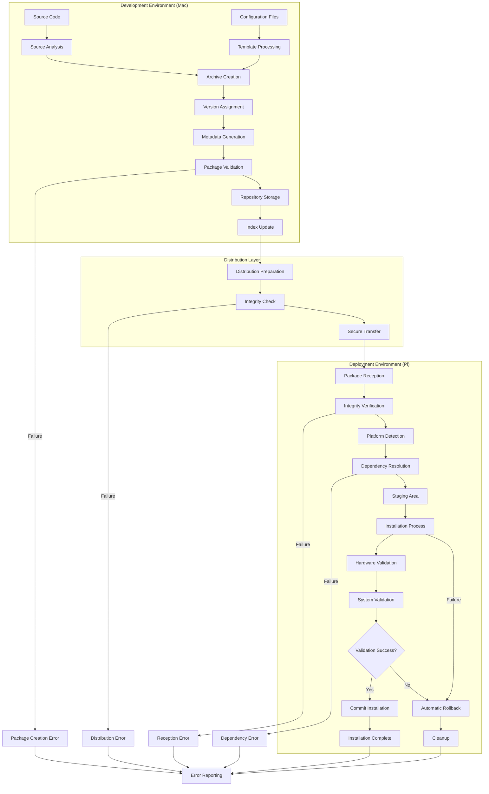
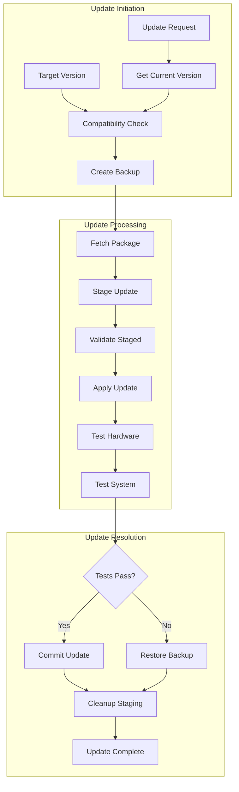
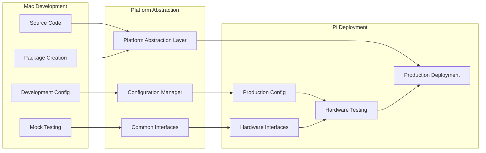
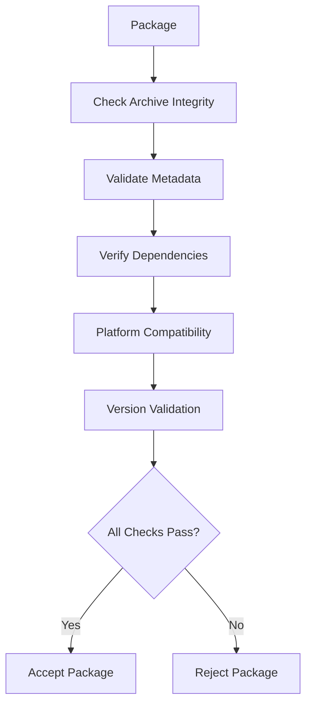
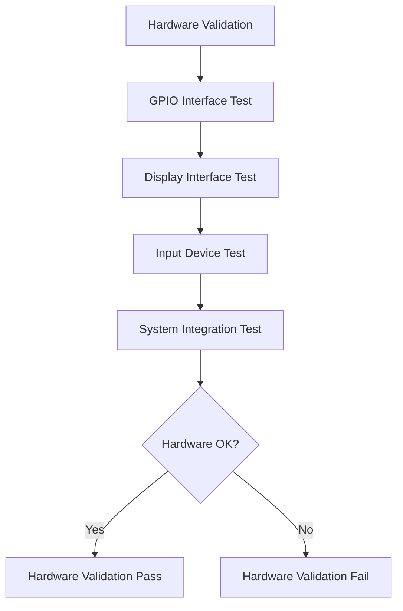

# Provisioning Data Flow Diagram

**Created**: 2025 08 08

## Diagram Header

**Diagram ID**: Provisioning_Data_Flow_GTach
**Category**: Data Flow (Subsidiary)
**Version**: 1.0
**Status**: Active
**Created**: 2025 08 08
**Last Updated**: 2025 08 08
**Master Document Reference**: Master_Data_Flow_GTach

## Purpose

This subsidiary diagram provides comprehensive data flow visualization for the GTach provisioning system, detailing information processing paths, validation procedures, and cross-platform deployment workflows as defined in the master data flow architecture.

## Data Flow Overview

### Primary Data Flows
- Package Creation Flow: Source → Archive → Repository → Distribution
- Installation Flow: Repository → Transfer → Deployment → Validation
- Update Flow: Version Check → Staging → Installation → Rollback Safety

### Master Document Alignment
All data flows align with master data flow architecture and provide detailed implementation paths for high-level workflows.

## Visual Documentation

### Primary Data Flow Diagram

### Update Data Flow

### Cross-Platform Data Flow

## Data Processing Specifications

### Package Creation Data Processing
1. **Source Analysis**: File enumeration, dependency scanning, configuration validation
2. **Archive Generation**: Compression, integrity calculation, metadata embedding
3. **Version Processing**: SemVer validation, compatibility checking, dependency resolution
4. **Repository Integration**: Index updating, metadata storage, search preparation

### Installation Data Processing
1. **Reception Validation**: Integrity verification, platform compatibility check
2. **Dependency Resolution**: System package analysis, version compatibility validation
3. **Staged Installation**: Temporary deployment, configuration application, service setup
4. **Hardware Validation**: GPIO testing, interface verification, operational confirmation

### Rollback Data Processing
1. **Failure Detection**: Validation error identification, system state assessment
2. **Backup Restoration**: Previous version recovery, configuration rollback
3. **Cleanup Operations**: Staging area cleanup, temporary file removal
4. **Status Reporting**: Error documentation, recovery confirmation

## Validation Procedures

### Package Validation Flow

### Hardware Validation Flow

## Error Handling Data Flows

### Error Classification and Routing
- **Creation Errors**: Source validation failures, configuration issues
- **Distribution Errors**: Transfer failures, integrity violations
- **Installation Errors**: Dependency conflicts, hardware failures
- **Validation Errors**: Testing failures, compatibility issues

### Recovery Procedures
- **Automatic Rollback**: Failed installation recovery
- **Manual Recovery**: Guided troubleshooting procedures
- **Error Reporting**: Comprehensive diagnostic information
- **State Restoration**: Previous working configuration recovery

## Integration Requirements

### Protocol Compliance
Data flows integrate with:
- Protocol 6: Cross-platform development workflows
- Protocol 8: Comprehensive logging with session timestamps
- Protocol 10: Hardware interface validation procedures

### Thread Safety
All data processing implements thread-safe operations with appropriate synchronization and atomic updates.

### Performance Optimization
Data flows optimize for:
- Minimal network transfer
- Efficient storage utilization
- Fast validation procedures
- Responsive user feedback

## Master Document Coordination

### Consistency Maintenance
This subsidiary diagram maintains consistency with master data flow architecture through aligned data processing patterns and validation procedures.

### Update Coordination
Data flow changes coordinate with master document through impact assessment and validation procedures.

## References

### Master Document Authority
- Master_Data_Flow_GTach: Authoritative source for data flow patterns

### Implementation References
- src/provisioning/package_creator.py: Package creation data flows
- src/provisioning/installer.py: Installation data processing
- src/provisioning/update_manager.py: Update data flows

### Protocol Dependencies
- Protocol 6: Cross-Platform Development Standards
- Protocol 8: Logging and Debug Standards
- Protocol 10: Hardware Documentation Standards

---

**Diagram Status**: Active
**Master Document Alignment**: Verified 2025-08-08
**Next Review**: 2025-09-08

---

**Copyright**: Copyright (c) 2025 William Watson. This work is licensed under the MIT License.
