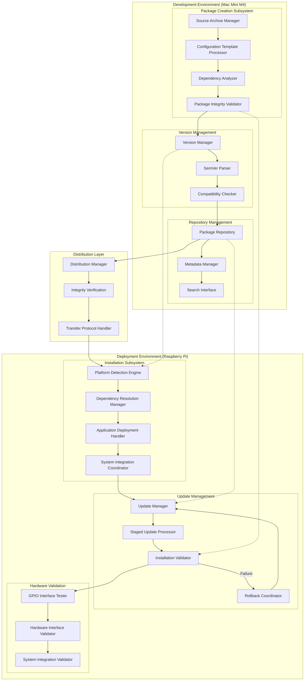

# Provisioning System Architecture

**Created**: 2025 08 08

## Diagram Header

**Diagram ID**: Provisioning_System_Architecture_GTach
**Category**: Component Architecture (Subsidiary)
**Version**: 1.0
**Status**: Active
**Created**: 2025 08 08
**Last Updated**: 2025 08 08
**Master Document Reference**: Master_System_Architecture_GTach

## Purpose

This component diagram provides detailed architecture specifications for the GTach provisioning subsystem, showing internal component structure, data flows, and integration patterns within the provisioning domain as defined in the master system architecture.

## Provisioning System Overview

### Component Architecture
The provisioning system implements a comprehensive package management architecture enabling reliable deployment from Mac development environments to Raspberry Pi production targets through automated package creation, semantic versioning, repository management, and safe update procedures.

### Master Document Alignment
This component architecture aligns with the master system architecture and provides detailed implementation specifications for the provisioning domain shown at high level in the authoritative master document.

## Visual Documentation

### Provisioning Architecture Diagram

### Architecture Layers

#### Layer 1: Development Environment (Mac Mini M4)
**Package Creation Subsystem**: Automated package generation with source archival, configuration templating, dependency analysis, and integrity validation.

**Version Management**: SemVer-compliant versioning with parsing, compatibility checking, and dependency resolution.

**Repository Management**: Local package storage with metadata indexing, search capabilities, and distribution coordination.

#### Layer 2: Distribution Layer
**Distribution Management**: Secure package transfer with integrity verification and cross-platform protocol handling.

#### Layer 3: Deployment Environment (Raspberry Pi)
**Installation Subsystem**: Platform detection, dependency resolution, application deployment, and system integration.

**Update Management**: Staged update processing with validation and automatic rollback capabilities.

**Hardware Validation**: GPIO interface testing and hardware integration validation per Protocol 10 specifications.

### Data Flow Patterns

#### Primary Flow: Package Creation → Repository → Distribution → Installation
1. Source code collection and configuration processing
2. Version assignment and dependency analysis
3. Package integrity validation and repository storage
4. Secure distribution to target environment
5. Platform detection and dependency resolution
6. Application deployment and system integration
7. Hardware interface validation and operational verification

#### Secondary Flow: Update Management with Rollback Safety
1. Version compatibility assessment
2. Staged update preparation
3. Installation validation and testing
4. Hardware interface verification
5. Automatic rollback on failure detection

## Cross-Platform Specifications

### Development Environment Authority
**Mac Mini M4 Responsibilities**: Package creation, version management, repository operations, and distribution initiation using mock hardware interfaces for validation.

**Development Tools Integration**: Seamless integration with Claude Desktop workflow coordination, Claude Code implementation execution, and GitHub Desktop version control per established protocols.

### Deployment Environment Authority
**Raspberry Pi Responsibilities**: Package installation, dependency resolution, hardware interface configuration, and operational validation using actual GPIO interfaces per Protocol 10 specifications.

**Production Configuration**: Platform-specific dependency resolution, hardware interface validation, and system service integration for embedded environment operation.

### Platform Abstraction Definition
**Configuration Management**: JSON-based platform detection with environment-specific configuration loading and cross-platform compatibility validation.

**Hardware Abstraction**: Mock implementations for Mac development with real hardware interfaces for Pi deployment, maintaining identical API contracts across platforms.

## Integration with Project Architecture

### Protocol Authority
This component diagram supports:
- **Protocol 1**: Project structure alignment through standardized package organization
- **Protocol 5**: GitHub Desktop integration through version control coordination
- **Protocol 6**: Cross-platform development through Mac-to-Pi deployment workflows
- **Protocol 10**: Hardware documentation through interface validation requirements

### Implementation Authority
This component diagram guides:
- Package creation and distribution procedures
- Version management and semantic versioning implementation
- Repository management and metadata handling
- Update mechanisms with rollback safety procedures

### Testing Authority
This component diagram establishes:
- Multi-layer testing integration with provisioning workflows
- Cross-platform validation requirements for package deployment
- Hardware interface testing integration with installation procedures

## Master Document Coordination

### Consistency Maintenance
This component diagram maintains consistency with the master system architecture through:
- Aligned component naming and responsibility definitions
- Consistent interface specifications and data flow patterns
- Coordinated abstraction levels and integration requirements

### Update Coordination
Changes to this component diagram coordinate with the master document through:
- Impact assessment on master architecture patterns
- Validation of continued alignment with system workflows
- Integration with cross-platform development requirements

## References

### Master Document Authority
- Master_System_Architecture_GTach: Authoritative source for system structure

### Implementation References
- Design_001_Application_Provisioning_System.md
- Design_003_Advanced_Provisioning_Features.md
- Synopsis_001_Package_Structure_Implementation.md
- Synopsis_003_Advanced_Provisioning_Features.md

### Protocol Dependencies
- Protocol 1: Project Structure Standards
- Protocol 5: GitHub Desktop Workflow Integration
- Protocol 6: Cross-Platform Development Standards
- Protocol 10: Hardware Documentation and Integration Standards

---

**Diagram Status**: Active
**Master Document Alignment**: Verified 2025-08-08
**Next Review**: 2025-09-08

---

**Copyright**: Copyright (c) 2025 William Watson. This work is licensed under the MIT License.
