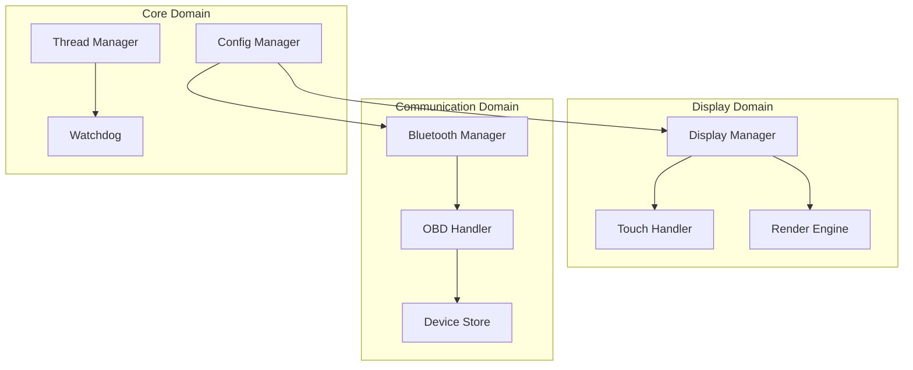

# Master Component Interaction Document

**Created**: 2025 08 08

## Master Diagram Header

**Master Diagram ID**: Master_Component_Interaction_GTach
**Category**: Component Interaction
**Version**: 1.0
**Status**: Draft
**Created**: 2025 08 08
**Last Updated**: 2025 08 08
**Authority Level**: Master Document - Single Source of Truth

## Purpose and Authority

### Master Document Purpose
This master document serves as the authoritative single source of truth for GTach component interactions, defining all component interfaces, data flow patterns, integration contracts, and communication protocols that govern subsidiary component interaction documentation.

### Scope of Authority
This master document definitively governs:
- Component interface specifications and contracts between all system components
- Data flow patterns and communication protocols across functional domains
- Integration requirements and dependency relationships throughout the system
- API specifications and interface contracts for cross-platform compatibility
- Authoritative reference for all subsidiary component interaction diagrams

### Subsidiary Document Coordination
All subsidiary component interaction diagrams must maintain consistency with this master document and reference this document for authoritative component interface specifications and interaction patterns.

## System Overview

### Master System View
[To be developed: Comprehensive view of component interactions across the GTach system including display, communication, core, and utility components]

### Architectural Principles
[To be developed: Core principles governing component interaction design including separation of concerns, interface consistency, and cross-platform compatibility]

### Integration Points
[To be developed: Critical component integration boundaries and communication protocols between functional domains]

## Master Visual Documentation

### Primary Master Diagram

### Supporting Master Views
[Additional master-level diagrams as component architecture develops]

### Master Legend and Notation
- **Component**: [Individual system components with defined responsibilities]
- **Interface**: [Communication contracts between components]
- **Data Flow**: [Information transfer patterns and protocols]
- **Dependency**: [Component dependency relationships and constraints]

## Subsidiary Document Governance

### Subsidiary Document Registry
[To be populated as subsidiary component interaction diagrams are created]

### Abstraction Level Management
All subsidiary component interaction diagrams must maintain consistent abstraction levels that provide detailed views of component relationships shown at high level in this master document.

### Consistency Requirements
Subsidiary diagrams must:
- Reference this master document as authoritative source
- Maintain consistent component naming and interface specifications
- Align with interaction patterns defined in this master
- Coordinate updates through master document change procedures

### Update Coordination Procedures
Changes to this master document require:
- Impact assessment on all subsidiary component interaction diagrams
- Validation of continued consistency across component documentation
- Coordination with cross-platform compatibility requirements
- Integration with hardware interface specifications

## Cross-Platform Master Specifications

### Development Environment Authority
[To be developed: Authoritative specification of Mac development environment component interactions]

### Deployment Environment Authority
[To be developed: Authoritative specification of Raspberry Pi deployment environment component interactions]

### Platform Abstraction Definition
[To be developed: Definitive specification of cross-platform component interaction approaches]

## Integration with Project Architecture

### Protocol Authority
This master document authoritatively supports:
- Protocol 1 project structure through component organization alignment
- Protocol 6 cross-platform development through interface specification
- Protocol 4 AI coordination through component interaction clarity

### Implementation Authority
This master document definitively guides:
- Component interface implementation approaches
- Cross-platform compatibility requirements
- Integration testing and validation procedures

### Testing Authority
This master document establishes:
- Component interaction testing requirements
- Interface contract validation procedures
- Cross-platform interaction testing approaches

## Master Document Maintenance

### Authority Validation Procedures
This master document authority is validated through:
- Quarterly review of component interaction accuracy
- Validation against current implementation specifications
- Cross-platform compatibility verification
- Interface contract consistency confirmation

### Update Authorization Requirements
Changes to this master document require:
- Technical review by system architect
- Impact assessment on subsidiary documentation
- Validation of cross-platform compatibility implications
- Integration with component implementation changes

### Subsidiary Impact Assessment
Master document changes require assessment of impact on:
- All subsidiary component interaction diagrams
- Hardware interface specifications
- Cross-platform implementation requirements
- Testing and validation procedures

### Version Control Authority
Master document changes are tracked through:
- Git version control with detailed change rationale
- Cross-reference to related implementation changes
- Integration with iteration-based development workflow
- Coordination with protocol update procedures

## Quality Assurance and Governance

### Master Document Review Requirements
This master document undergoes:
- Monthly accuracy validation against implementation
- Quarterly comprehensive review for completeness
- Annual architectural assessment for evolution needs
- Integration validation with hardware specifications

### Conflict Resolution Procedures
Conflicts between this master document and other documentation are resolved by:
- Establishing master document authority precedence
- Technical review of conflicting specifications
- Integration assessment with project requirements
- Update coordination across affected documentation

### Authority Verification
Master document authority is verified through:
- Implementation consistency validation
- Cross-platform compatibility confirmation
- Component interface contract alignment
- Testing procedure validation

### Completeness Validation
Master document completeness is ensured through:
- Coverage verification of all system components
- Cross-platform requirement specification completeness
- Component interaction pattern definition completeness
- Subsidiary document governance adequacy

## References and Dependencies

### Authoritative Sources
- Protocol 1: Project Structure Standards
- Protocol 4: Claude Desktop and Claude Code Integration
- Protocol 6: Cross-Platform Development Standards

### Governed Documents
[To be populated as subsidiary component interaction diagrams are created]

### External Authority References
- System architecture specifications
- Cross-platform compatibility requirements
- Hardware interface standards

---

**Master Document Status**: Draft - Requires Development
**Authority Verification Date**: 2025-08-08
**Next Master Review**: 2025-09-08
**Subsidiary Coordination Status**: No subsidiaries yet created
