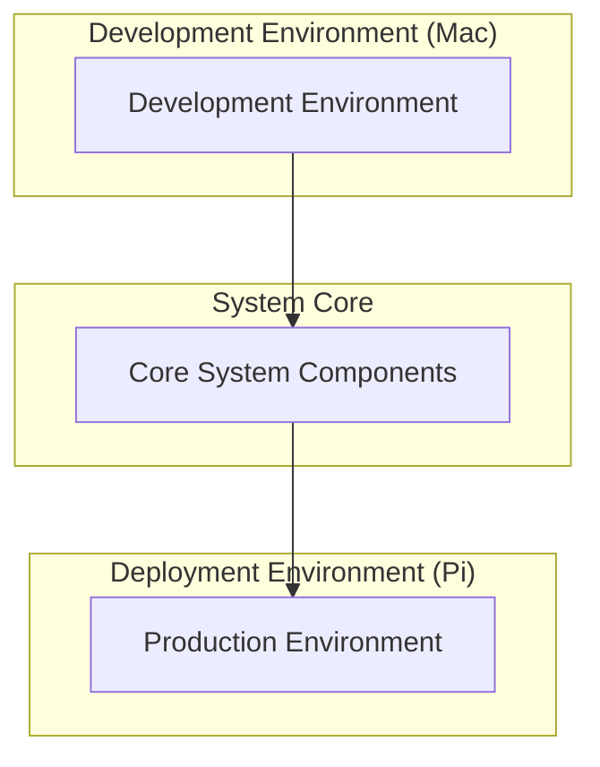

# Master System Architecture Document

**Created**: 2025 08 08

## Master Diagram Header

**Master Diagram ID**: Master_System_Architecture_GTach
**Category**: System Architecture
**Version**: 1.0
**Status**: Draft
**Created**: 2025 08 08
**Last Updated**: 2025 08 08
**Authority Level**: Master Document - Single Source of Truth

## Purpose and Authority

### Master Document Purpose
This master document serves as the authoritative single source of truth for the GTach system architecture, defining the complete system structure, functional domain organization, cross-platform abstraction layers, and high-level integration patterns that govern all subsidiary architectural documentation.

### Scope of Authority
This master document definitively governs:
- Overall system structure and functional domain boundaries
- Cross-platform development and deployment architecture
- High-level component relationships and integration patterns
- System-wide architectural principles and design constraints
- Authoritative reference for all subsidiary architecture diagrams

### Subsidiary Document Coordination
All subsidiary architecture diagrams must maintain consistency with this master document and reference this document as their authoritative source for system-level architectural decisions and component relationships.

## System Overview

### Master System View
[To be developed: Highest level view of the GTach system showing functional domains, cross-platform abstractions, and deployment architecture]

### Architectural Principles
[To be developed: Core architectural principles including cross-platform compatibility, embedded systems constraints, and development workflow integration]

### Integration Points
[To be developed: Critical integration points between functional domains, platform abstraction layers, and hardware interfaces]

## Master Visual Documentation

### Primary Master Diagram

### Supporting Master Views
[Additional master-level diagrams as system architecture develops]

### Master Legend and Notation
- **Functional Domain**: [Major system functional areas]
- **Platform Abstraction**: [Cross-platform compatibility layers]
- **Integration Point**: [Critical system integration boundaries]
- **Authority Level**: [Master document authoritative elements]

## Subsidiary Document Governance

### Subsidiary Document Registry
[To be populated as subsidiary architecture diagrams are created]

### Abstraction Level Management
All subsidiary architecture diagrams must maintain consistent abstraction levels that provide detailed views of components shown at high level in this master document.

### Consistency Requirements
Subsidiary diagrams must:
- Reference this master document as authoritative source
- Maintain consistent component naming and relationships
- Align with architectural principles defined in this master
- Coordinate updates through master document change procedures

### Update Coordination Procedures
Changes to this master document require:
- Impact assessment on all subsidiary architecture diagrams
- Validation of continued consistency across architectural documentation
- Coordination with cross-platform development requirements
- Integration with hardware interface specifications

## Cross-Platform Master Specifications

### Development Environment Authority
[To be developed: Authoritative specification of Mac development environment architecture]

### Deployment Environment Authority
[To be developed: Authoritative specification of Raspberry Pi deployment environment architecture]

### Platform Abstraction Definition
[To be developed: Definitive specification of cross-platform abstraction layers and compatibility mechanisms]

## Integration with Project Architecture

### Protocol Authority
This master document authoritatively supports:
- Protocol 1 project structure through architectural alignment
- Protocol 6 cross-platform development through abstraction definition
- Protocol 10 hardware documentation through interface specification

### Implementation Authority
This master document definitively guides:
- System component implementation approaches
- Cross-platform compatibility requirements
- Hardware integration patterns

### Testing Authority
This master document establishes:
- Multi-layer testing architecture requirements
- Cross-platform validation procedures
- System integration testing approaches

## Master Document Maintenance

### Authority Validation Procedures
This master document authority is validated through:
- Quarterly review of system architecture accuracy
- Validation against current implementation specifications
- Cross-platform compatibility verification
- Hardware integration requirement confirmation

### Update Authorization Requirements
Changes to this master document require:
- Technical review by system architect
- Impact assessment on subsidiary documentation
- Validation of cross-platform compatibility implications
- Integration with protocol requirement changes

### Subsidiary Impact Assessment
Master document changes require assessment of impact on:
- All subsidiary architecture diagrams
- Component interaction specifications
- Hardware interface definitions
- Cross-platform implementation requirements

### Version Control Authority
Master document changes are tracked through:
- Git version control with detailed change rationale
- Cross-reference to related implementation changes
- Integration with iteration-based development workflow
- Coordination with protocol update procedures

## Quality Assurance and Governance

### Master Document Review Requirements
This master document undergoes:
- Monthly accuracy validation against implementation
- Quarterly comprehensive review for completeness
- Annual architectural assessment for evolution needs
- Integration validation with hardware specifications

### Conflict Resolution Procedures
Conflicts between this master document and other documentation are resolved by:
- Establishing master document authority precedence
- Technical review of conflicting specifications
- Integration assessment with project requirements
- Update coordination across affected documentation

### Authority Verification
Master document authority is verified through:
- Implementation consistency validation
- Cross-platform compatibility confirmation
- Hardware integration requirement alignment
- Protocol compliance verification

### Completeness Validation
Master document completeness is ensured through:
- Coverage verification of all system components
- Cross-platform requirement specification completeness
- Hardware integration pattern definition completeness
- Subsidiary document governance adequacy

## References and Dependencies

### Authoritative Sources
- Protocol 1: Project Structure Standards
- Protocol 6: Cross-Platform Development Standards
- Protocol 10: Hardware Documentation and Integration Standards

### Governed Documents
[To be populated as subsidiary architecture diagrams are created]

### External Authority References
- Raspberry Pi hardware specifications
- Mac development environment requirements
- GPIO interface standards

---

**Master Document Status**: Draft - Requires Development
**Authority Verification Date**: 2025-08-08
**Next Master Review**: 2025-09-08
**Subsidiary Coordination Status**: No subsidiaries yet created
