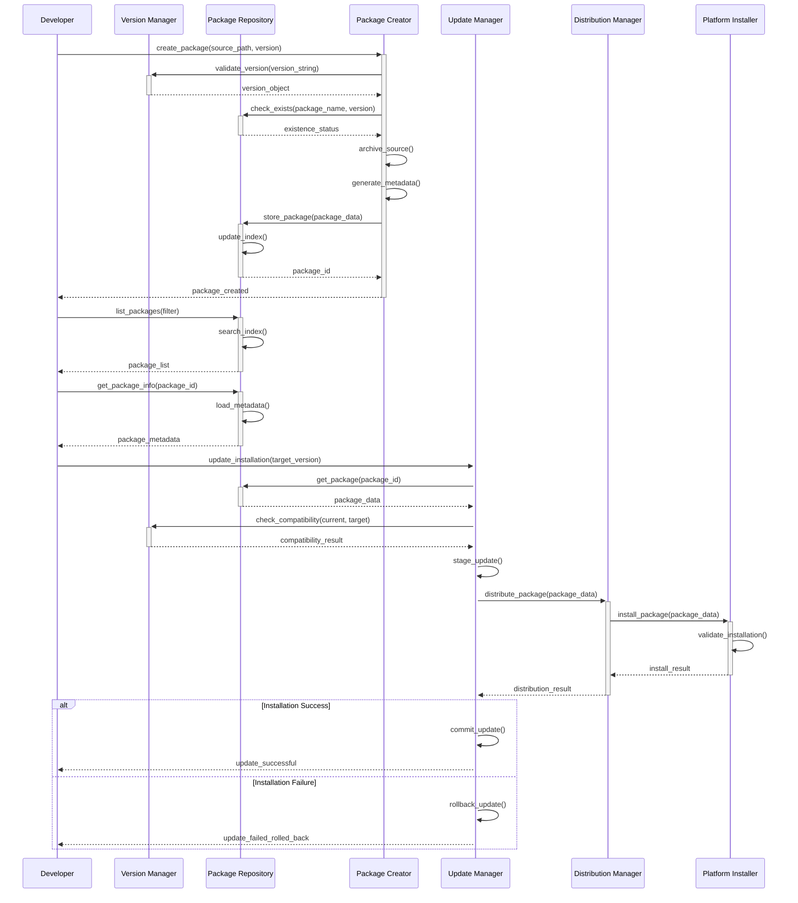
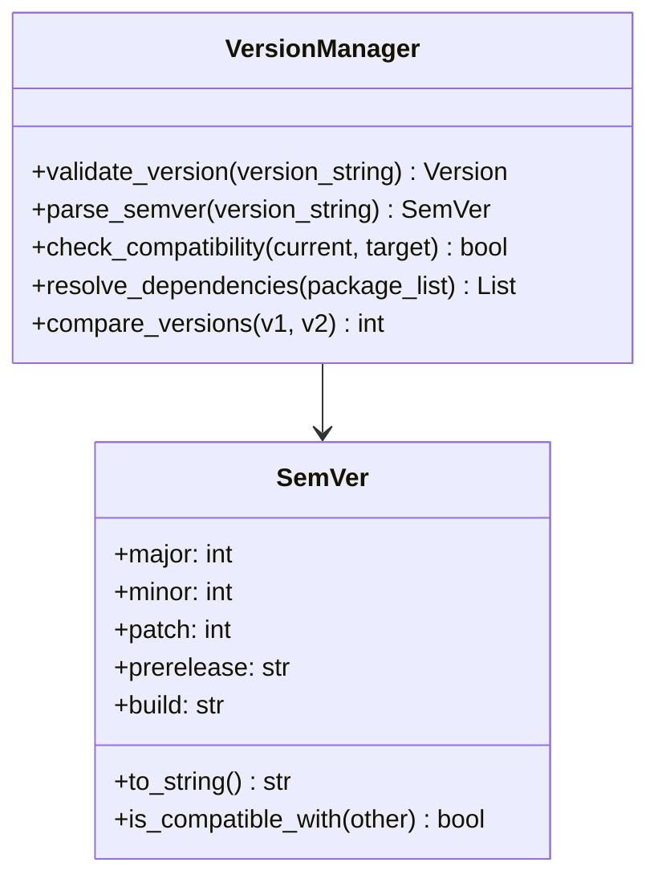
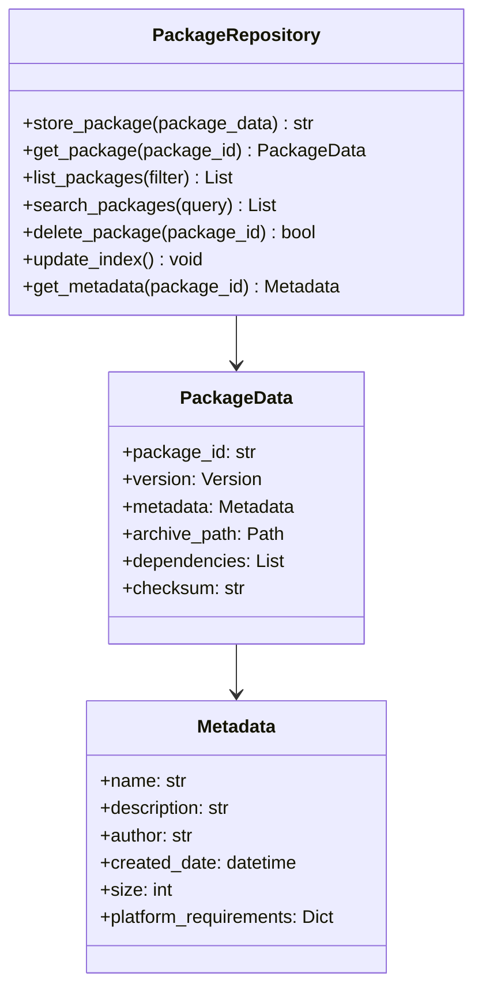
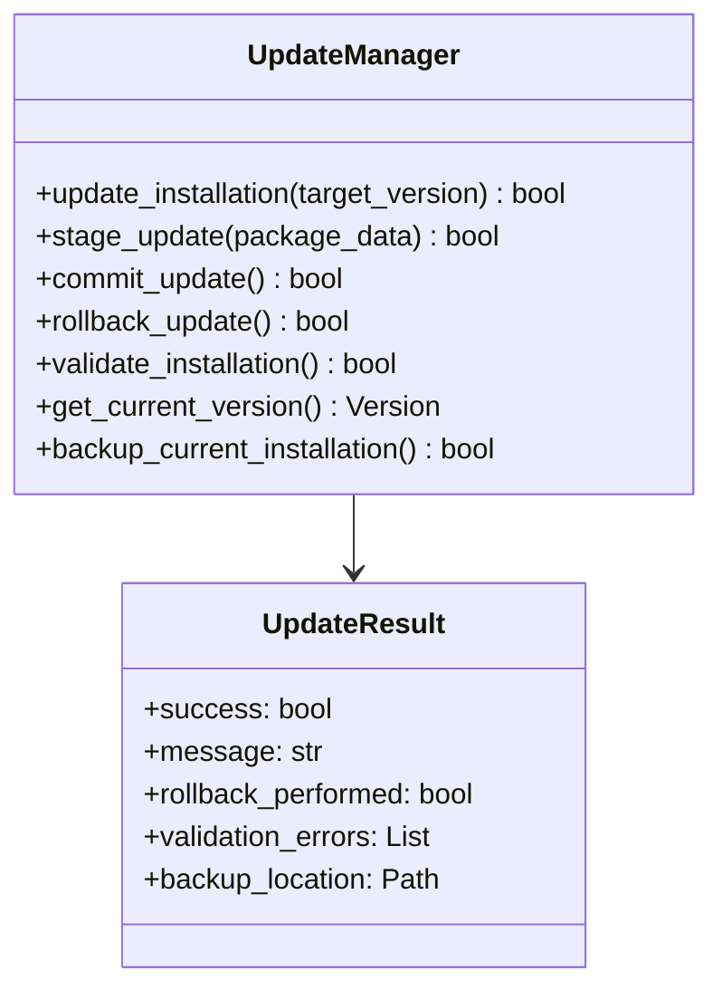

# Provisioning Component Interaction Diagram

**Created**: 2025 08 08

## Diagram Header

**Diagram ID**: Provisioning_Component_Interaction_GTach
**Category**: Component Interaction (Subsidiary)
**Version**: 1.0
**Status**: Active
**Created**: 2025 08 08
**Last Updated**: 2025 08 08
**Master Document Reference**: Master_Provisioning_System_Architecture_GTach

## Purpose

This subsidiary diagram provides detailed component interaction specifications for the GTach provisioning system, showing interface contracts, data flow patterns, and communication protocols between provisioning components as defined in the master provisioning system architecture document.

## Component Interaction Overview

### Primary Component Relationships
This diagram details the specific interfaces and interaction patterns between Version Manager, Package Repository, Update Manager, and supporting components within the provisioning system architecture.

### Master Document Alignment
All component interactions shown align with the master provisioning system architecture and provide implementation-level detail for the high-level patterns defined in the authoritative master document.

## Visual Documentation

### Component Interaction Diagram

### Interface Specifications

#### Version Manager Interfaces

#### Package Repository Interfaces

#### Update Manager Interfaces

### Data Flow Patterns

#### Package Creation Data Flow
1. **Source Analysis**: Source code validation and dependency extraction
2. **Version Processing**: SemVer validation and compatibility checking
3. **Archive Generation**: Compressed package creation with integrity validation
4. **Metadata Creation**: Package information and dependency specification
5. **Repository Storage**: Index update and package registration

#### Update Management Data Flow
1. **Compatibility Assessment**: Version comparison and dependency validation
2. **Package Retrieval**: Repository lookup and package acquisition
3. **Staging**: Temporary installation preparation and validation
4. **Installation**: System deployment with hardware interface validation
5. **Verification**: Operational testing and rollback decision
6. **Commitment**: Final installation or automatic rollback

### Cross-Platform Integration Patterns

#### Development Environment (Mac) Interactions
- Mock hardware interface validation during package creation
- Repository operations using local file system storage
- Version management with cross-platform compatibility checking

#### Deployment Environment (Pi) Interactions
- Real hardware interface validation during installation
- Platform-specific dependency resolution and system integration
- GPIO interface testing and operational verification

## Component Communication Protocols

### Synchronous Operations
- Version validation and parsing
- Package existence checking
- Compatibility assessment
- Installation validation

### Asynchronous Operations
- Package archive creation
- Repository index updates
- Distribution and transfer
- Hardware interface testing

### Error Handling Patterns
- Graceful degradation with detailed error reporting
- Automatic rollback on critical failures
- Comprehensive logging with session timestamps
- Cross-platform error code standardization

## Integration Requirements

### Thread Safety
All component interactions implement thread-safe operations with appropriate locking mechanisms and atomic operations for concurrent access scenarios.

### Cross-Platform Compatibility
Component interfaces maintain identical behavior across Mac development and Pi deployment environments through standardized API contracts and platform abstraction.

### Protocol Compliance
Component interactions comply with:
- Protocol 6 cross-platform development standards
- Protocol 8 logging and debug requirements
- Protocol 10 hardware interface validation

## Master Document Coordination

### Consistency Maintenance
This subsidiary diagram maintains consistency with the master provisioning system architecture through:
- Aligned component naming and responsibility definitions
- Consistent interface specifications and data flow patterns
- Coordinated abstraction levels and integration requirements

### Update Coordination
Changes to this diagram coordinate with the master document through:
- Impact assessment on master architecture patterns
- Validation of continued alignment with provisioning workflows
- Integration with cross-platform development requirements

## References

### Master Document Authority
- Master_Provisioning_System_Architecture_GTach: Authoritative source for provisioning system structure

### Implementation References
- src/provisioning/version_manager.py: Version management implementation
- src/provisioning/package_repository.py: Repository management implementation
- src/provisioning/update_manager.py: Update mechanism implementation

### Protocol Dependencies
- Protocol 6: Cross-Platform Development Standards
- Protocol 8: Logging and Debug Standards
- Protocol 10: Hardware Documentation and Integration Standards

---

**Diagram Status**: Active
**Master Document Alignment**: Verified 2025-08-08
**Next Review**: 2025-09-08
