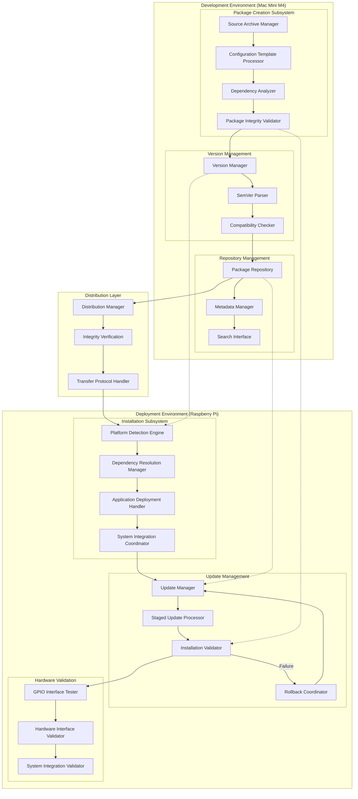

# Master Provisioning System Architecture Document

**Created**: 2025 08 08

## Master Diagram Header

**Master Diagram ID**: Master_Provisioning_System_Architecture_GTach
**Category**: Provisioning System Architecture
**Version**: 1.0
**Status**: Active
**Created**: 2025 08 08
**Last Updated**: 2025 08 08
**Authority Level**: Master Document - Single Source of Truth

## Purpose and Authority

### Master Document Purpose
This master document serves as the authoritative single source of truth for the GTach provisioning system architecture, defining the complete package management workflow, cross-platform deployment patterns, and integration mechanisms that govern all subsidiary provisioning documentation.

### Scope of Authority
This master document definitively governs:
- Package creation, distribution, and installation architecture
- Version management and semantic versioning workflows
- Repository management and package storage systems
- Update mechanisms with rollback safety procedures
- Cross-platform provisioning from Mac development to Raspberry Pi deployment
- Authoritative reference for all subsidiary provisioning diagrams

### Subsidiary Document Coordination
All subsidiary provisioning diagrams must maintain consistency with this master document and reference this document as their authoritative source for provisioning architectural decisions and workflow patterns.

## System Overview

### Master Provisioning Architecture
The GTach provisioning system implements a comprehensive package management architecture enabling reliable deployment from Mac development environments to Raspberry Pi production targets through automated package creation, semantic versioning, repository management, and safe update procedures.

### Architectural Principles
- **Reliability**: Automated deployment with comprehensive validation and rollback capabilities
- **Cross-Platform Compatibility**: Seamless Mac development to Pi production workflows
- **Version Management**: SemVer-compliant versioning with dependency resolution
- **Safety**: Staged updates with automatic rollback on failure
- **Integration**: Seamless integration with existing project protocols and workflows

### Integration Points
- Development workflow integration through Claude Desktop and Claude Code
- Version control coordination with GitHub Desktop per Protocol 5
- Cross-platform compatibility with Protocol 6 standards
- Hardware interface validation per Protocol 10 specifications

## Master Visual Documentation

### Primary Master Diagram

### Master Architecture Layers

#### Layer 1: Development Environment (Mac Mini M4)
**Package Creation Subsystem**: Automated package generation with source archival, configuration templating, dependency analysis, and integrity validation.

**Version Management**: SemVer-compliant versioning with parsing, compatibility checking, and dependency resolution.

**Repository Management**: Local package storage with metadata indexing, search capabilities, and distribution coordination.

#### Layer 2: Distribution Layer
**Distribution Management**: Secure package transfer with integrity verification and cross-platform protocol handling.

#### Layer 3: Deployment Environment (Raspberry Pi)
**Installation Subsystem**: Platform detection, dependency resolution, application deployment, and system integration.

**Update Management**: Staged update processing with validation and automatic rollback capabilities.

**Hardware Validation**: GPIO interface testing and hardware integration validation per Protocol 10 specifications.

### Master Data Flow Patterns

#### Primary Flow: Package Creation → Repository → Distribution → Installation
1. Source code collection and configuration processing
2. Version assignment and dependency analysis
3. Package integrity validation and repository storage
4. Secure distribution to target environment
5. Platform detection and dependency resolution
6. Application deployment and system integration
7. Hardware interface validation and operational verification

#### Secondary Flow: Update Management with Rollback Safety
1. Version compatibility assessment
2. Staged update preparation
3. Installation validation and testing
4. Hardware interface verification
5. Automatic rollback on failure detection

### Master Legend and Notation
- **Solid Arrows**: Primary data flow and process progression
- **Dashed Arrows**: Cross-platform integration and coordination
- **Subsystem Boundaries**: Functional domain organization
- **Environment Boundaries**: Platform-specific implementations

## Cross-Platform Master Specifications

### Development Environment Authority
**Mac Mini M4 Responsibilities**: Package creation, version management, repository operations, and distribution initiation using mock hardware interfaces for validation.

**Development Tools Integration**: Seamless integration with Claude Desktop workflow coordination, Claude Code implementation execution, and GitHub Desktop version control per established protocols.

### Deployment Environment Authority
**Raspberry Pi Responsibilities**: Package installation, dependency resolution, hardware interface configuration, and operational validation using actual GPIO interfaces per Protocol 10 specifications.

**Production Configuration**: Platform-specific dependency resolution, hardware interface validation, and system service integration for embedded environment operation.

### Platform Abstraction Definition
**Configuration Management**: JSON-based platform detection with environment-specific configuration loading and cross-platform compatibility validation.

**Hardware Abstraction**: Mock implementations for Mac development with real hardware interfaces for Pi deployment, maintaining identical API contracts across platforms.

## Integration with Project Architecture

### Protocol Authority
This master document authoritatively supports:
- **Protocol 1**: Project structure alignment through standardized package organization
- **Protocol 5**: GitHub Desktop integration through version control coordination
- **Protocol 6**: Cross-platform development through Mac-to-Pi deployment workflows
- **Protocol 10**: Hardware documentation through interface validation requirements

### Implementation Authority
This master document definitively guides:
- Package creation and distribution procedures
- Version management and semantic versioning implementation
- Repository management and metadata handling
- Update mechanisms with rollback safety procedures

### Testing Authority
This master document establishes:
- Multi-layer testing integration with provisioning workflows
- Cross-platform validation requirements for package deployment
- Hardware interface testing integration with installation procedures

## Subsidiary Document Governance

### Subsidiary Document Registry
- **Provisioning Component Interaction Diagram**: Detailed component interfaces and data flow
- **Provisioning Data Flow Diagram**: Comprehensive workflow and process visualization
- **Version Management Diagram**: SemVer implementation and compatibility workflows
- **Repository Management Diagram**: Package storage and metadata operations
- **Update Management Diagram**: Staged updates and rollback procedures

### Abstraction Level Management
Subsidiary diagrams provide detailed component-level views while maintaining consistency with master architecture patterns and cross-platform integration requirements.

### Consistency Requirements
Subsidiary diagrams must:
- Reference this master document as authoritative source
- Maintain consistent component naming and interface specifications
- Align with provisioning workflows defined in this master
- Coordinate updates through master document change procedures

### Update Coordination Procedures
Changes to this master document require:
- Impact assessment on all subsidiary provisioning diagrams
- Validation of continued consistency across provisioning documentation
- Coordination with cross-platform development requirements
- Integration with hardware interface specifications

## Master Document Maintenance

### Authority Validation Procedures
This master document authority is validated through:
- Monthly review against implementation in src/provisioning/
- Quarterly assessment of cross-platform deployment effectiveness
- Validation of version management and repository operations
- Hardware interface integration verification per Protocol 10

### Update Authorization Requirements
Changes to this master document require:
- Technical review by system architect
- Impact assessment on subsidiary documentation
- Validation of cross-platform compatibility implications
- Integration with provisioning system evolution

### Subsidiary Impact Assessment
Master document changes require assessment of impact on:
- All subsidiary provisioning diagrams
- Component interaction specifications
- Data flow and process documentation
- Cross-platform implementation requirements

### Version Control Authority
Master document changes are tracked through:
- Git version control with detailed change rationale
- Cross-reference to provisioning implementation changes
- Integration with iteration-based development workflow
- Coordination with protocol update procedures

## Quality Assurance and Governance

### Master Document Review Requirements
This master document undergoes:
- Monthly accuracy validation against provisioning implementation
- Quarterly comprehensive review for workflow completeness
- Annual architectural assessment for evolution needs
- Integration validation with hardware specifications

### Conflict Resolution Procedures
Conflicts between this master document and other documentation are resolved by:
- Establishing master document authority precedence for provisioning workflows
- Technical review of conflicting specifications
- Integration assessment with project requirements
- Update coordination across affected documentation

### Authority Verification
Master document authority is verified through:
- Implementation consistency validation in src/provisioning/
- Cross-platform deployment workflow confirmation
- Version management and repository operation alignment
- Hardware interface integration verification

### Completeness Validation
Master document completeness is ensured through:
- Coverage verification of all provisioning components
- Cross-platform requirement specification completeness
- Workflow and process definition completeness
- Subsidiary document governance adequacy

## References and Dependencies

### Authoritative Sources
- Protocol 1: Project Structure Standards
- Protocol 5: GitHub Desktop Workflow Integration
- Protocol 6: Cross-Platform Development Standards
- Protocol 10: Hardware Documentation and Integration Standards

### Implementation References
- Design_001_Application_Provisioning_System.md
- Design_003_Advanced_Provisioning_Features.md
- Synopsis_001_Package_Structure_Implementation.md
- Synopsis_003_Advanced_Provisioning_Features.md

### External Authority References
- Semantic Versioning (SemVer) specifications
- Raspberry Pi hardware documentation
- Mac development environment requirements

---

**Master Document Status**: Active
**Authority Verification Date**: 2025-08-08
**Next Master Review**: 2025-09-08
**Subsidiary Coordination Status**: Ready for subsidiary creation
