# Hardware Interface Specifications

**Created**: 2025 08 20

## Diagram Header

**Diagram ID**: Hardware_Interface_Specifications_GTach
**Category**: Hardware Interface Documentation
**Version**: 1.0
**Status**: Active
**Created**: 2025 08 20
**Last Updated**: 2025 08 20
**Master Document Reference**: Master_System_Architecture_GTach

## Purpose

This hardware interface diagram provides comprehensive specifications for GTach hardware integration, showing GPIO interfaces, HyperPixel display connections, touch interface protocols, and cross-platform hardware abstraction patterns as defined in the master system architecture.

## Hardware Interface Overview

### Interface Architecture
The hardware interface system implements comprehensive GPIO control, HyperPixel 2.0 Round display integration, capacitive touch interface management, and Bluetooth hardware coordination with cross-platform abstraction enabling Mac development mocking and Raspberry Pi production deployment.

### Master Document Alignment
This hardware interface specification aligns with the master system architecture Hardware Interfaces domain and provides detailed implementation specifications for GPIO control, display integration, and touch interface management shown at high level in the authoritative master document.

## Visual Documentation

### Hardware Interface Architecture Diagram

```mermaid
flowchart TD
    subgraph "Hardware Abstraction Layer"
        HardwareInterface[Hardware Interface Controller]
        PlatformDetection[Platform Detection Engine]
        InterfaceFactory[Interface Factory]
    end
    
    subgraph "GPIO Interface Management"
        GPIOController[GPIO Controller]
        PinManager[Pin Manager]
        StateController[State Controller]
        InterruptHandler[Interrupt Handler]
    end
    
    subgraph "Display Hardware Interface"
        HyperPixelDriver[HyperPixel 2.0 Round Driver]
        DisplayController[Display Controller]
        SurfaceManager[Surface Manager]
        RefreshController[Refresh Controller]
    end
    
    subgraph "Touch Interface Management"
        TouchDriver[Touch Driver]
        TouchController[Touch Controller]
        GestureProcessor[Gesture Processor]
        CalibrationManager[Calibration Manager]
    end
    
    subgraph "Bluetooth Hardware Interface"
        BluetoothHW[Bluetooth Hardware Controller]
        RFController[RF Controller]
        PairingHW[Pairing Hardware]
        ConnectionManager[Connection Manager]
    end
    
    subgraph "Cross-Platform Hardware Abstraction"
        subgraph "Mac Development Mocks"
            MockGPIO[Mock GPIO Controller]
            MockDisplay[Mock Display Interface]
            MockTouch[Mock Touch Interface]
            MockBluetooth[Mock Bluetooth HW]
        end
        
        subgraph "Raspberry Pi Hardware"
            RealGPIO[Raspberry Pi GPIO]
            HyperPixelHW[HyperPixel Hardware]
            TouchHW[Touch Hardware]
            BluetoothRealHW[Bluetooth Real HW]
        end
    end
    
    subgraph "Hardware Configuration"
        HardwareConfig[Hardware Configuration]
        PinMapping[Pin Mapping]
        InterfaceConfig[Interface Configuration]
        CalibrationData[Calibration Data]
    end
    
    %% Hardware Abstraction Flow
    HardwareInterface --> PlatformDetection
    PlatformDetection --> InterfaceFactory
    InterfaceFactory --> GPIOController
    InterfaceFactory --> HyperPixelDriver
    InterfaceFactory --> TouchDriver
    InterfaceFactory --> BluetoothHW
    
    %% GPIO Management Flow
    GPIOController --> PinManager
    PinManager --> StateController
    StateController --> InterruptHandler
    InterruptHandler --> GPIOController
    
    %% Display Interface Flow
    HyperPixelDriver --> DisplayController
    DisplayController --> SurfaceManager
    SurfaceManager --> RefreshController
    RefreshController --> HyperPixelDriver
    
    %% Touch Interface Flow
    TouchDriver --> TouchController
    TouchController --> GestureProcessor
    GestureProcessor --> CalibrationManager
    CalibrationManager --> TouchDriver
    
    %% Bluetooth Hardware Flow
    BluetoothHW --> RFController
    RFController --> PairingHW
    PairingHW --> ConnectionManager
    ConnectionManager --> BluetoothHW
    
    %% Cross-Platform Hardware Selection
    InterfaceFactory -->|Mac| MockGPIO
    InterfaceFactory -->|Mac| MockDisplay
    InterfaceFactory -->|Mac| MockTouch
    InterfaceFactory -->|Mac| MockBluetooth
    
    InterfaceFactory -->|Pi| RealGPIO
    InterfaceFactory -->|Pi| HyperPixelHW
    InterfaceFactory -->|Pi| TouchHW
    InterfaceFactory -->|Pi| BluetoothRealHW
    
    %% Hardware Configuration Integration
    HardwareConfig --> PinMapping
    PinMapping --> GPIOController
    InterfaceConfig --> HyperPixelDriver
    InterfaceConfig --> TouchDriver
    CalibrationData --> CalibrationManager
    
    %% Mock Hardware Connections (Development)
    MockGPIO -.->|Development| GPIOController
    MockDisplay -.->|Development| DisplayController
    MockTouch -.->|Development| TouchController
    MockBluetooth -.->|Development| RFController
    
    %% Real Hardware Connections (Production)
    RealGPIO -->|Production| GPIOController
    HyperPixelHW -->|Production| DisplayController
    TouchHW -->|Production| TouchController
    BluetoothRealHW -->|Production| RFController
```



### Hardware Specifications

#### HyperPixel 2.0 Round Display Interface
**Display Specifications**:
- **Resolution**: 480x480 pixels circular display
- **Interface**: SPI communication protocol
- **GPIO Pins**: CS, DC, RST, BL control pins
- **Touch Interface**: I2C capacitive touch controller
- **Power Requirements**: 3.3V operation with 5V backlight

**Pin Assignments**:
```
SPI Display Interface:
- MOSI: GPIO 10 (SPI0 MOSI)
- SCLK: GPIO 11 (SPI0 SCLK)
- CS: GPIO 8 (SPI0 CS0)
- DC: GPIO 24
- RST: GPIO 25
- BL: GPIO 18 (PWM0)

I2C Touch Interface:
- SDA: GPIO 2 (I2C1 SDA)
- SCL: GPIO 3 (I2C1 SCL)
- INT: GPIO 27
- RST: GPIO 17
```

#### GPIO Interface Specifications
**GPIO Controller Requirements**:
- **Pin Control**: Digital I/O with pull-up/pull-down configuration
- **Interrupt Support**: Edge detection and interrupt handling
- **PWM Support**: Hardware PWM for backlight control
- **Thread Safety**: Concurrent access protection

**Interface Patterns**:
- Mock implementations for Mac development testing
- Real GPIO access for Pi production deployment
- Common API abstraction across platforms
- Configuration-driven pin mapping

#### Touch Interface Protocol
**Touch Controller Specifications**:
- **Protocol**: I2C communication with interrupt-driven events
- **Resolution**: Multi-touch with gesture recognition
- **Calibration**: Software calibration with persistent storage
- **Refresh Rate**: 60Hz touch sampling rate

**Gesture Support**:
- Single tap, double tap detection
- Swipe gesture recognition (up/down/left/right)
- Circular gesture recognition for round display
- Pressure sensitivity and touch area detection

#### Bluetooth Hardware Interface
**Bluetooth Controller Requirements**:
- **Protocol**: Bluetooth Low Energy (BLE) support
- **Range**: Class 2 operation (10 meters)
- **Pairing**: Secure pairing with PIN authentication
- **Power Management**: Low power modes for battery optimization

## Cross-Platform Hardware Abstraction

### Development Environment (Mac)
**Mock Hardware Implementation**:
- GPIO simulation with state tracking and validation
- Display simulation with pixel buffer rendering
- Touch simulation with mouse/trackpad input mapping
- Bluetooth simulation with virtual device pairing

**Development Benefits**:
- Complete hardware testing without physical hardware
- Rapid development iteration and debugging
- Comprehensive test coverage with mock validation
- Cross-platform development workflow support

### Production Environment (Raspberry Pi)
**Real Hardware Integration**:
- Direct GPIO access through /dev/mem and sysfs interfaces
- SPI/I2C hardware protocol implementation
- Hardware interrupt handling and event processing
- Power management and thermal monitoring

**Production Optimization**:
- Hardware-specific performance optimization
- Resource utilization monitoring and management
- Thermal throttling and power management
- Hardware failure detection and recovery

## Integration with Project Architecture

### Protocol Authority
This hardware interface specification supports:
- **Protocol 1**: Project structure through hardware documentation organization
- **Protocol 6**: Cross-platform development through hardware abstraction
- **Protocol 8**: Logging standards through hardware monitoring
- **Protocol 10**: Hardware documentation through comprehensive interface specifications

### Implementation Authority
This hardware interface specification guides:
- GPIO controller implementation and pin management
- Display driver integration and refresh management
- Touch interface implementation and gesture processing
- Bluetooth hardware integration and connection management

### Testing Authority
This hardware interface specification establishes:
- Hardware testing framework with mock implementations
- Cross-platform hardware validation procedures
- Interface protocol testing and validation
- Hardware integration testing requirements

## Master Document Coordination

### Consistency Maintenance
This hardware interface specification maintains consistency with the master system architecture through:
- Aligned interface specifications with master hardware domain
- Consistent abstraction patterns and implementation approaches
- Coordinated integration with display, communication, and core domains

### Update Coordination
Changes to this hardware interface specification coordinate with the master document through:
- Impact assessment on hardware-dependent system components
- Validation of continued alignment with cross-platform requirements
- Integration with hardware documentation standards

## References

### Master Document Authority
- Master_System_Architecture_GTach: Authoritative source for hardware interface integration

### Hardware Specifications
- doc/hardware/specifications/hyperpixel/: HyperPixel hardware specifications
- doc/hardware/interfaces/hyperpixel/: HyperPixel interface documentation
- doc/hardware/deployment/hyperpixel/: HyperPixel deployment procedures

### Implementation References
- src/obdii/display/hardware_interface.py: Hardware interface implementation
- Hyperpixel_Round_PIM579_Pinout.png: Hardware pinout specifications

### Protocol Dependencies
- Protocol 1: Project Structure Standards
- Protocol 6: Cross-Platform Development Standards
- Protocol 8: Logging and Debug Standards
- Protocol 10: Hardware Documentation and Integration Standards

---

**Diagram Status**: Active
**Master Document Alignment**: Verified 2025-08-20
**Next Review**: 2025-09-20

---

**Copyright**: Copyright (c) 2025 William Watson. This work is licensed under the MIT License.
