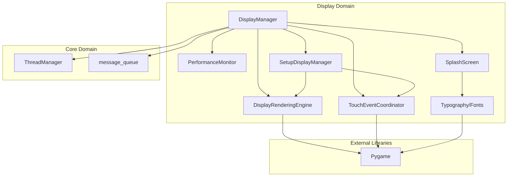
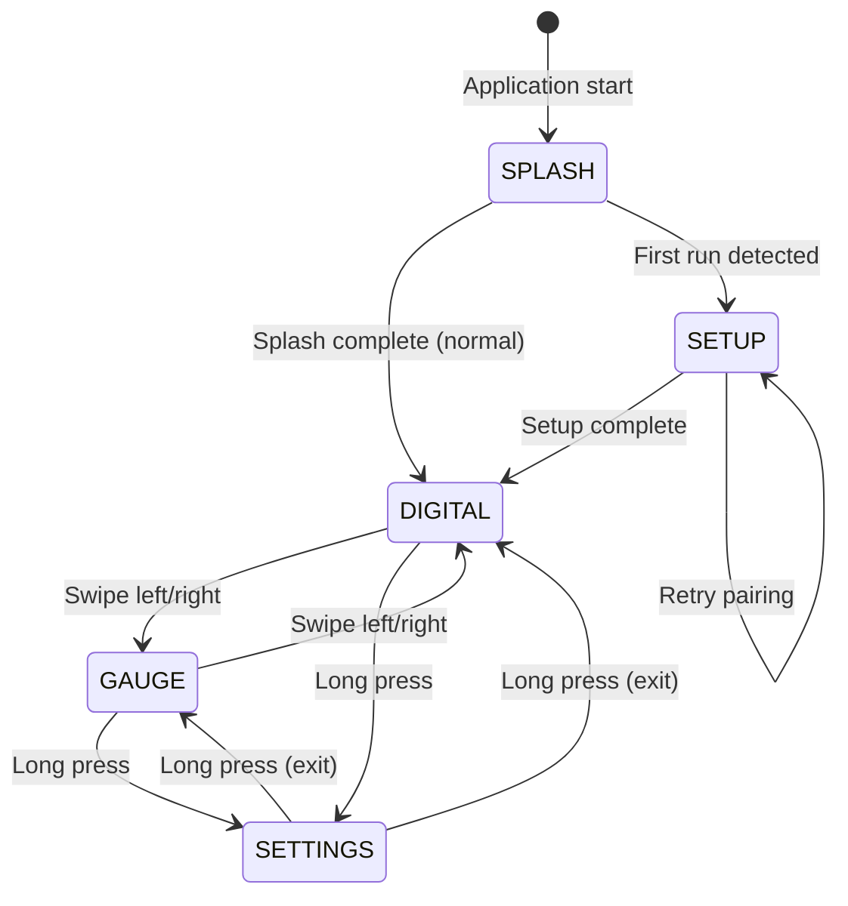
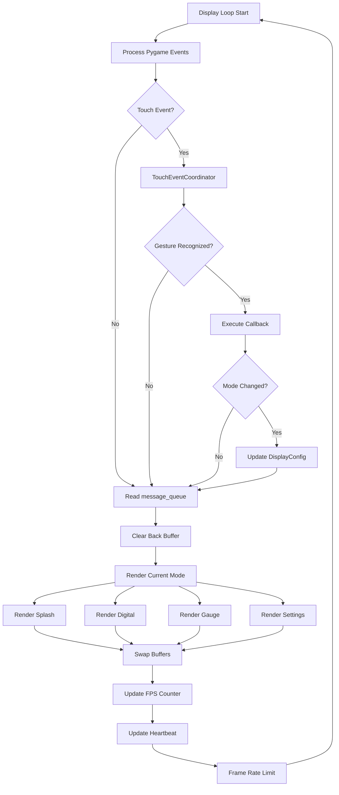
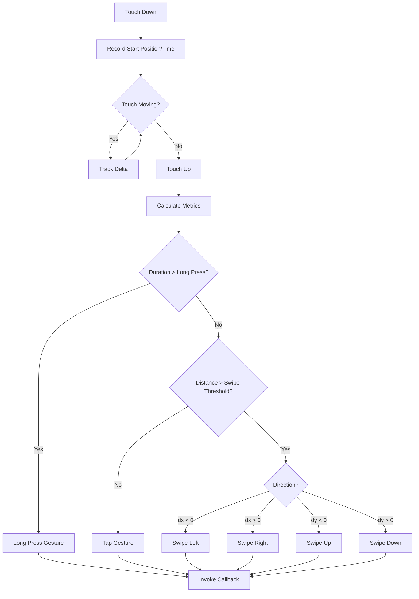

# Domain Design: Display

Created: 2025-12-29

---

## Table of Contents

- [1.0 Document Information](<#1.0 document information>)
- [2.0 Domain Overview](<#2.0 domain overview>)
- [3.0 Domain Boundaries](<#3.0 domain boundaries>)
- [4.0 Components](<#4.0 components>)
- [5.0 Interfaces](<#5.0 interfaces>)
- [6.0 Data Design](<#6.0 data design>)
- [7.0 Error Handling](<#7.0 error handling>)
- [8.0 Visual Documentation](<#8.0 visual documentation>)
- [9.0 Tier 3 Component Documents](<#9.0 tier 3 component documents>)
- [Version History](<#version history>)

---

## 1.0 Document Information

```yaml
document_info:
  document_id: "design-2c6b8e4d-domain_display"
  tier: 2
  domain: "Display"
  parent: "design-0000-master_gtach.md"
  version: "1.0"
  date: "2025-12-29"
  author: "William Watson"
```

### 1.1 Parent Reference

- **Master Design**: [design-0000-master_gtach.md](<design-0000-master_gtach.md>)

[Return to Table of Contents](<#table of contents>)

---

## 2.0 Domain Overview

### 2.1 Purpose

The Display domain manages all visual output and touch input for the GTach application. It provides a component-based architecture for rendering tachometer displays, handling touch gestures, monitoring performance, and managing display modes. The domain targets the Pimoroni HyperPixel 2.1 Round display (480x480) with framebuffer rendering via Pygame.

### 2.2 Responsibilities

1. **Display Rendering**: Render digital and analog gauge displays at target frame rates
2. **Touch Input Handling**: Process touch events and recognize gestures (swipe, long press)
3. **Mode Management**: Switch between SPLASH, DIGITAL, GAUGE, and SETTINGS modes
4. **Performance Monitoring**: Track FPS and frame timing for optimization
5. **Splash Screen**: Display automotive-themed startup animation
6. **Setup Wizard**: Guide initial Bluetooth device pairing
7. **Typography Management**: Provide consistent font rendering across modes
8. **Double Buffering**: Prevent screen tearing via front/back buffer swapping

### 2.3 Domain Patterns

| Pattern | Implementation | Purpose |
|---------|---------------|---------|
| State Machine | DisplayMode enum | Display mode transitions |
| Observer | Gesture callbacks | Touch event notification |
| Strategy | Render modes (digital/gauge) | Switchable display styles |
| Double Buffer | RenderTarget enum | Tear-free rendering |
| Singleton | FontManager | Consistent font access |
| Component | Extracted subsystems | Modular architecture |

[Return to Table of Contents](<#table of contents>)

---

## 3.0 Domain Boundaries

### 3.1 Internal Boundaries

```yaml
location: "src/gtach/display/"
modules:
  - "__init__.py: Package exports"
  - "manager.py: DisplayManager orchestrator"
  - "models.py: DisplayMode, DisplayConfig, ConnectionStatus"
  - "rendering.py: DisplayRenderingEngine, RenderTarget"
  - "input.py: TouchEventCoordinator, TouchAction, GestureType"
  - "performance.py: PerformanceMonitor"
  - "splash.py: SplashScreen"
  - "setup_manager.py: SetupDisplayManager"
  - "setup_models.py: Setup-specific data models"
  - "typography.py: FontManager, ButtonRenderer"
  - "touch.py: TouchHandler (legacy)"
  - "navigation_gestures.py: NavigationGestureHandler, GestureConfig"
```

### 3.2 External Dependencies

| Dependency | Type | Purpose |
|------------|------|---------|
| pygame | Third-party | Display rendering, event handling |
| yaml | Third-party (optional) | Configuration persistence |
| threading | Standard Library | Display thread management |
| time | Standard Library | Frame timing, animations |
| math | Standard Library | Gauge geometry calculations |
| logging | Standard Library | Structured logging |

### 3.3 Domain Dependencies

| Domain | Dependency Type | Usage |
|--------|-----------------|-------|
| Core | Required | ThreadManager for thread registration, message_queue for RPM data |
| Communication | Consumer | BluetoothManager state for connection display |
| Utilities | Required | TerminalRestorer for console state management |

[Return to Table of Contents](<#table of contents>)

---

## 4.0 Components

### 4.1 DisplayManager

```yaml
component:
  name: "DisplayManager"
  purpose: "Orchestrate display rendering, touch handling, and mode management"
  file: "manager.py"
  
  responsibilities:
    - "Initialize and coordinate display components"
    - "Manage display mode state machine"
    - "Run main display loop with frame timing"
    - "Delegate rendering to DisplayRenderingEngine"
    - "Delegate touch events to TouchEventCoordinator"
    - "Monitor performance via PerformanceMonitor"
    - "Handle splash screen and mode transitions"
  
  key_elements:
    - name: "DisplayManager"
      type: "class"
      purpose: "Main display orchestrator"
  
  dependencies:
    internal:
      - "DisplayRenderingEngine"
      - "TouchEventCoordinator"
      - "PerformanceMonitor"
      - "SplashScreen"
      - "DisplayConfig"
      - "DisplayMode"
    external:
      - "pygame"
      - "threading.Thread"
      - "threading.Event"
  
  processing_logic:
    - "Initialize components on construction"
    - "Register gesture callbacks for mode navigation"
    - "Display loop: process events → update state → render → swap buffers"
    - "Splash screen displays for configured duration (4s default)"
    - "Read RPM from ThreadManager.message_queue"
    - "Update heartbeat in loop iteration"
  
  error_conditions:
    - condition: "Pygame not available"
      handling: "Log error, set display_available = False"
    - condition: "Component initialization failure"
      handling: "Log error, attempt graceful degradation"
    - condition: "Rendering error"
      handling: "Log error, continue loop"
```

### 4.2 DisplayRenderingEngine

```yaml
component:
  name: "DisplayRenderingEngine"
  purpose: "Handle double-buffered framebuffer rendering"
  file: "rendering.py"
  
  responsibilities:
    - "Initialize Pygame display surface"
    - "Manage front/back buffer swapping"
    - "Render to back buffer without tearing"
    - "Present front buffer to display"
    - "Provide surface access for rendering operations"
  
  key_elements:
    - name: "DisplayRenderingEngine"
      type: "class"
      purpose: "Double-buffered renderer"
    - name: "RenderTarget"
      type: "enum"
      purpose: "FRONT_BUFFER, BACK_BUFFER selection"
  
  dependencies:
    internal: []
    external:
      - "pygame.display"
      - "pygame.Surface"
  
  processing_logic:
    - "Initialize with target resolution (480x480)"
    - "Create front and back buffer surfaces"
    - "Render operations target back buffer"
    - "swap_buffers() copies back to front, then flips display"
    - "Frame rate limiting via pygame.time.Clock"
  
  error_conditions:
    - condition: "Display initialization failure"
      handling: "Return False from initialize(), log error"
    - condition: "Buffer swap failure"
      handling: "Log error, attempt recovery"
```

### 4.3 TouchEventCoordinator

```yaml
component:
  name: "TouchEventCoordinator"
  purpose: "Process touch events and recognize gestures"
  file: "input.py"
  
  responsibilities:
    - "Track touch start/move/end events"
    - "Calculate gesture metrics (distance, velocity, duration)"
    - "Recognize gesture types (swipe left/right, long press, tap)"
    - "Invoke registered gesture callbacks"
    - "Provide touch state for rendering overlays"
  
  key_elements:
    - name: "TouchEventCoordinator"
      type: "class"
      purpose: "Gesture recognition engine"
    - name: "GestureType"
      type: "enum"
      purpose: "SWIPE_LEFT, SWIPE_RIGHT, LONG_PRESS, TAP, etc."
    - name: "TouchAction"
      type: "enum"
      purpose: "MODE_CHANGE, NAVIGATION, NONE, etc."
  
  dependencies:
    internal: []
    external:
      - "pygame.event"
      - "time.time"
  
  processing_logic:
    - "On touch down: record start position and time"
    - "On touch move: calculate delta, update tracking"
    - "On touch up: calculate gesture metrics"
    - "Classify gesture: distance > threshold = swipe, duration > threshold = long press"
    - "Direction: dx > 0 = right, dx < 0 = left"
    - "Invoke callback for recognized gesture type"
  
  error_conditions:
    - condition: "Callback raises exception"
      handling: "Log error, continue processing"
    - condition: "Invalid touch coordinates"
      handling: "Ignore event, log warning"
```

### 4.4 PerformanceMonitor

```yaml
component:
  name: "PerformanceMonitor"
  purpose: "Track display performance metrics"
  file: "performance.py"
  
  responsibilities:
    - "Calculate frames per second (FPS)"
    - "Track frame timing statistics"
    - "Detect performance degradation"
    - "Provide metrics for diagnostics"
  
  key_elements:
    - name: "PerformanceMonitor"
      type: "class"
      purpose: "FPS and timing tracker"
  
  dependencies:
    internal: []
    external:
      - "time.time"
      - "time.perf_counter"
      - "collections.deque"
  
  processing_logic:
    - "Record frame start/end times"
    - "Calculate rolling average FPS (last N frames)"
    - "Track min/max/avg frame times"
    - "Compare against target FPS (60 dev, 30 deploy)"
  
  error_conditions:
    - condition: "No frames recorded"
      handling: "Return default values (0 FPS)"
```

### 4.5 SplashScreen

```yaml
component:
  name: "SplashScreen"
  purpose: "Display automotive-themed startup animation"
  file: "splash.py"
  
  responsibilities:
    - "Render startup splash with branding"
    - "Display loading progress (optional)"
    - "Transition to main display after duration"
  
  key_elements:
    - name: "SplashScreen"
      type: "class"
      purpose: "Splash screen renderer"
  
  dependencies:
    internal:
      - "Typography (fonts)"
    external:
      - "pygame.Surface"
      - "time.time"
  
  processing_logic:
    - "Initialize with surface size and duration"
    - "Render background, logo, text"
    - "Track elapsed time"
    - "is_complete() returns True after duration"
  
  error_conditions:
    - condition: "Font loading failure"
      handling: "Use fallback system font"
```

### 4.6 SetupDisplayManager

```yaml
component:
  name: "SetupDisplayManager"
  purpose: "Manage initial Bluetooth pairing wizard UI"
  file: "setup_manager.py"
  
  responsibilities:
    - "Display device discovery progress"
    - "Show discovered Bluetooth devices"
    - "Handle device selection input"
    - "Display connection progress and status"
    - "Confirm successful pairing"
  
  key_elements:
    - name: "SetupDisplayManager"
      type: "class"
      purpose: "Setup wizard UI controller"
  
  dependencies:
    internal:
      - "DisplayRenderingEngine"
      - "TouchEventCoordinator"
    external:
      - "pygame"
  
  processing_logic:
    - "Show scanning animation during device discovery"
    - "List discovered devices with signal strength"
    - "Highlight selected device"
    - "Show connection progress spinner"
    - "Display success/failure result"
  
  error_conditions:
    - condition: "No devices found"
      handling: "Display 'No devices found' message, offer retry"
    - condition: "Connection failed"
      handling: "Display error, offer retry or back navigation"
```

[Return to Table of Contents](<#table of contents>)

---

## 5.0 Interfaces

### 5.1 DisplayManager Public Interface

```python
class DisplayManager:
    def __init__(self, thread_manager: ThreadManager,
                 terminal_restorer: TerminalRestorer = None,
                 config_path: str = 'config.yaml') -> None
    
    # Lifecycle
    def start(self) -> None
    def stop(self) -> None
    
    # Mode management
    @property
    def config(self) -> DisplayConfig
    def set_mode(self, mode: DisplayMode) -> None
    
    # Setup mode
    def enter_setup_mode(self) -> None
    def exit_setup_mode(self) -> None
    def is_in_setup_mode(self) -> bool
    
    # Component access
    @property
    def rendering_engine(self) -> DisplayRenderingEngine
    @property
    def touch_coordinator(self) -> TouchEventCoordinator
    @property
    def performance_monitor(self) -> PerformanceMonitor
```

### 5.2 DisplayRenderingEngine Public Interface

```python
class DisplayRenderingEngine:
    def initialize(self, size: Tuple[int, int]) -> bool
    def get_surface(self, target: RenderTarget = RenderTarget.BACK_BUFFER) -> pygame.Surface
    def swap_buffers(self) -> None
    def clear(self, color: Tuple[int, int, int] = (0, 0, 0)) -> None
    def shutdown(self) -> None
```

### 5.3 TouchEventCoordinator Public Interface

```python
class TouchEventCoordinator:
    def __init__(self, screen_size: Tuple[int, int]) -> None
    def process_event(self, event: pygame.event.Event) -> Optional[TouchAction]
    def register_gesture_callback(self, gesture: GestureType, 
                                  callback: Callable) -> None
    def unregister_gesture_callback(self, gesture: GestureType) -> None
    def get_touch_state(self) -> Dict[str, Any]
```

### 5.4 Inter-Domain Contracts

| Interface | Provider | Consumer | Contract |
|-----------|----------|----------|----------|
| message_queue | Core | Display | Display reads OBDResponse for RPM |
| data_available | Core | Display | Event set when new data ready |
| update_heartbeat() | Core | Display | Called in display loop |
| BluetoothState | Comm | Display | Connection status for UI |
| TerminalRestorer | Utils | Display | Console state for framebuffer |

[Return to Table of Contents](<#table of contents>)

---

## 6.0 Data Design

### 6.1 DisplayMode Enumeration

```yaml
entity:
  name: "DisplayMode"
  purpose: "Display mode state enumeration"
  
  values:
    - SPLASH: "Startup splash screen"
    - DIGITAL: "Digital numeric RPM display"
    - GAUGE: "Analog gauge RPM display"
    - SETTINGS: "Settings/configuration menu"
```

### 6.2 DisplayConfig

```yaml
entity:
  name: "DisplayConfig"
  purpose: "Display configuration settings"
  
  attributes:
    - name: "mode"
      type: "DisplayMode"
      constraints: "Default SPLASH"
    - name: "rpm_warning"
      type: "int"
      constraints: "Default 6500"
    - name: "rpm_danger"
      type: "int"
      constraints: "Default 7000"
    - name: "fps_limit"
      type: "int"
      constraints: "Default 60 (dev), 30 (deploy)"
    - name: "touch_long_press"
      type: "float"
      constraints: "Default 1.0 seconds"
    - name: "gesture_swipe_threshold"
      type: "int"
      constraints: "Default 50 pixels"
    - name: "gesture_velocity_threshold"
      type: "int"
      constraints: "Default 100 pixels/second"
```

### 6.3 GestureType Enumeration

```yaml
entity:
  name: "GestureType"
  purpose: "Recognized gesture types"
  
  values:
    - SWIPE_LEFT: "Horizontal swipe left"
    - SWIPE_RIGHT: "Horizontal swipe right"
    - SWIPE_UP: "Vertical swipe up"
    - SWIPE_DOWN: "Vertical swipe down"
    - LONG_PRESS: "Press and hold"
    - TAP: "Quick touch and release"
    - DOUBLE_TAP: "Two quick taps"
```

### 6.4 RenderTarget Enumeration

```yaml
entity:
  name: "RenderTarget"
  purpose: "Double buffer target selection"
  
  values:
    - FRONT_BUFFER: "Currently displayed buffer"
    - BACK_BUFFER: "Off-screen rendering buffer"
```

[Return to Table of Contents](<#table of contents>)

---

## 7.0 Error Handling

### 7.1 Exception Strategy

| Error Type | Handling Strategy |
|------------|-------------------|
| Pygame not available | Log error, set display_available=False, graceful degradation |
| Font loading failure | Use pygame default font as fallback |
| Display initialization failure | Return False, application handles |
| Rendering exception | Log error with traceback, continue loop |
| Touch callback exception | Log error, continue processing |
| Configuration load failure | Use default configuration |

### 7.2 Logging Standards

```yaml
logging:
  logger_names:
    - "DisplayManager"
    - "DisplayRenderingEngine"
    - "TouchEventCoordinator"
    - "PerformanceMonitor"
    - "SplashScreen"
    - "SetupDisplayManager"
  
  log_levels:
    DEBUG: "Frame timing, touch coordinates, gesture metrics"
    INFO: "Mode changes, component initialization, FPS reports"
    WARNING: "Performance degradation, missing resources"
    ERROR: "Initialization failures, rendering errors (with traceback)"
```

[Return to Table of Contents](<#table of contents>)

---

## 8.0 Visual Documentation

### 8.1 Domain Component Diagram



### 8.2 Display Mode State Machine



### 8.3 Rendering Pipeline



### 8.4 Touch Gesture Recognition



[Return to Table of Contents](<#table of contents>)

---

## 9.0 Tier 3 Component Documents

The following Tier 3 component design documents will decompose each component:

| Document | Component | Status |
|----------|-----------|--------|
| design-XXXXXXXX-component_display_manager.md | DisplayManager | Pending |
| design-XXXXXXXX-component_display_rendering_engine.md | DisplayRenderingEngine | Pending |
| design-XXXXXXXX-component_display_touch_coordinator.md | TouchEventCoordinator | Pending |
| design-XXXXXXXX-component_display_performance_monitor.md | PerformanceMonitor | Pending |
| design-XXXXXXXX-component_display_splash_screen.md | SplashScreen | Pending |
| design-XXXXXXXX-component_display_setup_manager.md | SetupDisplayManager | Pending |

*UUID placeholders to be replaced upon document creation*

[Return to Table of Contents](<#table of contents>)

---

## Version History

| Version | Date | Author | Changes |
|---------|------|--------|---------|
| 1.0 | 2025-12-29 | William Watson | Initial domain design document |

---

Copyright (c) 2025 William Watson. This work is licensed under the MIT License.
