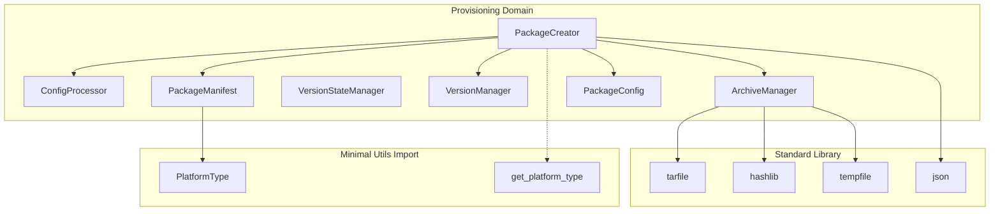
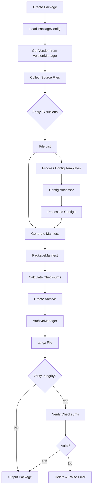
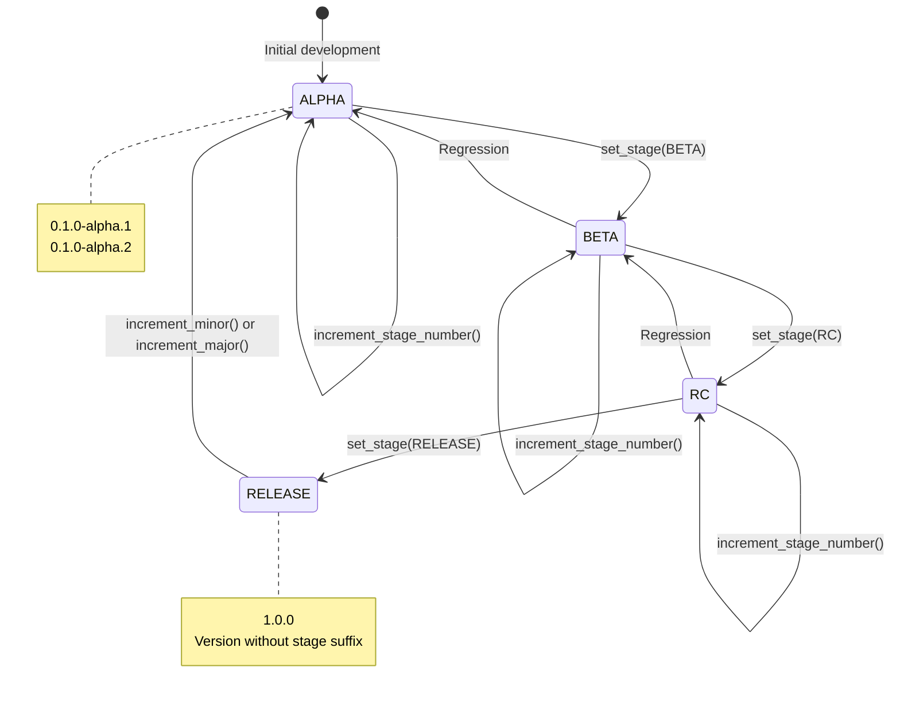

# Domain Design: Provisioning

Created: 2025-12-29

---

## Table of Contents

- [1.0 Document Information](<#1.0 document information>)
- [2.0 Domain Overview](<#2.0 domain overview>)
- [3.0 Domain Boundaries](<#3.0 domain boundaries>)
- [4.0 Components](<#4.0 components>)
- [5.0 Interfaces](<#5.0 interfaces>)
- [6.0 Data Design](<#6.0 data design>)
- [7.0 Error Handling](<#7.0 error handling>)
- [8.0 Visual Documentation](<#8.0 visual documentation>)
- [9.0 Tier 3 Component Documents](<#9.0 tier 3 component documents>)
- [Version History](<#version history>)

---

## 1.0 Document Information

```yaml
document_info:
  document_id: "design-5b2d4e6f-domain_provisioning"
  tier: 2
  domain: "Provisioning"
  parent: "design-0000-master_gtach.md"
  version: "1.0"
  date: "2025-12-29"
  author: "William Watson"
```

### 1.1 Parent Reference

- **Master Design**: [design-0000-master_gtach.md](<design-0000-master_gtach.md>)

[Return to Table of Contents](<#table of contents>)

---

## 2.0 Domain Overview

### 2.1 Purpose

The Provisioning domain manages deployment package creation for transferring the GTach application from the development platform (macOS) to the target deployment platform (Raspberry Pi Zero 2W). It provides thread-safe package creation, configuration template processing, archive management, and semantic version state tracking.

### 2.2 Responsibilities

1. **Package Creation**: Bundle application source, configs, and scripts into deployable archives
2. **Configuration Processing**: Transform platform-agnostic templates to target-specific configs
3. **Archive Management**: Create, verify, and manage tar.gz deployment packages
4. **Version Management**: Track semantic versions with development stage awareness
5. **Manifest Generation**: Create package manifests with integrity checksums
6. **Cross-Platform Support**: Handle Mac-to-Pi deployment workflow

### 2.3 Domain Patterns

| Pattern | Implementation | Purpose |
|---------|---------------|---------|
| Builder | PackageCreator | Construct deployment packages |
| Template Method | ConfigProcessor | Platform-specific config generation |
| Factory | ArchiveManager | Archive creation with options |
| State | VersionStateManager | Version lifecycle tracking |
| Strategy | Compression options | Configurable archive compression |

### 2.4 Domain Independence

The Provisioning domain is designed as a standalone deployment tool that operates independently from the GTach runtime application. It does not import or depend on operational components (ThreadManager, ConfigManager) to avoid circular dependencies. Any shared utilities are accessed through minimal, stable interfaces.

[Return to Table of Contents](<#table of contents>)

---

## 3.0 Domain Boundaries

### 3.1 Internal Boundaries

```yaml
location: "src/provisioning/"
modules:
  - "__init__.py: Package exports"
  - "package_creator.py: PackageCreator, PackageManifest, PackageConfig"
  - "config_processor.py: ConfigProcessor, template processing"
  - "archive_manager.py: ArchiveManager, compression utilities"
  - "version_manager.py: VersionManager, Version dataclass"
  - "version_state_manager.py: VersionStateManager, DevelopmentStage"
```

### 3.2 External Dependencies

| Dependency | Type | Purpose |
|------------|------|---------|
| tarfile | Standard Library | Archive creation |
| tempfile | Standard Library | Temporary file handling |
| shutil | Standard Library | File operations |
| hashlib | Standard Library | Checksum generation |
| json | Standard Library | Manifest serialization |
| pathlib | Standard Library | Path operations |
| threading | Standard Library | Thread-safe operations |
| logging | Standard Library | Structured logging |

### 3.3 Minimal External Imports

```yaml
restricted_imports:
  allowed:
    - "gtach.utils.platform.get_platform_type"
    - "gtach.utils.platform.PlatformType"
  forbidden:
    - "gtach.core.*: Avoids ThreadManager dependency"
    - "gtach.utils.config.*: Avoids ConfigManager singleton"
    - "gtach.comm.*: Avoids operational dependencies"
    - "gtach.display.*: Avoids runtime dependencies"
```

[Return to Table of Contents](<#table of contents>)

---

## 4.0 Components

### 4.1 PackageCreator

```yaml
component:
  name: "PackageCreator"
  purpose: "Create standardized deployment packages"
  file: "package_creator.py"
  
  responsibilities:
    - "Bundle source code from configured directories"
    - "Include configuration templates"
    - "Generate package manifest with checksums"
    - "Create installation scripts"
    - "Verify archive integrity"
  
  key_elements:
    - name: "PackageCreator"
      type: "class"
      purpose: "Main package builder"
    - name: "PackageManifest"
      type: "dataclass"
      purpose: "Package metadata container"
    - name: "PackageConfig"
      type: "dataclass"
      purpose: "Package creation settings"
  
  dependencies:
    internal:
      - "VersionManager"
      - "ArchiveManager (implicit)"
    external:
      - "tarfile"
      - "tempfile"
      - "shutil"
      - "hashlib"
      - "json"
      - "threading.Lock"
  
  processing_logic:
    - "Collect source files from configured directories"
    - "Apply exclusion patterns (*.pyc, __pycache__, .git, etc.)"
    - "Process configuration templates for target platform"
    - "Generate manifest with file checksums"
    - "Create tar.gz archive with metadata"
    - "Verify archive integrity post-creation"
  
  error_conditions:
    - condition: "Source directory not found"
      handling: "Log error, skip directory, continue"
    - condition: "Archive creation failure"
      handling: "Clean up temp files, raise exception"
    - condition: "Integrity verification failure"
      handling: "Delete corrupted archive, raise exception"
```

### 4.2 ConfigProcessor

```yaml
component:
  name: "ConfigProcessor"
  purpose: "Transform configuration templates for target platform"
  file: "config_processor.py"
  
  responsibilities:
    - "Load platform-agnostic configuration templates"
    - "Apply platform-specific variable substitution"
    - "Generate target platform configuration files"
    - "Validate processed configurations"
  
  key_elements:
    - name: "ConfigProcessor"
      type: "class"
      purpose: "Template processor"
  
  dependencies:
    internal: []
    external:
      - "pathlib.Path"
      - "string.Template (or similar)"
  
  processing_logic:
    - "Read template files from config_template_dirs"
    - "Identify platform variables (${PLATFORM}, ${HOME}, etc.)"
    - "Substitute values for target platform"
    - "Write processed configs to output directory"
  
  error_conditions:
    - condition: "Template not found"
      handling: "Log warning, skip template"
    - condition: "Undefined variable"
      handling: "Log error, use default or fail"
    - condition: "Write failure"
      handling: "Log error, raise exception"
```

### 4.3 ArchiveManager

```yaml
component:
  name: "ArchiveManager"
  purpose: "Manage tar.gz archive creation and verification"
  file: "archive_manager.py"
  
  responsibilities:
    - "Create compressed tar archives"
    - "Add files with proper paths"
    - "Generate and embed checksums"
    - "Extract archives for verification"
    - "Clean up temporary files"
  
  key_elements:
    - name: "ArchiveManager"
      type: "class"
      purpose: "Archive operations handler"
  
  dependencies:
    internal: []
    external:
      - "tarfile"
      - "hashlib"
      - "tempfile"
  
  processing_logic:
    - "Create tarfile with gzip compression"
    - "Add files preserving directory structure"
    - "Calculate SHA256 checksum of archive"
    - "Verify by extracting to temp and comparing"
  
  error_conditions:
    - condition: "Compression failure"
      handling: "Log error, clean up, raise exception"
    - condition: "Checksum mismatch"
      handling: "Log error, delete archive, raise exception"
```

### 4.4 VersionStateManager

```yaml
component:
  name: "VersionStateManager"
  purpose: "Track semantic version with development stage"
  file: "version_state_manager.py"
  
  responsibilities:
    - "Parse and validate semantic version strings"
    - "Track development stage (alpha, beta, rc, release)"
    - "Increment version components"
    - "Generate version strings for packages"
  
  key_elements:
    - name: "VersionStateManager"
      type: "class"
      purpose: "Version lifecycle manager"
    - name: "DevelopmentStage"
      type: "enum"
      purpose: "ALPHA, BETA, RC, RELEASE"
    - name: "Version"
      type: "dataclass"
      purpose: "Version components container"
  
  dependencies:
    internal: []
    external:
      - "re (regex)"
      - "dataclasses"
  
  processing_logic:
    - "Parse version: MAJOR.MINOR.PATCH[-stage.N]"
    - "Validate against semver specification"
    - "Increment: patch → minor → major with reset"
    - "Stage progression: alpha → beta → rc → release"
  
  error_conditions:
    - condition: "Invalid version format"
      handling: "Raise ValueError with details"
    - condition: "Invalid stage transition"
      handling: "Log warning, reject transition"
```

### 4.5 VersionManager

```yaml
component:
  name: "VersionManager"
  purpose: "Manage version information from project metadata"
  file: "version_manager.py"
  
  responsibilities:
    - "Read version from pyproject.toml or __init__.py"
    - "Provide version string for package naming"
    - "Support version comparison"
  
  key_elements:
    - name: "VersionManager"
      type: "class"
      purpose: "Version reader"
    - name: "Version"
      type: "dataclass"
      purpose: "Parsed version container"
  
  dependencies:
    internal: []
    external:
      - "pathlib.Path"
      - "re"
      - "tomllib (Python 3.11+) or toml"
  
  processing_logic:
    - "Try pyproject.toml first"
    - "Fall back to __version__ in package __init__.py"
    - "Parse into Version dataclass"
    - "Provide formatted string output"
```

[Return to Table of Contents](<#table of contents>)

---

## 5.0 Interfaces

### 5.1 PackageCreator Public Interface

```python
class PackageCreator:
    def __init__(self, project_root: Path, config: PackageConfig = None) -> None
    
    # Package creation
    def create_package(self, output_dir: Path = None) -> Path
    def create_manifest(self) -> PackageManifest
    
    # Configuration
    def set_config(self, config: PackageConfig) -> None
    def get_config(self) -> PackageConfig
    
    # Verification
    def verify_package(self, package_path: Path) -> bool
    
    # Utilities
    def list_source_files(self) -> List[Path]
    def get_package_name(self) -> str
```

### 5.2 VersionStateManager Public Interface

```python
class VersionStateManager:
    def __init__(self, version_string: str = None) -> None
    
    # Version access
    def get_version(self) -> Version
    def get_version_string(self) -> str
    def get_stage(self) -> DevelopmentStage
    
    # Version modification
    def increment_patch(self) -> str
    def increment_minor(self) -> str
    def increment_major(self) -> str
    def set_stage(self, stage: DevelopmentStage) -> str
    def increment_stage_number(self) -> str
    
    # Validation
    def is_release(self) -> bool
    def is_prerelease(self) -> bool
```

### 5.3 PackageManifest Structure

```python
@dataclass
class PackageManifest:
    package_name: str
    version: str
    created_at: str  # ISO format
    source_platform: str
    target_platform: str
    source_files: List[str]
    config_templates: List[str]
    scripts: List[str]
    dependencies: List[str]
    checksum: Optional[str]
    
    def to_dict(self) -> Dict[str, Any]
    @classmethod
    def from_dict(cls, data: Dict) -> 'PackageManifest'
```

### 5.4 Inter-Domain Contracts

| Interface | Provider | Consumer | Contract |
|-----------|----------|----------|----------|
| PlatformType | Utils | Provisioning | Source platform detection |
| get_platform_type() | Utils | Provisioning | Returns current platform |

Note: Provisioning domain intentionally has minimal dependencies on other domains to maintain standalone operation.

[Return to Table of Contents](<#table of contents>)

---

## 6.0 Data Design

### 6.1 PackageConfig

```yaml
entity:
  name: "PackageConfig"
  purpose: "Package creation settings"
  
  attributes:
    - name: "package_name"
      type: "str"
      constraints: "Default 'gtach-app'"
    - name: "version"
      type: "str"
      constraints: "Semver format, default from project"
    - name: "target_platform"
      type: "str"
      constraints: "Default 'raspberry-pi'"
    - name: "source_dirs"
      type: "List[str]"
      constraints: "Relative paths, default ['src/gtach']"
    - name: "config_template_dirs"
      type: "List[str]"
      constraints: "Default ['src/config']"
    - name: "script_dirs"
      type: "List[str]"
      constraints: "Default ['scripts']"
    - name: "exclude_patterns"
      type: "Set[str]"
      constraints: "Glob patterns for exclusion"
    - name: "compression_level"
      type: "int"
      constraints: "1-9, default 6"
    - name: "verify_integrity"
      type: "bool"
      constraints: "Default True"
```

### 6.2 DevelopmentStage Enumeration

```yaml
entity:
  name: "DevelopmentStage"
  purpose: "Pre-release stage enumeration"
  
  values:
    - ALPHA: "Early development, unstable"
    - BETA: "Feature complete, testing"
    - RC: "Release candidate"
    - RELEASE: "Production release"
```

### 6.3 Version Dataclass

```yaml
entity:
  name: "Version"
  purpose: "Semantic version components"
  
  attributes:
    - name: "major"
      type: "int"
      constraints: ">= 0"
    - name: "minor"
      type: "int"
      constraints: ">= 0"
    - name: "patch"
      type: "int"
      constraints: ">= 0"
    - name: "stage"
      type: "Optional[DevelopmentStage]"
      constraints: "None for release versions"
    - name: "stage_number"
      type: "Optional[int]"
      constraints: ">= 1 when stage present"
```

### 6.4 Package Archive Structure

```yaml
archive_structure:
  name: "gtach-app-0.1.0-alpha.1.tar.gz"
  
  contents:
    - "manifest.json: Package metadata"
    - "src/: Application source code"
    - "config/: Configuration templates"
    - "scripts/: Installation scripts"
    - "INSTALL.md: Installation instructions"
    - "checksums.sha256: File checksums"
```

[Return to Table of Contents](<#table of contents>)

---

## 7.0 Error Handling

### 7.1 Exception Strategy

| Error Type | Handling Strategy |
|------------|-------------------|
| Source directory missing | Log warning, skip, continue with others |
| Archive creation failure | Clean temp files, raise PackageError |
| Integrity verification failure | Delete archive, raise IntegrityError |
| Invalid version format | Raise ValueError with format hint |
| Template processing failure | Log error, skip template or fail based on config |
| Permission denied | Log error, raise with path details |

### 7.2 Logging Standards

```yaml
logging:
  logger_names:
    - "PackageCreator"
    - "ConfigProcessor"
    - "ArchiveManager"
    - "VersionStateManager"
    - "VersionManager"
  
  log_levels:
    DEBUG: "File operations, checksum calculations, template processing"
    INFO: "Package created, version parsed, archive verified"
    WARNING: "Missing directories, skipped files"
    ERROR: "Creation failures, integrity errors (with traceback)"
```

[Return to Table of Contents](<#table of contents>)

---

## 8.0 Visual Documentation

### 8.1 Domain Component Diagram



### 8.2 Package Creation Flow



### 8.3 Version State Machine



### 8.4 Archive Structure Diagram

```mermaid
graph TD
    subgraph "gtach-app-0.1.0-alpha.1.tar.gz"
        ROOT[/]
        
        ROOT --> MANIFEST[manifest.json]
        ROOT --> CHECKSUMS[checksums.sha256]
        ROOT --> INSTALL[INSTALL.md]
        
        ROOT --> SRC[src/]
        SRC --> GTACH[gtach/]
        GTACH --> CORE[core/]
        GTACH --> COMM[comm/]
        GTACH --> DISP[display/]
        GTACH --> UTILS[utils/]
        
        ROOT --> CONFIG[config/]
        CONFIG --> CFG_YAML[config.yaml]
        CONFIG --> DEV_YAML[devices.yaml]
        
        ROOT --> SCRIPTS[scripts/]
        SCRIPTS --> INSTALL_SH[install.sh]
        SCRIPTS --> START_SH[start.sh]
    end
```

[Return to Table of Contents](<#table of contents>)

---

## 9.0 Tier 3 Component Documents

The following Tier 3 component design documents will decompose each component:

| Document | Component | Status |
|----------|-----------|--------|
| design-XXXXXXXX-component_prov_package_creator.md | PackageCreator | Pending |
| design-XXXXXXXX-component_prov_config_processor.md | ConfigProcessor | Pending |
| design-XXXXXXXX-component_prov_archive_manager.md | ArchiveManager | Pending |
| design-XXXXXXXX-component_prov_version_state_manager.md | VersionStateManager | Pending |
| design-XXXXXXXX-component_prov_version_manager.md | VersionManager | Pending |

*UUID placeholders to be replaced upon document creation*

[Return to Table of Contents](<#table of contents>)

---

## Version History

| Version | Date | Author | Changes |
|---------|------|--------|---------|
| 1.0 | 2025-12-29 | William Watson | Initial domain design document |

---

Copyright (c) 2025 William Watson. This work is licensed under the MIT License.
