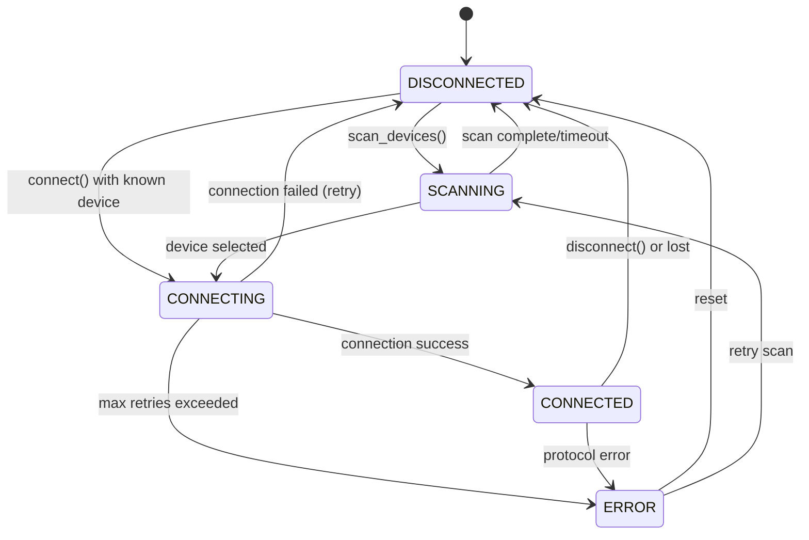
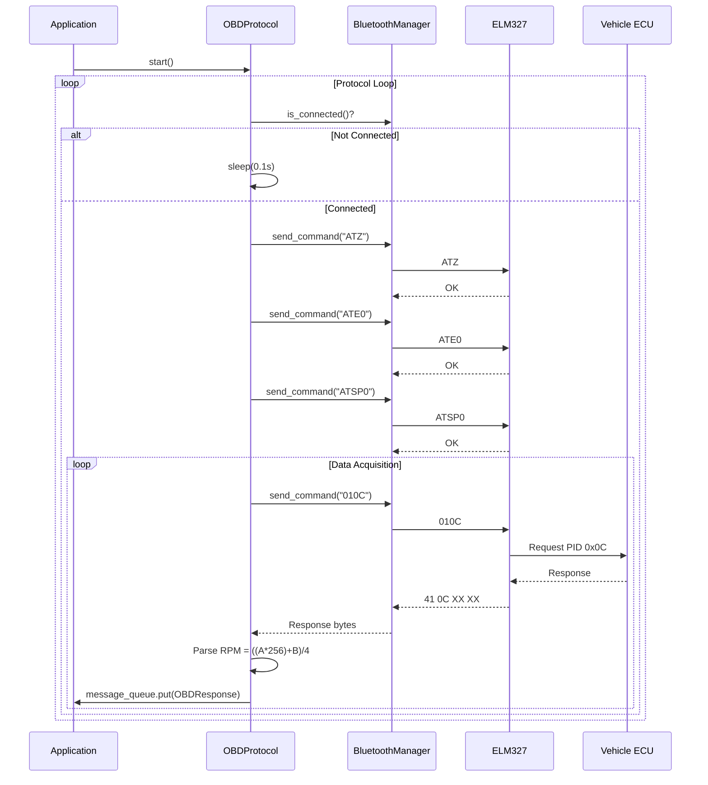
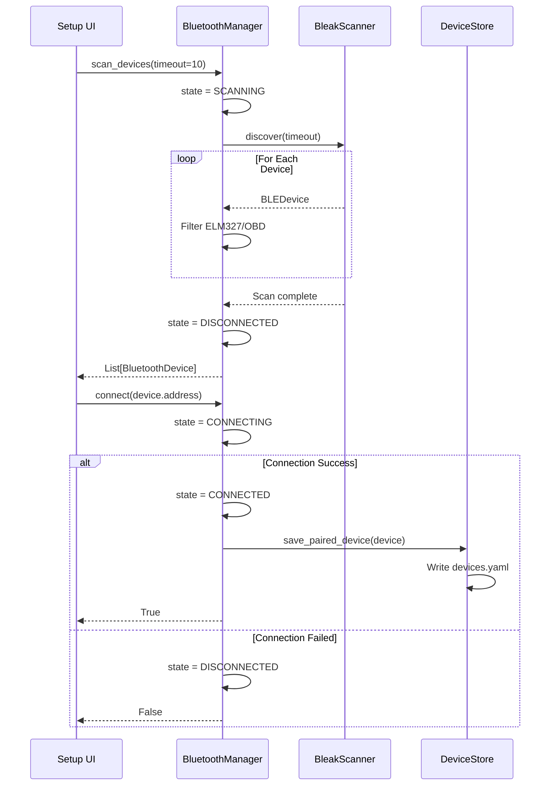

# Domain Design: Communication

Created: 2025-12-29

---

## Table of Contents

- [1.0 Document Information](<#1.0 document information>)
- [2.0 Domain Overview](<#2.0 domain overview>)
- [3.0 Domain Boundaries](<#3.0 domain boundaries>)
- [4.0 Components](<#4.0 components>)
- [5.0 Interfaces](<#5.0 interfaces>)
- [6.0 Data Design](<#6.0 data design>)
- [7.0 Error Handling](<#7.0 error handling>)
- [8.0 Visual Documentation](<#8.0 visual documentation>)
- [9.0 Tier 3 Component Documents](<#9.0 tier 3 component documents>)
- [Version History](<#version history>)

---

## 1.0 Document Information

```yaml
document_info:
  document_id: "design-7d3e9f5a-domain_comm"
  tier: 2
  domain: "Communication"
  parent: "design-0000-master_gtach.md"
  version: "1.0"
  date: "2025-12-29"
  author: "William Watson"
```

### 1.1 Parent Reference

- **Master Design**: [design-0000-master_gtach.md](<design-0000-master_gtach.md>)

[Return to Table of Contents](<#table of contents>)

---

## 2.0 Domain Overview

### 2.1 Purpose

The Communication domain manages Bluetooth connectivity to ELM327 OBD-II adapters and implements the OBD-II protocol for vehicle data acquisition. It provides cross-platform Bluetooth support using the Bleak library with async/await patterns while maintaining thread safety for integration with the Core domain.

### 2.2 Responsibilities

1. **Bluetooth Device Discovery**: Scan for available Bluetooth devices, identify ELM327 adapters
2. **Connection Management**: Establish, maintain, and recover Bluetooth connections
3. **OBD Protocol Initialization**: Configure ELM327 with AT commands (ATZ, ATE0, ATSP0/8)
4. **RPM Data Acquisition**: Request PID 0x0C, parse response, deliver to display
5. **Device Persistence**: Store paired device information for automatic reconnection
6. **State Machine Management**: Track connection states (DISCONNECTED→SCANNING→CONNECTING→CONNECTED)
7. **Error Recovery**: Retry connections with exponential backoff

### 2.3 Domain Patterns

| Pattern | Implementation | Purpose |
|---------|---------------|---------|
| State Machine | BluetoothState enum | Connection state tracking |
| Repository | DeviceStore | Device persistence and retrieval |
| Adapter | OBDProtocol | Adapt ELM327 protocol to application interface |
| Observer | Connection callbacks | Notify consumers of state changes |
| Strategy | Bleak backend selection | Cross-platform Bluetooth support |

[Return to Table of Contents](<#table of contents>)

---

## 3.0 Domain Boundaries

### 3.1 Internal Boundaries

```yaml
location: "src/gtach/comm/"
modules:
  - "__init__.py: Package exports (BluetoothManager, BluetoothState, OBDProtocol, OBDResponse)"
  - "bluetooth.py: BluetoothManager, BluetoothState, BluetoothConnectionError"
  - "obd.py: OBDProtocol, OBDResponse"
  - "device_store.py: DeviceStore (YAML-based persistence)"
  - "models.py: BluetoothDevice dataclass"
  - "pairing.py: Bluetooth pairing utilities"
  - "system_bluetooth.py: System-level Bluetooth operations"
```

### 3.2 External Dependencies

| Dependency | Type | Purpose |
|------------|------|---------|
| bleak | Third-party | Cross-platform Bluetooth LE/Classic |
| asyncio | Standard Library | Async operations for Bleak |
| threading | Standard Library | Thread-safe state management |
| yaml | Third-party (optional) | Device configuration persistence |
| logging | Standard Library | Structured logging |

### 3.3 Domain Dependencies

| Domain | Dependency Type | Usage |
|--------|-----------------|-------|
| Core | Required | ThreadManager for thread registration and heartbeats |
| Display | Consumer | SetupDisplayManager consumes device discovery results |

[Return to Table of Contents](<#table of contents>)

---

## 4.0 Components

### 4.1 BluetoothManager

```yaml
component:
  name: "BluetoothManager"
  purpose: "Manage Bluetooth device discovery and connection using Bleak"
  file: "bluetooth.py"
  
  responsibilities:
    - "Scan for Bluetooth devices with configurable timeout"
    - "Identify ELM327/OBD adapters from device names"
    - "Establish Bluetooth connections with retry logic"
    - "Manage connection state machine"
    - "Coordinate async operations from sync context"
    - "Send commands and receive responses via RFCOMM"
  
  key_elements:
    - name: "BluetoothManager"
      type: "class"
      purpose: "Main Bluetooth coordinator"
    - name: "BluetoothState"
      type: "enum"
      purpose: "Connection state enumeration"
    - name: "BluetoothConnectionError"
      type: "exception"
      purpose: "Bluetooth-specific error type"
  
  dependencies:
    internal:
      - "DeviceStore"
    external:
      - "bleak.BleakClient"
      - "bleak.BleakScanner"
      - "asyncio.AbstractEventLoop"
      - "threading.RLock"
      - "concurrent.futures.ThreadPoolExecutor"
  
  processing_logic:
    - "Initialize with ThreadManager reference for heartbeat updates"
    - "Scan uses BleakScanner with configurable timeout"
    - "Connection uses BleakClient with service discovery"
    - "State transitions are atomic (protected by RLock)"
    - "Async operations submitted via ThreadPoolExecutor"
    - "Commands sent via write characteristic, responses via notification"
  
  error_conditions:
    - condition: "Bleak library not installed"
      handling: "Log error, set state to ERROR, return gracefully"
    - condition: "Device not found during scan"
      handling: "Return empty list, maintain DISCONNECTED state"
    - condition: "Connection timeout"
      handling: "Increment retry count, attempt reconnection"
    - condition: "Connection lost"
      handling: "Transition to DISCONNECTED, trigger reconnection"
```

### 4.2 OBDProtocol

```yaml
component:
  name: "OBDProtocol"
  purpose: "Handle OBD-II protocol communication with ELM327"
  file: "obd.py"
  
  responsibilities:
    - "Initialize ELM327 adapter with AT commands"
    - "Request vehicle data via PID commands"
    - "Parse OBD-II response data"
    - "Deliver parsed data to ThreadManager message queue"
    - "Maintain protocol loop with heartbeat updates"
  
  key_elements:
    - name: "OBDProtocol"
      type: "class"
      purpose: "OBD-II protocol handler"
    - name: "OBDResponse"
      type: "dataclass"
      purpose: "Parsed OBD response container"
  
  dependencies:
    internal:
      - "BluetoothManager"
    external:
      - "threading.Thread"
      - "threading.Event"
  
  processing_logic:
    - "Protocol loop waits for Bluetooth connection"
    - "Initialize ELM327: ATZ (reset), ATE0 (echo off), ATSP0/8 (protocol)"
    - "Request RPM: send '010C', parse response bytes"
    - "RPM calculation: ((A * 256) + B) / 4"
    - "Put OBDResponse in ThreadManager.message_queue"
    - "Set ThreadManager.data_available event"
  
  error_conditions:
    - condition: "Bluetooth not connected"
      handling: "Sleep and retry loop"
    - condition: "Initialization failure"
      handling: "Log error, retry initialization"
    - condition: "Invalid response format"
      handling: "Return None, log warning"
    - condition: "Protocol error"
      handling: "Log error with traceback, sleep and continue"
```

### 4.3 DeviceStore

```yaml
component:
  name: "DeviceStore"
  purpose: "Persistent storage for paired Bluetooth devices"
  file: "device_store.py"
  
  responsibilities:
    - "Load and save device configuration from YAML"
    - "Manage primary and secondary device lists"
    - "Track setup completion state"
    - "Provide device retrieval by MAC address"
  
  key_elements:
    - name: "DeviceStore"
      type: "class"
      purpose: "Device persistence manager"
  
  dependencies:
    internal: []
    external:
      - "yaml (optional)"
      - "os, pathlib"
      - "logging"
  
  processing_logic:
    - "Load config from config/devices.yaml on init"
    - "Fall back to in-memory storage if YAML unavailable"
    - "Save updates atomically via temp file + rename"
    - "Track primary device separately from secondary list"
  
  error_conditions:
    - condition: "YAML not available"
      handling: "Use in-memory fallback, log warning"
    - condition: "Config file not found"
      handling: "Create default config, save"
    - condition: "Save failure"
      handling: "Log error, data remains in memory"
```

### 4.4 BluetoothDevice

```yaml
component:
  name: "BluetoothDevice"
  purpose: "Data model for Bluetooth device information"
  file: "models.py"
  
  key_elements:
    - name: "BluetoothDevice"
      type: "dataclass"
      purpose: "Device metadata container"
  
  attributes:
    - "name: Device display name"
    - "address: MAC address (normalized uppercase, no colons)"
    - "last_connected: Datetime of last connection"
    - "connection_count: Number of successful connections"
    - "signal_strength: RSSI in dBm (optional)"
    - "device_type: ELM327, OBD, UNKNOWN"
    - "metadata: Additional key-value data"
  
  processing_logic:
    - "Normalize MAC address in __post_init__"
    - "Detect device type from name (ELM, OBD keywords)"
    - "Convert timestamp strings to datetime"
    - "Serialize/deserialize via to_dict/from_dict"
```

[Return to Table of Contents](<#table of contents>)

---

## 5.0 Interfaces

### 5.1 BluetoothManager Public Interface

```python
class BluetoothManager:
    def __init__(self, thread_manager: ThreadManager, 
                 device_store: DeviceStore = None) -> None
    
    # State access (thread-safe properties)
    @property
    def state(self) -> BluetoothState
    @property
    def current_device(self) -> Optional[Tuple[str, str]]
    @property
    def client(self) -> Optional[BleakClient]
    
    # Lifecycle
    def start(self) -> None
    def stop(self) -> None
    
    # Operations (async internally, sync externally)
    def scan_devices(self, timeout: float = 10.0) -> List[BluetoothDevice]
    def connect(self, address: str, name: str = None) -> bool
    def disconnect(self) -> None
    def is_connected(self) -> bool
    def send_command(self, command: str, timeout: float = 1.0) -> Optional[str]
```

### 5.2 OBDProtocol Public Interface

```python
class OBDProtocol:
    def __init__(self, bluetooth_manager: BluetoothManager,
                 thread_manager: ThreadManager) -> None
    def start(self) -> None
    def stop(self) -> None
```

### 5.3 DeviceStore Public Interface

```python
class DeviceStore:
    def __init__(self, config_path: str = "config/devices.yaml") -> None
    
    # Device management
    def save_paired_device(self, device: BluetoothDevice, 
                          is_primary: bool = True) -> None
    def get_primary_device(self) -> Optional[BluetoothDevice]
    def get_all_devices(self) -> List[BluetoothDevice]
    def remove_device(self, mac_address: str) -> bool
    def set_primary_device(self, mac_address: str) -> bool
    def get_device_by_mac(self, mac_address: str) -> Optional[BluetoothDevice]
    def clear_all_devices(self) -> None
    
    # Setup state
    def is_setup_complete(self) -> bool
    def mark_setup_complete(self) -> None
    def is_first_run(self) -> bool
    
    # Configuration
    def get_discovery_timeout(self) -> int
    def set_discovery_timeout(self, timeout: int) -> None
```

### 5.4 Inter-Domain Contracts

| Interface | Consumer | Contract |
|-----------|----------|----------|
| OBDResponse → message_queue | Display domain | Display reads RPM from queue |
| BluetoothState changes | Application | App responds to connection state |
| is_setup_complete() | Application | Determines startup mode |
| scan_devices() | Display/Setup | Returns discovered devices for UI |

[Return to Table of Contents](<#table of contents>)

---

## 6.0 Data Design

### 6.1 BluetoothDevice Entity

```yaml
entity:
  name: "BluetoothDevice"
  purpose: "Bluetooth device information and metadata"
  
  attributes:
    - name: "name"
      type: "str"
      constraints: "Required"
    - name: "address"
      type: "str"
      constraints: "MAC format, normalized uppercase without colons"
    - name: "last_connected"
      type: "Optional[datetime]"
      constraints: "ISO format string convertible"
    - name: "connection_count"
      type: "int"
      constraints: "Default 0"
    - name: "signal_strength"
      type: "Optional[int]"
      constraints: "RSSI in dBm"
    - name: "device_type"
      type: "str"
      constraints: "ELM327, OBD, UNKNOWN"
    - name: "metadata"
      type: "Dict[str, Any]"
      constraints: "Default empty dict"
```

### 6.2 OBDResponse Entity

```yaml
entity:
  name: "OBDResponse"
  purpose: "Parsed OBD-II response data"
  
  attributes:
    - name: "pid"
      type: "int"
      constraints: "0x00-0xFF, e.g., 0x0C for RPM"
    - name: "data"
      type: "bytes"
      constraints: "Raw response bytes after parsing"
    - name: "timestamp"
      type: "float"
      constraints: "Unix timestamp"
    - name: "error"
      type: "Optional[str]"
      constraints: "Error message if parsing failed"
```

### 6.3 BluetoothState Enumeration

```yaml
states:
  DISCONNECTED: "No active Bluetooth connection"
  SCANNING: "Device discovery in progress"
  CONNECTING: "Connection attempt in progress"
  CONNECTED: "Active connection established"
  ERROR: "Unrecoverable error state"
```

### 6.4 Device Configuration Storage

```yaml
storage:
  name: "devices.yaml"
  location: "config/devices.yaml"
  format: "YAML"
  
  structure:
    paired_devices:
      primary:
        name: "string"
        mac_address: "string"
        device_type: "string"
        last_connected: "ISO datetime string"
        connection_verified: "boolean"
        signal_strength: "integer"
      secondary:
        <mac_address>:
          name: "string"
          mac_address: "string"
          # ... same fields as primary
    setup:
      completed: "boolean"
      first_run: "boolean"
      discovery_timeout: "integer (seconds)"
```

[Return to Table of Contents](<#table of contents>)

---

## 7.0 Error Handling

### 7.1 Exception Hierarchy

```
BluetoothConnectionError (domain base)
├── DeviceNotFoundError
├── ConnectionTimeoutError
├── ServiceDiscoveryError
└── CommandTimeoutError

OBDError (domain base)
├── InitializationError
├── ProtocolError
└── ResponseParseError
```

### 7.2 Error Strategies

| Error Type | Strategy |
|------------|----------|
| Bleak not installed | Log error, set ERROR state, return gracefully |
| Device not found | Return empty results, stay DISCONNECTED |
| Connection timeout | Retry with exponential backoff (max 3 attempts) |
| Connection lost | Transition DISCONNECTED, trigger auto-reconnect |
| Command timeout | Return None, caller handles missing data |
| Parse error | Log warning, return None response |

### 7.3 Logging Standards

```yaml
logging:
  logger_names:
    - "BluetoothManager"
    - "OBDProtocol"
    - "DeviceStore"
  
  log_levels:
    DEBUG: "Command/response details, state transitions"
    INFO: "Connection established, device paired, protocol initialized"
    WARNING: "Retry attempts, parse failures, timeout warnings"
    ERROR: "Connection failures, protocol errors (with traceback)"
```

[Return to Table of Contents](<#table of contents>)

---

## 8.0 Visual Documentation

### 8.1 Domain Component Diagram

```mermaid
graph TB
    subgraph "Communication Domain"
        BM[BluetoothManager]
        OBD[OBDProtocol]
        DS[DeviceStore]
        BD[BluetoothDevice]
        BS[BluetoothState]
    end
    
    subgraph "External Libraries"
        BLEAK[Bleak Library]
        YAML[PyYAML]
    end
    
    subgraph "Core Domain"
        TM[ThreadManager]
        MQ[message_queue]
    end
    
    BM --> BLEAK
    BM --> DS
    BM --> TM
    BM --> BS
    
    OBD --> BM
    OBD --> TM
    OBD --> MQ
    
    DS --> YAML
    DS --> BD
    
    subgraph "External Systems"
        ELM[ELM327 Adapter]
        ECU[Vehicle ECU]
    end
    
    BLEAK -.->|Bluetooth| ELM
    ELM -.->|OBD-II| ECU
```



### 8.2 Bluetooth State Machine



### 8.3 OBD Protocol Flow



### 8.4 Device Discovery Sequence



[Return to Table of Contents](<#table of contents>)

---

## 9.0 Tier 3 Component Documents

The following Tier 3 component design documents decompose each component:

| Document | Component | Status |
|----------|-----------|--------|
| [design-d4e5f6a7-component_comm_bluetooth_manager.md](<design-d4e5f6a7-component_comm_bluetooth_manager.md>) | BluetoothManager | Complete |
| [design-e5f6a7b8-component_comm_obd_protocol.md](<design-e5f6a7b8-component_comm_obd_protocol.md>) | OBDProtocol | Complete |
| [design-f6a7b8c9-component_comm_device_store.md](<design-f6a7b8c9-component_comm_device_store.md>) | DeviceStore | Complete |
| [design-a7b8c9d0-component_comm_bluetooth_device.md](<design-a7b8c9d0-component_comm_bluetooth_device.md>) | BluetoothDevice | Complete |

[Return to Table of Contents](<#table of contents>)

---

## Version History

| Version | Date | Author | Changes |
|---------|------|--------|---------|
| 1.0 | 2025-12-29 | William Watson | Initial domain design document |
| 1.1 | 2025-12-29 | William Watson | Added Tier 3 component document cross-references |

---

Copyright (c) 2025 William Watson. This work is licensed under the MIT License.
