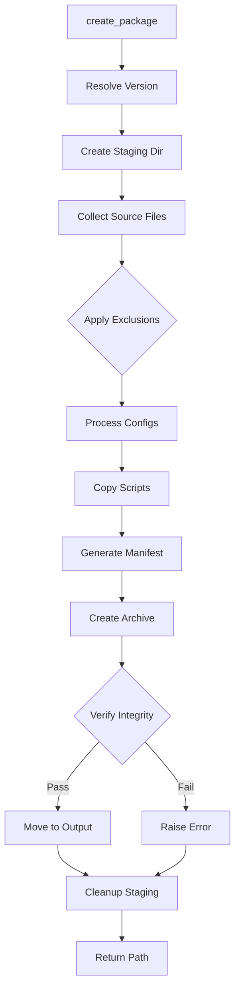
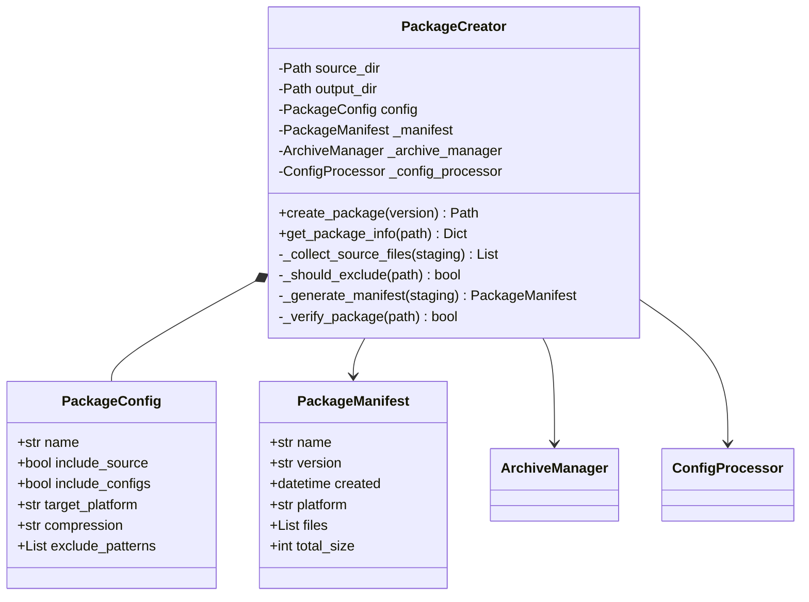

# Component Design: PackageCreator

Created: 2025-12-29

---

## Table of Contents

- [1.0 Document Information](<#1.0 document information>)
- [2.0 Component Overview](<#2.0 component overview>)
- [3.0 Class Design](<#3.0 class design>)
- [4.0 Method Specifications](<#4.0 method specifications>)
- [5.0 Package Structure](<#5.0 package structure>)
- [6.0 Error Handling](<#6.0 error handling>)
- [7.0 Visual Documentation](<#7.0 visual documentation>)
- [Version History](<#version history>)

---

## 1.0 Document Information

```yaml
document_info:
  document_id: "design-a9b0c1d2-component_prov_package_creator"
  tier: 3
  domain: "Provisioning"
  component: "PackageCreator"
  parent: "design-5b2d4e6f-domain_provisioning.md"
  source_file: "src/gtach/provisioning/package.py"
  version: "1.0"
  date: "2025-12-29"
  author: "William Watson"
```

### 1.1 Parent Reference

- **Domain Design**: [design-5b2d4e6f-domain_provisioning.md](<design-5b2d4e6f-domain_provisioning.md>)
- **Master Design**: [design-0000-master_gtach.md](<design-0000-master_gtach.md>)

[Return to Table of Contents](<#table of contents>)

---

## 2.0 Component Overview

### 2.1 Purpose

PackageCreator bundles source code, configuration files, and installation scripts into compressed deployment packages with manifest generation and integrity verification.

### 2.2 Responsibilities

1. Collect source files from specified directories
2. Process configuration templates for target platform
3. Generate package manifest with SHA256 checksums
4. Create compressed tar.gz archive
5. Verify package integrity post-creation
6. Apply file exclusion patterns

### 2.3 Domain Independence

PackageCreator is a standalone deployment tool. It does NOT import Core, Communication, or Display domain components to avoid circular dependencies. It reads files from disk without loading application modules.

[Return to Table of Contents](<#table of contents>)

---

## 3.0 Class Design

### 3.1 PackageCreator Class

```python
class PackageCreator:
    """Deployment package creator for GTach.
    
    Creates self-contained deployment packages with
    manifest, checksums, and installation scripts.
    """
```

### 3.2 Constructor

```python
def __init__(self,
             source_dir: Path,
             output_dir: Path,
             config: Optional[PackageConfig] = None) -> None:
    """Initialize package creator.
    
    Args:
        source_dir: Root directory containing source code
        output_dir: Directory for output packages
        config: Optional PackageConfig (uses defaults if None)
    """
```

### 3.3 Attributes

| Attribute | Type | Purpose |
|-----------|------|---------|
| `source_dir` | `Path` | Source code root |
| `output_dir` | `Path` | Output location |
| `config` | `PackageConfig` | Package settings |
| `_manifest` | `PackageManifest` | Generated manifest |
| `_archive_manager` | `ArchiveManager` | Archive operations |
| `_config_processor` | `ConfigProcessor` | Template processing |
| `_version_manager` | `VersionManager` | Version extraction |
| `logger` | `Logger` | Logging instance |

### 3.4 PackageConfig Dataclass

```python
@dataclass
class PackageConfig:
    """Package creation configuration."""
    name: str = "gtach"
    include_source: bool = True
    include_configs: bool = True
    include_scripts: bool = True
    include_docs: bool = False
    target_platform: str = "raspberry_pi"
    compression: str = "gzip"  # gzip, bz2, xz
    exclude_patterns: List[str] = field(default_factory=lambda: [
        "*.pyc",
        "__pycache__",
        ".git",
        ".gitignore",
        "*.egg-info",
        "venv",
        ".venv",
        "*.log",
        ".DS_Store",
        "deprecated",
    ])
```

[Return to Table of Contents](<#table of contents>)

---

## 4.0 Method Specifications

### 4.1 create_package

```python
def create_package(self, version: Optional[str] = None) -> Path:
    """Create deployment package.
    
    Args:
        version: Optional version override (reads from source if None)
    
    Returns:
        Path to created package file
    
    Algorithm:
        1. Resolve version from source or parameter
        2. Create temporary staging directory
        3. Collect source files (apply exclusions)
        4. Process configuration templates
        5. Copy installation scripts
        6. Generate manifest with checksums
        7. Create compressed archive
        8. Verify archive integrity
        9. Move to output directory
        10. Cleanup staging
        11. Return package path
    """
```

### 4.2 _collect_source_files

```python
def _collect_source_files(self, staging_dir: Path) -> List[Path]:
    """Collect source files into staging.
    
    Args:
        staging_dir: Staging directory path
    
    Returns:
        List of collected file paths
    
    Algorithm:
        1. Walk source_dir recursively
        2. Apply exclusion patterns
        3. Copy files preserving structure
        4. Return file list
    """
```

### 4.3 _should_exclude

```python
def _should_exclude(self, path: Path) -> bool:
    """Check if path matches exclusion pattern.
    
    Args:
        path: Path to check
    
    Returns:
        True if should be excluded
    
    Pattern Matching:
        - Glob patterns (*.pyc)
        - Directory names (__pycache__)
        - Exact matches (.git)
    """
```

### 4.4 _generate_manifest

```python
def _generate_manifest(self, staging_dir: Path) -> PackageManifest:
    """Generate package manifest.
    
    Args:
        staging_dir: Staging directory with files
    
    Returns:
        PackageManifest with file checksums
    
    Manifest Contents:
        - Package name and version
        - Creation timestamp
        - Target platform
        - File list with SHA256 checksums
        - Total size
    """
```

### 4.5 _verify_package

```python
def _verify_package(self, package_path: Path) -> bool:
    """Verify package integrity.
    
    Args:
        package_path: Path to created package
    
    Returns:
        True if verification passes
    
    Verification:
        1. Extract to temp directory
        2. Read manifest
        3. Verify all file checksums
        4. Return result
    """
```

### 4.6 get_package_info

```python
def get_package_info(self, package_path: Path) -> Dict[str, Any]:
    """Get information about existing package.
    
    Args:
        package_path: Path to package file
    
    Returns:
        Dict with manifest data
    """
```

[Return to Table of Contents](<#table of contents>)

---

## 5.0 Package Structure

### 5.1 Archive Layout

```
gtach-0.1.0-raspberry_pi.tar.gz
├── manifest.json           # Package manifest
├── checksums.sha256        # File checksums
├── INSTALL.md              # Installation instructions
├── src/                    # Source code
│   └── gtach/
│       ├── __init__.py
│       ├── core/
│       ├── comm/
│       ├── display/
│       └── utils/
├── config/                 # Configuration files
│   ├── config.yaml
│   └── devices.yaml
└── scripts/                # Installation scripts
    ├── install.sh
    ├── uninstall.sh
    └── configure.sh
```

### 5.2 Manifest Structure

```json
{
    "name": "gtach",
    "version": "0.1.0",
    "created": "2025-12-29T10:30:00Z",
    "platform": "raspberry_pi",
    "files": [
        {
            "path": "src/gtach/__init__.py",
            "size": 1234,
            "sha256": "abc123..."
        }
    ],
    "total_size": 123456,
    "file_count": 42
}
```

[Return to Table of Contents](<#table of contents>)

---

## 6.0 Error Handling

### 6.1 Exception Strategy

| Scenario | Exception | Handling |
|----------|-----------|----------|
| Source dir not found | FileNotFoundError | Raise with message |
| Permission denied | PermissionError | Raise with path |
| Compression failure | IOError | Log, cleanup, raise |
| Verification failure | PackageError | Log, return False |

### 6.2 Cleanup on Failure

```python
def create_package(self, version: str = None) -> Path:
    staging_dir = None
    try:
        staging_dir = self._create_staging()
        # ... package creation ...
    except Exception as e:
        self.logger.error(f"Package creation failed: {e}")
        raise
    finally:
        if staging_dir and staging_dir.exists():
            shutil.rmtree(staging_dir)
```

[Return to Table of Contents](<#table of contents>)

---

## 7.0 Visual Documentation

### 7.1 Package Creation Flow



### 7.2 Class Diagram



[Return to Table of Contents](<#table of contents>)

---

## Version History

| Version | Date | Author | Changes |
|---------|------|--------|---------|
| 1.0 | 2025-12-29 | William Watson | Initial component design document |

---

Copyright (c) 2025 William Watson. This work is licensed under the MIT License.
