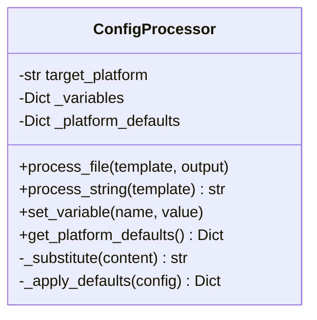
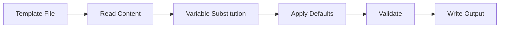

# Component Design: ConfigProcessor

Created: 2025-12-29

---

## Table of Contents

- [1.0 Document Information](<#1.0 document information>)
- [2.0 Component Overview](<#2.0 component overview>)
- [3.0 Class Design](<#3.0 class design>)
- [4.0 Method Specifications](<#4.0 method specifications>)
- [5.0 Template Variables](<#5.0 template variables>)
- [6.0 Visual Documentation](<#6.0 visual documentation>)
- [Version History](<#version history>)

---

## 1.0 Document Information

```yaml
document_info:
  document_id: "design-b0c1d2e3-component_prov_config_processor"
  tier: 3
  domain: "Provisioning"
  component: "ConfigProcessor"
  parent: "design-5b2d4e6f-domain_provisioning.md"
  source_file: "src/gtach/provisioning/config_processor.py"
  version: "1.0"
  date: "2025-12-29"
  author: "William Watson"
```

### 1.1 Parent Reference

- **Domain Design**: [design-5b2d4e6f-domain_provisioning.md](<design-5b2d4e6f-domain_provisioning.md>)

[Return to Table of Contents](<#table of contents>)

---

## 2.0 Component Overview

### 2.1 Purpose

ConfigProcessor transforms platform-agnostic configuration templates into target-specific configurations by substituting variables and applying platform-specific defaults.

### 2.2 Responsibilities

1. Load configuration templates
2. Substitute platform-specific variables
3. Apply platform defaults for missing values
4. Validate processed configuration
5. Output target configuration file

[Return to Table of Contents](<#table of contents>)

---

## 3.0 Class Design

### 3.1 ConfigProcessor Class

```python
class ConfigProcessor:
    """Configuration template processor for deployment."""
```

### 3.2 Constructor

```python
def __init__(self, 
             target_platform: str = "raspberry_pi",
             variables: Optional[Dict[str, str]] = None) -> None:
    """Initialize config processor.
    
    Args:
        target_platform: Target platform identifier
        variables: Additional variable substitutions
    """
```

### 3.3 Attributes

| Attribute | Type | Purpose |
|-----------|------|---------|
| `target_platform` | `str` | Target platform ID |
| `_variables` | `Dict[str, str]` | Variable mappings |
| `_platform_defaults` | `Dict` | Platform-specific defaults |

[Return to Table of Contents](<#table of contents>)

---

## 4.0 Method Specifications

### 4.1 process_file

```python
def process_file(self, 
                 template_path: Path,
                 output_path: Path) -> None:
    """Process template file to output.
    
    Args:
        template_path: Source template file
        output_path: Destination file path
    
    Algorithm:
        1. Read template content
        2. Apply variable substitutions
        3. Apply platform defaults
        4. Validate result
        5. Write to output path
    """
```

### 4.2 process_string

```python
def process_string(self, template: str) -> str:
    """Process template string.
    
    Args:
        template: Template string with ${VAR} placeholders
    
    Returns:
        Processed string with substitutions applied
    """
```

### 4.3 set_variable

```python
def set_variable(self, name: str, value: str) -> None:
    """Set a variable for substitution."""
```

### 4.4 get_platform_defaults

```python
def get_platform_defaults(self) -> Dict[str, Any]:
    """Get defaults for target platform.
    
    Returns:
        Dict of platform-specific default values
    """
```

[Return to Table of Contents](<#table of contents>)

---

## 5.0 Template Variables

### 5.1 Built-in Variables

| Variable | Description | Example |
|----------|-------------|---------|
| `${PLATFORM}` | Target platform | "raspberry_pi" |
| `${HOME}` | User home directory | "/home/pi" |
| `${CONFIG_DIR}` | Config directory | "/home/pi/.config/gtach" |
| `${LOG_DIR}` | Log directory | "/home/pi/.config/gtach/logs" |
| `${VERSION}` | Application version | "0.1.0" |

### 5.2 Platform Defaults

```python
PLATFORM_DEFAULTS = {
    "raspberry_pi": {
        "display.fps_limit": 30,
        "bluetooth.scan_duration": 15.0,
    },
    "macos": {
        "display.fps_limit": 60,
        "bluetooth.scan_duration": 10.0,
    }
}
```

### 5.3 Template Syntax

```yaml
# config.yaml.template
display:
  fps_limit: ${DISPLAY_FPS:-30}  # Default if not set
  
bluetooth:
  scan_duration: ${BT_SCAN_DURATION}

paths:
  home: ${HOME}
  config: ${CONFIG_DIR}
```

[Return to Table of Contents](<#table of contents>)

---

## 6.0 Visual Documentation

### 6.1 Class Diagram



### 6.2 Processing Flow



[Return to Table of Contents](<#table of contents>)

---

## Version History

| Version | Date | Author | Changes |
|---------|------|--------|---------|
| 1.0 | 2025-12-29 | William Watson | Initial component design document |

---

Copyright (c) 2025 William Watson. This work is licensed under the MIT License.
