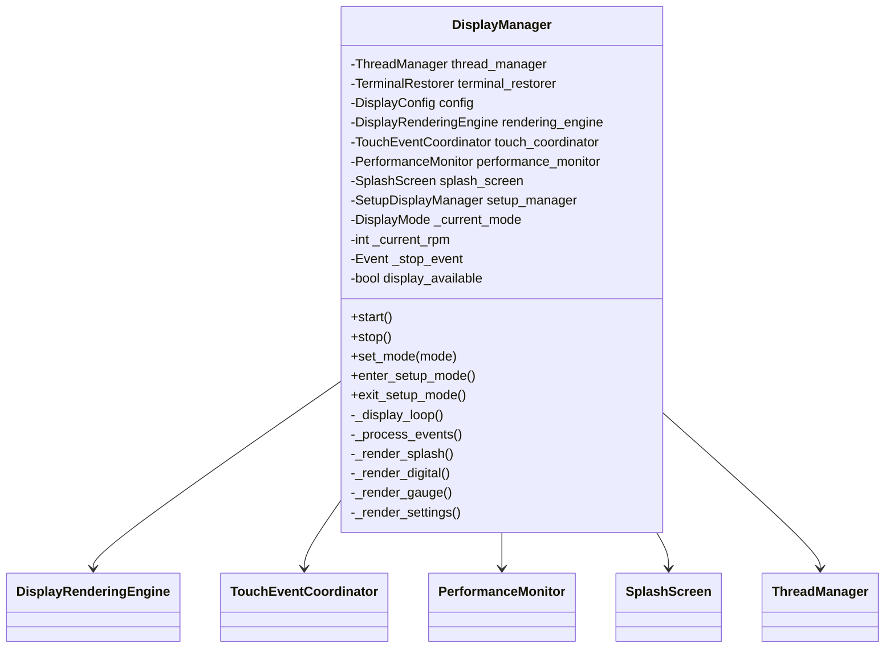
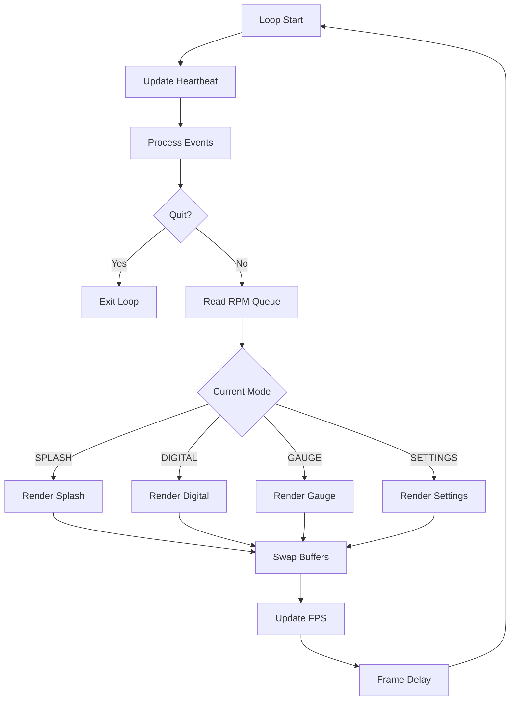

# Component Design: DisplayManager

Created: 2025-12-29

---

## Table of Contents

- [1.0 Document Information](<#1.0 document information>)
- [2.0 Component Overview](<#2.0 component overview>)
- [3.0 Class Design](<#3.0 class design>)
- [4.0 Method Specifications](<#4.0 method specifications>)
- [5.0 Display Modes](<#5.0 display modes>)
- [6.0 Rendering Pipeline](<#6.0 rendering pipeline>)
- [7.0 Error Handling](<#7.0 error handling>)
- [8.0 Dependencies](<#8.0 dependencies>)
- [9.0 Visual Documentation](<#9.0 visual documentation>)
- [Version History](<#version history>)

---

## 1.0 Document Information

```yaml
document_info:
  document_id: "design-b8c9d0e1-component_display_manager"
  tier: 3
  domain: "Display"
  component: "DisplayManager"
  parent: "design-2c6b8e4d-domain_display.md"
  source_file: "src/gtach/display/manager.py"
  version: "1.0"
  date: "2025-12-29"
  author: "William Watson"
```

### 1.1 Parent Reference

- **Domain Design**: [design-2c6b8e4d-domain_display.md](<design-2c6b8e4d-domain_display.md>)
- **Master Design**: [design-0000-master_gtach.md](<design-0000-master_gtach.md>)

[Return to Table of Contents](<#table of contents>)

---

## 2.0 Component Overview

### 2.1 Purpose

DisplayManager orchestrates all display operations including rendering, touch handling, mode management, and component coordination. It serves as the main entry point for the display subsystem.

### 2.2 Responsibilities

1. Initialize and coordinate display components
2. Run main display loop with frame timing
3. Manage display mode state machine (SPLASH→DIGITAL/GAUGE→SETTINGS)
4. Read RPM data from ThreadManager message queue
5. Delegate rendering to DisplayRenderingEngine
6. Delegate touch events to TouchEventCoordinator
7. Update thread heartbeat for watchdog monitoring
8. Handle splash screen timing and transitions

### 2.3 Target Display

- **Hardware**: Pimoroni HyperPixel 2.1 Round
- **Resolution**: 480×480 pixels (circular)
- **Interface**: SPI framebuffer via Pygame
- **Touch**: Capacitive touch panel

[Return to Table of Contents](<#table of contents>)

---

## 3.0 Class Design

### 3.1 DisplayManager Class

```python
class DisplayManager:
    """Main display orchestrator for GTach.
    
    Coordinates rendering, touch input, and mode management
    for the circular tachometer display.
    """
```

### 3.2 Constructor Signature

```python
def __init__(self,
             thread_manager: ThreadManager,
             terminal_restorer: TerminalRestorer = None,
             config_path: str = 'config.yaml') -> None:
    """Initialize display manager.
    
    Args:
        thread_manager: ThreadManager for heartbeat/message queue
        terminal_restorer: Optional terminal state manager
        config_path: Path to display configuration
    
    Initializes:
        - DisplayConfig from file or defaults
        - DisplayRenderingEngine
        - TouchEventCoordinator
        - PerformanceMonitor
        - SplashScreen
        - Gesture callbacks for navigation
    """
```

### 3.3 Instance Attributes

| Attribute | Type | Purpose |
|-----------|------|---------|
| `thread_manager` | `ThreadManager` | Thread coordination |
| `terminal_restorer` | `TerminalRestorer` | Console state management |
| `config` | `DisplayConfig` | Display settings |
| `rendering_engine` | `DisplayRenderingEngine` | Double-buffered renderer |
| `touch_coordinator` | `TouchEventCoordinator` | Gesture recognition |
| `performance_monitor` | `PerformanceMonitor` | FPS tracking |
| `splash_screen` | `SplashScreen` | Startup animation |
| `setup_manager` | `SetupDisplayManager` | Setup wizard UI |
| `_current_mode` | `DisplayMode` | Active display mode |
| `_current_rpm` | `int` | Latest RPM value |
| `_stop_event` | `threading.Event` | Shutdown signal |
| `_in_setup_mode` | `bool` | Setup wizard active |
| `display_available` | `bool` | Pygame initialized |

[Return to Table of Contents](<#table of contents>)

---

## 4.0 Method Specifications

### 4.1 start / stop

```python
def start(self) -> None:
    """Start display manager.
    
    Algorithm:
        1. Initialize Pygame display
        2. Hide cursor (terminal_restorer)
        3. Initialize rendering engine
        4. Register gesture callbacks
        5. Set mode to SPLASH
        6. Start display loop thread
    """

def stop(self) -> None:
    """Stop display manager.
    
    Algorithm:
        1. Set _stop_event
        2. Shutdown rendering engine
        3. Restore terminal state
        4. Quit Pygame
    """
```

### 4.2 _display_loop

```python
def _display_loop(self) -> None:
    """Main display loop.
    
    Target: 60 FPS (development), 30 FPS (deployment)
    
    Algorithm:
        while not _stop_event.is_set():
            1. Update heartbeat
            2. Process Pygame events
            3. Read RPM from message_queue (non-blocking)
            4. Select render method based on mode
            5. Render to back buffer
            6. Swap buffers
            7. Update performance monitor
            8. Frame rate limiting
    """
```

### 4.3 _process_events

```python
def _process_events(self) -> bool:
    """Process Pygame events.
    
    Returns:
        False if quit event received
    
    Algorithm:
        1. Get all pending events
        2. Check for QUIT event
        3. Pass touch events to touch_coordinator
        4. Handle keyboard events (debug mode)
    """
```

### 4.4 Mode Rendering Methods

```python
def _render_splash(self, surface: pygame.Surface) -> None:
    """Render splash screen.
    
    Checks splash_screen.is_complete() for transition.
    """

def _render_digital(self, surface: pygame.Surface, rpm: int) -> None:
    """Render digital numeric display.
    
    Features:
        - Large centered RPM number
        - Warning/danger color coding
        - Connection status indicator
    """

def _render_gauge(self, surface: pygame.Surface, rpm: int) -> None:
    """Render analog gauge display.
    
    Features:
        - Circular gauge with needle
        - RPM scale markings
        - Warning/danger zones
        - Digital readout overlay
    """

def _render_settings(self, surface: pygame.Surface) -> None:
    """Render settings menu.
    
    Features:
        - Mode selection
        - RPM thresholds
        - Connection info
    """
```

### 4.5 set_mode

```python
def set_mode(self, mode: DisplayMode) -> None:
    """Change display mode.
    
    Args:
        mode: New DisplayMode
    
    Side Effects:
        - Updates _current_mode
        - Logs mode transition
        - May trigger config save
    """
```

### 4.6 _on_gesture

```python
def _on_swipe_left(self) -> None:
    """Handle swipe left gesture.
    
    Mode Transitions:
        DIGITAL -> GAUGE
        GAUGE -> DIGITAL
    """

def _on_swipe_right(self) -> None:
    """Handle swipe right gesture.
    
    Same as swipe left (cycle modes).
    """

def _on_long_press(self) -> None:
    """Handle long press gesture.
    
    Mode Transitions:
        DIGITAL/GAUGE -> SETTINGS
        SETTINGS -> Previous mode
    """
```

### 4.7 Setup Mode Methods

```python
def enter_setup_mode(self) -> None:
    """Enter setup wizard mode."""

def exit_setup_mode(self) -> None:
    """Exit setup wizard, return to normal display."""

def is_in_setup_mode(self) -> bool:
    """Check if in setup mode."""
```

[Return to Table of Contents](<#table of contents>)

---

## 5.0 Display Modes

### 5.1 DisplayMode Enum

```python
class DisplayMode(Enum):
    """Display mode enumeration."""
    SPLASH = auto()    # Startup splash screen
    DIGITAL = auto()   # Numeric RPM display
    GAUGE = auto()     # Analog gauge display
    SETTINGS = auto()  # Settings menu
```

### 5.2 Mode Transitions

| From | To | Trigger |
|------|-----|---------|
| SPLASH | DIGITAL | Splash timer complete |
| SPLASH | SETUP | First run detected |
| DIGITAL | GAUGE | Swipe gesture |
| GAUGE | DIGITAL | Swipe gesture |
| DIGITAL | SETTINGS | Long press |
| GAUGE | SETTINGS | Long press |
| SETTINGS | DIGITAL/GAUGE | Long press |

### 5.3 DisplayConfig

```python
@dataclass
class DisplayConfig:
    """Display configuration settings."""
    mode: DisplayMode = DisplayMode.SPLASH
    rpm_warning: int = 6500      # Yellow zone threshold
    rpm_danger: int = 7000       # Red zone threshold
    rpm_max: int = 8000          # Maximum displayed RPM
    fps_limit: int = 60          # Target frame rate
    splash_duration: float = 4.0 # Splash screen seconds
```

[Return to Table of Contents](<#table of contents>)

---

## 6.0 Rendering Pipeline

### 6.1 Frame Sequence

```
1. Clear back buffer (black)
2. Render mode content to back buffer
3. Render overlays (FPS, connection status)
4. Swap buffers (back → front)
5. Pygame display flip
6. Frame rate delay
```

### 6.2 Color Scheme

```python
COLORS = {
    'background': (0, 0, 0),        # Black
    'text': (255, 255, 255),        # White
    'rpm_normal': (0, 255, 0),      # Green
    'rpm_warning': (255, 255, 0),   # Yellow
    'rpm_danger': (255, 0, 0),      # Red
    'gauge_face': (40, 40, 40),     # Dark gray
    'gauge_tick': (200, 200, 200),  # Light gray
    'needle': (255, 0, 0),          # Red
}
```

### 6.3 Circular Display Handling

```python
# Display is 480x480 circular
# Content must respect circular boundary
CENTER = (240, 240)
RADIUS = 240

def is_in_display(x: int, y: int) -> bool:
    """Check if point is within circular display."""
    dx = x - CENTER[0]
    dy = y - CENTER[1]
    return (dx * dx + dy * dy) <= (RADIUS * RADIUS)
```

[Return to Table of Contents](<#table of contents>)

---

## 7.0 Error Handling

### 7.1 Exception Strategy

| Scenario | Handling |
|----------|----------|
| Pygame init failure | Set display_available=False, log error |
| Rendering exception | Log error, continue loop |
| Message queue empty | Use last known RPM |
| Font load failure | Use Pygame default font |

### 7.2 Graceful Degradation

```python
if not self.display_available:
    # Console-only mode
    while not self._stop_event.is_set():
        self.thread_manager.update_heartbeat('display')
        time.sleep(0.1)
```

[Return to Table of Contents](<#table of contents>)

---

## 8.0 Dependencies

### 8.1 Internal Dependencies

| Component | Usage |
|-----------|-------|
| DisplayRenderingEngine | Double-buffered rendering |
| TouchEventCoordinator | Gesture recognition |
| PerformanceMonitor | FPS tracking |
| SplashScreen | Startup animation |
| SetupDisplayManager | Setup wizard UI |
| ThreadManager | Heartbeat, message queue |
| TerminalRestorer | Console state |

### 8.2 External Dependencies

| Package | Import | Purpose |
|---------|--------|---------|
| pygame | display, event, font | Graphics, input |
| threading | Event, Thread | Concurrency |
| queue | Empty | Message queue handling |
| logging | getLogger | Logging |

[Return to Table of Contents](<#table of contents>)

---

## 9.0 Visual Documentation

### 9.1 Class Diagram



### 9.2 Display Loop Flow



[Return to Table of Contents](<#table of contents>)

---

## Version History

| Version | Date | Author | Changes |
|---------|------|--------|---------|
| 1.0 | 2025-12-29 | William Watson | Initial component design document |

---

Copyright (c) 2025 William Watson. This work is licensed under the MIT License.
