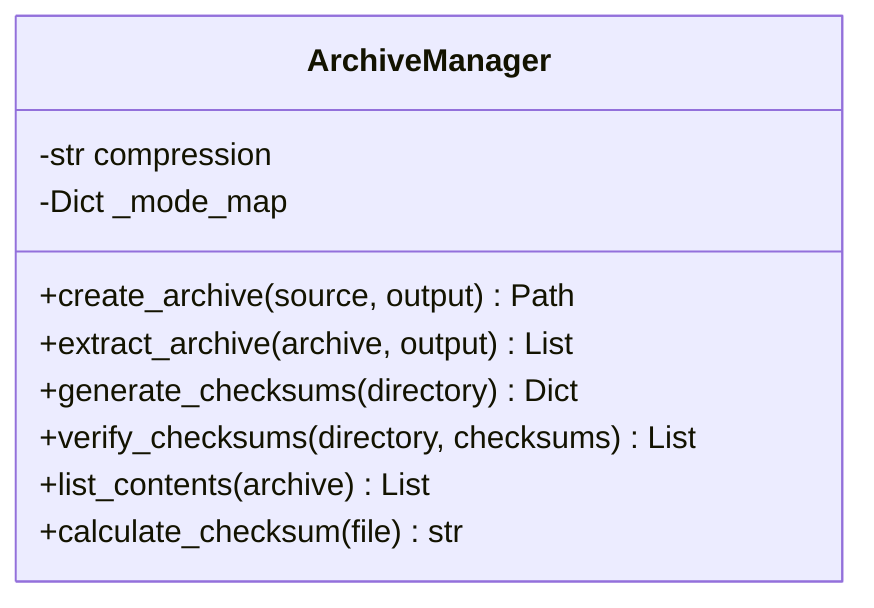
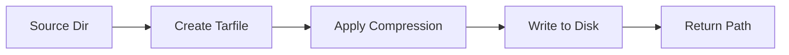

# Component Design: ArchiveManager

Created: 2025-12-29

---

## Table of Contents

- [1.0 Document Information](<#1.0 document information>)
- [2.0 Component Overview](<#2.0 component overview>)
- [3.0 Class Design](<#3.0 class design>)
- [4.0 Method Specifications](<#4.0 method specifications>)
- [5.0 Visual Documentation](<#5.0 visual documentation>)
- [Version History](<#version history>)

---

## 1.0 Document Information

```yaml
document_info:
  document_id: "design-c1d2e3f4-component_prov_archive_manager"
  tier: 3
  domain: "Provisioning"
  component: "ArchiveManager"
  parent: "design-5b2d4e6f-domain_provisioning.md"
  source_file: "src/gtach/provisioning/archive.py"
  version: "1.0"
  date: "2025-12-29"
  author: "William Watson"
```

### 1.1 Parent Reference

- **Domain Design**: [design-5b2d4e6f-domain_provisioning.md](<design-5b2d4e6f-domain_provisioning.md>)

[Return to Table of Contents](<#table of contents>)

---

## 2.0 Component Overview

### 2.1 Purpose

ArchiveManager handles creation and extraction of compressed tar archives with checksum generation and verification for deployment packages.

### 2.2 Responsibilities

1. Create compressed tar archives (gzip, bz2, xz)
2. Extract archives to target directory
3. Generate SHA256 checksums for files
4. Verify archive integrity via checksums
5. List archive contents

[Return to Table of Contents](<#table of contents>)

---

## 3.0 Class Design

### 3.1 ArchiveManager Class

```python
class ArchiveManager:
    """Compressed archive handler for deployment packages."""
```

### 3.2 Constructor

```python
def __init__(self, compression: str = "gzip") -> None:
    """Initialize archive manager.
    
    Args:
        compression: Compression type (gzip, bz2, xz)
    """
```

### 3.3 Attributes

| Attribute | Type | Purpose |
|-----------|------|---------|
| `compression` | `str` | Compression algorithm |
| `_mode_map` | `Dict` | Compression to tarfile mode |

### 3.4 Compression Modes

```python
MODE_MAP = {
    "gzip": "w:gz",
    "bz2": "w:bz2",
    "xz": "w:xz",
    "none": "w",
}

EXTENSION_MAP = {
    "gzip": ".tar.gz",
    "bz2": ".tar.bz2",
    "xz": ".tar.xz",
    "none": ".tar",
}
```

[Return to Table of Contents](<#table of contents>)

---

## 4.0 Method Specifications

### 4.1 create_archive

```python
def create_archive(self,
                   source_dir: Path,
                   output_path: Path,
                   base_name: Optional[str] = None) -> Path:
    """Create compressed archive from directory.
    
    Args:
        source_dir: Directory to archive
        output_path: Output file path (extension added if missing)
        base_name: Optional base directory name in archive
    
    Returns:
        Path to created archive
    
    Algorithm:
        1. Determine compression mode
        2. Open tarfile with mode
        3. Add all files from source_dir
        4. Close archive
        5. Return path
    """
```

### 4.2 extract_archive

```python
def extract_archive(self,
                    archive_path: Path,
                    output_dir: Path) -> List[Path]:
    """Extract archive to directory.
    
    Args:
        archive_path: Path to archive file
        output_dir: Extraction target directory
    
    Returns:
        List of extracted file paths
    """
```

### 4.3 generate_checksums

```python
def generate_checksums(self, directory: Path) -> Dict[str, str]:
    """Generate SHA256 checksums for all files.
    
    Args:
        directory: Directory to checksum
    
    Returns:
        Dict mapping relative path to SHA256 hex digest
    """
```

### 4.4 verify_checksums

```python
def verify_checksums(self,
                     directory: Path,
                     checksums: Dict[str, str]) -> List[str]:
    """Verify file checksums.
    
    Args:
        directory: Directory containing files
        checksums: Expected checksums
    
    Returns:
        List of failed file paths (empty if all pass)
    """
```

### 4.5 list_contents

```python
def list_contents(self, archive_path: Path) -> List[str]:
    """List archive contents without extracting.
    
    Args:
        archive_path: Path to archive
    
    Returns:
        List of file paths in archive
    """
```

### 4.6 calculate_checksum

```python
@staticmethod
def calculate_checksum(file_path: Path) -> str:
    """Calculate SHA256 checksum of file.
    
    Args:
        file_path: Path to file
    
    Returns:
        SHA256 hex digest string
    """
```

[Return to Table of Contents](<#table of contents>)

---

## 5.0 Visual Documentation

### 5.1 Class Diagram



### 5.2 Archive Creation Flow



[Return to Table of Contents](<#table of contents>)

---

## Version History

| Version | Date | Author | Changes |
|---------|------|--------|---------|
| 1.0 | 2025-12-29 | William Watson | Initial component design document |

---

Copyright (c) 2025 William Watson. This work is licensed under the MIT License.
