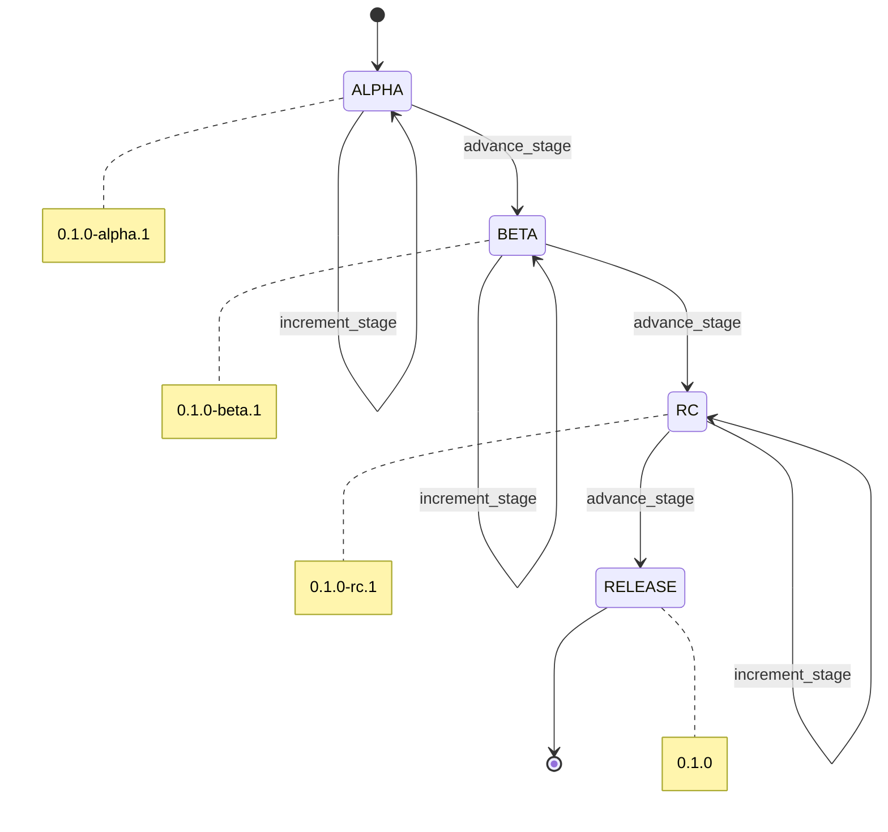
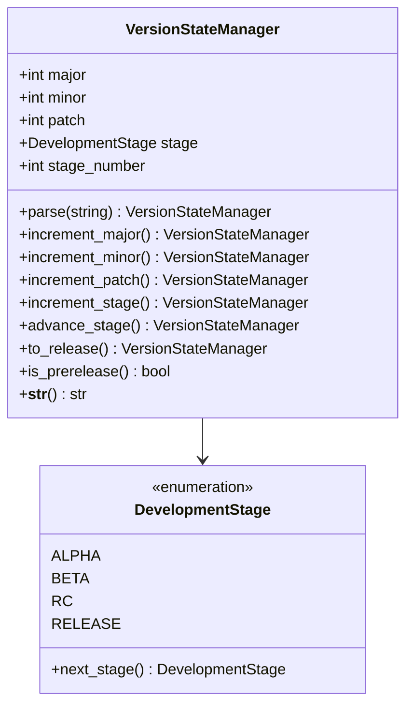

# Component Design: VersionStateManager

Created: 2025-12-29

---

## Table of Contents

- [1.0 Document Information](<#1.0 document information>)
- [2.0 Component Overview](<#2.0 component overview>)
- [3.0 Class Design](<#3.0 class design>)
- [4.0 Method Specifications](<#4.0 method specifications>)
- [5.0 Version State Machine](<#5.0 version state machine>)
- [6.0 Visual Documentation](<#6.0 visual documentation>)
- [Version History](<#version history>)

---

## 1.0 Document Information

```yaml
document_info:
  document_id: "design-d2e3f4a5-component_prov_version_state_manager"
  tier: 3
  domain: "Provisioning"
  component: "VersionStateManager"
  parent: "design-5b2d4e6f-domain_provisioning.md"
  source_file: "src/gtach/provisioning/version_state.py"
  version: "1.0"
  date: "2025-12-29"
  author: "William Watson"
```

### 1.1 Parent Reference

- **Domain Design**: [design-5b2d4e6f-domain_provisioning.md](<design-5b2d4e6f-domain_provisioning.md>)

[Return to Table of Contents](<#table of contents>)

---

## 2.0 Component Overview

### 2.1 Purpose

VersionStateManager tracks semantic versioning with development stage progression (ALPHA→BETA→RC→RELEASE) and provides version comparison and increment operations.

### 2.2 Responsibilities

1. Parse semantic version strings
2. Track development stage (alpha, beta, rc, release)
3. Provide version increment operations
4. Support stage transitions
5. Format version strings

### 2.3 Semantic Versioning

Follows https://semver.org with extensions for development stages:
- `MAJOR.MINOR.PATCH` (e.g., 1.0.0)
- `MAJOR.MINOR.PATCH-stage.N` (e.g., 0.1.0-alpha.1)

[Return to Table of Contents](<#table of contents>)

---

## 3.0 Class Design

### 3.1 VersionStateManager Class

```python
class VersionStateManager:
    """Semantic version with development stage tracking."""
```

### 3.2 Constructor

```python
def __init__(self, version_string: str = "0.1.0-alpha.1") -> None:
    """Initialize from version string.
    
    Args:
        version_string: Semantic version string
    
    Raises:
        ValueError: If version string invalid
    """
```

### 3.3 Attributes

| Attribute | Type | Purpose |
|-----------|------|---------|
| `major` | `int` | Major version |
| `minor` | `int` | Minor version |
| `patch` | `int` | Patch version |
| `stage` | `DevelopmentStage` | Current stage |
| `stage_number` | `int` | Stage iteration |

### 3.4 DevelopmentStage Enum

```python
class DevelopmentStage(Enum):
    """Development stage enumeration."""
    ALPHA = "alpha"
    BETA = "beta"
    RC = "rc"          # Release candidate
    RELEASE = "release"
    
    def next_stage(self) -> 'DevelopmentStage':
        """Get next development stage."""
        order = [ALPHA, BETA, RC, RELEASE]
        idx = order.index(self)
        return order[min(idx + 1, len(order) - 1)]
```

[Return to Table of Contents](<#table of contents>)

---

## 4.0 Method Specifications

### 4.1 parse

```python
@classmethod
def parse(cls, version_string: str) -> 'VersionStateManager':
    """Parse version string.
    
    Args:
        version_string: Version to parse
    
    Returns:
        VersionStateManager instance
    
    Formats Accepted:
        - "1.0.0"
        - "0.1.0-alpha.1"
        - "1.2.3-beta.2"
        - "2.0.0-rc.1"
    """
```

### 4.2 increment_major / minor / patch

```python
def increment_major(self) -> 'VersionStateManager':
    """Increment major version, reset minor/patch."""

def increment_minor(self) -> 'VersionStateManager':
    """Increment minor version, reset patch."""

def increment_patch(self) -> 'VersionStateManager':
    """Increment patch version."""
```

### 4.3 increment_stage

```python
def increment_stage(self) -> 'VersionStateManager':
    """Increment stage number (e.g., alpha.1 -> alpha.2)."""
```

### 4.4 advance_stage

```python
def advance_stage(self) -> 'VersionStateManager':
    """Advance to next development stage.
    
    Transitions:
        alpha.N -> beta.1
        beta.N -> rc.1
        rc.N -> release
    """
```

### 4.5 to_release

```python
def to_release(self) -> 'VersionStateManager':
    """Convert to release version (remove stage suffix)."""
```

### 4.6 __str__

```python
def __str__(self) -> str:
    """Format as version string.
    
    Returns:
        "1.0.0" or "0.1.0-alpha.1"
    """
```

### 4.7 Comparison Methods

```python
def __lt__(self, other: 'VersionStateManager') -> bool:
    """Compare versions for ordering."""

def __eq__(self, other: 'VersionStateManager') -> bool:
    """Check version equality."""

def is_prerelease(self) -> bool:
    """Check if prerelease version."""
```

[Return to Table of Contents](<#table of contents>)

---

## 5.0 Version State Machine

### 5.1 Stage Transitions

```
ALPHA.1 -> ALPHA.2 -> ... -> ALPHA.N
    |
    v (advance_stage)
BETA.1 -> BETA.2 -> ... -> BETA.N
    |
    v (advance_stage)
RC.1 -> RC.2 -> ... -> RC.N
    |
    v (advance_stage / to_release)
RELEASE (no suffix)
```

### 5.2 Version Ordering

```
0.1.0-alpha.1 < 0.1.0-alpha.2 < 0.1.0-beta.1 < 0.1.0-rc.1 < 0.1.0
```

[Return to Table of Contents](<#table of contents>)

---

## 6.0 Visual Documentation

### 6.1 State Diagram



### 6.2 Class Diagram



[Return to Table of Contents](<#table of contents>)

---

## Version History

| Version | Date | Author | Changes |
|---------|------|--------|---------|
| 1.0 | 2025-12-29 | William Watson | Initial component design document |

---

Copyright (c) 2025 William Watson. This work is licensed under the MIT License.
