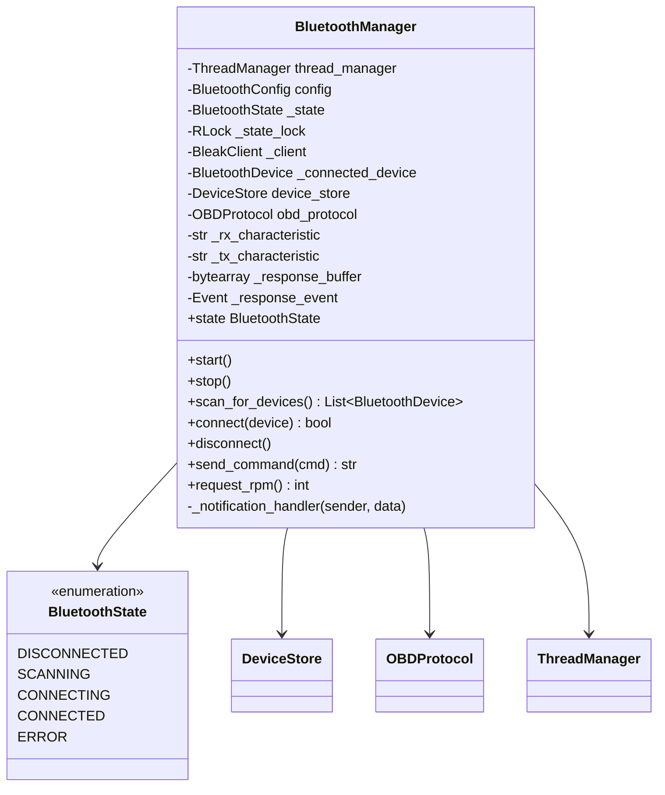
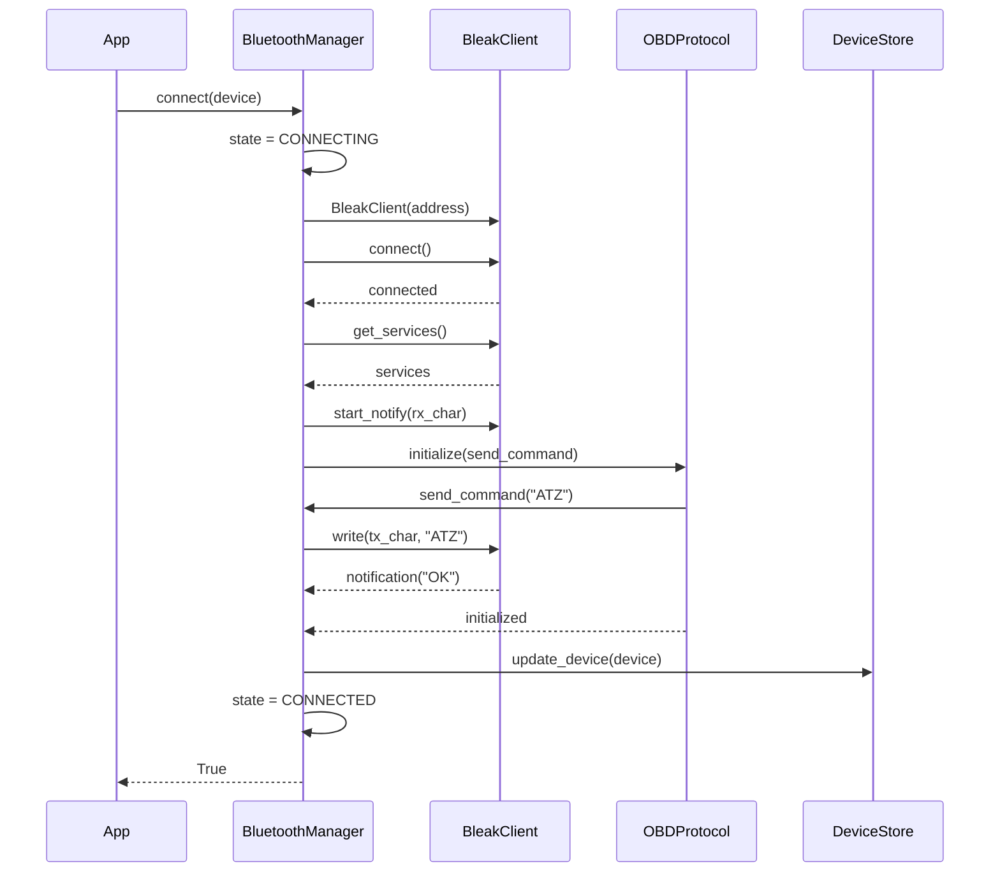
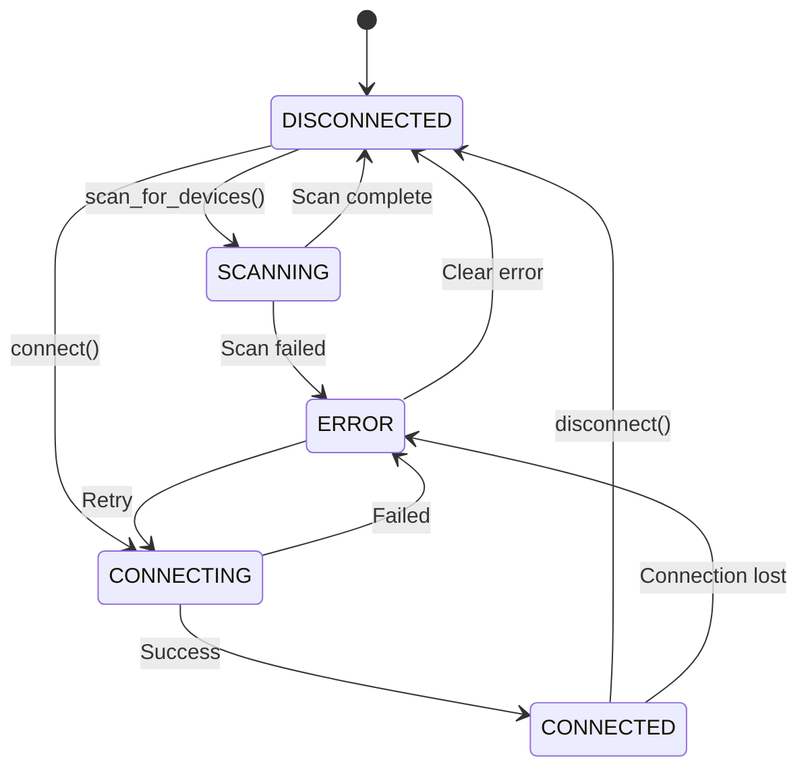

# Component Design: BluetoothManager

Created: 2025-12-29

---

## Table of Contents

- [1.0 Document Information](<#1.0 document information>)
- [2.0 Component Overview](<#2.0 component overview>)
- [3.0 Class Design](<#3.0 class design>)
- [4.0 Method Specifications](<#4.0 method specifications>)
- [5.0 Data Structures](<#5.0 data structures>)
- [6.0 State Management](<#6.0 state management>)
- [7.0 Threading Model](<#7.0 threading model>)
- [8.0 Error Handling](<#8.0 error handling>)
- [9.0 Dependencies](<#9.0 dependencies>)
- [10.0 Visual Documentation](<#10.0 visual documentation>)
- [Version History](<#version history>)

---

## 1.0 Document Information

```yaml
document_info:
  document_id: "design-d4e5f6a7-component_comm_bluetooth_manager"
  tier: 3
  domain: "Communication"
  component: "BluetoothManager"
  parent: "design-7d3e9f5a-domain_comm.md"
  source_file: "src/gtach/comm/bluetooth.py"
  version: "1.0"
  date: "2025-12-29"
  author: "William Watson"
```

### 1.1 Parent Reference

- **Domain Design**: [design-7d3e9f5a-domain_comm.md](<design-7d3e9f5a-domain_comm.md>)
- **Master Design**: [design-0000-master_gtach.md](<design-0000-master_gtach.md>)

[Return to Table of Contents](<#table of contents>)

---

## 2.0 Component Overview

### 2.1 Purpose

BluetoothManager provides cross-platform Bluetooth Low Energy (BLE) connectivity using the Bleak library. It manages device discovery, connection lifecycle, and data transmission with ELM327-compatible OBD-II adapters.

### 2.2 Responsibilities

1. Scan for BLE devices with timeout handling
2. Connect to ELM327 OBD-II adapters
3. Manage connection state machine (DISCONNECTED→SCANNING→CONNECTING→CONNECTED→ERROR)
4. Handle characteristic discovery and notification subscription
5. Send commands and receive responses via BLE characteristics
6. Provide thread-safe state access via property wrappers
7. Coordinate with OBDProtocol for ELM327 initialization

### 2.3 Design Rationale

- **Bleak Library**: Cross-platform async BLE (macOS CoreBluetooth, Linux BlueZ)
- **State Machine**: Clear connection lifecycle with defined transitions
- **RLock Properties**: Thread-safe state access from any thread
- **Async/Await**: Native async for non-blocking BLE operations

[Return to Table of Contents](<#table of contents>)

---

## 3.0 Class Design

### 3.1 BluetoothManager Class

```python
class BluetoothManager:
    """Cross-platform Bluetooth manager using Bleak.
    
    Provides async BLE operations with thread-safe state management
    for connecting to ELM327 OBD-II adapters.
    
    Thread Safety:
        State properties protected by RLock
        Async operations run in dedicated event loop
    """
```

### 3.2 Constructor Signature

```python
def __init__(self, 
             thread_manager: ThreadManager,
             config: Optional[BluetoothConfig] = None) -> None:
    """Initialize Bluetooth manager.
    
    Args:
        thread_manager: ThreadManager for thread registration
        config: Optional BluetoothConfig (uses defaults if None)
    
    Initializes:
        - State to DISCONNECTED
        - RLock for thread-safe property access
        - Empty client reference
        - Device store for persistence
        - OBD protocol handler
    """
```

### 3.3 Instance Attributes

| Attribute | Type | Purpose |
|-----------|------|---------|
| `thread_manager` | `ThreadManager` | Thread registration/heartbeat |
| `config` | `BluetoothConfig` | Connection parameters |
| `_state` | `BluetoothState` | Current state (protected) |
| `_state_lock` | `threading.RLock` | State access synchronization |
| `_client` | `Optional[BleakClient]` | Active BLE client |
| `_connected_device` | `Optional[BluetoothDevice]` | Current device info |
| `device_store` | `DeviceStore` | Persistent device storage |
| `obd_protocol` | `OBDProtocol` | ELM327 protocol handler |
| `_rx_characteristic` | `Optional[str]` | Read characteristic UUID |
| `_tx_characteristic` | `Optional[str]` | Write characteristic UUID |
| `_response_buffer` | `bytearray` | Incoming data buffer |
| `_response_event` | `asyncio.Event` | Response received signal |
| `_stop_event` | `threading.Event` | Shutdown signal |

[Return to Table of Contents](<#table of contents>)

---

## 4.0 Method Specifications

### 4.1 State Property

```python
@property
def state(self) -> BluetoothState:
    """Thread-safe state access.
    
    Returns:
        Current BluetoothState
    
    Thread Safety:
        Acquires _state_lock for read
    """

@state.setter
def state(self, value: BluetoothState) -> None:
    """Thread-safe state update with logging.
    
    Thread Safety:
        Acquires _state_lock for write
        Logs state transitions at INFO level
    """
```

### 4.2 start / stop

```python
async def start(self) -> None:
    """Start Bluetooth manager and attempt auto-connect.
    
    Algorithm:
        1. Register thread with thread_manager
        2. Set state to DISCONNECTED
        3. Attempt connection to last known device (if any)
        4. If no last device, remain DISCONNECTED
    """

async def stop(self) -> None:
    """Stop Bluetooth manager and disconnect.
    
    Algorithm:
        1. Set _stop_event
        2. If connected, call disconnect()
        3. Set state to DISCONNECTED
    """
```

### 4.3 scan_for_devices

```python
async def scan_for_devices(self, 
                           duration: float = None) -> List[BluetoothDevice]:
    """Scan for BLE devices.
    
    Args:
        duration: Scan duration (default from config.scan_duration)
    
    Returns:
        List of discovered BluetoothDevice objects
    
    State Transitions:
        Current -> SCANNING -> Previous state
    
    Algorithm:
        1. Store current state
        2. Set state to SCANNING
        3. Create BleakScanner
        4. Start scan with timeout
        5. Filter for ELM327/OBD devices (name matching)
        6. Convert to BluetoothDevice objects
        7. Update device_store with discoveries
        8. Restore previous state
        9. Return device list
    
    Error Handling:
        On exception: restore state, log error, return empty list
    """
```

### 4.4 connect

```python
async def connect(self, device: BluetoothDevice) -> bool:
    """Connect to a Bluetooth device.
    
    Args:
        device: BluetoothDevice to connect to
    
    Returns:
        True if connection successful
    
    State Transitions:
        Current -> CONNECTING -> CONNECTED or ERROR
    
    Algorithm:
        1. If already connected, disconnect first
        2. Set state to CONNECTING
        3. Create BleakClient with device address
        4. Connect with timeout
        5. Discover services and characteristics
        6. Find RX/TX characteristics for SPP
        7. Subscribe to notifications
        8. Initialize ELM327 via obd_protocol
        9. Update device_store with connection
        10. Set state to CONNECTED
        11. Store _connected_device
        12. Return True
    
    Error Handling:
        On exception: set state to ERROR, log error, return False
    """
```

### 4.5 disconnect

```python
async def disconnect(self) -> None:
    """Disconnect from current device.
    
    State Transitions:
        Current -> DISCONNECTED
    
    Algorithm:
        1. If _client exists and is_connected:
           a. Unsubscribe from notifications
           b. Call _client.disconnect()
        2. Clear _client
        3. Clear _connected_device
        4. Set state to DISCONNECTED
    """
```

### 4.6 send_command

```python
async def send_command(self, 
                       command: str, 
                       timeout: float = None) -> Optional[str]:
    """Send command and wait for response.
    
    Args:
        command: Command string to send
        timeout: Response timeout (default from config)
    
    Returns:
        Response string or None on timeout/error
    
    Algorithm:
        1. Verify connected state
        2. Clear _response_buffer
        3. Clear _response_event
        4. Encode command with CR terminator
        5. Write to _tx_characteristic
        6. Wait for _response_event with timeout
        7. Decode and return response
    
    Error Handling:
        On timeout: log warning, return None
        On exception: log error, return None
    """
```

### 4.7 _notification_handler

```python
def _notification_handler(self, 
                          sender: int, 
                          data: bytearray) -> None:
    """Handle incoming BLE notifications.
    
    Called by Bleak when data received on subscribed characteristic.
    
    Algorithm:
        1. Append data to _response_buffer
        2. Check for response terminator ('>') 
        3. If complete response: set _response_event
    """
```

### 4.8 request_rpm

```python
async def request_rpm(self) -> Optional[int]:
    """Request current RPM from vehicle.
    
    Returns:
        RPM value or None on error
    
    Algorithm:
        1. Send "010C" command via send_command
        2. Parse response via obd_protocol.parse_rpm_response
        3. Return RPM value
    """
```

[Return to Table of Contents](<#table of contents>)

---

## 5.0 Data Structures

### 5.1 BluetoothState Enum

```python
class BluetoothState(Enum):
    """Bluetooth connection state."""
    DISCONNECTED = auto()  # No active connection
    SCANNING = auto()      # Scanning for devices
    CONNECTING = auto()    # Connection in progress
    CONNECTED = auto()     # Active connection
    ERROR = auto()         # Error state
```

### 5.2 BluetoothConfig Dataclass

```python
@dataclass
class BluetoothConfig:
    """Bluetooth configuration parameters."""
    scan_duration: float = 10.0       # Scan timeout seconds
    connection_timeout: float = 10.0  # Connect timeout
    command_timeout: float = 2.0      # Command response timeout
    retry_limit: int = 3              # Max retry attempts
    retry_delay: float = 3.0          # Delay between retries
```

### 5.3 ELM327 Characteristics

```python
# Standard SPP-over-BLE UUIDs
SPP_SERVICE_UUID = "0000ffe0-0000-1000-8000-00805f9b34fb"
SPP_CHARACTERISTIC_UUID = "0000ffe1-0000-1000-8000-00805f9b34fb"

# Some adapters use different UUIDs
ALT_SERVICE_UUID = "00001101-0000-1000-8000-00805f9b34fb"
```

[Return to Table of Contents](<#table of contents>)

---

## 6.0 State Management

### 6.1 State Transitions

| From | To | Trigger |
|------|-----|---------|
| DISCONNECTED | SCANNING | scan_for_devices() |
| DISCONNECTED | CONNECTING | connect() |
| SCANNING | DISCONNECTED | Scan complete |
| SCANNING | ERROR | Scan failure |
| CONNECTING | CONNECTED | Connection success |
| CONNECTING | ERROR | Connection failure |
| CONNECTED | DISCONNECTED | disconnect() |
| CONNECTED | ERROR | Connection lost |
| ERROR | DISCONNECTED | Error cleared |
| ERROR | CONNECTING | Retry connection |

### 6.2 Thread-Safe State Access

```python
@property
def state(self) -> BluetoothState:
    with self._state_lock:
        return self._state

@state.setter  
def state(self, value: BluetoothState) -> None:
    with self._state_lock:
        old_state = self._state
        self._state = value
        if old_state != value:
            self.logger.info(f"State: {old_state.name} -> {value.name}")
```

[Return to Table of Contents](<#table of contents>)

---

## 7.0 Threading Model

### 7.1 Async Event Loop

```python
# BluetoothManager runs in dedicated thread with own event loop
async def _bluetooth_thread_main(self):
    """Main entry point for Bluetooth thread."""
    loop = asyncio.get_event_loop()
    self.thread_manager.async_bridge.set_event_loop(loop)
    
    await self.start()
    
    while not self._stop_event.is_set():
        self.thread_manager.update_heartbeat('bluetooth')
        # Process BLE events
        await asyncio.sleep(0.1)
    
    await self.stop()
```

### 7.2 Cross-Thread Communication

```
Main Thread                    Bluetooth Thread
     │                              │
     │ async_bridge.submit_async_task(connect())
     │─────────────────────────────►│
     │                              │ await connect()
     │                              │ Bleak operations
     │◄─────────────────────────────│
     │ Future.result()              │
```

[Return to Table of Contents](<#table of contents>)

---

## 8.0 Error Handling

### 8.1 Exception Strategy

| Scenario | Exception | Handling |
|----------|-----------|----------|
| Scan failure | BleakError | Log, return empty list |
| Connection failure | BleakError | Log, set ERROR state |
| Characteristic not found | ValueError | Log, disconnect |
| Write failure | BleakError | Log, return None |
| Notification error | BleakError | Log, attempt recovery |

### 8.2 Retry Logic

```python
async def connect_with_retry(self, device: BluetoothDevice) -> bool:
    """Connect with exponential backoff retry."""
    for attempt in range(self.config.retry_limit):
        if await self.connect(device):
            return True
        delay = self.config.retry_delay * (2 ** attempt)
        await asyncio.sleep(delay)
    return False
```

[Return to Table of Contents](<#table of contents>)

---

## 9.0 Dependencies

### 9.1 Internal Dependencies

| Component | Usage |
|-----------|-------|
| ThreadManager | Thread registration, heartbeat |
| DeviceStore | Device persistence |
| OBDProtocol | ELM327 initialization, response parsing |
| BluetoothDevice | Device information container |

### 9.2 External Dependencies

| Package | Import | Purpose |
|---------|--------|---------|
| bleak | BleakClient, BleakScanner | BLE operations |
| asyncio | Event, get_event_loop | Async coordination |
| threading | RLock, Event | Thread safety |
| logging | getLogger | Structured logging |

[Return to Table of Contents](<#table of contents>)

---

## 10.0 Visual Documentation

### 10.1 Class Diagram



### 10.2 Connection Sequence



### 10.3 State Machine



[Return to Table of Contents](<#table of contents>)

---

## Version History

| Version | Date | Author | Changes |
|---------|------|--------|---------|
| 1.0 | 2025-12-29 | William Watson | Initial component design document |

---

Copyright (c) 2025 William Watson. This work is licensed under the MIT License.
