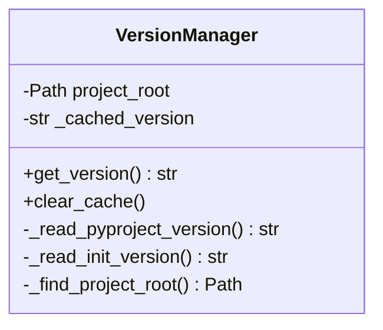
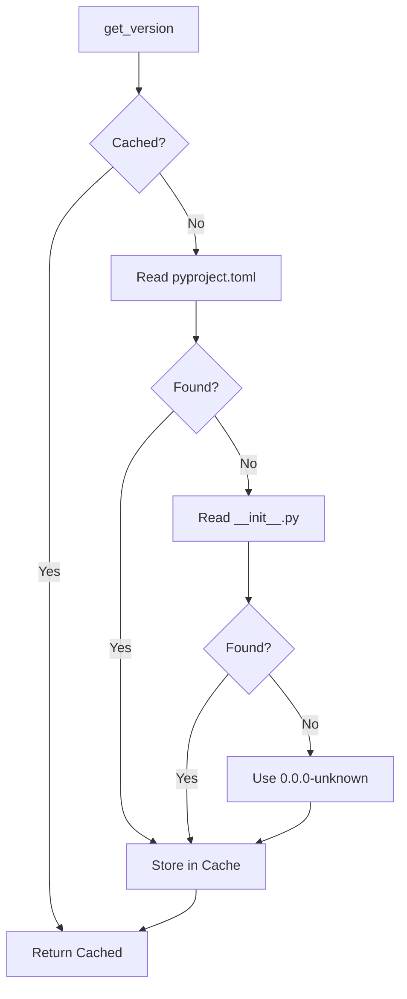

# Component Design: VersionManager

Created: 2025-12-29

---

## Table of Contents

- [1.0 Document Information](<#1.0 document information>)
- [2.0 Component Overview](<#2.0 component overview>)
- [3.0 Class Design](<#3.0 class design>)
- [4.0 Method Specifications](<#4.0 method specifications>)
- [5.0 Version Sources](<#5.0 version sources>)
- [6.0 Visual Documentation](<#6.0 visual documentation>)
- [Version History](<#version history>)

---

## 1.0 Document Information

```yaml
document_info:
  document_id: "design-e3f4a5b6-component_prov_version_manager"
  tier: 3
  domain: "Provisioning"
  component: "VersionManager"
  parent: "design-5b2d4e6f-domain_provisioning.md"
  source_file: "src/gtach/provisioning/version.py"
  version: "1.0"
  date: "2025-12-29"
  author: "William Watson"
```

### 1.1 Parent Reference

- **Domain Design**: [design-5b2d4e6f-domain_provisioning.md](<design-5b2d4e6f-domain_provisioning.md>)

[Return to Table of Contents](<#table of contents>)

---

## 2.0 Component Overview

### 2.1 Purpose

VersionManager reads version information from project metadata files (pyproject.toml, __init__.py) providing a unified interface for version access.

### 2.2 Responsibilities

1. Read version from pyproject.toml
2. Read version from __init__.py __version__
3. Provide fallback hierarchy for version sources
4. Cache version for performance

[Return to Table of Contents](<#table of contents>)

---

## 3.0 Class Design

### 3.1 VersionManager Class

```python
class VersionManager:
    """Project version reader from metadata files."""
```

### 3.2 Constructor

```python
def __init__(self, project_root: Optional[Path] = None) -> None:
    """Initialize version manager.
    
    Args:
        project_root: Project root directory (auto-detect if None)
    """
```

### 3.3 Attributes

| Attribute | Type | Purpose |
|-----------|------|---------|
| `project_root` | `Path` | Project root directory |
| `_cached_version` | `Optional[str]` | Cached version string |
| `_sources` | `List[Callable]` | Version source methods |

[Return to Table of Contents](<#table of contents>)

---

## 4.0 Method Specifications

### 4.1 get_version

```python
def get_version(self) -> str:
    """Get project version.
    
    Returns:
        Version string (e.g., "0.1.0-alpha.1")
    
    Resolution Order:
        1. pyproject.toml [project] version
        2. src/gtach/__init__.py __version__
        3. "0.0.0-unknown" fallback
    """
```

### 4.2 _read_pyproject_version

```python
def _read_pyproject_version(self) -> Optional[str]:
    """Read version from pyproject.toml.
    
    Parses TOML and extracts [project].version field.
    """
```

### 4.3 _read_init_version

```python
def _read_init_version(self) -> Optional[str]:
    """Read version from __init__.py.
    
    Uses regex to extract __version__ = "..." pattern.
    """
```

### 4.4 _find_project_root

```python
def _find_project_root(self) -> Path:
    """Auto-detect project root.
    
    Searches upward for pyproject.toml or .git directory.
    """
```

### 4.5 clear_cache

```python
def clear_cache(self) -> None:
    """Clear cached version for re-read."""
```

[Return to Table of Contents](<#table of contents>)

---

## 5.0 Version Sources

### 5.1 pyproject.toml

```toml
[project]
name = "gtach"
version = "0.1.0-alpha.1"
```

### 5.2 __init__.py

```python
# src/gtach/__init__.py
__version__ = "0.1.0-alpha.1"
```

### 5.3 Resolution Priority

```
1. pyproject.toml (authoritative source)
2. __init__.py (fallback for runtime)
3. "0.0.0-unknown" (error indicator)
```

[Return to Table of Contents](<#table of contents>)

---

## 6.0 Visual Documentation

### 6.1 Class Diagram



### 6.2 Version Resolution Flow



[Return to Table of Contents](<#table of contents>)

---

## Version History

| Version | Date | Author | Changes |
|---------|------|--------|---------|
| 1.0 | 2025-12-29 | William Watson | Initial component design document |

---

Copyright (c) 2025 William Watson. This work is licensed under the MIT License.
