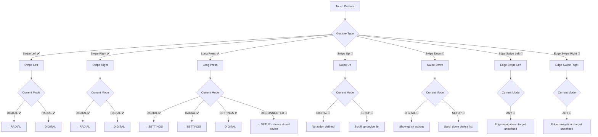

Created: 2026 May 27

# Gesture Reference

---

## Table of Contents

- [1.0 Document Information](<#1.0 document information>)
- [2.0 Purpose](<#2.0 purpose>)
- [3.0 Gesture Inventory](<#3.0 gesture inventory>)
- [4.0 Gesture-to-Action Mapping](<#4.0 gesture-to-action mapping>)
- [5.0 Implementation Status](<#5.0 implementation status>)
- [6.0 Detection Parameters](<#6.0 detection parameters>)
- [Version History](<#version history>)

---

## 1.0 Document Information

```yaml
document_info:
  document_id: "design-g1h2i3j4-gesture_reference"
  tier: 3
  domain: "Display"
  component: "TouchHandler / NavigationGestureHandler"
  parent: "design-2c6b8e4d-domain_display.md"
  source_files:
    - "src/gtach/display/touch.py"
    - "src/gtach/display/navigation_gestures.py"
  version: "1.0"
  date: "2026-05-27"
```

### 1.1 Related Documents

- [design-2c6b8e4d-domain_display.md](<design-2c6b8e4d-domain_display.md>) — Display domain
- [design-b8c9d0e1-component_display_manager.md](<design-b8c9d0e1-component_display_manager.md>) — DisplayManager (mode transitions)
- [design-d0e1f2a3-component_display_touch_coordinator.md](<design-d0e1f2a3-component_display_touch_coordinator.md>) — TouchEventCoordinator
- [design-a3b4c5d6-component_display_setup_manager.md](<design-a3b4c5d6-component_display_setup_manager.md>) — Setup wizard touch interactions

### 1.2 Status Key

| Symbol | Meaning |
|--------|---------|
| ✅ | Implemented — active in `touch.py` |
| 🔶 | Designed — defined in `navigation_gestures.py`; not wired into active touch path |
| ❌ | Not designed — no implementation or design exists |

[Return to Table of Contents](<#table of contents>)

---

## 2.0 Purpose

This document provides a single reference for all touch gestures in GTach: what gestures exist, which display modes they apply to, what action each gesture triggers, and whether that gesture is currently implemented.

The active touch handler is `touch.py` (`TouchHandler`). The `NavigationGestureHandler` in `navigation_gestures.py` is instantiated but bypassed at runtime; its gesture definitions are recorded here as designed-but-unimplemented.

[Return to Table of Contents](<#table of contents>)

---

## 3.0 Gesture Inventory

### 3.1 Recognised Gesture Types

| Gesture | Direction / Duration | Detection Criteria | Status |
|---------|---------------------|--------------------|--------|
| Swipe horizontal | Left or right | `abs(dx) ≥ 100px`, short duration | ✅ |
| Long press | Any position | Duration `≥ 1.0s` | ✅ |
| Swipe up | Upward | `abs(dy) ≥ 80px`, velocity `≥ 200px/s` | 🔶 |
| Swipe down | Downward | `abs(dy) ≥ 80px`, velocity `≥ 200px/s` | 🔶 |
| Edge swipe left | From left edge (`x ≤ 40px`) | `dx ≥ 80px` | 🔶 |
| Edge swipe right | From right edge (`x ≥ 440px`) | `dx ≤ -80px` | 🔶 |
| Tap | Any position | `distance < threshold`, short duration | 🔶 |

### 3.2 Detection Notes

- Swipe threshold in `touch.py`: `100px` (horizontal only).
- Swipe threshold in `navigation_gestures.py`: `80px` (all directions); velocity threshold `200px/s`.
- Long press threshold: configurable via `DisplayConfig.touch_long_press` (default `1.0s`).
- Left and right swipes produce the same action in the current implementation (no directional distinction).

[Return to Table of Contents](<#table of contents>)

---

## 4.0 Gesture-to-Action Mapping

### 4.1 Diagram



### 4.2 Tabular Reference

| Gesture | Mode | Action | Status |
|---------|------|--------|--------|
| Swipe left | DIGITAL | → RADIAL | ✅ |
| Swipe left | RADIAL | → DIGITAL | ✅ |
| Swipe right | DIGITAL | → RADIAL | ✅ |
| Swipe right | RADIAL | → DIGITAL | ✅ |
| Long press | DIGITAL | → SETTINGS | ✅ |
| Long press | RADIAL | → SETTINGS | ✅ |
| Long press | SETTINGS | → DIGITAL | ✅ |
| Long press | DISCONNECTED | → SETUP (clears stored device) | 🔶 |
| Swipe up | DIGITAL | No action defined | 🔶 |
| Swipe up | SETUP / DEVICE_LIST | Scroll device list up | 🔶 |
| Swipe down | DIGITAL | Show quick actions | 🔶 |
| Swipe down | SETUP / DEVICE_LIST | Scroll device list down | 🔶 |
| Edge swipe left | ANY | Edge navigation (target undefined) | 🔶 |
| Edge swipe right | ANY | Edge navigation (target undefined) | 🔶 |
| Tap | SETUP / WELCOME | Start scan | 🔶 |
| Tap | SETUP / DEVICE_LIST | Select device | 🔶 |
| Tap | SETUP / FAILURE | Retry | 🔶 |
| Long press | SETUP / DEVICE_LIST | Connect to selected device | 🔶 |

### 4.3 Observations

- Swipe left and swipe right are functionally identical in the current implementation — both toggle DIGITAL ↔ RADIAL with no directional distinction.
- The DISCONNECTED → SETUP long-press transition is specified in the master design but not implemented in `touch.py`.
- Swipe up/down and edge swipes are fully defined in `NavigationGestureHandler` but the class is bypassed in the active touch path.
- Setup wizard tap/swipe interactions are specified in `design-a3b4c5d6` but their implementation status is not confirmed against `setup_manager.py`.

[Return to Table of Contents](<#table of contents>)

---

## 5.0 Implementation Status

### 5.1 Active Touch Path

The live gesture handling resides in `src/gtach/display/touch.py` (`TouchHandler._process_touch`). It implements:

- Horizontal swipe detection via `abs(dx) ≥ 100px`
- Long press detection via `duration ≥ touch_long_press` (default `1.0s`)
- Direct mode switching — no intermediary gesture handler

`NavigationGestureHandler` is instantiated in `DisplayManager.__init__` but its `cancel_gesture()` method is the only call made from the active touch path; gesture routing through it does not occur.

### 5.2 Unimplemented Items Requiring Design Decisions

The following require design resolution before implementation:

| Item | Gap |
|------|-----|
| Long press on DISCONNECTED → SETUP | Implemented in design; not in `touch.py` |
| Swipe up / Swipe down actions on main screens | Partially specified; no confirmed target actions |
| Edge swipe targets | Defined as gesture type; no target action assigned |
| Left vs right swipe distinction | Both map to same toggle; directional behaviour unspecified |

[Return to Table of Contents](<#table of contents>)

---

## 6.0 Detection Parameters

| Parameter | Source | Value | Notes |
|-----------|--------|-------|-------|
| Horizontal swipe threshold | `touch.py` | `100px` | Hard-coded |
| Long press duration | `DisplayConfig.touch_long_press` | `1.0s` | Configurable |
| Swipe threshold (designed) | `GestureConfig.swipe_threshold` | `80px` | `navigation_gestures.py` |
| Velocity threshold (designed) | `GestureConfig.velocity_threshold` | `200px/s` | `navigation_gestures.py` |
| Edge detection width (designed) | `GestureConfig.edge_width` | `40px` | `navigation_gestures.py` |
| Max gesture time (designed) | `GestureConfig.max_gesture_time` | `1.0s` | `navigation_gestures.py` |

[Return to Table of Contents](<#table of contents>)

---

## Version History

| Version | Date | Description |
|---------|------|-------------|
| 1.0 | 2026-05-27 | Initial document. |

---

Copyright (c) 2026 William Watson. MIT License.
