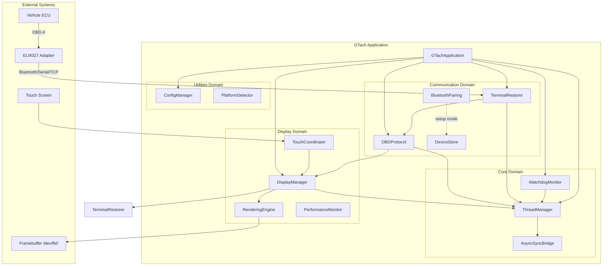
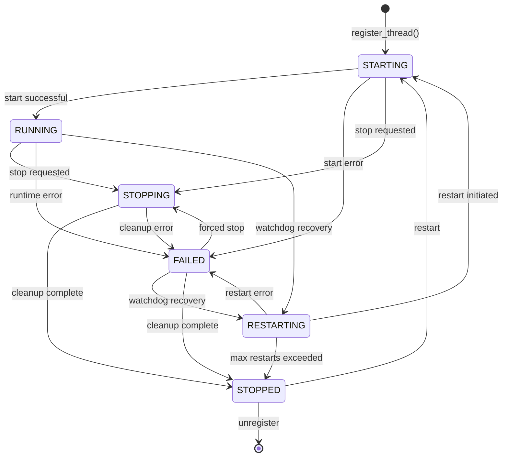
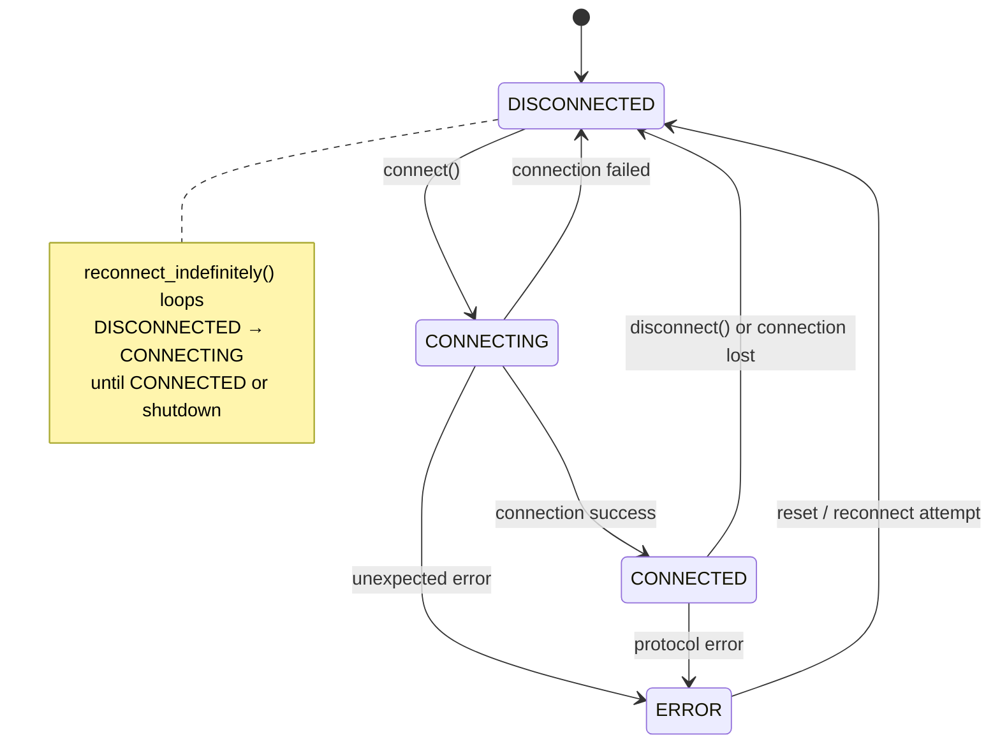
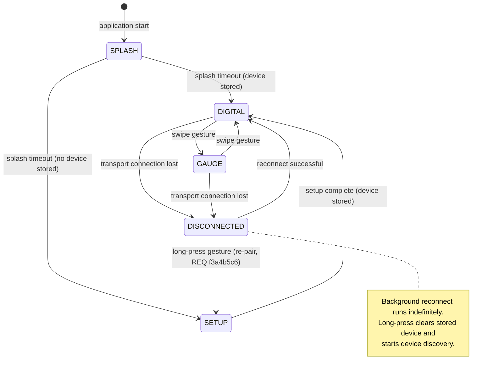

# GTach Master Design Document

Created: 2025-12-29

---

## Table of Contents

- [1.0 Project Information](<#1.0 project information>)
- [2.0 Scope](<#2.0 scope>)
- [3.0 System Overview](<#3.0 system overview>)
- [4.0 Design Constraints](<#4.0 design constraints>)
- [5.0 Development Environment](<#5.0 development environment>)
- [6.0 Target Platform](<#6.0 target platform>)
- [7.0 Architecture](<#7.0 architecture>)
- [8.0 Domain Structure](<#8.0 domain structure>)
- [9.0 Data Design](<#9.0 data design>)
- [10.0 Interfaces](<#10.0 interfaces>)
- [11.0 Error Handling](<#11.0 error handling>)
- [12.0 Non-Functional Requirements](<#12.0 non-functional requirements>)
- [13.0 Visual Documentation](<#13.0 visual documentation>)
- [14.0 Tier 2 Domain Documents](<#14.0 tier 2 domain documents>)
- [15.0 Tier 3 Component Documents](<#15.0 tier 3 component documents>)
- [Version History](<#version history>)

---

## 1.0 Project Information

```yaml
project_info:
  name: "GTach"
  version: "0.2.0"
  date: "2025-12-29"
  author: "William Watson"
  description: "Real-time automotive tachometer display for embedded circular touch screens"
  license: "MIT"
```

[Return to Table of Contents](<#table of contents>)

---

## 2.0 Scope

### 2.1 Purpose

GTach provides real-time engine RPM monitoring via OBD-II Bluetooth interface with visualization on embedded circular touch displays. The application connects to ELM327-compatible Bluetooth OBD-II adapters, retrieves engine telemetry data, and renders tachometer displays optimized for automotive dash mounting.

### 2.2 In Scope

- ELM327 OBD-II protocol communication via Bluetooth
- Real-time RPM data acquisition and display
- Digital and analog gauge display modes
- Touch-based user interface with gesture navigation
- Setup wizard for initial Bluetooth device pairing
- Cross-platform development (macOS) to deployment (Raspberry Pi) pipeline
- Thread-safe concurrent operation with watchdog monitoring
- Graceful degradation with hardware mock fallbacks

### 2.3 Out of Scope

- WiFi OBD-II adapters
- CAN bus direct connection
- Data logging and analytics
- Cloud connectivity
- Multi-vehicle profiles
- Advanced diagnostics beyond RPM display
- Audio/haptic feedback systems

### 2.4 Terminology

| Term | Definition |
|------|------------|
| ELM327 | Microcontroller chip implementing OBD-II to RS-232 protocol translation |
| OBD-II | On-Board Diagnostics version 2 - standardized vehicle diagnostic interface |
| PID | Parameter ID - OBD-II data request identifier (e.g., 0x0C for RPM) |
| BLE | Bluetooth Low Energy — not used; ELM327 adapters use Classic Bluetooth SPP (RFCOMM) exclusively |
| Framebuffer | Direct video memory access for display rendering |
| HyperPixel | Pimoroni circular touch display for Raspberry Pi |

[Return to Table of Contents](<#table of contents>)

---

## 3.0 System Overview

### 3.1 Description

GTach is a Python-based embedded application implementing a real-time automotive tachometer. The system architecture follows a domain-driven design with four functional domains: Core (threading/watchdog), Communication (Bluetooth/OBD), Display (rendering/touch), and Utilities (configuration/platform).

### 3.2 Context Flow

```
Vehicle ECU → ELM327 Adapter → Bluetooth/Serial/TCP → OBDTransport → OBDProtocol → DisplayManager → Framebuffer → User
                                                                   ↓
                                                             ThreadManager ← WatchdogMonitor
                                                                   ↓
                                                             ConfigManager
```

### 3.3 Primary Functions

1. **Bluetooth Device Management**: Scan, discover, connect to ELM327 OBD-II adapters
2. **OBD Protocol Handling**: Initialize ELM327, request RPM data (PID 0x0C), parse responses
3. **Display Rendering**: Double-buffered 30 FPS rendering to framebuffer with mode switching
4. **Touch Input Processing**: Gesture recognition (swipe, long-press) for mode navigation
5. **Thread Lifecycle Management**: Atomic state transitions with automatic restart on failure
6. **Watchdog Monitoring**: Health checks with escalating recovery procedures
7. **Platform Abstraction**: Cross-platform operation with conditional hardware access

[Return to Table of Contents](<#table of contents>)

---

## 4.0 Design Constraints

### 4.1 Technical Constraints

- Raspberry Pi Zero 2W resource limitations (512MB RAM, quad-core ARM)
- Circular display resolution (480x480 HyperPixel)
- Bluetooth Classic for ELM327 compatibility (most adapters do not support BLE)
- Real-time rendering requirements (30-60 FPS minimum)
- Automotive environment considerations (vibration, temperature variation)

### 4.2 Implementation Constraints

```yaml
implementation:
  language: "Python 3.9+"
  framework: "None (pure Python with minimal dependencies)"
  libraries:
    - "pygame: Display rendering and event handling"
    - "pyserial: Serial port communication for macOS Bluetooth transport"
    - "PyYAML: Configuration file parsing (optional)"
  standards:
    - "PEP 8: Python style guide"
    - "PEP 484: Type hints"
    - "SAE J1979: OBD-II PID definitions"
```

### 4.3 Performance Targets

| Metric | Target Value |
|--------|--------------|
| Display Frame Rate | 30 FPS |
| OBD Response Latency | < 100ms |
| Bluetooth Reconnection | indefinite (no retry limit) |
| Memory Usage | < 128MB resident |
| Startup Time | < 10 seconds to operational |
| Thread Recovery | < 30 seconds automatic restart |

[Return to Table of Contents](<#table of contents>)

---

## 5.0 Development Environment

```yaml
development_environment:
  platform: "macOS 14+ (Sonoma)"
  python_version: "3.9+"
  toolchain:
    - "pytest: Unit and integration testing"
    - "pytest-asyncio: Async test support"
    - "pytest-cov: Coverage analysis"
    - "mypy: Static type checking (recommended)"
  ide: "Any Python-capable editor"
  version_control: "Git with GitHub"
```

### 5.1 Development Dependencies

- Python virtual environment (venv)
- Mock implementations for Raspberry Pi hardware (GPIO, framebuffer)
- Bluetooth adapter for ELM327 testing
- Pygame for display simulation

[Return to Table of Contents](<#table of contents>)

---

## 6.0 Target Platform

```yaml
target_platform:
  type: "embedded"
  hardware: "Raspberry Pi Zero 2W"
  os: "Raspberry Pi OS (Debian-based Linux)"
  architecture: "ARM64 (aarch64)"
  display: "Pimoroni HyperPixel 2.1 Round (480x480)"
  constraints:
    - "512MB RAM"
    - "Quad-core ARM Cortex-A53 @ 1GHz"
    - "microSD storage"
    - "Single USB port (Bluetooth dongle or built-in)"
    - "GPIO pins occupied by display"
```

### 6.1 Deployment Requirements

- Raspberry Pi OS Lite (headless) or Desktop
- Python 3.9+ with virtual environment
- Framebuffer access permissions
- Bluetooth service enabled and accessible
- Auto-start via systemd service unit

[Return to Table of Contents](<#table of contents>)

---

## 7.0 Architecture

### 7.1 Architectural Pattern

**Layered Domain Architecture** with asynchronous coordination

The system employs a domain-driven design where each functional area (Core, Communication, Display, Utilities) operates as an independent domain with well-defined interfaces. Cross-domain communication occurs through the ThreadManager and event queues.

### 7.2 Component Relationships

```
GTachApplication (Coordinator)
    ├── ConfigManager (Singleton)
    ├── ThreadManager (Singleton-like)
    │   └── AsyncSyncBridge
    ├── WatchdogMonitor
    │   └── ThreadManager (reference)
    ├── OBDTransport (RFCOMMTransport | SerialTransport | TCPTransport)
    │   └── DeviceStore (MAC address lookup on Pi)
    ├── OBDProtocol
    │   ├── OBDTransport (reference)
    │   └── ThreadManager (reference)
    └── DisplayManager
        ├── ThreadManager (reference)
        ├── DisplayRenderingEngine
        ├── TouchEventCoordinator
        ├── PerformanceMonitor
        └── SetupDisplayManager (conditional)
```

### 7.3 Technology Stack

```yaml
technology_stack:
  language: "Python 3.9+"
  runtime: "CPython interpreter"
  async_framework: "asyncio (standard library)"
  bluetooth: "Standard library socket AF_BLUETOOTH/RFCOMM (Pi/Linux); pyserial (macOS); TCP socket (emulator)"
  display: "Pygame (SDL2 wrapper)"
  configuration: "PyYAML (optional, graceful fallback)"
  data_store: "YAML files (device persistence)"
  testing: "pytest ecosystem"
```

### 7.4 Directory Structure

```
GTach/
├── ai/
│   ├── governance.md
│   └── templates/
├── src/
│   ├── gtach/
│   │   ├── __init__.py          # Package exports, version
│   │   ├── main.py              # Entry point, CLI
│   │   ├── app.py               # Application controller
│   │   ├── core/                # Threading, watchdog
│   │   ├── comm/                # Bluetooth, OBD protocol
│   │   ├── display/             # Rendering, touch, UI
│   │   └── utils/               # Config, platform detection
│   ├── scripts/                 # Release utilities
│   ├── config/                  # Runtime configuration
│   └── tests/                   # Unit tests
├── tests/                       # Integration tests
├── workspace/
│   ├── design/
│   ├── change/
│   ├── issues/
│   ├── prompt/
│   ├── test/
│   ├── trace/
│   ├── audit/
│   └── knowledge/
├── docs/
└── pyproject.toml
```

[Return to Table of Contents](<#table of contents>)

---

## 8.0 Domain Structure

### 8.1 Core Domain

**Location**: `src/gtach/core/`

**Purpose**: Thread lifecycle management and system health monitoring

**Components**:
- `ThreadManager`: Thread-safe lifecycle management with atomic state transitions
- `WatchdogMonitor`: Health monitoring with escalating recovery procedures
- `AsyncSyncBridge`: Coordination between async and sync execution contexts

**Key Patterns**:
- State Machine: ThreadStatus (STARTING → RUNNING → STOPPING → STOPPED)
- Observer: Thread heartbeat monitoring
- Strategy: Platform-optimized worker pool sizing

### 8.2 Communication Domain

**Location**: `src/gtach/comm/`

**Purpose**: Bluetooth connectivity and OBD-II protocol handling

**Components**:
- `OBDTransport`: Abstract base class defining the uniform transport interface
- `RFCOMMTransport`: Classic Bluetooth RFCOMM socket transport (Pi/Linux production path)
- `SerialTransport`: pyserial transport for macOS paired ELM327 (/dev/cu.*)
- `TCPTransport`: TCP socket transport for ircama ELM327 emulator (development)
- `OBDProtocol`: ELM327 initialization and RPM data acquisition
- `DeviceStore`: YAML-based persistent device storage (stores MAC address for RFCOMMTransport)
- `BluetoothDevice`: Simplified device model (name, mac_address, device_type, last_connected)
- `BluetoothPairing`: Classic BT device discovery and pairing via bluetoothctl (setup mode only)

**Key Patterns**:
- State Machine: TransportState (DISCONNECTED → CONNECTING → CONNECTED → ERROR)
- Repository: DeviceStore for device persistence
- Factory: select_transport() selects concrete transport from platform/CLI args
- Adapter: OBDProtocol adapting ELM327 to application interface

### 8.3 Display Domain

**Location**: `src/gtach/display/`

**Purpose**: Visual rendering, touch input, and user interface

**Components**:
- `DisplayManager`: Component orchestration and lifecycle
- `DisplayRenderingEngine`: Double-buffered framebuffer rendering
- `TouchEventCoordinator`: Gesture recognition and event routing
- `PerformanceMonitor`: FPS and frame time tracking
- `SetupDisplayManager`: Initial device pairing wizard
- `SplashScreen`: Automotive-themed startup display

**Key Patterns**:
- State Machine: DisplayMode (SPLASH → DIGITAL/GAUGE → SETTINGS)
- Factory: Component creation via factory classes
- Observer: Touch gesture callbacks
- Double Buffer: Front/back buffer swapping for tear-free rendering

### 8.4 Utilities Domain

**Location**: `src/gtach/utils/`

**Purpose**: Cross-cutting concerns and platform abstraction

**Components**:
- `ConfigManager`: Thread-safe singleton configuration with session management
- `PlatformDetector`: Multi-method Raspberry Pi detection
- `TerminalRestorer`: Console state management for framebuffer applications
- `DependencyValidator`: Runtime dependency checking
- `OBDII_HOME`: Standardized path management

**Key Patterns**:
- Singleton: ConfigManager with double-checked locking
- Strategy: Platform-specific detection methods
- Template Method: Configuration hierarchy (env → user → system → default)

[Return to Table of Contents](<#table of contents>)

---

## 9.0 Data Design

### 9.1 Entities

#### 9.1.1 BluetoothDevice

```yaml
entity:
  name: "BluetoothDevice"
  purpose: "Represents a paired Bluetooth OBD-II adapter stored in DeviceStore"
  attributes:
    - name: "name"
      type: "str"
      constraints: "Required, max 64 characters"
    - name: "mac_address"
      type: "str"
      constraints: "Required, MAC address format (AA:BB:CC:DD:EE:FF uppercase)"
    - name: "device_type"
      type: "str"
      constraints: "Optional, auto-detected from name; e.g., 'ELM327', 'OBD', 'UNKNOWN'"
    - name: "last_connected"
      type: "datetime"
      constraints: "Optional, ISO 8601 format in YAML storage"
```

#### 9.1.2 OBDResponse

```yaml
entity:
  name: "OBDResponse"
  purpose: "Parsed OBD-II response data"
  attributes:
    - name: "pid"
      type: "int"
      constraints: "0x00-0xFF"
    - name: "data"
      type: "bytes"
      constraints: "Raw response bytes"
    - name: "value"
      type: "float"
      constraints: "Calculated value (e.g., RPM)"
    - name: "timestamp"
      type: "float"
      constraints: "Unix timestamp"
    - name: "valid"
      type: "bool"
      constraints: "Response validity flag"
```

#### 9.1.3 DisplayConfig

```yaml
entity:
  name: "DisplayConfig"
  purpose: "Display rendering and interaction settings"
  attributes:
    - name: "mode"
      type: "DisplayMode"
      constraints: "Enum: SPLASH, DIGITAL, GAUGE, SETTINGS"
    - name: "rpm_max"
      type: "int"
      constraints: "Default 8000 (gauge scale ceiling)"
    - name: "fps_limit"
      type: "int"
      constraints: "Default 30"
    - name: "rpm_band_note"
      type: "str"
      constraints: "Background colour bands fixed: black 0-2999, green 3000-3999, yellow 4000-4999, red 5000+"
    - name: "gesture_swipe_threshold"
      type: "int"
      constraints: "Default 80 pixels"
```

### 9.2 Storage

#### 9.2.1 Device Store

```yaml
storage:
  name: "devices.yaml"
  location: "~/.config/gtach/devices.yaml"
  format: "YAML"
  fields:
    - name: "primary_device"
      type: "BluetoothDevice"
      constraints: "Single device, nullable"
    - name: "secondary_devices"
      type: "List[BluetoothDevice]"
      constraints: "Backup devices"

```

#### 9.2.2 Configuration

```yaml
storage:
  name: "config.yaml"
  location_hierarchy:
    - "$GTACH_CONFIG (environment)"
    - "~/.config/gtach/config.yaml (user)"
    - "/etc/gtach/config.yaml (system)"
    - "Built-in defaults"
  format: "YAML"
  sections:
    - "obd: port, baudrate, timeout, retry_delay"
    - "bluetooth: scan_timeout, connect_timeout"
    - "display: mode, fps_limit, rpm_max"
```

### 9.3 Validation Rules

- MAC addresses validated against standard format regex
- RPM values constrained to 0-15000 range
- Configuration values type-checked with fallback to defaults
- Device names sanitized for filesystem safety

[Return to Table of Contents](<#table of contents>)

---

## 10.0 Interfaces

### 10.1 Internal Interfaces

#### 10.1.1 ThreadManager Interface

```python
class ThreadManager:
    def register_thread(self, name: str, thread: threading.Thread) -> bool
    def start_thread(self, name: str) -> bool
    def stop_thread(self, name: str, timeout: float = 5.0) -> bool
    def get_thread_status(self, name: str) -> Optional[ThreadStatus]
    def update_heartbeat(self, name: str) -> None
    def submit_task(self, func: Callable, *args, **kwargs) -> Future
    def shutdown(self) -> None
```

#### 10.1.2 OBDTransport Interface

```python
class OBDTransport(ABC):
    def connect(self) -> bool
    def disconnect(self) -> None
    def send_command(self, command: str, timeout: float = 2.0) -> Optional[str]
    def is_connected(self) -> bool
    def reconnect_indefinitely(self, retry_delay: float = 5.0) -> None

def select_transport(platform_type: PlatformType, args: argparse.Namespace) -> OBDTransport
```

#### 10.1.3 DisplayManager Interface

```python
class DisplayManager:
    def start(self) -> None
    def stop(self) -> None
    def set_mode(self, mode: DisplayMode) -> None
    def update_rpm(self, rpm: int) -> None
    def set_setup_mode(self, setup_manager: SetupDisplayManager) -> None
    def register_touch_callback(self, callback: Callable) -> None
```

### 10.2 External Interfaces

#### 10.2.1 ELM327 OBD-II Protocol

```yaml
interface:
  name: "ELM327 AT Commands"
  protocol: "Serial over Bluetooth RFCOMM"
  data_format: "ASCII text with CR termination"
  commands:
    - "ATZ: Reset adapter"
    - "ATE0: Echo off"
    - "ATSP0: Auto protocol detection"
    - "ATSP8: ISO 15765-4 CAN (29-bit, 500 kbaud)"
    - "010C: Request engine RPM"
  response_format: "Hex bytes followed by > prompt"
```

#### 10.2.2 Framebuffer Interface

```yaml
interface:
  name: "Linux Framebuffer"
  protocol: "Direct memory-mapped I/O"
  device: "/dev/fb0"
  data_format: "Raw pixel data (RGB565 or RGB888)"
  operations:
    - "Memory map framebuffer"
    - "Write pixel data"
    - "Page flip (double buffering)"
```

[Return to Table of Contents](<#table of contents>)

---

## 11.0 Error Handling

### 11.1 Exception Hierarchy

```
Exception
├── GTachError (base)
│   ├── ConfigurationError
│   │   ├── ConfigFileNotFoundError
│   │   └── ConfigValidationError
│   ├── BluetoothError
│   │   ├── BluetoothConnectionError
│   │   ├── BluetoothTimeoutError
│   │   └── DeviceNotFoundError
│   ├── OBDError
│   │   ├── OBDConnectionError
│   │   ├── OBDProtocolError
│   │   └── OBDResponseError
│   ├── DisplayError
│   │   ├── FramebufferError
│   │   └── RenderingError
│   └── PlatformError
│       └── HardwareNotAvailableError
```

### 11.2 Error Strategy

| Error Type | Handling Strategy |
|------------|-------------------|
| Validation Errors | Log warning, use default values, continue operation |
| Bluetooth Failures | Indefinite reconnect loop with configured retry_delay; no retry limit enforced |
| OBD Timeouts | Retry with increased timeout; reconnect via BluetoothManager on persistent failure |
| Display Errors | Graceful degradation to console mode if framebuffer unavailable |
| Thread Failures | Automatic restart via WatchdogMonitor with backoff |
| Configuration Errors | Fall back to built-in defaults, log warning |

### 11.3 Logging Configuration

```yaml
logging:
  levels:
    - "DEBUG: Development diagnostics (--debug flag only; not active in production)"
    - "INFO: Operational events (active only in debug mode; no log output in production)"
    - "WARNING: Recoverable issues"
    - "ERROR: Failures requiring attention"
    - "CRITICAL: System-wide failures"
  required_info:
    - "Timestamp (ISO 8601)"
    - "Logger name (module path)"
    - "Log level"
    - "Message"
    - "Exception traceback (for errors)"
  format: "%(asctime)s - %(name)s - %(levelname)s - %(message)s"
  session_based: "Not used; debug logs written to workspace/logs/ on macOS or ~/.local/share/gtach/logs/ on Pi"
```

[Return to Table of Contents](<#table of contents>)

---

## 12.0 Non-Functional Requirements

### 12.1 Performance

| Metric | Target | Measurement Method |
|--------|--------|-------------------|
| Display Refresh Rate | ≥30 FPS | PerformanceMonitor frame timing |
| RPM Update Latency | <100ms end-to-end | Timestamp correlation |
| Memory Usage | <128MB resident | /proc/meminfo monitoring |
| Startup Time | <10 seconds to display | Timed from process start |
| CPU Usage | <50% average on Pi Zero 2W | top/htop monitoring |

### 12.2 Reliability

```yaml
reliability:
  error_recovery: "Automatic thread restart with exponential backoff"
  fault_tolerance:
    - "Watchdog monitoring with escalating recovery"
    - "Graceful degradation to mock implementations"
    - "Connection retry with exponential backoff"
    - "Configuration fallback hierarchy"
  availability_target: "99% uptime during vehicle operation"
```

### 12.3 Security

```yaml
security:
  authentication: "N/A (local device only)"
  authorization: "Linux user permissions for hardware access"
  data_protection:
    - "No sensitive data stored"
    - "Configuration files readable only by owner"
    - "No network connectivity beyond Bluetooth"
```

### 12.4 Maintainability

```yaml
maintainability:
  code_organization:
    - "Domain-driven directory structure"
    - "Single responsibility per module"
    - "Interface-based component coupling"
  documentation:
    - "Comprehensive docstrings (Google style)"
    - "Type hints throughout"
    - "Design documents per governance.md"
  testing:
    coverage_target: "80% line coverage"
    approaches:
      - "Unit tests with mocked dependencies"
      - "Integration tests on target platform"
      - "Manual system tests for UI"
```

[Return to Table of Contents](<#table of contents>)

---

## 13.0 Visual Documentation

### 13.1 System Architecture Diagram



### 13.2 Thread State Machine



### 13.3 Transport State Machine



### 13.4 Display Mode Flow



### 13.5 Data Flow Diagram

```mermaid
flowchart LR
    subgraph "Vehicle"
        ECU[Engine ECU]
    end
    
    subgraph "OBD Adapter"
        ELM[ELM327]
    end
    
    subgraph "GTach Application"
        TR[OBDTransport]
        OBD[OBDProtocol]
        Q[Data Queue]
        DM[DisplayManager]
        RE[RenderingEngine]
    end
    
    subgraph "Hardware"
        FB[Framebuffer]
        DISP[Display]
    end
    
    ECU -->|CAN Bus| ELM
    ELM -->|Bluetooth RFCOMM / Serial / TCP| TR
    TR -->|Raw Response| OBD
    OBD -->|Parsed RPM| Q
    Q -->|Read| DM
    DM -->|Render Commands| RE
    RE -->|Pixel Data| FB
    FB -->|Video Signal| DISP
```



[Return to Table of Contents](<#table of contents>)

---

## 14.0 Tier 2 Domain Documents

The following Tier 2 domain design documents decompose each domain:

| Document | Domain | Status |
|----------|--------|--------|
| [design-4f8a2b1c-domain_core.md](<design-4f8a2b1c-domain_core.md>) | Core (Threading/Watchdog) | Complete |
| [design-7d3e9f5a-domain_comm.md](<design-7d3e9f5a-domain_comm.md>) | Communication (Bluetooth/OBD) | Complete |
| [design-2c6b8e4d-domain_display.md](<design-2c6b8e4d-domain_display.md>) | Display (Rendering/Touch) | Complete |
| [design-9a1f3c7e-domain_utils.md](<design-9a1f3c7e-domain_utils.md>) | Utilities (Config/Platform) | Complete |

[Return to Table of Contents](<#table of contents>)

---

## 15.0 Tier 3 Component Documents

The following Tier 3 component design documents provide detailed implementation specifications:

### 15.1 Core Domain Components

| Document | Component | Source File |
|----------|-----------|-------------|
| [design-a1b2c3d4-component_core_thread_manager.md](<design-a1b2c3d4-component_core_thread_manager.md>) | ThreadManager | src/gtach/core/thread.py |
| [design-b2c3d4e5-component_core_watchdog_monitor.md](<design-b2c3d4e5-component_core_watchdog_monitor.md>) | WatchdogMonitor | src/gtach/core/watchdog.py |
| [design-c3d4e5f6-component_core_async_sync_bridge.md](<design-c3d4e5f6-component_core_async_sync_bridge.md>) | AsyncSyncBridge | src/gtach/core/thread.py |

### 15.2 Communication Domain Components

| Document | Component | Source File |
|----------|-----------|-------------|
| [design-d4e5f6a7-component_comm_bluetooth_manager.md](<design-d4e5f6a7-component_comm_bluetooth_manager.md>) | BluetoothManager | src/gtach/comm/bluetooth.py |
| [design-e5f6a7b8-component_comm_obd_protocol.md](<design-e5f6a7b8-component_comm_obd_protocol.md>) | OBDProtocol | src/gtach/comm/obd.py |
| [design-f6a7b8c9-component_comm_device_store.md](<design-f6a7b8c9-component_comm_device_store.md>) | DeviceStore | src/gtach/comm/device_store.py |
| [design-a7b8c9d0-component_comm_bluetooth_device.md](<design-a7b8c9d0-component_comm_bluetooth_device.md>) | BluetoothDevice | src/gtach/comm/models.py |

### 15.3 Display Domain Components

| Document | Component | Source File |
|----------|-----------|-------------|
| [design-b8c9d0e1-component_display_manager.md](<design-b8c9d0e1-component_display_manager.md>) | DisplayManager | src/gtach/display/manager.py |
| [design-c9d0e1f2-component_display_rendering_engine.md](<design-c9d0e1f2-component_display_rendering_engine.md>) | DisplayRenderingEngine | src/gtach/display/rendering.py |
| [design-d0e1f2a3-component_display_touch_coordinator.md](<design-d0e1f2a3-component_display_touch_coordinator.md>) | TouchEventCoordinator | src/gtach/display/input.py |
| [design-e1f2a3b4-component_display_performance_monitor.md](<design-e1f2a3b4-component_display_performance_monitor.md>) | PerformanceMonitor | src/gtach/display/performance.py |
| [design-f2a3b4c5-component_display_splash_screen.md](<design-f2a3b4c5-component_display_splash_screen.md>) | SplashScreen | src/gtach/display/splash.py |
| [design-a3b4c5d6-component_display_setup_manager.md](<design-a3b4c5d6-component_display_setup_manager.md>) | SetupDisplayManager | src/gtach/display/setup_manager.py |

### 15.4 Utilities Domain Components

| Document | Component | Source File |
|----------|-----------|-------------|
| [design-b4c5d6e7-component_utils_config_manager.md](<design-b4c5d6e7-component_utils_config_manager.md>) | ConfigManager | src/gtach/utils/config.py |
| [design-c5d6e7f8-component_utils_platform_detector.md](<design-c5d6e7f8-component_utils_platform_detector.md>) | PlatformDetector | src/gtach/utils/platform.py |
| [design-d6e7f8a9-component_utils_terminal_restorer.md](<design-d6e7f8a9-component_utils_terminal_restorer.md>) | TerminalRestorer | src/gtach/utils/terminal.py |
| [design-e7f8a9b0-component_utils_dependency_validator.md](<design-e7f8a9b0-component_utils_dependency_validator.md>) | DependencyValidator | src/gtach/utils/dependencies.py |
| [design-f8a9b0c1-component_utils_home.md](<design-f8a9b0c1-component_utils_home.md>) | OBDII_HOME Utilities | src/gtach/utils/home.py |


[Return to Table of Contents](<#table of contents>)

---

## Version History

| Version | Date | Author | Changes |
|---------|------|--------|---------|
| 1.0 | 2025-12-29 | William Watson | Initial master design document created via reverse engineering of existing source code |
| 1.1 | 2025-12-29 | William Watson | Added Tier 2 domain document cross-references (Core, Comm, Display, Utils, Provisioning) |
| 1.2 | 2025-12-29 | William Watson | Added Tier 3 component document cross-references (23 components across 5 domains) |
| 1.3 | 2026-03-13 | William Watson | C2: memory 256->128 MB. C3: FPS 60->30. C4: DisplayConfig entity updated to fixed band model. C5: removed Provisioning domain (OOS-11). Error strategy updated: indefinite reconnect, no retry limit. |
| 2.0 | 2026-04-01 | William Watson | Updated to reflect transport abstraction (change e1f2a3b4 / requirements v0.9): removed Bleak/BluetoothManager; added OBDTransport/RFCOMMTransport/SerialTransport/TCPTransport; updated component relationships, entity definition (BluetoothDevice simplified), interface (OBDTransport replaces BluetoothManager), technology stack, context flow. Corrected display mode flow to include DISCONNECTED state and long-press to setup (REQ f3a4b5c6). Corrected logging to no-output-in-production (NFR e1f2a3b4). Removed session-based logging. Renamed §13.3 to Transport State Machine. |

---

Copyright (c) 2025 William Watson. This work is licensed under the MIT License.
